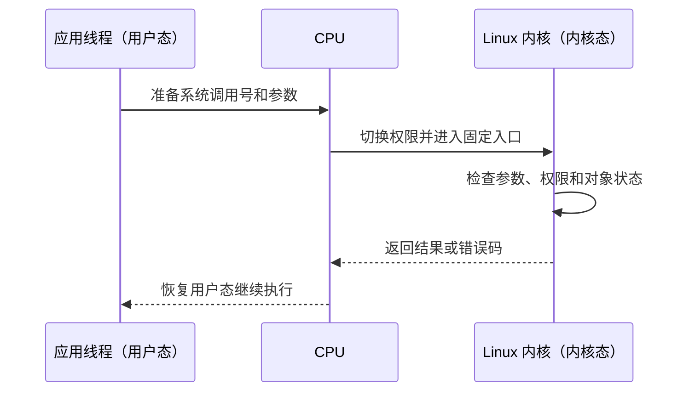

# 操作系统原理：内核怎样管理程序和硬件

一个应用不能假设自己独占 CPU、内存和设备。同一台服务器上可能同时运行 Web 服务、数据库、AI 任务和监控程序。**操作系统（Operating System，OS）**负责在它们之间分配资源，并防止一个程序随意破坏另一个程序。

## 1. 操作系统解决什么问题

Linux 的核心部分叫**内核（kernel）**。内核始终运行在受保护的高权限环境中，负责：

| 职责 | 内核管理的对象 | 应用看到的接口 |
|---|---|---|
| 执行管理 | 进程、线程和 CPU 时间 | 创建进程、等待线程、定时器 |
| 内存管理 | 虚拟地址、物理页和访问权限 | 分配内存、映射文件 |
| 文件管理 | 文件、目录、页缓存和存储设备 | `open`、`read`、`write` |
| 网络管理 | 网卡、连接、路由和协议状态 | Socket、`send`、`recv` |
| 隔离与权限 | 用户身份、进程权限和资源边界 | 文件权限、容器、资源限制 |

这些接口是**抽象**。抽象把不同硬件的共同能力表示成统一对象。例如，应用可以通过文件描述符读写普通文件、网络连接或管道，而不必直接控制每一种设备。

## 2. 内核可以采用哪些结构

操作系统包含的功能很多，怎样组织它会影响隔离、性能和维护方式：

| 结构 | 基本思路 | 主要取舍 |
|---|---|---|
| 单体内核 | 进程、内存、文件系统、网络和多数驱动都在内核地址空间协作 | 内部调用直接；一个内核缺陷可能影响整个系统 |
| 微内核 | 内核只保留调度、地址空间、进程间通信等最小机制，驱动和服务更多放在用户态 | 隔离清楚；组件通信与切换更多 |
| 模块化内核 | 核心保持统一内核接口，功能可作为模块动态加入 | 兼顾直接协作和可扩展性，模块仍拥有内核权限 |
| 混合结构 | 根据系统目标组合上述做法 | 不能只凭名称推断具体边界 |

Linux 通常称为模块化单体内核：文件系统、网络和许多驱动在同一内核空间运行，也支持按需装载模块。“单体”不等于所有代码写在一个文件里，而是这些组件共享高权限地址空间并可直接调用。

### 计算机启动时操作系统怎样接管

从通电到应用运行，大致经过：


固件常见为 BIOS 或 UEFI，引导程序负责找到内核。内核刚启动时还不能依赖完整用户空间，因此通常借助一个初始内存文件系统准备真正根文件系统所需的驱动和工具。随后第一个用户态进程负责创建其余服务。

具体文件名和启动管理器会因系统而异；稳定主线是“固件 → 引导 → 内核初始化 → 第一个用户进程 → 普通服务”。

## 3. 虚拟机与容器隔离的层次不同

**虚拟机（virtual machine）**让一个物理主机同时运行多个来宾操作系统。**Hypervisor（虚拟机监控器）**控制虚拟 CPU、内存和设备，把敏感操作截获或安全地映射到真实硬件。

```text
应用 -> 来宾内核 -> 虚拟硬件 -> Hypervisor -> 真实硬件
```

现代 CPU 提供硬件虚拟化扩展和第二阶段地址翻译，帮助来宾页表最终映射到主机物理内存。设备可通过模拟、半虚拟化驱动或受控直通提供给来宾。

**容器**通常不运行独立来宾内核，而是让一组进程共享宿主机内核，再用 namespace 限制可见对象、用 cgroup 统计和限制资源、用权限机制缩小能力。

| 对比 | 虚拟机 | 容器 |
|---|---|---|
| 内核 | 每个来宾可有自己的内核 | 共享宿主机内核 |
| 隔离边界 | Hypervisor 与虚拟硬件边界 | 同一内核中的进程隔离机制 |
| 启动与镜像 | 通常包含完整操作系统 | 通常只包含应用与用户态依赖 |
| 兼容性 | 可运行不同来宾内核 | 必须使用宿主内核提供的系统调用 |

容器不是“轻量虚拟机”的完整同义词。二者都能分配 CPU 和内存，但信任边界、内核共享和故障面不同。

## 4. 用户态、内核态与系统调用

CPU 支持不同的执行权限。普通应用运行在**用户态**，不能直接修改页表、设备寄存器或其他进程的内存。内核运行在**内核态**，拥有管理这些资源所需的权限。

应用需要内核服务时，通过**系统调用（system call）**进入内核。系统调用是预先定义的受控入口，例如：

- `read` 和 `write` 请求读写数据；
- `socket` 创建网络通信对象；
- `fork` 或其他进程创建接口启动新进程；
- `mmap` 建立虚拟内存映射。

网络中的 **Socket** 是内核维护的通信端点，应用通常也通过文件描述符引用它。这样 `read`、`write` 等共同接口就能用于多种 I/O 对象。

一次系统调用可以简化成：



这里有一个重要区别：

- **权限态切换**是同一个线程从用户态进入内核态再返回；
- **任务上下文切换**是调度器停止线程 A，改为运行线程 B。

系统调用如果立即完成，可以只有权限态切换。如果线程需要等待磁盘、网络、锁或定时器，调度器才可能改为运行其他线程。

## 5. 调度器怎样让多个线程共享 CPU

**调度器（scheduler）**从可运行线程中选择下一位 CPU 使用者。操作系统把每个可独立安排线程的位置视为一个**逻辑 CPU**；它可能对应物理核心，也可能对应核心的一个硬件线程。

| 状态 | 含义 |
|---|---|
| Running | 线程正在某个逻辑 CPU 上执行 |
| Runnable | 线程已经具备运行条件，正在等待 CPU |
| Sleeping / Blocked | 线程正在等待某个事件，暂时不能继续执行 |

线程可以因时间片结束、被更高优先级任务抢占或主动等待而离开 CPU。保存线程 A 的程序计数器、栈指针和寄存器，再恢复线程 B 的对应状态，称为**上下文切换**。调度指标、FCFS/SJF/RR、优先级、多级反馈队列与多核调度见 [CPU 调度](cpu_scheduling.md)。

## 6. 中断、异常和系统调用有什么区别

CPU 正在执行应用指令时，可能因为三类原因进入内核：

| 入口 | 谁触发 | 例子 |
|---|---|---|
| 系统调用 | 应用主动请求 | 读取文件、发送网络数据 |
| 异常 | 当前指令执行时发现事件 | 缺页、除零、非法访问 |
| 中断 | CPU 外部的硬件发出通知 | 网卡收到数据、存储请求完成 |

**中断（interrupt）**由 CPU 外部硬件发出；**异常（exception）**由当前指令执行触发；**系统调用**则是程序主动进入内核的受控请求。中断的请求、屏蔽、优先级、现场保存和返回过程，以及轮询的区别，见 [I/O 硬件](io_hardware.md)。

## 7. I/O 为什么会让线程等待

CPU 执行指令的速度与网卡、磁盘等设备完成请求的速度并不一致。为了让 CPU 不必原地空等，内核和设备都使用队列：应用提交请求，设备稍后完成，内核再唤醒等待者或交付结果。

以文件读取为例，内核命中页缓存时可以直接返回；需要设备读取时则提交请求，让当前线程进入 Sleeping，完成后再把它唤醒为 Runnable。设备完成不代表原线程已经运行，唤醒也只表示它重新具备被调度的条件。设备分类、驱动、缓冲、缓存与完成交付见 [I/O 管理](io_management.md)。

## 8. 阻塞、非阻塞、同步和异步分别是什么

这些词描述的不是同一件事：

- **阻塞（blocking）**关心调用暂时不能完成时，当前线程是否等待；
- **非阻塞（non-blocking）**表示调用不能立即完成时先返回，让程序稍后再试；
- **同步（synchronous）**通常表示调用方沿着当前控制流程等待结果；
- **异步（asynchronous）**表示先提交工作，结果以后通过事件、回调或完成队列交付。

异步 I/O 没有消除设备工作，只改变结果交付方式。设备管理层面的完整区分见 [I/O 管理](io_management.md)，网络就绪与完成模型见 [I/O 模型](../network/io_models.md)。

## 9. 内核怎样保护共享资源

多个线程和设备完成处理可能同时访问内核状态，因此内核也需要互斥、等待和唤醒机制。临界区、锁、信号量与条件变量见[操作系统同步](os_synchronization.md)；语言层面的并发组织见[并发基础](concurrency.md)。

## 10. 把一次请求放进操作系统地图

下面把调度、内存和 I/O 连成完整流程：

1. 网卡接收请求，通过 DMA 把数据传到内存，并通知内核；
2. 内核网络栈找到对应 Socket，让等待的服务线程变为 Runnable；
3. 调度器选择该线程，CPU 开始执行应用代码；
4. 程序访问虚拟地址，MMU 根据页表找到物理内存；若映射缺失，则由缺页处理补全；
5. 程序通过系统调用发送响应或写入文件；
6. 设备稍后报告完成，内核继续相应协议并唤醒等待者。

进程、文件描述符和进程间通信见[进程、线程与文件描述符](processes_fds.md)；地址翻译见[虚拟内存](virtual_memory.md)；一次普通文件写入的完整软硬件路径见[一次文件写入](file_write_path.md)。

## 11. 常见误解

- **“操作系统只是一个图形界面。”** 图形界面是应用层软件；内核负责资源和硬件管理。
- **“Runnable 表示线程正在运行。”** 它只表示线程具备运行条件，可能仍在等待 CPU。
- **“系统调用一定发生线程切换。”** 系统调用先发生权限切换，只有等待或抢占时才可能换线程。
- **“设备完成后，等待线程立刻运行。”** 设备完成会触发后续处理和唤醒，线程仍要等待调度。
- **“异步 I/O 让 I/O 变得没有成本。”** 它改变等待和通知方式，设备传输与错误处理仍然存在。
- **“轮询总比中断先进。”** 两者适合不同事件频率和 CPU 预算。
- **“容器拥有自己的 Linux 内核。”** 普通容器共享宿主机内核；虚拟机才通常运行来宾内核。
- **“单体内核就是不可拆分的一大段代码。”** 它描述高权限组件的协作边界，Linux 仍支持模块和清晰子系统。

## 12. 三类系统怎样使用这些基础

| 场景 | 常见操作系统问题 | 基础机制 |
|---|---|---|
| 传统互联网服务 | 如何处理大量连接，服务为何卡在数据库或文件 I/O | 调度、阻塞状态、事件通知和网络栈 |
| AI Agent 平台 | 如何隔离执行任务，限制 CPU 和内存，安全调用工具 | 进程边界、权限、虚拟内存和资源控制 |
| HFT 系统 | 如何在明确负载下减少执行过程中的等待和干扰 | 调度、中断、轮询、内存和设备队列 |

这些应用都建立在同一套操作系统机制上。学习顺序应是先能解释正确流程，再根据业务目标测量并优化。CPU 亲和性、内存预热和中断分布等配置只有在证据表明确实需要时才有意义。

## 13. 章末思考题

1. 为什么普通应用不能直接修改页表或设备寄存器？
2. 系统调用、异常和中断分别由谁触发？
3. Runnable、Running 和 Sleeping 三种状态有什么区别？
4. 为什么系统调用不一定发生任务上下文切换？
5. 从设备完成读取，到原线程继续执行，中间还要经过哪些步骤？
6. 阻塞与同步、非阻塞与异步为什么不能简单画等号？
7. 在什么情况下轮询可能合适，它付出了什么代价？
8. 按顺序说明从固件到普通服务启动的主要阶段。
9. 虚拟机与容器在内核和隔离边界上有什么根本区别？

一分钟复述：**内核负责在进程之间分配 CPU 和内存，并通过统一接口管理文件、网络和设备；应用用系统调用主动进入内核，缺页等异常由当前指令触发，设备用中断报告外部事件；线程等待时会睡眠，事件完成后先变为可运行，再由调度器安排到 CPU。** 这段话也可以作为面试回答的主干。
