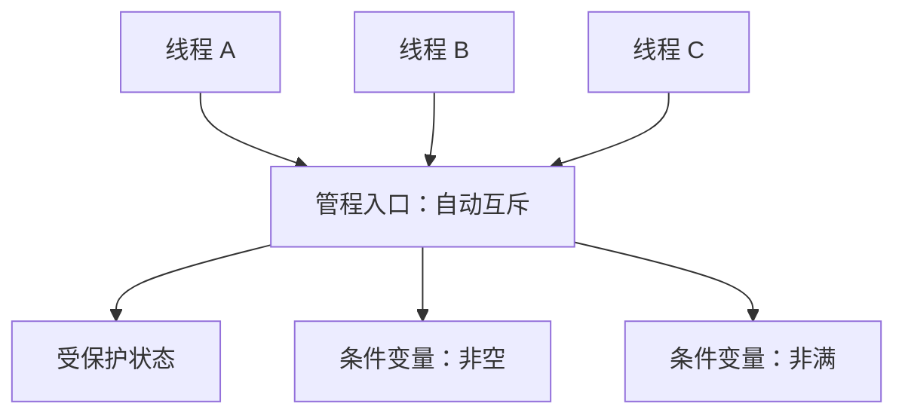

# 操作系统同步：锁、信号量与条件变量

多个线程可以同时访问同一片内存。共享本身不是错误；真正危险的是多个线程的操作交错后，破坏了程序必须保持的关系。本章从竞争条件出发，依次建立临界区、互斥锁、信号量、条件变量和管程，再用经典同步问题检验这些工具是否真的会用。

本章讨论操作系统层面的同步模型，不展开 Rust 或 C++ 的语言内存模型。Rust 中怎样用所有权、`Mutex`、消息和 Actor 组织并发，见[并发基础](concurrency.md)；Acquire、Release 等原子内存顺序见[原子操作与内存顺序](../infrastructure/atomics.md)。

## 1. 竞争条件为什么会出现

假设两个线程共享变量 `count = 10`，并且都执行 `count += 1`。源码看起来只有一行，机器执行时却至少要经历“读取、计算、写回”：

```text
线程 A 读取 count，得到 10
线程 B 读取 count，得到 10
线程 A 计算 10 + 1，并写回 11
线程 B 计算 10 + 1，并写回 11
```

两个线程各加一次，最终结果却是 11 而不是 12。程序结果取决于不可预知的执行顺序，这种现象称为**竞争条件（race condition）**。

竞争条件不只会让计数少一。链表可能被接到错误节点，余额检查和扣款之间可能被另一笔请求插入，生产者也可能覆盖消费者尚未取走的队列槽位。

### 1.1 原子性是什么

如果一项操作对其他并发执行者表现为“要么尚未发生，要么已经完整发生”，不会暴露中间状态，就称它具有**原子性（atomicity）**。

原子性必须针对具体操作说明：

- 单次原子加法可以保证一个计数不丢失；
- “检查余额、扣款、记录流水”包含多个状态，不能因为其中一个字段用原子类型就自动成为整体原子操作；
- 数据库事务、互斥锁和 CPU 原子指令处于不同层级，不能只看到“原子”二字就认为语义相同。

## 2. 临界区问题

访问共享状态且不能与冲突操作任意交错的代码区域称为**临界区（critical section）**。同步机制要让线程按照规则进入和离开临界区。


一个正确的临界区方案通常要求满足三点：

1. **互斥（mutual exclusion）**：一个线程在临界区内时，其他冲突线程不能同时进入；
2. **进展（progress）**：临界区空闲且有线程希望进入时，不能由与此无关的线程无限拖延决定；
3. **有限等待（bounded waiting）**：一个线程提出进入请求后，其他线程不能无限次插队，使它永远进不去。

互斥解决“同时修改”的安全问题；进展和有限等待解决系统能否继续前进的**活性（liveness）**问题。只保证互斥而让某个线程永久等不到，也不是完整方案。

## 3. 硬件怎样提供不可分割的基础动作

若“查看锁是否空闲”和“把锁改为已占用”是两条可以被打断的普通指令，两个线程仍可能同时认为自己获得了锁。处理器因此提供某些不可分割的读改写操作，常见思想包括：

| 原子动作 | 直觉 |
|---|---|
| test-and-set / exchange | 读取旧值并写入新值，整体不可分割 |
| compare-and-swap（CAS） | 只有当前值等于期望值时才替换，并返回是否成功 |
| fetch-and-add | 返回旧值并完成加法，整体不可分割 |

用 CAS 表示抢锁的抽象过程：

```text
while CAS(lock, expected=FREE, new=HELD) 失败:
    继续等待或采用退避策略

进入临界区
lock = FREE
```

这只是直觉模型。生产级锁还要处理内存可见性、公平性、等待策略和线程被抢占等问题，所以应用通常使用操作系统或标准库提供的同步原语，而不是自己拼装锁。

在单处理器内核的某些极短路径中，暂时屏蔽本地中断可以避免当前 CPU 被中断处理打断；它不能阻止另一颗 CPU 同时访问共享状态，也不适合普通用户程序。多核系统仍需要跨核心有效的同步机制。

## 4. 互斥锁：一次只允许一个持有者

**互斥锁（mutex）**是一种带有“空闲/已持有”状态的同步对象。线程进入临界区前执行 `lock`，离开时执行 `unlock`：

```text
lock(mutex)
修改共享状态
unlock(mutex)
```

锁保护的是一条**不变量（invariant）**，也就是共享状态始终必须满足的关系。例如“队列长度等于当前元素数”涉及多个字段，就应让所有相关修改处在同一临界区中。

锁的基本使用规则是：

- 先明确锁保护哪些状态；
- 所有访问这些状态的路径遵守同一规则；
- 尽量缩小临界区，但不能把必须一起完成的检查和修改拆开；
- 不要在持锁时执行无法控制时长的网络、磁盘操作或外部回调；
- 无论正常返回还是错误退出，都必须释放已经取得的锁。

### 4.1 自旋等待与睡眠等待

锁暂时不可用时，等待者可以采用两类方式：

| 等待方式 | 线程做什么 | 适合什么情况 | 主要代价 |
|---|---|---|---|
| 自旋（spin） | 反复检查锁 | 临界区极短，持有者很快会在别的 CPU 上释放 | 持续占用 CPU 和共享缓存资源 |
| 睡眠/阻塞 | 进入等待状态，由内核以后唤醒 | 等待时间不确定，或 CPU 应让给其他工作 | 入睡、唤醒和重新调度有成本 |

自旋不是“更高级的锁”。如果持锁线程已经被调度器暂停，等待者继续自旋并不能让锁更早释放。真实互斥锁也可能先短暂自旋，再进入内核睡眠；具体策略属于实现细节。

## 5. 信号量：用一个计数表示可用许可

**信号量（semaphore）**维护一个只能通过原子操作改变的整数计数。它表示当前有多少份许可或资源可用。

经典教材把两个操作记为：

- `P`，也称 `wait` 或 `down`：申请一份许可；没有许可时等待；
- `V`，也称 `signal`、`post` 或 `up`：归还一份许可，并在需要时唤醒等待者。

本书使用下面的抽象语义：

```text
P(S):
    原子地等待 S > 0，然后令 S = S - 1

V(S):
    原子地令 S = S + 1，并允许一个合适的等待者继续
```

**计数信号量**的初值可以大于 1，例如数据库连接池有 20 个连接，就可用初值 20 表示许可。**二值信号量**只允许 0 和 1，可用于互斥，但它与 mutex 的所有权和错误检查语义不一定相同。

信号量容易把“资源数量”和“互斥”写在同一套 P/V 中，也因此容易用错。检查伪代码时要逐项写出每个信号量的含义、初值，以及每条路径是否成对归还许可。

## 6. 条件变量：等待共享状态满足条件

互斥锁回答“谁可以修改状态”，却不能高效回答“状态什么时候变成我需要的样子”。例如消费者取得锁后发现队列为空，它不应持锁反复检查，否则生产者永远无法取得锁放入数据。

**条件变量（condition variable）**让线程等待某个由共享状态表示的条件。它必须与互斥锁和一个明确的**条件谓词（predicate）**一起使用。

消费者的标准形状是：

```text
lock(mutex)
while queue_is_empty():
    wait(not_empty, mutex)

item = remove_from_queue()
unlock(mutex)
```

生产者改变状态后通知等待者：

```text
lock(mutex)
add_to_queue(item)
signal(not_empty)        # 或在多个等待者都应重新检查时 broadcast
unlock(mutex)
```

`wait(condition, mutex)` 必须原子地完成两件事：

1. 释放 mutex 并进入条件变量的等待集合；
2. 被唤醒后，在返回调用者之前重新取得 mutex。

如果“释放锁”和“开始等待”之间存在空窗，生产者可能恰好在空窗中发出通知，消费者随后才睡下，并且再也等不到新通知。这称为**丢失唤醒（lost wakeup）**。

### 6.1 为什么必须使用 `while`，不能使用 `if`

被唤醒只表示“现在应该重新检查”，不表示条件必然仍为真：

- 另一个被唤醒线程可能先取得锁并消费了数据；
- `signal` 表示状态可能发生有利变化，不承诺为某个特定线程保留资源；
- 某些条件变量接口允许**虚假唤醒（spurious wakeup）**，即没有对应通知也返回。

因此正确模板是：

```text
while not predicate:
    wait(condition, mutex)
```

条件变量本身通常不保存“通知次数”。没有等待者时的一次 `signal`，不能被未来的 `wait` 当成库存通知使用。需要保存数量时，应把数量放在受锁保护的共享状态中，或使用信号量。

## 7. 管程：把状态、操作和等待条件封装在一起

**管程（monitor）**是一种更高层的同步抽象。它把共享状态、操作这些状态的过程以及条件变量封装成一个模块，并保证同一时刻只有一个执行者在管程内活动。



管程的价值不是创造新的硬件能力，而是把“谁能访问状态、何时等待、何时通知”集中在同一抽象中，减少调用者绕过同步规则的机会。具体语言和运行库对管程语义的实现不同，回答题目时应先说明采用哪一种唤醒规则。

## 8. 读写锁与屏障

### 8.1 读写锁

**读写锁（read-write lock）**区分两类临界区：

- 多个读者可以同时持有读锁；
- 写者需要独占写锁；
- 写者持有锁时，其他读者和写者都不能进入。

它适合读操作较长、读多写少，并且并发读确实能产生收益的场景。读写锁的内部状态和公平策略更复杂；临界区很短或写入频繁时，普通 mutex 可能更简单。若不断允许新读者插队，写者还可能饥饿，因此必须了解实现采用读者优先、写者优先还是公平策略。

### 8.2 屏障

**屏障（barrier）**用于阶段同步：必须等一组中的所有参与者都到达某个点，大家才能进入下一阶段。

下面是使用 mutex 和条件变量实现的可复用屏障直觉。`generation` 区分不同轮次，避免上一轮的唤醒被下一轮误用：

```text
barrier_wait():
    lock(mutex)
    my_generation = generation
    arrived = arrived + 1

    if arrived == N:
        arrived = 0
        generation = generation + 1
        broadcast(all_arrived)
    else:
        while generation == my_generation:
            wait(all_arrived, mutex)

    unlock(mutex)
```

屏障不是互斥锁。它不保护某个共享对象只能由一个线程访问，而是保证所有参与者在阶段边界会合。

## 9. 经典问题一：有界生产者—消费者

容量为 `N` 的缓冲区需要同时保证三件事：

- 生产者不能覆盖尚未消费的槽位；
- 消费者不能从空槽位读取；
- 修改队列结构时必须互斥。

使用三个信号量：

```text
empty = Semaphore(N)   # 空槽位数量
full  = Semaphore(0)   # 已放入元素数量
mutex = Semaphore(1)   # 队列结构的互斥许可
```

生产者：

```text
produce(item):
    P(empty)           # 先确保存在空位
    P(mutex)
    put(item)
    V(mutex)
    V(full)            # 最后公布多了一个可消费元素
```

消费者：

```text
consume():
    P(full)            # 先确保存在元素
    P(mutex)
    item = take()
    V(mutex)
    V(empty)           # 归还一个空位
    return item
```

不能先取得 `mutex` 再等待 `empty` 或 `full`。若生产者持有 mutex 等空位，消费者就无法取得 mutex 消费数据并释放空位，双方会互相等待。

## 10. 经典问题二：读者—写者

要求多个读者可以并发读取，但写者必须独占。下面是经典的**读者优先**方案：

```text
read_count = 0
count_mutex = Semaphore(1)   # 保护 read_count
resource    = Semaphore(1)   # 写者或整组读者占用资源
```

读者：

```text
reader():
    P(count_mutex)
    read_count = read_count + 1
    if read_count == 1:
        P(resource)           # 第一个读者阻止写者
    V(count_mutex)

    read_shared_data()

    P(count_mutex)
    read_count = read_count - 1
    if read_count == 0:
        V(resource)           # 最后一个读者允许写者进入
    V(count_mutex)
```

写者：

```text
writer():
    P(resource)
    write_shared_data()
    V(resource)
```

这个方案保证读写互斥，却不保证写者有限等待：只要新读者不断到达，`read_count` 就可能始终不降到 0，写者因而饥饿。生产实现通常需要排队或写者优先策略。

## 11. 经典问题三：哲学家进餐

五位哲学家围坐，每人需要同时拿到左右两把叉子才能进餐。如果所有人都先拿左叉再等右叉，就可能形成环形等待。

一种简单解决方法是增加初值为 4 的“房间许可”，最多允许四位哲学家同时尝试拿叉子：

```text
room = Semaphore(4)
fork[0..4] = 每把初值为 1 的 Semaphore

philosopher(i):
    while true:
        think()

        P(room)
        P(fork[i])
        P(fork[(i + 1) mod 5])

        eat()

        V(fork[(i + 1) mod 5])
        V(fork[i])
        V(room)
```

最多四人竞争时，至少会留下一个缺口，使某位已拿到一把叉子的哲学家能够取得第二把，环形等待被破坏。另一种常见方案是为叉子规定全局编号，所有人总先拿编号较小者；它本质上也在破坏循环等待。

## 12. 怎样选择同步原语

| 问题 | 常见起点 | 核心原因 |
|---|---|---|
| 一组状态必须一起修改 | mutex | 用一个临界区保持不变量 |
| 有固定数量的同类资源 | 计数信号量 | 计数就是可用许可数 |
| 等待共享状态满足谓词 | mutex + condition variable | wait 原子释放锁并睡眠，醒来后重查谓词 |
| 读多写少且读临界区较长 | 读写锁 | 允许多个读者并发 |
| 多个工作者必须完成同一阶段 | barrier | 所有人到齐后共同进入下一阶段 |
| 状态天然由单一执行者拥有 | 消息或 Actor | 从结构上减少共享写入 |

选择同步原语前，先写出共享状态、不变量、等待谓词和失败路径。只根据“哪个锁更快”选型，往往会得到难以证明正确的程序。

<details>
<summary>平台接口细节：为什么教材伪代码不能直接当 API 文档</summary>

POSIX 条件变量规定 `pthread_cond_wait` 在等待时释放 mutex，返回前重新取得 mutex，并允许虚假唤醒。不同操作系统和语言库对公平性、锁中毒、超时、取消和唤醒顺序的保证可能不同。

因此，教材伪代码用于证明同步关系；落到具体程序时，还必须查当前平台的官方 API 文档，确认返回值、超时使用的时钟、错误处理和取消语义。

</details>

## 13. 常见误解

- **“一行源码就是原子操作。”** 源码表达式通常会拆成多条机器动作。
- **“用了原子变量就不需要设计同步协议。”** 多个字段的不变量仍需一个整体协议。
- **“mutex 只是让代码变慢。”** 它首先表达互斥和所有权；是否构成性能问题要测量。
- **“自旋一定比睡眠快。”** 等待稍长或持锁者未运行时，自旋只会浪费 CPU。
- **“条件变量收到一次 signal，就保存了一张票。”** 条件变量通常不累计通知，持久状态必须由谓词记录。
- **“被唤醒就可以直接继续。”** 必须重新取得锁并在 `while` 中检查谓词。
- **“读写锁一定优于 mutex。”** 它的管理更复杂，还可能造成读者或写者饥饿。
- **“信号量和 mutex 完全相同。”** 二值信号量能表达互斥，但所有权、检查和用途可能不同。

## 14. 应用场景

- 传统后端使用 mutex 保护内存状态，用条件变量协调工作线程，用信号量限制数据库连接、文件句柄或并发任务数量；
- AI 基础设施可用 barrier 协调多工作者训练阶段，用信号量限制同时占用的加速器或模型实例，用有界生产者—消费者队列连接数据准备与计算；
- HFT 和其他实时性敏感系统也使用相同正确性规则，只是在正确之后进一步评估等待策略、状态所有权和专用线程是否合适。

## 15. 本章小结

- 竞争条件来自共享操作的不可控交错，原子性表示不暴露中间状态；
- 临界区方案要同时考虑互斥、进展和有限等待；
- CPU 原子读改写是构造锁的基础，不等于完整同步协议；
- mutex 保护不变量，自旋和睡眠是不同等待策略；
- 信号量用计数表示许可，条件变量用于等待受锁保护的谓词；
- 条件等待必须使用 `while`，以处理状态再次变化和虚假唤醒；
- 管程封装状态与同步规则，读写锁区分读者和写者，屏障协调阶段；
- 经典问题的关键不是背代码，而是逐项说明每个计数、锁和等待关系代表什么。

## 16. 思考题、408 题与面试追问

1. `count += 1` 为什么会丢失更新？请写出一种错误交错。
2. 临界区问题的互斥、进展、有限等待分别防止什么错误？
3. 为什么“检查锁为空”和“设置锁为占用”必须构成一个原子动作？
4. 一个有 10 个连接的连接池，信号量初值应是多少？第 11 个申请者会怎样？
5. 条件变量的 `wait` 为什么必须原子地释放 mutex 并开始等待？
6. 为什么下面写法错误：`if queue_empty: wait(not_empty, mutex)`？请给出两个原因。
7. 在有界缓冲区方案中，为什么生产者必须先 `P(empty)`，再 `P(mutex)`？反过来可能形成什么等待关系？
8. 读者优先方案为什么可能让写者饥饿？怎样从策略上改成写者优先或公平排队？
9. 五位哲学家都先拿左叉时，为什么可能无法前进？`room=4` 破坏了什么关系？
10. 屏障与 mutex 分别解决什么问题？为什么 generation 能帮助实现可复用屏障？

## 权威依据

- [2025 年 408 计算机学科专业基础考试大纲（高校公开附件）](https://www.uwh.edu.cn/uploads/article/20250609/660428d58334252302af691bf99e064e.pdf)
- [OSTEP 官方目录：Concurrency、Locks、Condition Variables 与 Semaphores](https://pages.cs.wisc.edu/~remzi/OSTEP/)
- [OSTEP 官方并发练习](https://pages.cs.wisc.edu/~remzi/OSTEP/Homework/homework.html)
- [Operating System Concepts, 10th Edition 官方目录](https://os-book.com/OS10/toc-dir/toc.pdf)
- [POSIX `pthread_cond_wait` 语义](https://pubs.opengroup.org/onlinepubs/9699919799/functions/pthread_cond_wait.html)
