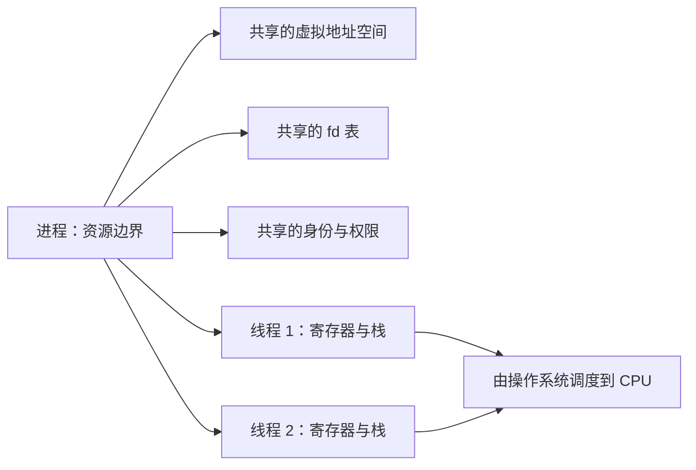
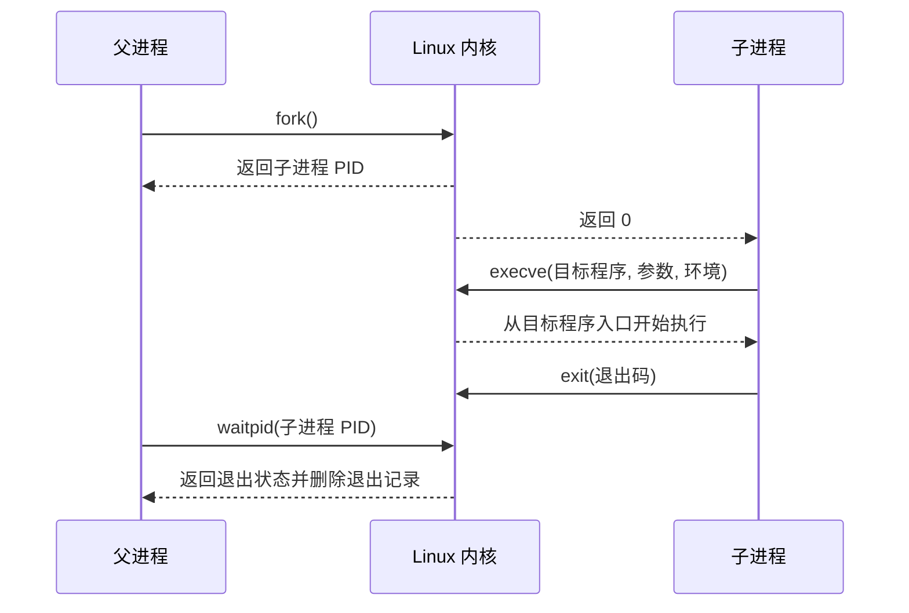
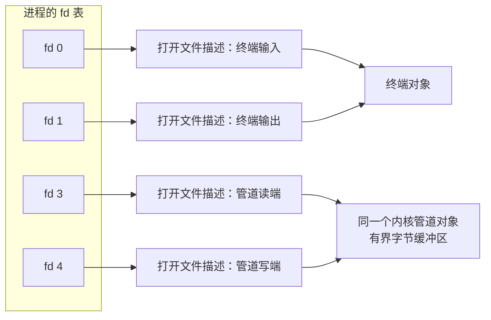
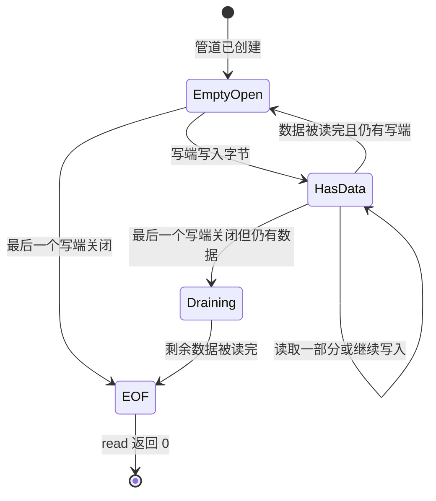
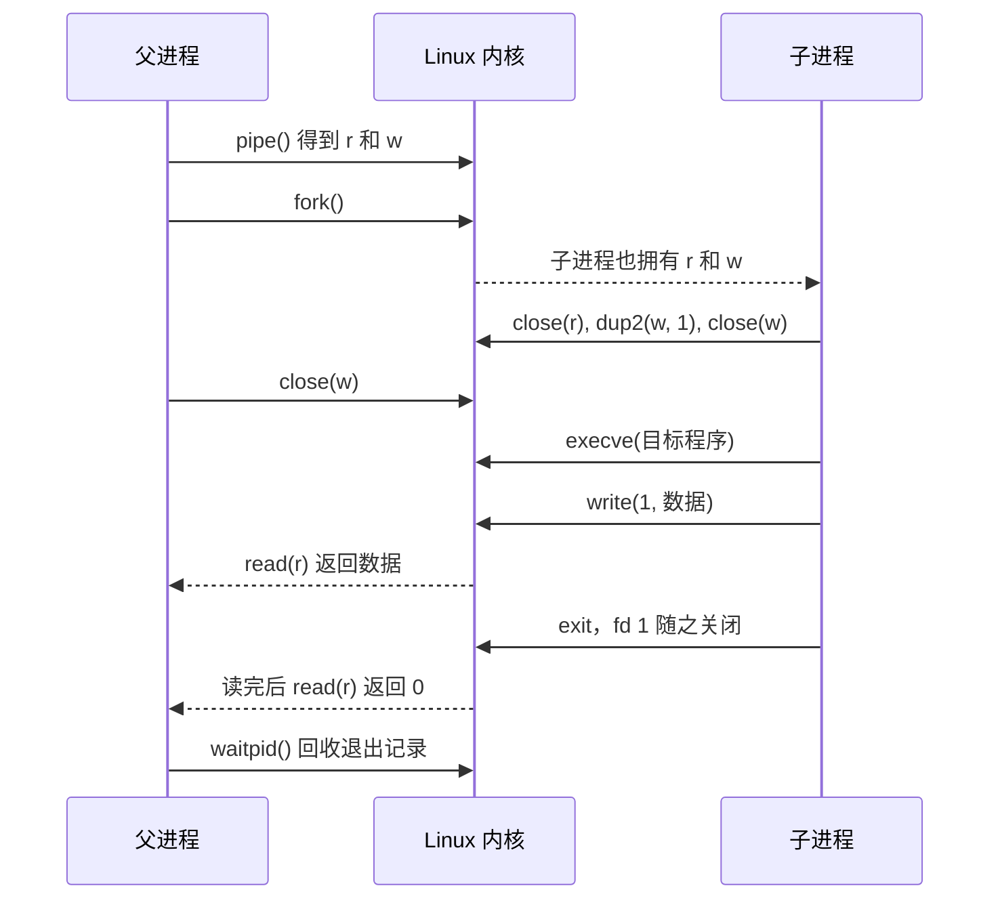

# 进程、线程、文件描述符与管道

假设一个后端服务需要启动图片转换程序，并收集它打印到标准输出的结果。操作系统要创建一个新的执行环境，让父子进程传递字节，并在子进程退出后回收资源。Unix 风格系统通常用进程表示运行实例，用文件描述符引用内核资源，再用匿名管道连接两个进程的数据流。

## 1. 程序、进程和线程是三个不同概念

- **程序（program）**是磁盘上的代码和静态数据，例如 `/usr/bin/sort`。程序还没有运行。
- **进程（process）**是程序的一次运行实例。进程拥有自己的虚拟地址空间、文件描述符表、身份和权限等资源。
- **线程（thread）**是进程中实际执行指令的一条执行流，也是操作系统调度 CPU 的基本对象。

同一个程序可以同时产生多个进程；一个进程也可以包含多个线程。一个进程中的线程通常共享堆、全局变量和文件描述符表，但每个线程拥有自己的寄存器、调用栈和调度状态。

可以把进程理解为一间工作室，把线程理解为工作室里的工人。工人共享房间和文件柜，但每个人有自己的工作台和当前工作进度。



Linux 内核会把进程和线程都作为可调度的任务管理，但这不表示两者相同。区分它们时，最重要的是看哪些资源共享、哪些执行状态独立。

## 2. 新程序通过 `fork`、`execve` 和 `wait` 启动

Unix 风格系统常用下面三个步骤启动并回收一个子程序：

1. 父进程调用 `fork()` 创建子进程。
2. 子进程调用 `execve()`，用目标程序替换自己原来的程序内容。
3. 父进程调用 `wait()` 或 `waitpid()`，取得退出状态并回收子进程记录。

`fork()` 返回后，父进程和子进程从相同的位置继续执行，但看到的返回值不同：父进程得到子进程号，子进程得到 0。两者最初拥有内容相似的虚拟地址空间。Linux 通常用**写时复制（Copy-on-Write，COW）**推迟真正的内存复制，具体机制见[虚拟内存](virtual_memory.md)。

`execve()` 不会再创建一个进程。它把当前进程的代码、数据、堆和栈替换成新程序，进程号通常保持不变。只有在 `execve()` 失败时，调用方才会回到原来的代码继续处理错误。

子进程退出后，内核会暂时保存它的进程号和退出状态。父进程尚未调用 `wait` 时，这条待领取的退出记录称为**僵尸进程（zombie process）**。僵尸进程已经不执行代码，也不占用 CPU；父进程调用 `wait` 后，内核才删除这条记录。



Rust 的 `std::process::Command` 会封装这些平台细节。学习底层生命周期不是要求业务代码手写 `fork`，而是为了理解子进程怎样继承资源、怎样连接输入输出，以及退出后为什么仍要回收。

## 3. fd 是进程表中的索引

**文件描述符（file descriptor，fd）**是一个非负小整数。这个整数只在当前进程的 fd 表中有意义。按照惯例，fd 0、1、2 分别表示标准输入、标准输出和标准错误。

fd 不是文件路径，也不是全系统唯一的文件编号。操作系统用三层关系把 fd 连接到真正的资源：

| 层次 | 保存的内容 | 所属范围 |
|---|---|---|
| fd 表项 | 从数字 fd 指向打开文件描述；还保存 `close-on-exec` 等 fd 自身属性 | 当前进程 |
| 打开文件描述（open file description） | 打开方式和状态；普通文件还会在这里记录当前偏移 | 内核，可被多个 fd 引用 |
| 内核对象 | 真正的文件、socket、管道或设备 | 内核 |



这个三层模型可以解释两个常见行为：

- `dup()` 会创建另一个 fd，但新旧 fd 指向同一个打开文件描述。对于普通文件，它们因此共享文件偏移。
- `fork()` 会给子进程复制一份 fd 表；父子进程中对应的 fd 仍指向相同的打开文件描述和内核对象。

后面的管道 EOF 规则依赖“可能有多个 fd 引用同一个管道端点”，所以不能把 fd 只理解为一个孤立的数字。

## 4. 匿名管道是一条内核中的单向字节通道

**匿名管道（anonymous pipe）**没有文件路径。进程调用 `pipe()` 后，内核创建一个管道对象，并向调用进程返回两个 fd：

- 第一个 fd 是**读端**，只能读取；
- 第二个 fd 是**写端**，只能写入。

两个 fd 连接到同一个内核管道对象。这个对象至少需要维护三类基础状态：尚未读走的字节、当前还存在多少读端与写端引用，以及等待数据或等待空间的线程。

一次数据传递可以简化为下面四步：

1. 写进程调用 `write(write_fd, ...)`。
2. 内核把字节从写进程的用户空间复制进管道缓冲区。
3. 读进程调用 `read(read_fd, ...)`。
4. 内核从管道缓冲区取出字节，复制到读进程提供的用户空间缓冲区。

读取会消费数据。同一段字节被一个读者取走后，其他读者不会再次得到它。普通匿名管道是单向的；两个进程需要双向通信时，通常创建两条方向相反的管道，或者使用 `socketpair`。

### 4.1 管道传输字节流，不保存消息边界

管道只知道连续的字节，不知道一条“业务消息”从哪里开始、在哪里结束。写进程连续调用两次 `write`，读进程可能用一次 `read` 取到两次写入的内容，也可能用多次 `read` 才取完一次写入。

因此，应用不能假设“一次写入一定对应一次读取”。如果管道承载多条记录，双方需要自行约定格式，例如：

- 每条记录以换行符结束；
- 先发送固定长度的长度字段，再发送正文；
- 使用能够逐步解析的序列化格式。

这个规则来自管道的字节流语义，与使用哪一种编程语言无关。

### 4.2 容量决定什么时候阻塞

管道缓冲区的容量有限，具体大小由操作系统版本和配置决定，面试中不需要背一个固定数字。有限容量让生产者和消费者不能无限拉开距离。

| 当前状态 | 阻塞模式下的结果 | 非阻塞模式下的结果 |
|---|---|---|
| 缓冲区有数据 | `read` 返回当前可取得的字节，数量可能小于请求值 | 同样读取已有字节 |
| 缓冲区为空，但仍有写端 | `read` 等待数据或等待最后一个写端关闭 | 返回 `EAGAIN`/`EWOULDBLOCK` |
| 缓冲区有空间 | `write` 写入字节；一次调用仍可能只完成一部分 | 写入能够接受的内容 |
| 缓冲区已满，仍有读端 | `write` 等待读者腾出空间 | 返回 `EAGAIN`/`EWOULDBLOCK`，某些较大请求也可能只完成一部分 |

**阻塞**表示当前线程暂时不具备继续执行的条件。内核会让它等待，并让 CPU 执行其他可运行线程。数据到达或空间释放后，内核再唤醒等待者。非阻塞 fd 不让线程原地等待，程序需要稍后重试，或者用 I/O 事件机制等待“可以读”或“可以写”的通知。

无论使用阻塞还是非阻塞模式，程序都必须检查 `read` 和 `write` 的返回值，因为一次调用不保证处理完整个用户缓冲区。

## 5. EOF 与断管由端点是否仍被引用决定

管道没有特殊的“EOF 字节”。读端是否得到 EOF，取决于内核还能否找到任何写端引用。

- 缓冲区为空，但至少还有一个写端 fd 存在：阻塞式 `read` 继续等待，因为未来仍可能有数据。
- 最后一个写端 fd 已关闭，但缓冲区还有数据：`read` 先返回剩余数据。
- 最后一个写端 fd 已关闭，并且缓冲区已经读空：`read` 返回 0，这个 0 才表示 EOF。

这里的“最后一个”要检查所有相关进程和所有复制出来的 fd。只要某个进程忘记关闭一份写端，读者就可能永远等不到 EOF。

反方向也有对应规则：如果所有读端都已经关闭，写进程继续写就不可能有人接收数据。内核默认向写进程发送 `SIGPIPE` 信号；如果程序忽略或捕获了这个信号，`write` 会失败并返回 `EPIPE`。Rust 通常把它表现为 `io::ErrorKind::BrokenPipe`。



## 6. `fork` 后必须关闭不用的管道端

父进程要读取子进程的标准输出时，常按下面的顺序连接管道：

1. 父进程在 `fork` 前调用 `pipe()`，得到读端 `r` 和写端 `w`。
2. `fork()` 后，父进程和子进程都暂时拥有 `r` 与 `w`。
3. 子进程关闭不需要的 `r`，再调用 `dup2(w, 1)`，让标准输出 fd 1 指向管道写端。
4. `dup2` 成功后，子进程关闭原来的 `w`，因为 fd 1 已经是同一写端的新引用。
5. 父进程关闭不需要的 `w`，只保留 `r` 读取数据。
6. 子进程执行目标程序。目标程序写标准输出时，数据进入管道。
7. 子进程退出并关闭 fd 1 后，父进程读完剩余数据，下一次 `read` 得到 0。

`dup2(w, 1)` 会先处理原 fd 1 的指向，再让 fd 1 指向与 `w` 相同的打开文件描述。新程序不需要知道管道 fd 的原始数字；它只按惯例向标准输出写数据。



父进程忘记关闭自己的 `w` 是最典型的错误。即使子进程已经退出，内核仍看到父进程持有一个写端，因此不会向父进程的读操作返回 EOF。

## 7. Rust 用标准库连接子进程输出

下面的代码使用 `std::process::Command` 建立子进程，并要求标准库把子进程 stdout 连接到匿名管道。示例依赖系统中存在 `printf` 命令，因此标记为只编译、不在文档测试中执行。

```rust,no_run
use std::io::{self, Read};
use std::process::{Command, Stdio};

fn main() -> io::Result<()> {
    let mut child = Command::new("printf")
        .arg("hello through pipe")
        .stdout(Stdio::piped())
        .spawn()?;

    // take() 把管道读端的所有权交给 pipe_reader，避免重复使用。
    let mut pipe_reader = child.stdout.take().expect("stdout 已设置为管道");
    let mut text = String::new();

    // 先持续读到 EOF，再等待退出。这样子进程写满管道时仍有人读取。
    pipe_reader.read_to_string(&mut text)?;
    let status = child.wait()?;

    assert!(status.success());
    assert_eq!(text, "hello through pipe");
    Ok(())
}
```

`Stdio::piped()` 隐藏了创建管道、启动子进程、重定向标准输出和关闭多余端点等平台操作，但没有改变底层语义。不同平台和标准库版本不一定使用同一组系统调用；从程序能观察到的结果看，`child.stdout` 是父进程持有的读端，子进程的标准输出连接到写端。

还有一层容易混淆：某些语言运行库会先在用户空间缓冲标准输出。只有运行库真正调用 `write` 后，字节才进入内核管道。因此“子进程打印了但父进程暂时没读到”既可能来自用户空间输出缓冲，也可能来自管道读取逻辑，需要分层判断。

## 8. 管道死锁来自循环等待

最常见的管道死锁过程如下：

1. 父进程创建管道并启动子进程。
2. 子进程不断写 stdout，直到有限的管道缓冲区写满。
3. 子进程阻塞在 `write`，因此还没有机会退出。
4. 父进程没有读取管道，而是先调用 `wait` 等待子进程退出。
5. 父进程等子进程退出，子进程等父进程读取，双方形成循环等待。

解决原则是：子进程可能继续写时，父进程就要继续排空输出。程序同时捕获 stdout 和 stderr 时，也要同时读取两条管道；只读 stdout 而放任 stderr 写满，仍然可能死锁。成熟的子进程库通常提供“并发收集输出并等待退出”的高层接口，应优先使用并理解它的容量与输出上限。

管道死锁不是 CPU 运行速度问题，而是资源依赖顺序错误。排查时先画出“谁在等数据、谁在等空间、谁持有哪些端点”，通常比猜测某个函数慢更有效。

## 9. `execve` 时哪些 fd 会留下

`fork()` 会复制父进程的 fd 表，因此子进程起初能访问这些 fd。这样才能把管道端点交给子进程，但无关 fd 也可能被一并带过去。

`FD_CLOEXEC` 的含义是：当前进程成功执行 `execve` 时，自动关闭这个 fd。它不会在 `fork` 时关闭 fd。创建文件或 socket 时使用带 `O_CLOEXEC` 的接口，可以从创建完成的一刻就设置这个属性。

启动新程序时应明确列出它真正需要的标准输入、标准输出、标准错误和其他 fd，其余 fd 在执行新程序前关闭。这样既避免新程序意外访问文件或网络连接，也避免某个多余的管道写端让读者永远等不到 EOF。具体关闭方式要结合平台提供的进程创建接口；核心规则是让继承集合保持显式、最小。

## 10. 系统调用与线程切换不是一回事

应用不能直接修改内核中的 fd 表和管道对象。调用 `pipe`、`read`、`write` 或 `waitpid` 时，当前线程通过系统调用从用户态进入内核态，内核检查参数并操作受保护的数据。

一次系统调用不一定更换正在执行的线程：

- 管道中已有数据时，当前线程可以进入内核完成 `read`，然后仍由同一线程返回用户态。
- 管道为空且仍有写端时，阻塞式 `read` 无法立即完成。内核让当前线程进入等待状态，调度器才选择另一个可运行线程。

因此，**用户态进入内核态**表示同一线程改变执行权限，**任务上下文切换**表示 CPU 从线程 A 改为执行线程 B。两者可能连续发生，但不是同一个动作。

## 11. 同一套基础适用于不同系统

前面的机制是通用操作系统知识，不属于某一个行业。不同系统只是把相同机制放进不同业务场景：

- **传统互联网后端**可能启动图片转换器、压缩工具或部署脚本，并通过管道收集 stdout 与 stderr。
- **AI 推理与 Agent 平台**可能在沙箱中启动模型服务、代码执行器或工具进程，并通过管道传输输入、日志和结果。
- **数据处理系统**可能把多个命令连接成流水线，让上一步的输出成为下一步的输入。
- **交易系统**也可能用独立进程隔离网关、策略或运维工具，但管道语义与其他系统完全相同。

选择管道之前还要看通信关系。匿名管道适合有继承关系的本机进程和单向字节流；无亲缘进程、本机双向请求或跨机器通信，通常会选择命名管道、Unix domain socket、TCP 或更高层 RPC。这里的选择依据是通信范围和数据语义，不是行业名称。

## 12. 高频误区与面试表达

- “进程就是正在执行的代码。”——进程不仅有代码，还有地址空间、fd、权限和退出状态等资源。
- “fd 3 是某个文件的全局编号。”——fd 只是在当前进程 fd 表中的索引。
- “一次 `write` 对应一次 `read`。”——管道是字节流，不保存应用消息边界。
- “子进程关闭写端后，父进程立刻读到 EOF。”——缓冲区中的剩余数据会先被读完，而且其他进程不能再持有写端。
- “管道为空时 `read` 一定返回 0。”——仍有写端时，阻塞读取会等待；只有所有写端关闭且数据读完才返回 0。
- “系统调用一定引发线程切换。”——进入内核与换到另一线程是两个动作。

面试中可以按“对象—行为—边界”组织回答：

> `pipe()` 创建一个内核管道对象，并返回读端和写端两个 fd。fd 是进程 fd 表中的索引，它们通过各自的打开文件描述连接到同一个有界字节缓冲区。管道传输字节流，因此应用要自己定义消息边界。空管道在仍有写端时会让阻塞读取等待；所有写端关闭且数据读完后，`read` 才返回 0。`fork` 会让父子进程都得到端点引用，所以双方必须关闭不用的端，否则 EOF 可能永远不到。所有读端关闭后继续写会触发 `SIGPIPE`，或让 `write` 返回 `EPIPE`。

## 做题方法

进程、fd 与管道题不要只画进程，要同时画三层对象：进程的 fd 表、内核打开文件对象、底层文件或管道对象。

1. 执行 `fork` 时复制 fd 表项，并让父子表项指向同一打开文件对象；因此共享文件偏移。每多一个引用，就把引用计数加一。
2. 执行 `dup` 或重定向时只改变 fd 表的映射；执行 `exec` 时进程映像被替换，但未设置 close-on-exec 的 fd 仍在。
3. 管道题给每个进程标出读端和写端。读到 EOF 的条件是**所有**写端引用都关闭；写端是否会阻塞取决于缓冲区空间与读端是否存在。
4. 逐条模拟 `close`，同步减少引用计数。不要因为某个进程“不再使用”就假设 fd 已关闭。
5. 僵尸进程题分别追踪子进程是否退出、父进程是否 `wait`；孤儿与僵尸是不同维度。

最后验算：每个 fd 号只在所属进程内有意义；共享打开文件对象的描述符应观察到同一偏移；若图上还存在任意写端引用，读者就不应得到 EOF。

## 13. 思考题

1. 父进程调用 `pipe()` 后再 `fork()`，一共可能出现几份读端和写端 fd？它们分别指向哪些内核对象？
2. 父进程只想读取子进程输出时，父进程和子进程分别应关闭哪一端？遗漏一次关闭会产生什么现象？
3. 写进程调用两次 `write`，读进程为什么不能假设正好调用两次 `read` 就得到两条消息？请设计一种简单的消息格式。
4. 管道缓冲区为空时，`read` 阻塞和返回 0 的条件有什么区别？
5. 父进程先 `wait`、后读取大量子进程输出时，循环等待是怎样形成的？如果同时捕获 stdout 和 stderr，读取逻辑还要增加什么约束？
6. `FD_CLOEXEC` 为什么不能代替 `fork` 后主动关闭不用的管道端？
7. 一次管道 `read` 立即返回时，为什么它可以发生系统调用，却不发生任务上下文切换？

### 参考答案与解答

<details><summary>展开答案</summary>

1. `pipe()` 先在父进程产生读/写两个 fd；`fork()` 后父子各有两个表项，共四份 fd 表项。两份读端指向同一管道读端内核对象，两份写端指向同一写端/同一管道缓冲区。
2. 父进程关闭写端、保留读端；子进程关闭读端，把输出写到写端。若任一进程遗漏写端关闭，读者即使已读完数据也可能一直等不到 EOF。
3. 管道是字节流，write 边界不等于 read 边界。可使用“4 字节大端长度 + payload”，读者先循环读满长度头，再按长度循环读满正文，并设置最大长度。
4. 缓冲区空但仍有写端时，阻塞 read 等待未来数据；空且所有写端引用都关闭时，read 返回 0 表示 EOF。
5. 子进程输出填满管道后阻塞，无法退出；父进程等待子进程退出而不读，形成环。stdout/stderr 两条管道还要并发或用 poll/epoll 同时排空，不能先读完一条再读另一条。
6. `FD_CLOEXEC` 只在成功 `exec` 时自动关闭；fork 到 exec 之间和不执行 exec 的子进程仍持有 fd。管道 EOF 和死锁要求 fork 后立即关闭每方不用的端。
7. read 仍要进入内核检查 fd 和缓冲区；若已有数据或 EOF，可立即在同一线程返回，不需要睡眠和调度，因此没有任务切换。

</details>

## 14. 小结

本章最重要的关系是：进程通过 fd 表引用打开文件描述，打开文件描述再连接内核对象。`pipe()` 创建同一个管道对象的读端和写端；`fork()` 会复制这些引用；`dup2()` 可以把写端放到标准输出的位置。管道是有界字节流，没有消息边界。端点是否全部关闭决定 EOF、`SIGPIPE` 和 `EPIPE`，读取与等待顺序不正确则可能造成死锁。

虚拟地址和写时复制由[虚拟内存](virtual_memory.md)继续讲解；更广泛的调度、信号和内核机制见[操作系统原理](os_internals.md)。

## 一手资料

- [Linux `pipe(2)`](https://man7.org/linux/man-pages/man2/pipe.2.html)
- [Linux `pipe(7)`](https://man7.org/linux/man-pages/man7/pipe.7.html)
- [Linux `dup(2)`](https://man7.org/linux/man-pages/man2/dup.2.html)
- [Linux `fork(2)`](https://man7.org/linux/man-pages/man2/fork.2.html)
- [Linux `execve(2)`](https://man7.org/linux/man-pages/man2/execve.2.html)
- [Linux `waitpid(2)`](https://man7.org/linux/man-pages/man2/waitpid.2.html)
- [Rust `std::process`](https://doc.rust-lang.org/std/process/)
