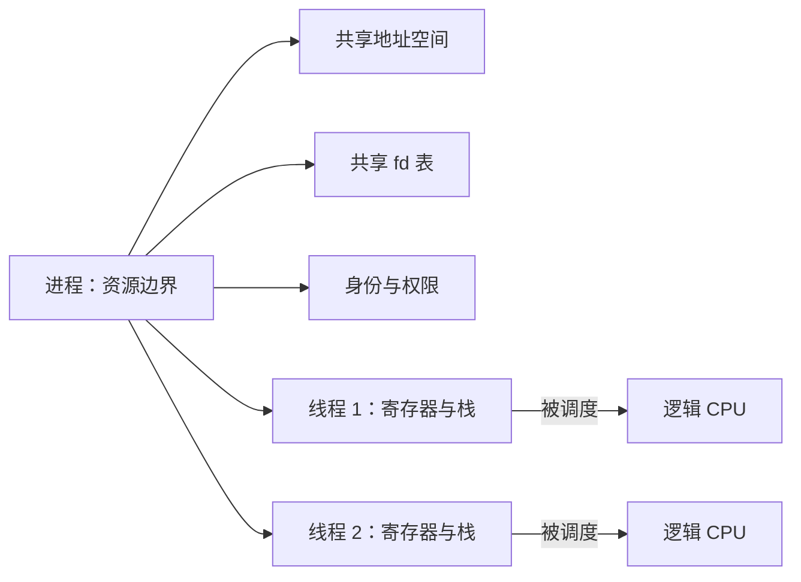
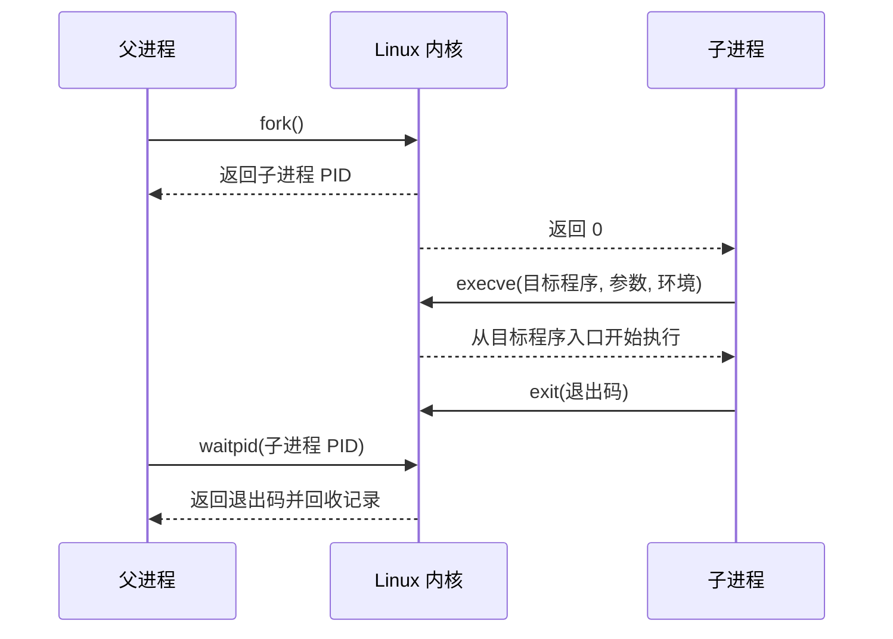

# 进程、线程与文件描述符：Linux 怎样安排工作

> **面试优先级：P0。** 你需要解释进程和线程的区别、`fork → execve → wait` 的生命周期、文件描述符指向什么，以及系统调用为什么不等于线程上下文切换。调度策略和 `clone` 的具体标志属于 P1，不需要背枚举值。

假设一个服务要启动编译器或数据转换程序，并收集它的输出。服务不能只把一段字符串“交给 CPU”；它要创建子进程、连接输入输出、等待结果，并在超时后回收整个进程树。本章用这个普通的子进程场景解释 Linux 的基本执行模型。

## 1. 先分清程序、进程和线程

- **程序**是可执行文件中的代码和静态数据，例如磁盘上的 `/usr/bin/sort`。
- **进程**是程序的一次运行实例，也是地址空间、文件描述符、身份和权限等资源的边界。
- **线程**是进程中可被调度器安排到 CPU 上执行的一条指令流。

同一个程序可以启动多个进程。一个进程也可以有多个线程；这些线程通常共享进程的地址空间和打开文件，所以传递数据很方便，但错误写入也可能破坏彼此的数据。

可以把进程想成一间工作室，把线程想成其中的工人。工作室共享原料和文件柜；每个工人仍有自己的工作台。对应到系统中，线程共享堆和文件描述符，却各自拥有寄存器、调用栈、线程局部存储和调度状态。



“Linux 内核把进程和线程都表示为任务”不意味着两者完全相同。关键问题始终是：它们共享哪些资源，哪些状态彼此独立？

## 2. 启动新程序：`fork`、`execve` 与 `wait`

Unix 风格系统启动子程序时，常用下面的三段生命周期：

1. 父进程调用 `fork()`，创建一个子进程。
2. 子进程调用 `execve()`，用目标程序替换自己的程序映像。
3. 父进程调用 `wait()` 或 `waitpid()`，取得退出状态并回收记录。

`fork()` 创建的父子进程最初拥有相似的地址空间。Linux 通常用**写时复制（Copy-on-Write，COW）**推迟真正的内存复制：父子先共享物理页，某一方写入时才复制。具体机制见[虚拟内存](virtual_memory.md)。

`execve()` 成功后不会返回原程序。子进程的进程号可以保持不变，但代码、数据、堆和栈会被新程序替换。部分文件描述符会继续存在，这正是后面必须理解 `close-on-exec` 的原因。

子进程退出时，内核暂时保留它的进程号、退出码和资源统计，等待父进程领取。这个“已经退出、但还没有被父进程等待”的记录叫**僵尸进程（zombie）**。僵尸不会继续执行，也不消耗 CPU；它的问题是仍占用进程表记录。父进程调用 `wait` 后，这条记录才被回收。



高级语言通常提供更安全的子进程接口。例如 Rust 的 `std::process::Command` 会封装许多平台细节；理解底层三步，是为了排查继承、超时和回收问题，不是要求所有程序都手写 `fork`。

## 3. 文件描述符不是文件本身

**文件描述符（file descriptor，fd）**是当前进程 fd 表中的一个小整数索引。按照惯例，0、1、2 分别代表标准输入、标准输出和标准错误。fd 不等于文件路径，也不是全系统唯一的文件编号。

```text
进程中的 fd 3
  → fd 表项：是否在 exec 时关闭等
  → 打开文件描述：当前偏移、打开状态
  → 文件、socket、pipe 或设备对象
```

中间的**打开文件描述（open file description）**保存当前文件偏移和 `O_APPEND` 等状态。理解这一层可以解释三个常见现象：

- 两次分别调用 `open()`，通常得到两个独立的打开文件描述，因此文件偏移互不影响。
- `dup()` 创建新 fd，但新旧 fd 指向同一个打开文件描述，因此共享文件偏移。
- `fork()` 后继承的父子 fd 也可能指向同一个打开文件描述，因此一方读写会推进另一方看到的偏移。

fd 还可以指向 **pipe（管道）**。管道是内核维护的有界字节缓冲区，一端写入，另一端读取。父进程常把子进程的标准输出连接到管道，从而收集结果。如果父进程不持续读取，而子进程把管道写满，子进程会阻塞；此时单纯等待子进程退出可能形成死锁。

## 4. 为什么要控制 fd 继承

默认情况下，子进程可能继承父进程打开的 fd。合理继承可以把标准输入输出接到文件或管道；意外继承则会产生难以发现的问题：

- 子进程保留了 socket，导致服务重启后连接或端口仍未释放。
- 某个进程仍持有管道写端，读取方永远等不到文件结束标记。
- 不相关程序获得了本不该访问的文件或秘密句柄。

`FD_CLOEXEC` 表示成功执行 `execve` 时关闭该 fd。`O_CLOEXEC` 允许在创建 fd 的同一个操作中设置这一属性。并发程序应优先使用后者，因为“先打开、再设置”之间存在窗口：另一个线程可能恰好在窗口内启动子进程并泄露 fd。

面试时不必背所有 `fcntl` 命令，但要说清为什么需要原子设置 `close-on-exec`。

## 5. 系统调用不是普通函数，也不必然切换线程

应用在用户态不能直接修改内核数据。它调用 `read`、`write` 或 `waitpid` 时，运行库按照当前架构的约定准备参数，再执行系统调用指令进入内核态。内核检查地址、权限和资源状态，完成工作后返回结果。

这里有两个容易混淆的动作：

| 动作 | 发生了什么 | 是否换了线程 |
|---|---|---|
| 用户态进入内核态 | 同一线程提高执行权限，运行内核代码 | 不一定 |
| 任务上下文切换 | 调度器保存线程 A 的状态，恢复线程 B 的状态 | 是 |

一次很快完成的系统调用可以由同一线程进入内核再返回。如果 `read` 等待数据、`waitpid` 等待子进程，或线程被抢占，当前线程会停止运行，调度器才选择其他可运行线程。

系统调用的返回值只表达该接口承诺的完成程度。例如普通文件 `write` 成功通常表示内核接受了数据，不表示断电后一定存在；完整路径见[一次文件写入](file_write_path.md)。

## 6. 调度器怎样看线程状态

**调度器**是内核中选择“下一刻让哪个线程使用 CPU”的组件。为了建立基础模型，可以把线程状态简化为：

- **Running**：正在某个逻辑 CPU 上执行。
- **Runnable**：已经具备运行条件，正在运行队列中等待 CPU。
- **Sleeping**：在等 I/O、锁、定时器或其他事件。
- **Stopped**：被停止信号或调试器暂停。
- **Zombie**：严格说是已退出进程留下的待回收记录，不是仍能运行的线程。

可运行线程多于逻辑 CPU 时，调度器必须轮流安排它们。线程因为 I/O 睡眠时，CPU 可以运行别的线程；这提高整体利用率，却会引入排队、唤醒和缓存重新变热的成本。一次上下文切换没有适用于所有机器的固定耗时，代价取决于工作集、地址空间、硬件和负载。

CPU 亲和性表示线程被允许在哪些逻辑 CPU 上运行。固定线程位置可能减少迁移并改善 Cache 局部性，但也可能造成某些核心过载。它是要用延迟分布和调度事件验证的策略，不是“绑核必快”的口号。

<details>
<summary><strong>P1 选读：线程库与 <code>clone</code> 的关系</strong></summary>

Linux 通过 `clone` 一类底层接口创建任务，并用标志决定是否共享地址空间、fd 表和信号处理等资源。POSIX 线程库会封装正确的标志组合、线程栈和线程局部状态。面试中若没有继续追问内核实现，只需掌握“线程共享进程的大部分资源，但拥有独立执行状态”，不需要背 `clone` 标志。

</details>

## 7. 启动和取消子进程的完整边界

普通服务启动一个外部程序时，至少要决定：

1. 目标程序和参数是什么，是否避免把不可信文本拼成 shell 命令；
2. 工作目录、环境变量、身份和允许继承的 fd 是什么；
3. stdout 和 stderr 由谁持续读取，最大保留多少；
4. 怎样记录进程号、退出码和被哪个信号终止；
5. 超时后怎样停止子进程以及它继续创建的后代；
6. 最终由谁调用 `wait`，保证没有僵尸记录。

如果程序可能创建后代，只杀最初的子进程不一定够。常见做法是建立进程组或其他明确的资源边界，取消时先停止继续创建工作，再向整个边界发出终止信号，等待一段时间后升级强制终止，最后逐一确认退出并回收。已经写入数据库或发送到远端的副作用不会因为进程被杀而自动撤销，必须由业务协议处理。

这套生命周期不仅适用于命令行工具，也适用于工作进程池、测试运行器和后台任务系统。

## 8. 在 Linux 上观察证据

下面的只读命令适合在自己的 Linux 测试环境使用：

```bash
# 查看当前 shell 的进程号、父进程号、状态、线程数和打开 fd 数
ps -o pid,ppid,stat,nlwp,comm -p $$
ls -l /proc/$$/fd | sed -n '1,20p'

# 分别显示一个进程中的线程；LWP 是 Linux 线程 ID
ps -L -o pid,lwp,psr,stat,comm -p $$

# 跟踪一个短命令的进程创建、执行和等待
strace -f -e trace=process /bin/true
```

一次 `ps` 结果只是瞬间快照。排障时还要问：线程长时间可运行却得不到 CPU，还是在等待某个明确事件？子进程由谁创建，谁负责读取输出和回收？fd 是有意继承还是意外泄露？

## 9. 高频误区与面试回答

- “进程是代码，线程只是一个函数。”——进程是资源边界，线程是可调度执行流。
- “fd 3 是某个文件的全局编号。”——fd 只在当前进程的 fd 表中有意义。
- “系统调用一定发生线程切换。”——权限切换和任务切换是两件事。
- “僵尸进程仍在后台消耗 CPU。”——它已经退出，只剩等待父进程回收的记录。
- “杀掉父进程就取消了所有工作。”——后代进程和外部副作用可能继续存在。

30 秒回答可以这样组织：

> 进程是地址空间、fd 和身份等资源的边界，线程是共享进程资源的可调度执行流。Unix 程序常用 `fork` 创建子进程，用 `execve` 替换成目标程序，再由父进程用 `waitpid` 取得退出状态并回收。fd 是进程表中的索引，背后的打开文件描述保存偏移和状态，因此 `dup` 或 `fork` 后可能共享偏移。系统调用只是同一线程进入内核的权限边界；只有阻塞、抢占等情况才会进一步发生任务上下文切换。

## 10. 自测与小结

1. 父子进程为什么可能通过两个 fd 共同推进一个文件偏移？
2. `execve` 成功后，为什么某些 fd 还会存在？怎样避免意外继承？
3. 子进程已经退出后，父进程为什么还要调用 `wait`？
4. 管道写满时，为什么“父进程只等退出、不读输出”可能死锁？
5. 举出一次进入内核但没有发生任务上下文切换的情况。

本章的主线是“创建、执行、等待、回收”。虚拟地址和 COW 由下一章主讲；调度、中断和低延迟干扰由[操作系统原理](os_internals.md)继续展开。

## 一手资料

- [Linux `fork(2)`](https://man7.org/linux/man-pages/man2/fork.2.html)
- [Linux `execve(2)`](https://man7.org/linux/man-pages/man2/execve.2.html)
- [Linux `waitpid(2)`](https://man7.org/linux/man-pages/man2/waitpid.2.html)
- [Linux `open(2)`](https://man7.org/linux/man-pages/man2/open.2.html)
- [Linux `dup(2)`](https://man7.org/linux/man-pages/man2/dup.2.html)
- [Linux `pthreads(7)`](https://man7.org/linux/man-pages/man7/pthreads.7.html)
- [Linux `sched(7)`](https://man7.org/linux/man-pages/man7/sched.7.html)
