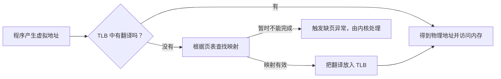
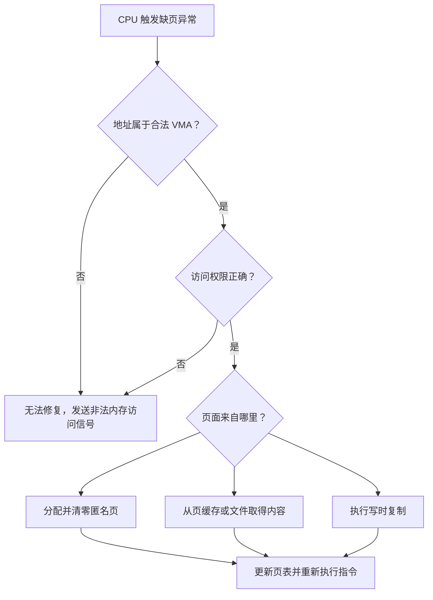

# 虚拟内存：程序为什么看见自己的地址空间

程序打印“申请了 8 GiB 内存”时，机器的可用物理内存不一定立刻减少 8 GiB；两个进程也可以打印同一个地址，却读取到不同内容。原因是程序操作的是自己的虚拟地址，操作系统和 CPU 再把虚拟地址转换成真实的物理内存位置。

## 1. 为什么需要虚拟内存

**物理内存**是机器实际安装的 RAM。**物理地址**表示 RAM 中的真实位置。如果应用直接使用物理地址，会出现三个问题：应用必须知道机器的硬件布局，一个错误指针可能破坏其他程序，而且多个程序很难安全共享同一台机器。

**虚拟内存（Virtual Memory）**让每个进程看到一套独立的**虚拟地址空间**。虚拟地址空间是进程能够使用的地址编号范围，不代表每个编号已经占有一块 RAM。

虚拟内存主要提供：

- **隔离**：两个进程中的相同虚拟地址可以对应不同物理内存，彼此不能随意访问；
- **保护**：不同区域可以分别设置可读、可写和可执行权限；
- **共享**：操作系统可以有意让多个进程映射同一份文件或共享内存；
- **按需分配**：先保留地址范围，真正访问时再准备物理页。

虚拟内存不等于 Swap。**Swap（交换空间）**是内存紧张时，操作系统可能用来暂存部分内存内容的磁盘空间。即使关闭 Swap，地址翻译和进程隔离仍然需要虚拟内存。

## 2. 一个进程的地址空间里有什么

进程的地址空间通常包含下面几类区域：

```text
较高地址
┌────────────────────────────┐
│ 线程栈：函数参数、局部变量等 │
├────────────────────────────┤
│ 内存映射：动态库、映射文件等 │
├────────────────────────────┤
│ 堆：运行期间动态申请的数据   │
├────────────────────────────┤
│ 可写数据：全局变量等         │
├────────────────────────────┤
│ 代码和只读数据               │
└────────────────────────────┘
较低地址
```

图中方向只是帮助理解，具体布局会因操作系统、CPU 架构和安全随机化而变化，不应把固定地址背成规则。

Linux 用 **VMA（Virtual Memory Area，虚拟内存区域）**记录一段连续虚拟地址的用途和权限。例如，一段 VMA 可以表示“这里是可读写的堆”，另一段可以表示“这里映射了某个只读文件”。

VMA 只是使用规划，不等于物理内存已经到位。可以把 VMA 类比为规划好的门牌号范围；页表才记录某个门牌号当前对应哪间真实房屋。

## 3. 页表怎样完成地址翻译

操作系统把虚拟内存和物理内存都按固定大小的**页（page）**管理。页是内存映射和保护的基本单位。许多 x86-64 Linux 机器使用 4 KiB 基础页，但这是常见配置，不是所有机器的固定值。

一个虚拟地址可以理解成两部分：

```text
虚拟地址 = 虚拟页号 + 页内偏移
```

**页表（page table）**是操作系统为进程维护的映射结构。页表项记录虚拟页对应的物理页，以及这一页是否存在、是否可写、是否可执行等状态。

**MMU（Memory Management Unit，内存管理单元）**是 CPU 中负责地址翻译和权限检查的硬件。CPU 每次读取指令或数据时，MMU 都要确定虚拟地址对应哪个物理地址。

为了避免每次都读取页表，CPU 使用 **TLB（Translation Lookaside Buffer，地址翻译缓存）**保存最近使用过的地址翻译。它缓存的是“虚拟页到物理页”的关系，不是程序数据本身。



这里最重要的区别是：**TLB 未命中不等于缺页。** TLB 没有缓存时，CPU 仍可能从有效页表中找到映射；只有现有映射不能完成这次访问时，才需要进入内核处理缺页。

## 4. 缺页发生时，系统具体做什么

**Page fault（缺页异常）**表示 CPU 无法按当前页表完成一次内存访问，于是暂停当前指令并进入内核。它的名字容易让人误以为程序一定出错，但很多缺页是正常的按需分配步骤。

内核会依次判断：

1. 这个地址是否属于进程已有的 VMA；
2. 本次读、写或执行是否符合 VMA 权限；
3. 需要新分配空白物理页、载入文件内容，还是复制一个共享页；
4. 建立或更新页表后，是否可以重新执行刚才的指令。



Linux 通常用名为 `SIGSEGV` 的信号报告无法修复的非法内存访问。信号是内核向进程通知事件的一种机制；若程序没有专门处理，进程通常会终止。

Linux 常把不需要存储 I/O 就能完成的缺页称为 **minor fault（次要缺页）**，把需要从存储读取内容的缺页称为 **major fault（主要缺页）**。两者是处理路径分类，不表示 minor 是错误较小、major 是程序损坏。

这也解释了为什么内存申请函数返回成功，不代表所有物理页已经准备好。申请函数可能只保留地址范围；程序第一次真正写入每个页面时，内核才分配和清零物理页。

## 5. 写时复制为什么能够共享页面

`fork()` 创建子进程时，如果立刻复制父进程的所有物理页，会复制大量可能根本不会修改的数据。Linux 通常采用 **Copy-on-Write（COW，写时复制）**：

1. 父子进程的页表先指向同一物理页；
2. 共享页面暂时不允许直接写入；
3. 任何一方第一次写入时触发缺页；
4. 内核复制该页，让写入方得到自己的可写副本。

```text
fork 刚完成：父页表 ─┐
                     ├→ 同一个只读物理页
            子页表 ─┘

子进程写入后：父页表 ───→ 原物理页
              子页表 ───→ 复制出的新物理页
```

COW 不是免费复制，而是把复制推迟到确实发生写入时。如果父子进程最终都修改大量页面，仍然需要相应的复制时间和内存。

## 6. `mmap` 把什么映射进地址空间

`mmap()` 是建立内存映射的系统调用。它可以创建匿名内存，也可以把文件的一部分映射到进程地址空间。映射完成后，程序通过普通内存读写指令访问这些内容。

理解一个映射时，先回答三个基础问题：

1. 内容来自匿名内存还是文件？
2. 当前进程可以读、写还是执行？
3. 修改是私有副本，还是需要与其他映射者共享？

`MAP_PRIVATE` 表示修改对当前进程私有，通常通过 COW 形成副本，不直接改动原文件。`MAP_SHARED` 表示修改可以进入共享文件页，并被其他映射同一对象的进程看到。

“另一个进程已经看到修改”和“数据在断电后仍存在”是不同承诺。文件映射的修改仍会先进入内存中的页缓存；需要持久化时，程序还要使用与文件系统语义相符的同步操作。

## 7. 物理内存不足时怎样管理

**匿名内存**没有普通文件作为直接后备，例如堆、栈和匿名 `mmap`；文件页则可能由页缓存保存。物理内存紧张时，系统要在文件页、匿名页和各进程工作集之间回收空间。FIFO/OPT/LRU/Clock、全局与局部置换、抖动、Swap 和 OOM 见[内存管理](memory_management.md)，本章不重复置换策略。

## 8. 怎样观察而不是猜测

常见指标回答不同问题：

| 指标 | 它表示什么 | 不能直接说明什么 |
|---|---|---|
| VSZ / VmSize | 进程保留的虚拟地址范围 | 已占用同样大小的 RAM |
| RSS / VmRSS | 当前驻留在 RAM 中的进程页面 | 多进程 RSS 相加就是唯一物理占用 |
| PSS | 把共享页按共享者比例分摊后的估算 | 未来一定需要多少内存 |
| Page fault | 某次访问需要内核补全映射 | 一定发生了程序错误 |

在自己的 Linux 测试环境中，可以读取：

```bash
# 查看当前 shell 进程的虚拟地址范围和驻留内存
grep -E 'VmSize|VmRSS|RssAnon|RssFile|RssShmem' /proc/$$/status

# 查看地址区域、权限以及是否由文件支撑
sed -n '1,40p' /proc/$$/maps

# 查看整机内存、页缓存和 Swap 概况
grep -E 'MemTotal|MemAvailable|Cached|SwapTotal|SwapFree' /proc/meminfo
```

不要为了观察 OOM 在重要机器上耗尽内存。此类实验应放在可以销毁的容器或虚拟机中，并设置明确的小容量限制。

## 9. 常见误解

- **“虚拟内存就是 Swap。”** 虚拟内存首先提供地址翻译、隔离、保护和共享；Swap 只是可选后备。
- **“TLB miss 就是 page fault。”** TLB 未命中后，CPU 仍可能从页表得到有效映射。
- **“申请 1 GiB 就立即占有 1 GiB RAM。”** 地址范围和物理页可能在真正访问时才准备。
- **“COW 不发生复制。”** 它只是让只读页面先共享，把复制推迟到第一次写入。
- **“RSS 可以直接相加。”** 共享库和共享文件页可能被多个进程重复计算。
- **“`mmap` 写完就已经持久化。”** 内存可见性、文件写回和断电持久性是不同阶段。

## 10. 三类系统怎样使用这些基础

| 场景 | 虚拟内存解决的实际问题 | 进一步需要考虑什么 |
|---|---|---|
| 传统互联网服务 | 隔离多个服务进程，为缓存和数据库管理内存 | 容量上限、工作集、回收和 OOM 恢复 |
| AI Agent 平台 | 隔离任务执行环境，限制每个容器或沙箱的内存 | 模型与工具进程的峰值、共享文件页和资源配额 |
| HFT 系统 | 保存订单簿等常驻状态，并理解首次访问和地址翻译 | 在正确性成立后，再评估预热、大页或内存位置是否必要 |

这些场景使用同一套虚拟内存机制。业务类型只决定工作集和故障边界，不会改变页表、缺页和回收的基本含义。

## 做题方法

地址翻译题固定从页大小开始：

1. 页大小为 `2^p` 字节时，虚拟地址低 `p` 位是页内偏移，其余是虚拟页号。翻译前后页内偏移不变，这是首要验算条件。
2. 先查 TLB；未命中才按题设页表层级取索引。页表项无效可能是缺页，也可能是非法地址，必须结合映射与权限判断。
3. 页表项有效时，用物理页号拼接原偏移得到物理地址；不要把虚拟页号直接当物理页号。
4. 缺页题按“陷入内核 → 合法性检查 → 选择/分配物理页 → 必要时写回 → 从文件或 Swap 读入 → 更新页表/TLB → 重启指令”排序。
5. 写时复制题给每个页标引用计数与只读/COW 状态。第一次写会分配并复制私有页，未写的一方仍指向原页。
6. `mmap` 题分别标出映射是否共享、是否由文件后备、写入传播到哪里；虚拟地址连续不代表物理页连续。

空间计算时把“虚拟地址位数、单级页表项大小、实际映射页数”分开。直接用整个虚拟空间除页大小会得到单级页表的理论项数，却不等于多级页表已经分配的物理内存。

## 11. 章末思考题

1. 为什么两个进程可以使用数值相同的虚拟地址而不互相覆盖？
2. VMA、页表项和物理页分别记录或保存什么？
3. 为什么 TLB 未命中不一定触发缺页？
4. 举出两个可以被内核正常修复的缺页，以及一个无法修复的非法访问。
5. `fork` 后父子进程只读同一页和分别写同一页时，各会发生什么？
6. 为什么干净文件页可以直接回收，脏文件页却通常要先写回？
7. 一个进程的 VmSize 很大但 RSS 很小时，可以说明什么，不能说明什么？

一分钟复述：**每个进程拥有独立虚拟地址空间，VMA 描述地址范围和权限，页表把虚拟页映射到物理页，MMU 与 TLB 完成日常翻译；映射暂时不能完成时，内核处理缺页；物理内存紧张时，内核再通过回收、写回或 Swap 腾出空间。** 这段话也可以作为面试回答的主干。

### 参考答案与解答

<details><summary>展开答案</summary>

1. 每个进程使用自己的页表根；相同虚拟页号可映射到不同物理页框。只有显式共享映射时，两个页表项才可能指向同一物理页。
2. VMA 描述一段虚拟地址范围、权限和后备对象；页表项保存虚拟页到物理页的当前映射及 present/权限等位；物理页保存真实字节。
3. TLB 只是翻译缓存。TLB miss 后页表项若 present，硬件/内核补入 TLB 即可；只有页表表明映射不在内存或权限异常等，才触发 page fault。
4. 可修复：首次访问按需分配的匿名页；访问尚未读入的文件映射页。不可修复：写只读 VMA 或访问没有合法 VMA 的地址，内核通常向进程发送错误信号。
5. fork 后父子页表都以只读 COW 指向同一物理页；只读不复制。某一方首次写时触发保护异常，内核复制新页并只更新写入方映射；双方分别写后各有私有页。
6. 干净文件页可从原文件重新读取，回收只需丢弃映射；脏文件页含尚未写回的新数据，直接丢弃会丢失修改，通常先回写。
7. 说明进程保留了很大的虚拟地址范围，但当前驻留物理页较少；可能是稀疏映射、未触碰预留或文件映射。它不能单独说明将来峰值、Swap、工作集或内存压力，也不能等同于泄漏。

</details>

## 一手资料

- [Linux Memory Management Concepts](https://docs.kernel.org/admin-guide/mm/concepts.html)
- [Linux Page Tables](https://docs.kernel.org/mm/page_tables.html)
- [Linux `mmap(2)`](https://man7.org/linux/man-pages/man2/mmap.2.html)
- [Linux `fork(2)`](https://man7.org/linux/man-pages/man2/fork.2.html)
- [Linux `proc_pid_smaps(5)`](https://man7.org/linux/man-pages/man5/proc_pid_smaps.5.html)
