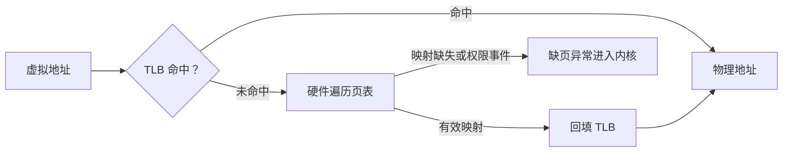

# 虚拟内存：程序为什么看见自己的地址空间

> **面试优先级：P0。** 你需要讲清虚拟地址、VMA、页表、TLB、缺页、写时复制、`mmap`、回收和 OOM 之间的因果关系。多级页表的具体层名、内核回收器实现和大页配置属于追问内容，不要先背。

程序显示“申请了 8 GiB”时，机器的物理内存不一定立刻减少 8 GiB；两个进程也可以打印相同的地址，却访问不同数据。理解这些现象，需要先把**地址范围已经保留**、**虚拟页已经映射**和**数据当前驻留在物理内存**分开。

## 1. 为什么程序不直接使用物理地址

物理地址表示真实内存硬件中的位置。如果应用直接操作物理地址，它必须了解机器安装了多少内存，而且一个错误指针就可能改坏内核或其他程序的数据。

**虚拟内存（Virtual Memory）**让每个进程看到自己的虚拟地址空间，再由 CPU 硬件和操作系统把虚拟地址翻译成物理地址。它主要解决三个问题：

- **隔离**：两个进程中的同一个虚拟地址可以映射到不同物理页。
- **共享**：内核也可以让多个进程有意映射同一个文件页或共享内存页。
- **按需使用**：程序可以先保留地址范围，真正访问时再准备物理页。

虚拟内存不等于 swap。**Swap（交换空间）**只是内存紧张时可能用于保存匿名页的后备存储；即使系统完全禁用 swap，仍然需要虚拟地址、页表和保护机制。

## 2. 地址空间与 VMA 描述“允许怎样访问”

一个进程的虚拟地址空间通常包含程序代码、只读常量、可写数据、堆、动态库、文件映射和每个线程的栈。这些区域在虚拟地址上彼此分开，并带有读、写、执行等权限。

Linux 用 **VMA（Virtual Memory Area，虚拟内存区域）**描述一段连续地址范围的用途和权限。例如，一个 VMA 可以表示“这段地址可读写、由匿名内存支撑”，另一个 VMA 可以表示“这段地址只读、对应某个文件”。

VMA 不等于物理页。可以把 VMA 理解成规划图：它说明一段房间号码属于谁、允许做什么；页表才记录某个房间号码此刻对应哪一间真实房屋。程序刚保留一个很大的 VMA 时，其中许多页可能还没有物理内存。

```text
虚拟地址空间
  ├─ 代码 VMA：可读、可执行、文件支撑
  ├─ 堆 VMA：可读、可写、匿名
  ├─ 文件映射 VMA：权限由 mmap 参数决定
  └─ 线程栈 VMA：可读、可写、按需增长到限制
```

## 3. 页、页表、MMU 与 TLB 怎样合作

操作系统把内存按固定大小的**页（page）**管理。许多 x86-64 Linux 机器的基础页是 4 KiB，但这只是常见配置，程序应查询实际值。虚拟地址可以拆成“虚拟页号 + 页内偏移”；翻译时页内偏移不变，只需要找到虚拟页对应的物理页框。

**页表（page table）**是内核维护的分层映射结构。页表项记录物理页框位置，以及该页是否存在、是否可写、是否可执行等权限。分层设计允许进程拥有巨大而稀疏的地址空间，而不必为每一个可能地址预先创建映射。

**MMU（Memory Management Unit，内存管理单元）**是 CPU 中执行地址翻译和权限检查的硬件。每次访存都完整遍历页表太慢，所以 CPU 还使用 **TLB（Translation Lookaside Buffer，地址翻译缓存）**保存最近用过的虚拟页到物理页翻译。



**TLB miss 不等于 page fault。** TLB 没有缓存时，硬件仍可能从页表找到有效映射，然后回填 TLB；只有映射尚未建立、页面不在内存或访问违反权限时，才需要用异常进入内核处理。

页表被修改后，CPU 不能继续使用过期的 TLB 项。多核系统有时需要通知其他核心使对应翻译失效，这类跨核心协调称为 TLB shootdown。P0 只需知道频繁修改映射也有成本，不必背架构指令。

## 4. Page fault 为什么不一定是程序错误

**Page fault（缺页异常）**表示当前访存不能直接按现有页表完成，CPU 把控制权交给内核判断原因。它既可能是按需分配的正常步骤，也可能是非法访问。

常见路径如下：

1. 首次写匿名内存时，内核分配一个清零的物理页并建立映射。
2. 访问文件映射时，如果数据已在页缓存，内核只需把相应页映射进进程。
3. 如果文件页不在内存，内核要从存储读取它；当前线程通常需要等待。
4. 写入共享的写时复制页时，内核分配私有页、复制数据并更新映射。
5. 地址没有 VMA 或权限不允许时，内核无法修复，通常向线程发送 `SIGSEGV`。

Linux 统计中，通常把不需要存储 I/O 就能完成的缺页记作 **minor fault**，把需要 I/O 的缺页记作 **major fault**。minor 仍需要进入内核和修改映射，并非零成本；major 也只是统计类别，不代表磁盘损坏。

一个 1 GiB 匿名区域若按 4 KiB 基础页逐页首次写入，大约涉及：

```text
1 GiB / 4 KiB = 262,144 pages
```

因此，“分配函数很快返回”不代表第一次使用整块内存也会很快。低延迟程序常在启动阶段预先触碰确定会使用的页面，把首次缺页成本移出关键路径；是否值得这样做必须用 fault 计数和延迟分布验证。

## 5. Copy-on-Write 为什么推迟复制

`fork()` 创建子进程时，如果立即复制父进程的全部物理内存，启动成本会非常高，而且子进程可能马上执行 `execve()`，使复制完全浪费。

Linux 通常使用 **Copy-on-Write（COW，写时复制）**：父子进程先让页表指向同一物理页，并暂时禁止直接写入。只读访问可以继续共享；某一方第一次写时触发 fault，内核为写入方复制该页并恢复可写权限。

COW 是“推迟到确实写时再付费”，不是“复制免费”。如果父子双方很快改写大部分页面，最终仍会消耗复制时间和额外内存。多线程进程在 `fork` 后、`execve` 前还能安全执行的操作也受限制；应用一般应使用成熟的进程启动接口。

## 6. `mmap` 建立了什么关系

`mmap()` 的作用是把一段虚拟地址范围映射到匿名内存或文件。理解一个映射时依次回答四个问题：

1. 映射由匿名内存还是文件支撑？
2. 使用 `MAP_PRIVATE` 还是 `MAP_SHARED`？
3. 允许读、写还是执行？
4. 程序需要的只是可见性，还是还要求崩溃后持久化？

匿名映射没有普通文件作为直接后备，常用于大块内存和运行时分配。文件映射让程序通过内存读写文件内容，对应物理页通常属于内核页缓存。

`MAP_PRIVATE` 的修改对当前进程私有，通常通过 COW 形成私有页面，不回写到底层文件。`MAP_SHARED` 的修改可以被映射同一对象的进程观察，并能进入文件的写回路径。另一个进程“已经看见”、数据“已经进入页缓存”和整机断电后“仍然存在”是不同承诺；需要持久性时仍要按接口和文件系统语义使用 `msync`、`fsync` 等机制。

## 7. 匿名内存、页缓存和统计口径

**匿名内存**包括堆、栈和匿名 `mmap`，没有普通文件作为直接后备。**页缓存（page cache）**是内核用物理内存保存的文件内容副本，用来避免每次读写都访问存储。两者都占用 RAM，也都参与内存压力处理。

常见指标回答的是不同问题：

| 指标 | 表示什么 | 不能直接推出什么 |
|---|---|---|
| VSZ / VmSize | 进程保留的虚拟地址范围 | 当前占用了等量 RAM |
| RSS / VmRSS | 当前驻留的映射页总量 | 多进程 RSS 相加就是整机唯一占用 |
| PSS | 把共享页按共享者比例分摊后的估算 | 精确的未来峰值 |
| 系统页缓存 | 内核当前用于缓存文件的内存 | 全部都能无代价立即回收 |

共享库和同一文件页面可能出现在多个进程的 RSS 中，所以把所有 RSS 直接相加会重复计算。反过来，未映射的页缓存和内核自身内存又可能没有出现在这些进程 RSS 中。容量规划要同时看匿名页、文件页、共享程度和工作集峰值。

## 8. 内存紧张时：回收、swap 与 OOM

当可用物理内存下降时，内核会进行**内存回收（reclaim）**。它可以丢弃以后能从文件重新读取的干净页缓存；脏文件页必须先写回；系统允许 swap 时，匿名页还可能被换出。回收需要扫描、写回或读取数据，因此内存问题常先表现为 CPU 和 I/O 增加、缺页上升以及 P99 延迟变差，而不是立即报错。

如果内核仍无法满足必要分配，就会进入 **OOM（Out Of Memory，内存不足）**处理。Linux 可能选择终止一个或多个进程以释放内存。被终止的进程只是结果；排障还要检查内存增长、回收、swap、fault 和工作负载变化。

容器常使用 cgroup 设置内存边界。`memory.high` 通常施加回收和节流压力，`memory.max` 是不能继续超过的硬上限；到达 cgroup 上限可能只在该资源组内触发 OOM。它能限制记账范围，却不能消除共享内核、页缓存、存储和内存带宽上的相互影响。

<details>
<summary><strong>P1 选读：大页解决什么问题</strong></summary>

基础页较小时，同样大小的工作集需要更多页表项和 TLB 条目。Huge Page（大页）用更大的页面扩大 TLB 能覆盖的内存范围，可能减少地址翻译开销。代价是分配粒度更大、碎片和运维要求更高，透明大页的合并与拆分还可能引入延迟波动。是否使用大页应由目标机器上的 TLB 事件、内存浪费和尾延迟实验决定。

</details>

## 9. 在 Linux 上怎样获得证据

下面的命令只读取当前 shell 和系统状态，适合自己的 Linux 测试环境：

```bash
# 查看当前进程的虚拟内存、驻留内存及主要分类
grep -E 'VmSize|VmRSS|RssAnon|RssFile|RssShmem' /proc/$$/status

# 查看地址范围、权限和文件后备
sed -n '1,40p' /proc/$$/maps

# 查看系统内存、页缓存和 swap 概况
grep -E 'MemTotal|MemAvailable|Cached|SwapTotal|SwapFree' /proc/meminfo

# 连续三次观察运行队列、内存、换页和 CPU 概况
vmstat 1 3
```

不要为了观察 OOM 在宿主机申请全部内存。若要做实验，应在可销毁的容器或虚拟机中设置很小、明确的资源上限，并提前准备终止和恢复方式。

一次观测应回答：地址空间很大但 RSS 很小，还是工作集真的驻留？fault 是首次按需分配，还是文件页被反复读入？延迟尖刺是否与回收、换页或 OOM 事件在同一时间发生？

## 10. 高频误区与面试回答

- “虚拟内存就是 swap。”——虚拟内存首先是地址翻译、隔离和共享；swap 只是可选后备。
- “TLB miss 就是 page fault。”——TLB 未命中后仍可能从有效页表完成翻译。
- “`malloc` 成功说明所有物理页已经就绪。”——许多页面会在首次访问时按需准备。
- “RSS 相加就是整机内存用量。”——共享页会重复计算，内核内存又可能遗漏。
- “`mmap` 写完就已断电安全。”——映射可见、页缓存写回和持久化是不同阶段。
- “COW 不会消耗复制成本。”——它只是把复制推迟到第一次写。

30 秒回答可以这样组织：

> 每个进程看到独立的虚拟地址空间，VMA 描述一段地址允许怎样访问，页表把虚拟页映射到物理页，CPU 的 TLB 缓存近期翻译。TLB miss 仍可通过页表解决；映射尚未建立、文件页不在内存、COW 写入或权限错误时才会触发 page fault。`fork` 通常先共享物理页，写时再复制。匿名页和文件页缓存都占用 RAM；内存紧张时会回收、写回或换页，无法满足分配时才可能 OOM。排障时我会把 VSZ、RSS/PSS、fault、回收和尾延迟按时间对齐。

## 11. 自测与小结

1. 为什么两个进程可以使用相同数值的虚拟地址而不互相覆盖？
2. VMA、页表项和物理页分别记录什么？
3. 举出两个正常 page fault 和一个无法修复的非法访问。
4. `fork` 后父子只读同一页和分别写同一页时，有什么不同？
5. 为什么释放干净页缓存和回写脏页的成本不同？
6. 为什么系统可能在 OOM 之前先出现很长的尾延迟？

本章主讲地址映射和物理内存压力。操作系统怎样把缺页、调度和中断反映为延迟抖动，见[操作系统原理](os_internals.md)；文件页怎样从脏页进入设备，见[一次文件写入](file_write_path.md)。

## 一手资料

- [Linux Memory Management Concepts](https://docs.kernel.org/admin-guide/mm/concepts.html)
- [Linux Page Tables](https://docs.kernel.org/mm/page_tables.html)
- [Linux Cache and TLB Flushing](https://docs.kernel.org/core-api/cachetlb.html)
- [Linux `mmap(2)`](https://man7.org/linux/man-pages/man2/mmap.2.html)
- [Linux `fork(2)`](https://man7.org/linux/man-pages/man2/fork.2.html)
- [Linux `proc_pid_smaps(5)`](https://man7.org/linux/man-pages/man5/proc_pid_smaps.5.html)
- [Linux cgroup v2 memory controller](https://docs.kernel.org/admin-guide/cgroup-v2.html#memory)
