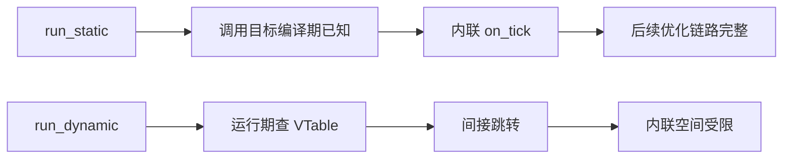

# 零成本抽象 (Zero-Cost Abstractions)

在低延迟系统里，“抽象”常常被误解为“额外开销”。这种直觉在很多运行时托管语言里是成立的，但在 Rust 中并不总是成立。所谓零成本抽象（Zero-Cost Abstraction），核心并不是“任何写法都一样快”，而是“当抽象能够在编译期被解析时，运行期不应支付额外税费”。因此，我们真正要学习的不是语法技巧，而是识别哪些抽象能被编译器彻底消解，哪些抽象会把决策推迟到运行时。

对 HFT 而言，这个问题直接关联工程边界：我们既希望代码具备类型安全、可维护性和可组合性，又不能接受在热路径上引入虚调用、装箱分配或不可预测分支。Rust 的价值就在于，它允许我们在许多场景同时获得“高层表达能力”和“底层执行效率”，前提是我们理解其优化模型并按模型写代码。

## 1. 理论背景 (Theory & Context)

### 1.1 单态化 (Monomorphization)
Rust 泛型采用单态化（Monomorphization）而非类型擦除（Type Erasure）。这意味着编译器会为每个具体类型生成专门版本的机器码。例如 `fn process<T>(x: T)` 若被 `u64` 和 `f64` 调用，最终会产生两个已具体化的实现。由于类型在编译期已确定，优化器可以做更激进的内联、常量传播与分支裁剪，这就是许多“看上去很抽象”的代码在运行时仍然高效的根本原因。

单态化的代价是代码体积增长（Code Bloat）。这不是理论问题，而是会影响 I-Cache 命中率的工程问题。高频系统中常见做法是：把与类型无关的大逻辑外提，只把真正依赖类型信息的短路径保留在泛型层，从而在执行效率与二进制体积之间取得平衡。

### 1.2 静态分发 vs 动态分发

静态分发（Static Dispatch）与动态分发（Dynamic Dispatch）的差异不只是一条间接调用指令，更重要的是它们对后续优化链路的影响。静态分发下，调用目标在编译期已知，优化器更容易跨函数边界合并逻辑；动态分发下，调用目标在运行期通过 VTable 决定，内联空间被压缩，进一步优化机会减少。


## 2. 核心实现：迭代器优化 (Iterator Optimization)

很多工程师初看 Rust 会认为“链式迭代器一定比 for 循环更重”。在未优化构建里这个直觉可能成立，但在发布构建中，迭代器常常能生成同等级甚至更优机器码。原因在于迭代器把“访问模式”表达得更明确，优化器更容易证明边界安全性并实施融合优化。

### 2.1 案例：计算加权价格
下面以“订单总价值计算”为例，对比两种写法。两者语义等价，重点在于编译器能否把它们优化到相近执行路径。

```rust
struct Order {
    price: f64,
    qty: u32,
}

// 方式 1: 传统的 for 循环
fn total_value_loop(orders: &[Order]) -> f64 {
    let mut total = 0.0;
    for i in 0..orders.len() {
        total += orders[i].price * orders[i].qty as f64;
    }
    total
}

// 方式 2: 迭代器链
fn total_value_iter(orders: &[Order]) -> f64 {
    orders.iter()
        .map(|o| o.price * o.qty as f64)
        .sum()
}
```

在 `--release` 条件下，这两种写法经常收敛到接近的性能水平。迭代器写法的优势在于语义信息更集中：遍历范围、映射关系与归约操作是显式表达的，便于优化器识别并进行边界消除与指令调度。反过来，若循环体中存在复杂分支、不可预测访存或函数调用，迭代器也不会自动“变魔法”，这时仍需回到数据布局和分支结构本身做优化。


### 2.2 Newtype 模式与零开销封装

在交易系统中，`OrderId`、`TradeId`、`Price` 往往都可表示为 `u64`。如果直接使用原始类型，编译器无法阻止“语义错位”的参数传递。Newtype 模式通过轻量封装在编译期建立类型边界，同时保持运行期布局与原始类型一致，是低成本高收益的抽象方式。

```rust
// 定义 Newtype
#[derive(Clone, Copy, PartialEq, Eq, Hash, Debug)]
#[repr(transparent)] // 保证内存布局与内部类型完全一致
struct OrderId(u64);

#[derive(Clone, Copy, PartialEq, Eq, Hash, Debug)]
#[repr(transparent)]
struct Price(u64); // 假设是定点数

fn cancel_order(id: OrderId) { /* ... */ }

// 编译期错误！防止逻辑 Bug
// let price = Price(100);
// cancel_order(price); 
```

`#[repr(transparent)]` 保证单字段封装类型与内部字段在 ABI 上兼容。对性能关键路径而言，这意味着你获得了更强类型约束，但通常不需要为此支付额外内存布局成本。工程价值在于：把“参数传错类型”这类低级错误从运行期异常前移为编译期失败。

## 3. 性能分析 (Performance Analysis)

### 3.1 动态分发的代价
下面给出一个静态分发与动态分发的最小对照。它不是为了证明“dyn 一定慢”，而是为了说明在热路径中，动态分发会压缩优化空间，进而影响尾延迟。

```rust
trait Strategy {
    fn on_tick(&mut self, price: f64) -> bool;
}

struct MomentumStrategy;
impl Strategy for MomentumStrategy {
    #[inline(always)]
    fn on_tick(&mut self, price: f64) -> bool {
        price > 100.0
    }
}

// 静态分发：编译器生成专门的代码，内联 on_tick
fn run_static<S: Strategy>(strat: &mut S, price: f64) -> bool {
    strat.on_tick(price)
}

// 动态分发：通过 VTable 调用，无法内联
fn run_dynamic(strat: &mut dyn Strategy, price: f64) -> bool {
    strat.on_tick(price)
}
```



在低延迟场景中，是否采用动态分发应由“路径位置”决定：控制面、插件化接口、非热点调度层使用 `dyn Trait` 往往合理；逐笔行情处理、撮合前风控等热路径更适合静态分发。这样做并非教条，而是为了让编译器在真正关键路径上保留最大优化自由度。

### 3.2 如何做可信基准

零成本抽象的结论必须由可复现实验支持。实践中建议使用 `criterion` 或等价框架，在固定 CPU 频率策略、固定输入分布、预热充分的条件下对比实现，并同时观察吞吐与分位点延迟。若只看平均值，很容易忽略分支不稳定、I-Cache 压力和偶发慢路径带来的尾部劣化。

| 对比项 | 推荐做法 | 需要避免 |
|---|---|---|
| 构建模式 | 使用 `--release` | 在 debug 下下结论 |
| 输入数据 | 固定分布并可复现 | 每次随机输入导致噪声 |
| 评价指标 | 同时看平均值与分位点 | 仅报告单次最优结果 |
| 观察维度 | 时间 + 指令/分支/缓存事件 | 只看 wall-clock 时间 |

## 4. 常见陷阱 (Pitfalls)

第一个陷阱是把“泛型越多越好”误解为性能策略。过大的泛型函数在多类型实例化后会带来明显代码膨胀，增加指令缓存压力。改进方法通常不是放弃泛型，而是把与类型无关的大段逻辑拆分出去，只让短小、可内联、类型相关的部分保留在泛型函数内。

第二个陷阱是在热路径滥用动态分发或复杂闭包捕获。动态分发会减少优化器可见信息，复杂闭包可能增加状态体积并影响寄存器分配。若某段逻辑位于高频循环内，应优先检查其分发方式和闭包捕获集合是否最小化。

第三个陷阱是用 debug 构建评估性能。Rust 的许多“零成本”特性依赖优化管线生效，未优化构建下结论通常没有工程意义。性能评估必须在 release 构建与稳定测试环境中进行。

## 5. 本章小结

零成本抽象并不意味着“抽象自动免费”，而是意味着“可在编译期解析的抽象，可以被优化为接近手写低级代码的执行形态”。在 Rust 中，这一能力主要依赖单态化、静态分发和优化器可见性。对低延迟系统而言，实践策略是明确划分热路径与冷路径：热路径优先静态分发与可内联结构，冷路径优先可扩展性与可维护性。只有这样，才能同时获得工程可读性与时延确定性。

## 6. 延伸阅读

- [Rust Performance Book - Iterators](https://nnethercote.github.io/perf-book/iterators.html)
- [Zero Cost Abstractions in Rust (Talk)](https://www.youtube.com/watch?v=u6rZ9j25Fhw)

---
下一章：[Unsafe Rust 实战 (SIMD, Intrinsics)](unsafe_rust.md)
