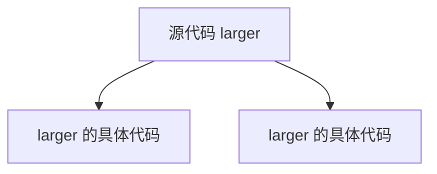
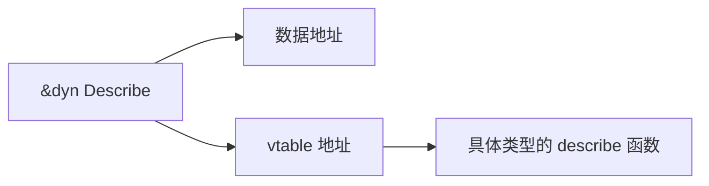

# Rust 的零成本抽象

编程中的“抽象”，就是用更容易理解的概念隐藏重复的底层步骤。例如，`Vec<T>` 把申请内存、记录长度和释放内存封装起来；迭代器把“怎样向后取出一个元素”封装成统一接口；泛型让同一段算法能够处理不同类型。

抽象首先解决的是**正确性和可维护性**问题。我们还会关心它在程序运行时做了什么，因为更方便的写法不一定都没有运行成本。

Rust 常说的“零成本抽象”可以理解为两条原则：

1. 没有使用某项功能，就不需要为它付出运行成本。
2. 使用一项抽象时，编译器应尽量把它变成与手写底层代码相近的机器指令。

这里的“零成本”不是承诺任何高级写法都同样快。它表示许多决定能够在编译期间完成，不必留到程序运行时再处理。

## 1. 从源代码到运行中的程序

CPU 并不直接执行泛型、trait 或迭代器。Rust 编译器会检查源代码，再把它转换为目标机器可以执行的指令。


因此，判断一个抽象的成本时，需要分清两个问题：

- **源代码中出现了什么？** 这决定代码是否清楚、类型是否安全。
- **运行时还保留了什么？** 这决定程序是否要做额外分配、查表、计数或同步。

有些抽象主要存在于编译期，例如泛型类型参数；有些行为一定存在于运行时，例如给 `Vec` 扩容、给 `Arc` 更新引用计数或给互斥锁加锁。后者也是有价值的抽象，只是不能把它们叫作“没有成本”。

## 2. 泛型为什么通常没有类型判断开销

下面的函数可以比较任何实现了 `Ord` 的类型：

```rust
fn larger<T: Ord>(left: T, right: T) -> T {
    if left >= right { left } else { right }
}

fn main() {
    assert_eq!(larger(3_u32, 8_u32), 8);
    assert_eq!(larger('z', 'a'), 'z');
}
```

编译器看到两种实际用法后，会生成适合 `u32` 和 `char` 的具体版本。这个过程叫作**单态化**（monomorphization）。运行时不需要先询问“这次传进来的是什么类型”，因为类型在编译时已经确定。



单态化也有边界：同一个泛型函数被许多类型使用时，可能生成许多份机器码，使二进制文件变大。代码变大还可能影响指令缓存。因此，“泛型调用通常不做运行时类型判断”和“泛型永远没有任何代价”不是同一句话。

## 3. 静态分发与动态分发

**分发**是“程序如何找到要调用的具体函数”。Rust 中常见两种方式。

### 3.1 静态分发：编译时已经知道目标

泛型参数 `T: Trait` 使用静态分发。编译器为实际类型选择具体实现：

```rust
trait Describe {
    fn describe(&self) -> String;
}

struct UserId(u64);

impl Describe for UserId {
    fn describe(&self) -> String {
        format!("user-{}", self.0)
    }
}

fn show<T: Describe>(value: &T) -> String {
    value.describe()
}

fn main() {
    assert_eq!(show(&UserId(7)), "user-7");
}
```

调用目标已知后，编译器有机会把短函数直接放进调用处，这叫**内联**。注意例子中的 `String` 和 `format!` 仍然可能申请内存；静态分发消除的是“运行时选择实现”的工作，不会消除函数本身要求的工作。

### 3.2 动态分发：运行时根据对象选择目标

`&dyn Trait` 或 `Box<dyn Trait>` 使用动态分发。trait 对象需要同时保存：

- 数据在哪里；
- 这个具体类型对应的函数表在哪里。

函数表通常称为 **vtable**。调用方法时，程序先从表中找到函数，再跳转过去。



动态分发让一个集合可以容纳多种实现，也让插件式架构更容易扩展。它的运行工作通常很小，但调用目标不固定会限制一部分内联优化。选择时先看需求：类型集合固定、想让编译器看见具体类型，可以使用泛型或枚举；类型需要在运行时扩展，可以使用 trait 对象。

## 4. 迭代器到底做了什么

迭代器不是“提前复制出一个新集合”。它是一个保存遍历状态的值；每次调用 `next`，它给出下一个元素或表示已经结束。

`map`、`filter` 等适配器通常是**惰性**的：创建它们时只组合规则，不立刻遍历数据。只有 `sum`、`collect`、`for_each` 这类消费操作开始后，元素才逐个流过整条链。

```rust
fn sum_even_squares(values: &[u32]) -> u32 {
    values
        .iter()
        .copied()
        .filter(|value| value % 2 == 0)
        .map(|value| value * value)
        .sum()
}

fn main() {
    assert_eq!(sum_even_squares(&[1, 2, 3, 4]), 20);
}
```

这段代码的逻辑可以理解为：取一个元素，判断它是否为偶数，是则平方并加入总和，然后再取下一个元素。发布构建中，编译器常能把多层适配器合并成一个循环，所以中间通常不会创建“偶数数组”和“平方数组”。

但这不是无条件保证。如果闭包里包含无法展开的调用、复杂控制流，或者代码真的执行了 `collect`，就可能出现额外工作或分配。正确结论是：迭代器**允许**编译器生成紧凑循环，但最终应看发布构建的结果。

## 5. Newtype：让相同底层类型具有不同含义

用户编号、订单编号和文件编号都可能用 `u64` 保存，但它们不能互相替代。Newtype 是只包一层的新结构体，它让编译器帮我们阻止混用：

```rust
#[derive(Clone, Copy, Debug, PartialEq, Eq)]
#[repr(transparent)]
struct UserId(u64);

#[derive(Clone, Copy, Debug, PartialEq, Eq)]
#[repr(transparent)]
struct JobId(u64);

fn find_user(id: UserId) -> bool {
    id.0 == 42
}

fn main() {
    assert!(find_user(UserId(42)));
    // find_user(JobId(42)); // 取消注释后无法通过类型检查。
}
```

`#[repr(transparent)]` 表示这个单字段结构体与内部字段具有兼容的内存布局和调用约定。Newtype 本身不需要额外保存一份标签，区别存在于编译器的类型系统中。

它也不是“自动获得所有能力”：如果希望比较、复制或打印 Newtype，仍需通过 `derive` 或手动实现相应 trait。

## 6. 哪些成本不会自动消失

理解零成本抽象，还要能识别真实存在的工作：

| 写法 | 运行时通常需要做什么 | 为什么存在 |
|---|---|---|
| `Vec::push` 导致扩容 | 申请更大的内存并搬移元素 | 容器需要容纳更多数据 |
| `Box::new` | 在堆上申请空间 | 让数据有稳定地址或减小栈上值的体积 |
| `Arc::clone` / `drop` | 原子地更新引用计数 | 让多个线程安全地共享所有权 |
| `Mutex::lock` | 协调并发访问，竞争时可能等待 | 保护共享可变状态 |
| `Box<dyn Trait>` | 通常有堆分配，并通过 vtable 调用 | 支持运行时多态和不同大小的具体类型 |
| `collect::<Vec<_>>()` | 创建并填充新容器 | 调用者明确要求保留所有结果 |

这些成本不是语言缺陷，而是程序所需语义的实现。先问“我是否需要这种语义”，比先问“它是不是最快”更有用。

## 7. 怎样验证，而不是猜测

Rust 的 debug 构建重视编译速度和调试体验，许多优化没有开启。因此，对生成代码或运行效率下结论时，应使用 `--release`。

可以采用下面的顺序：

1. 先写语义清楚、能测试正确性的实现。
2. 用代表真实工作的输入做基准，而不是只跑一次计时。
3. 在发布构建中比较两种实现，并保持输入、机器和构建参数一致。
4. 只有差异确实重要时，再查看汇编或性能分析结果解释原因。

一次测试只能说明当时的代码、输入和环境，不能证明某种语法永远更快。

## 8. 在三类系统中的用法

- **传统后端**：用 `UserId`、`TenantId` 等 Newtype 防止参数混用；用迭代器表达数据清洗；在插件系统中按扩展需求选择 `dyn Trait`。
- **AI Infra**：用不同类型区分模型编号、批次编号和张量维度；用泛型复用批处理算法；需要加载不同运行时后端时使用动态分发。
- **HFT**：用类型区分价格、数量和订单编号；对固定的数据处理组件使用静态分发；只有测量表明某条路径值得优化时，才进一步检查生成代码。

三个领域使用的是同一套语言机制，区别只是业务约束和测量目标不同。

## 9. 本章小结

零成本抽象的重点不是“所有抽象都免费”，而是编译器能把许多编译期信息从最终执行过程里消去。泛型通常通过单态化实现静态分发，trait 对象通过 vtable 实现运行时多态，迭代器通常以惰性方式组合操作，Newtype 则把业务含义交给类型系统检查。

选择抽象时，先选择需要的语义，再验证运行时结果。可读、正确和容易维护是默认目标；性能问题应由证据指出。

## 10. 思考题与面试表达

1. 为什么泛型函数通常不需要在运行时判断 `T` 是什么类型？它可能带来什么代码体积问题？
2. `&dyn Trait` 为什么能指向不同的具体类型？调用方法时多做了哪一步？
3. 为什么 `map` 本身可能什么都不执行，而 `collect` 会开始遍历并可能分配内存？
4. Newtype 与类型别名有什么区别？为什么 `type UserId = u64` 不能阻止编号混用？
5. 如果有人说“迭代器一定比 `for` 快”，你会怎样设计实验验证？

核心结论是：**零成本抽象把能在编译期决定的工作留在编译期，而不是承诺所有高级接口都没有运行成本。** 泛型单态化和迭代器优化说明它怎样实现；分配、动态分发和代码体积则说明它的边界。

---

上一章：[怎样为 Rust 项目选择工具与依赖](../introduction/ecosystem.md) · 下一章：[编译器怎样理解并优化 Rust 程序](compiler_optimizations.md)
