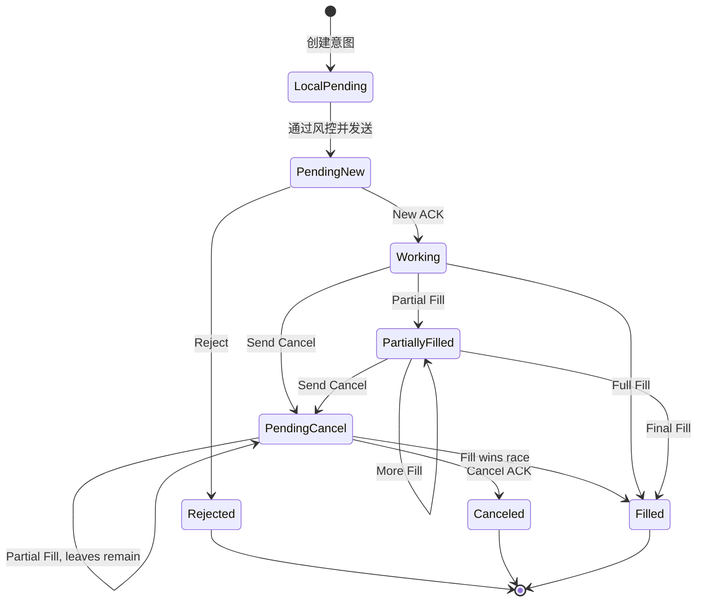

# HFT 总览：从行情到成交的完整生命周期

> 本章面向第一次接触电子交易的读者。目标不是教你“预测涨跌”，而是让你能把一笔订单从市场数据进入机器，一直追踪到成交、持仓和事后核对。

## 学完本章，你应该能回答

- HFT（High-Frequency Trading，高频交易）到底“高频”在哪里；
- 交易所、经纪商、做市商、投资者和行情供应商分别做什么；
- 行情、策略、风控、订单网关、成交回报和持仓之间怎样连接；
- 为什么“发单成功”不等于“订单已经成交”；
- 为什么低延迟不能凌驾于正确性、风控和合规之上。

## 本部分学习路线

| 顺序 | 章节 | 你会解决的问题 |
| ---: | --- | --- |
| 1 | 当前章：HFT 总览 | 一笔交易怎样完整地走过系统 |
| 2 | [市场微观结构](market_microstructure.md) | 价格、价差、深度和队列是什么意思 |
| 3 | [订单类型与撮合优先级](orders_matching.md) | 订单为何成交、排队、部分成交或取消 |
| 4 | [延迟预算与关键路径](latency_critical_path.md) | 怎样定义、测量和优化“快” |
| 5 | [HFT 系统设计面试](system_design_interview.md) | 怎样设计可恢复、可审计的交易系统 |
| 6 | [HFT 高频面试题库](interview_question_bank.md) | 怎样把知识组织成经得住追问的答案 |

## 1. 先建立正确的心智模型

HFT 不是某一个固定策略，也不能简单理解为“电脑快速买卖”。更准确的说法是：

> HFT 是一类以自动化决策、较短持有周期、较高消息处理速率和严格延迟控制为常见特征的电子交易系统与业务实践。

“高频”可能指多个维度：

| 维度 | 它在描述什么 | 容易产生的误解 |
| --- | --- | --- |
| 行情频率 | 每秒接收和处理多少条市场消息 | 消息多不代表每条都要交易 |
| 决策频率 | 策略重新评估报价或风险的次数 | 决策不一定产生订单 |
| 订单频率 | 新增、修改、撤销订单的速率 | 订单数不等于成交数 |
| 成交频率 | 实际成交的笔数 | 成交多不等于必然盈利 |
| 延迟 | 从输入事件到输出动作所需时间 | 平均延迟低不代表尾延迟可控 |

不同市场、司法辖区和交易场所有不同规则。系统必须遵守适用法规、交易所规则、经纪商限制和公司内部控制。本书只讲系统与面试知识，不提供投资建议，也不承诺任何收益。

## 2. 参与者与基础设施

先把“谁和谁交易”分清：

| 角色 | 通俗理解 | 典型职责 |
| --- | --- | --- |
| 交易场所（Venue） | 维护规则和撮合队列的市场 | 接收订单、撮合、发布行情和回报 |
| 经纪商（Broker） | 客户进入市场的通道之一 | 客户接入、风控、路由、清算协作 |
| 做市商（Market Maker） | 持续提供买卖报价的参与者 | 提供流动性、管理库存和对冲风险 |
| 主动交易者 | 根据目标主动获取流动性 | 提交可能立即成交的订单 |
| 清算机构 | 管理成交后的交收与义务 | 净额、保证金、结算等 |
| 行情供应商 | 整合或转发行情 | 标准化、聚合、分发市场数据 |

同一家公司可能同时扮演多个角色，但业务权限、账户和系统边界通常必须清晰隔离。

## 3. 一笔交易的端到端生命周期

下面是最重要的一张图。面试时如果你不知道从哪里讲，先沿这条链路讲。


### 3.1 开盘前：参考数据和权限准备

系统通常先加载：

- 合约代码、价格精度、最小变动单位（tick size）；
- 交易时段、涨跌价范围、数量单位；
- 账户、席位、策略权限和风险限额；
- 费用、币种和交易日信息；
- 前一日持仓与当日初始状态。

这里的错误不一定造成“慢”，却可能造成数量放大、价格缩小、错合约交易等严重事故。因此，生产系统常采用版本号、双人复核、校验和以及“配置不完整就不启用”的 fail-closed 原则。

### 3.2 接收行情：先证明数据是连续的

交易所常用带序号的增量消息发布订单簿变化。假设系统依次收到序号 `1001、1002、1004`，缺少 `1003`；此时订单簿可能已经不可信。正确做法通常是：

1. 标记该频道或标的状态为 stale（陈旧）；
2. 停止依赖不可信订单簿做新决策，具体行为由风险政策决定；
3. 通过重传通道补包，或重新申请快照；
4. 将快照与快照后的增量消息拼接；
5. 通过序号和订单簿不变量确认恢复完成。

详细实现可继续阅读[市场数据处理](../connectivity/market_data.md)和[增量更新与快照](../connectivity/incremental_updates.md)。

### 3.3 重建订单簿：把事件还原成当前市场

行情消息通常不是一句“现在买一是 99.99”，而是一连串事件：新增订单、减量、撤单、成交、价格档位变化。系统将它们还原为 L1、L2 或 L3 订单簿。三种粒度会在[市场微观结构](market_microstructure.md)中详细解释。

订单簿至少应维护这些不变量：

- 若买卖两边均非空，正常连续交易阶段应满足 `best_bid < best_ask`；
- 同一侧的价格档位有确定顺序；
- 数量不能为负；
- 已删除订单不能再次成交；
- 本地应用的消息序号连续。

### 3.4 决策：从状态生成“意图”

策略模块读取市场状态，产生的最好不是一段任意网络字节，而是明确的业务意图，例如：

```rust
#[derive(Debug, Clone, Copy)]
enum Side {
    Buy,
    Sell,
}

/// 价格使用最小报价单位的整数，避免浮点误差。
#[derive(Debug, Clone, Copy)]
struct OrderIntent {
    instrument_id: u32,
    side: Side,
    price_ticks: i64,
    quantity: u32,
    post_only: bool,
}
```

“意图”和“已发送订单”要分开。前者还必须经过权限、数量、价格、敞口、频率等检查。

### 3.5 预交易风控：关键路径上的安全门

常见检查包括：

| 检查 | 要阻止的问题 | 例子 |
| --- | --- | --- |
| 合约与时段 | 不可交易标的或闭市发单 | 合约已到期 |
| 单笔数量 | 胖手指错误 | 上限 100，却输入 10,000 |
| 价格范围 | 明显错误价格 | 买价偏离参考价过大 |
| 订单金额 | 过大名义金额 | `price × quantity` 超限 |
| 持仓/敞口 | 成交后风险过大 | 买单全部成交会越限 |
| 消息速率 | 超出场所或内部限制 | 改撤单风暴 |
| 自成交防护 | 同一主体订单互相成交 | 买卖策略交叉 |

风控失败必须返回可审计的原因，不能为了几百纳秒把规则“临时绕过”。实现细节见[预交易风控](../engine/pre_trade_risk.md)。

### 3.6 发送订单：本地接受不等于交易所接受

一次 `send()` 成功通常只说明数据交给了本机网络栈或网卡，并不表示：

- 交易所已经收到；
- 交易所已经接受；
- 订单已经进入公开订单簿；
- 订单已经成交。

订单需要本地唯一标识（如 Client Order ID），以便把后续确认、拒绝、成交和撤单回报关联起来。

### 3.7 交易所处理：验证、排队与撮合

交易所先做协议、权限和业务校验，再按订单类型和撮合规则处理。可成交订单会与对手方匹配；剩余数量可能进入订单簿，也可能因为 IOC、FOK 等条件被取消。具体规则必须以对应场所的规则手册为准，详见[订单类型与撮合优先级](orders_matching.md)。

### 3.8 回报处理：一个订单是状态机，不是布尔值



最经典的竞态是“撤单与成交同时在路上”：你发送撤单后，原订单在交易所仍可能先成交。因此，`PendingCancel` 不能被当作 `Canceled`。订单状态必须由交易所回报驱动，并正确处理重复、乱序和断线重放。

### 3.9 成交之后：持仓、风险与核对

成交回报会改变：

- 已成交数量与剩余数量；
- 现金和头寸；
- 已实现/未实现损益的内部估计；
- 策略、账户、组合层面的风险占用；
- 需要执行的对冲或退出动作。

内部实时状态仍不是最终法律账本。系统还应通过订单回报、独立 drop copy、经纪商/清算文件等来源做核对，发现“本地认为成交 9 手、外部记录 10 手”之类的差异。

## 4. 一个带数字的微型例子

假设最小价格变动为 `0.01` 元，系统用“分”存储价格：

| 市场状态 | 价格 | 数量 |
| --- | ---: | ---: |
| 买一 | 100.00 | 40 |
| 卖一 | 100.02 | 30 |

策略生成“以 100.02 买 10”的限价订单：

1. 订单具有可成交性，因为买入限价 `100.02 >= 最优卖价 100.02`；
2. 风控检查数量、价格和成交后持仓；
3. 交易所接受后，订单会与卖一队列中的挂单撮合；
4. 若卖一的前 10 单位可成交，则本订单全部成交，成交价通常是静止订单的价格 `100.02`，但必须以场所规则为准；
5. 本地收到 ACK 和 Fill 的先后顺序取决于协议，不能凭想象写死；
6. 买方持仓增加 10，卖一剩余数量从 30 变为 20。

如果订单改为“以 100.01 买 10”，它不会立即与 `100.02` 的卖单成交，通常会成为新的最优买价，等待未来卖方主动成交或被撤销。

## 5. 三条同时存在的路径

面试里只画“行情 → 策略 → 发单”是不完整的。一个可运营系统至少有三条路径：

| 路径 | 目标 | 典型内容 |
| --- | --- | --- |
| 热路径（hot path） | 低且稳定的事件到动作延迟 | 解码、订单簿、决策、风控、编码 |
| 恢复路径（recovery path） | 故障后恢复正确状态 | 快照、重放、会话恢复、对账 |
| 控制路径（control path） | 安全运营和人工治理 | 配置、启停、kill switch、审计 |

三者共享业务状态时，要明确谁可以写、如何版本化、怎样避免热加载产生“半新半旧”配置。

## 6. 三种时间戳，不要混为一谈

| 时间 | 含义 | 用途 |
| --- | --- | --- |
| 事件时间 | 交易所认为事件发生的时间 | 市场事件排序、研究和回放 |
| 接收时间 | 本系统看到消息的时间 | 测量网络与接收链路 |
| 处理时间 | 系统内部阶段开始/结束时间 | 分解关键路径延迟 |

跨机器比较时间戳之前必须讨论时钟同步、硬件/软件打点位置和时钟误差。否则“系统 A 快 300ns”可能只是两台机器的钟不同。

## 7. 面试答题模板：两分钟讲清生命周期

参考答法：

> 我会把系统分为行情输入、状态构建、决策、预交易风控、订单网关和回报/持仓六段。行情先做协议解析、序号与重复检查，再更新本地订单簿。策略根据可信状态产生订单意图，风控检查价格、数量、敞口和速率，通过后由网关编码发送。交易所的 ACK、Reject、Partial Fill、Fill 和 Cancel ACK 驱动本地订单状态机；撤单在确认前仍可能成交。成交同步更新持仓与风险，并通过独立回报做事后对账。低延迟优化只发生在不破坏这些正确性和合规边界的前提下。

### 常见追问

**追问 1：行情断档时还可以交易吗？**

参考答法：不能一概而论。首先将数据标记为不可信；再按标的、策略和风险政策决定暂停新单、只允许撤单或切换可靠备用源。恢复时需快照加增量，并验证序号和订单簿不变量。

**追问 2：为什么订单 ACK 不代表成交？**

参考答法：ACK 通常只是“订单已被接受”，订单可能在簿中排队，之后才部分成交、全部成交或撤销。成交必须以 Fill/Execution Report 为准。

**追问 3：最快的模块应该是哪一个？**

参考答法：先定义端到端延迟目标并测量关键路径，不能孤立优化某一模块。真正瓶颈可能是排队、缓存未命中、协议处理或网络，且 p99/p99.9 往往比平均值更重要。

## 8. 易错点清单

- 把 HFT 等同于某一种套利策略；
- 把行情消息数量、订单数量和成交数量混成一个指标；
- 用浮点数表示货币价格，忽略 tick size 和溢出；
- 收到一个 UDP 包就假设此前数据都完整；
- `send()` 返回成功便更新成“已成交”；
- 发出 Cancel 就立刻释放全部风险占用；
- 只设计正常路径，不设计断线恢复、重放和对账；
- 为了低延迟绕过风控、审计或交易场所规则；
- 引用某个场所的撮合规则，却不说明规则可能不同且会更新。

## 9. 练习

1. 画出“行情序号缺口 → 暂停决策 → 申请快照 → 回放增量 → 恢复”的状态机。
2. 某买单数量为 100，已经成交 30，撤单请求已发出但未确认。此时最坏情况下还可能再成交多少？风险模块应预留多少数量？
3. 设计一个 `OrderState` 枚举，列出哪些事件可以让它从一个状态转到另一个状态。
4. 如果本地成交记录是 99 笔，drop copy 是 100 笔，你会按什么顺序排查？
5. 用一分钟解释“低延迟、吞吐量、尾延迟”三者的区别。

<details>
<summary>第 2 题参考思路</summary>

在撤单得到确认前，剩余 70 仍可能全部成交。因此不能因为“已经发送撤单”就释放这 70 的风险占用；只有取消确认或最终成交等权威事件到达后，才能按状态释放或转换占用。

</details>

## 10. 本章速记

> 行情要连续，状态要可证；意图先风控，发送非成交；回报驱动状态，成交更新风险；热路径要快，恢复与审计不能少。

---

下一章：[市场微观结构](market_microstructure.md)
