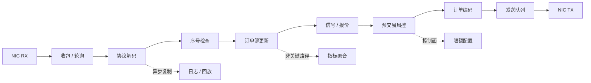

# 延迟预算与关键路径：把“快”变成可测量的工程目标

低延迟不是“代码尽量快”，而是：先定义一个有业务边界的时间区间，再把它拆成可测阶段，找到真正的关键路径，并控制尾延迟和过载行为。

> 风控、权限、审计和交易场所要求属于正确性边界，不能因为它们位于关键路径就绕过。合规的快速系统首先是正确、可停止、可恢复的系统。

## 1. 先问：从哪里，到哪里？

“我们的延迟是 5 微秒”信息不足。至少要说明：

- **起点**：网卡收到第一个字节、收到最后一个字节，还是应用解码完成？
- **终点**：策略生成意图、调用 `send()`、网卡发出第一个/最后一个字节，还是交易所 ACK？
- **负载**：消息速率、报文大小、标的数量和突发形态；
- **统计口径**：p50、p99、p99.9、最大值，样本窗口多长；
- **环境**：生产、仿真、裸机、虚拟机，是否包含网络和交易所；
- **时间源**：TSC、单调时钟、硬件时间戳，是否同步。

### 1.1 常见边界

| 名称 | 一个常见定义 | 用途 | 局限 |
| --- | --- | --- | --- |
| Tick-to-Trade | 某行情事件到对应订单发出 | 策略关键路径 | “对应”关系和网卡边界要定义 |
| Wire-to-Wire | 入站线速时间戳到出站线速时间戳 | 端到端设备/主机延迟 | 需要合适硬件打点 |
| Order-to-ACK | 本地发单到收到场所确认 | 会话与网络观察 | 包含外部场所，抖动来源更多 |
| Market-data latency | 场所事件时间到本地接收 | 观察行情传播 | 两端时钟误差会污染结果 |
| Internal stage latency | 解码、簿更新、风控等阶段耗时 | 定位瓶颈 | 打点本身有开销 |

同一团队可以同时维护多个指标，但名字和边界必须版本化，避免优化前后换了口径却宣称“提升”。

## 2. 平均数为什么不够

假设 100 次请求中 99 次为 `2µs`，1 次为 `1002µs`：

- 平均值约为 `12µs`；
- p50 约为 `2µs`；
- p99 的具体取值依百分位实现约定，可能仍接近快速样本；
- 最大值是 `1002µs`。

平均值既不能描述典型体验，也不能单独暴露极端停顿。HFT 常关心尾延迟，因为一次长暂停可能使系统基于陈旧市场状态行动。

| 指标 | 通俗解释 | 回答的问题 |
| --- | --- | --- |
| p50 | 一半样本不超过它 | 典型路径多快 |
| p99 | 约 99% 样本不超过它 | 尾部是否受控 |
| p99.9 | 更靠近极端尾部 | 稀有抖动是否严重 |
| max | 观测窗口内最大值 | 最糟观测，但对样本数很敏感 |
| jitter | 延迟的波动 | 系统是否稳定可预测 |

必须同时报告样本数量与窗口。100 个样本无法有意义地估计万分位尾部。

## 3. 关键路径长什么样



关键路径是决定最终输出完成时间的依赖链。把日志放到另一个线程不代表它自动离开关键路径：若热线程需要等待队列空间或争用同一缓存行，日志仍会造成延迟。

## 4. 建立延迟预算

下面是**教学用假设预算**，不是任何市场的承诺值：

| 阶段 | p50 预算 | p99 预算 | 主要风险 |
| --- | ---: | ---: | --- |
| NIC RX 到用户态可见 | 0.8µs | 1.4µs | 中断、驱动、批处理 |
| 解码与序号检查 | 0.5µs | 0.8µs | 变长字段、分支、错包 |
| 订单簿更新 | 0.7µs | 1.2µs | 哈希冲突、cache miss |
| 决策 | 0.6µs | 1.0µs | 数据依赖、模型复杂度 |
| 预交易风控 | 0.4µs | 0.7µs | 共享状态、原子竞争 |
| 编码与发送准备 | 0.5µs | 0.9µs | 分配、校验和、队列 |
| 用户态到 NIC TX | 0.7µs | 1.3µs | 调度、驱动、拥塞 |
| **阶段 p50 算术和** | **4.2µs** | — | 仅作预算检查 |

### 4.1 为什么不能把各阶段 p99 直接相加

每个阶段最慢的 1% 不一定发生在同一批事件上。`p99(A+B)` 通常不等于 `p99(A)+p99(B)`。正确做法是：

1. 对端到端样本直接测 p99；
2. 用相同 trace/event ID 关联阶段耗时；
3. 分析慢样本中哪些阶段共同变慢；
4. 阶段预算可用于容量和责任划分，但不可替代端到端分布。

### 4.2 预算应包括异常但合法的输入

只测最短消息会得到虚假的乐观结果。至少覆盖：

- 新增、撤销、成交和多档变化；
- 突发行情；
- 风控拒绝的冷路径；
- 序号缺口和恢复切换；
- 日志/指标背压；
- 连接重建后的缓存冷启动。

## 5. 延迟、吞吐量和排队

- **Latency**：一件事从开始到完成要多久；
- **Throughput**：单位时间处理多少件事；
- **Capacity**：在满足延迟/正确性目标下的最大可持续负载；
- **Burst tolerance**：短时突发能吸收多少。

当平均到达速率逼近处理能力时，队列会快速积累。Little's Law 的稳定系统关系是：

<div class="formula" role="math" aria-label="Little's Law">
L = λ × W
</div>

其中 `L` 是系统内平均任务数，`λ` 是平均吞吐率，`W` 是平均停留时间。

例如平均每秒处理 `500,000` 个事件，平均停留 `20µs`：

<div class="formula" role="math" aria-label="Little's Law worked example">
L = 500,000 × 20 × 10<sup>−6</sup> = 10
</div>

也就是系统中平均约有 10 个事件。这个公式不说明尾延迟，也要求长期稳定；但它很好地提醒你：队列不是免费缓冲，积压最终会变成陈旧数据和延迟。

### 5.1 背压不是“无限加大队列”

行情处理遇到过载时，随意丢增量消息会破坏订单簿。可选动作取决于协议和风险策略：

- 提前按容量拒绝启动；
- 降低非关键遥测；
- 分片或扩容可并行部分；
- 检测缺口后进入恢复；
- 标记状态 stale，暂停依赖该状态的新动作；
- 只允许撤单、触发 kill switch 等安全降级。

## 6. 常见延迟来源：从大类排查

### 6.1 CPU 与内存

| 来源 | 为什么慢 | 常见验证方法 |
| --- | --- | --- |
| L1/L2/L3 cache miss | 数据要从更远层级取回 | 硬件计数器、数据布局实验 |
| 分支预测失败 | CPU 流水线被清空/重定向 | perf 计数、输入分布分析 |
| TLB miss / page fault | 地址翻译或缺页处理 | 预触页、计数器、fault 指标 |
| 堆分配 | 分配器元数据、锁、缺页 | allocation profiling、预分配对照 |
| 伪共享 | 多核反复争夺同一缓存行 | cache line 布局、线程缩减实验 |
| NUMA 远端访问 | 内存位于另一 NUMA 节点 | 绑核/绑内存对照 |

### 6.2 操作系统与调度

- 线程迁核导致缓存变冷；
- 抢占、中断和软中断打断关键线程；
- 动态频率、深度睡眠状态使响应时间不稳定；
- 系统调用和上下文切换；
- 页回收、后台服务和共享机器噪声。

CPU 隔离、亲和性和实时调度可能有帮助，但配置错误也可能让网络中断无处处理或让控制线程饿死。每项调优都要有基线、回滚和故障演练。

### 6.3 网络与协议

- 序列化/反序列化；
- 拷贝与缓冲区管理；
- 中断合并或批处理等待；
- 内核协议栈；
- 交换机排队与拥塞；
- 物理传播和链路序列化。

一个简单下界：`1500 bytes` 的有效载荷仅在线速 `10 Gbit/s` 上序列化就需要：

<div class="formula" role="math" aria-label="ten gigabit link serialization time">
1,500 × 8 / 10<sup>10</sup> = 1.2 μs
</div>

这还没有算以太网开销、传播、交换机和软件。它说明优化时要尊重物理和协议下界，不能把所有延迟都归咎于 Rust 函数调用。

## 7. 常用设计手段及其代价

| 手段 | 可能收益 | 代价/风险 |
| --- | --- | --- |
| 单写者事件循环 | 避免锁，顺序确定 | 单核容量上限，需要合理分片 |
| 预分配与对象池 | 避免热路径分配抖动 | 容量规划、回收和代际 ID 更复杂 |
| 连续数组/SoA | 更好缓存局部性 | 稀疏键空间可能浪费内存 |
| 批处理 | 摊薄系统调用和协议开销 | 第一条消息会等待，增加延迟 |
| Busy polling | 降低唤醒开销 | 持续占 CPU、功耗和运维成本高 |
| CPU pinning | 减少迁核和缓存抖动 | 需要处理中断与 NUMA 拓扑 |
| Kernel bypass | 缩短通用内核路径 | 驱动、运维、安全和可移植性复杂 |
| FPGA/offload | 确定性和并行处理潜力 | 开发验证慢，升级和可观察性困难 |
| 零拷贝解析 | 减少复制 | 生命周期、对齐和安全边界更难 |

选择标准不是“越底层越高级”，而是瓶颈证据、延迟目标、团队能力、故障恢复和总拥有成本。

## 8. Rust 热路径的一个朴素模式

```rust
#[derive(Default)]
struct Counters {
    decoded: u64,
    rejected: u64,
}

struct Message<'a> {
    sequence: u64,
    payload: &'a [u8],
}

struct Intent;
struct RiskReject;

/// 把具体的订单簿、策略、风控和网关隐藏在可测试的接口后。
trait EngineState {
    fn accept_sequence(&mut self, sequence: u64) -> bool;
    fn enter_recovery(&mut self);
    fn apply_and_evaluate(&mut self, message: Message<'_>) -> Option<Intent>;
    fn check_and_reserve(&mut self, intent: &Intent) -> Result<(), RiskReject>;
    fn encode_and_enqueue(&mut self, intent: Intent);
}

fn decode(packet: &[u8]) -> Result<Message<'_>, ()> {
    let mut sequence_bytes = [0_u8; 8];
    sequence_bytes.copy_from_slice(packet.get(..8).ok_or(())?);
    Ok(Message {
        sequence: u64::from_be_bytes(sequence_bytes),
        payload: &packet[8..],
    })
}

fn on_packet<S: EngineState>(packet: &[u8], state: &mut S, counters: &mut Counters) {
    // 返回借用 packet 的视图，避免不必要的 String/Vec 分配。
    let Ok(message) = decode(packet) else {
        counters.rejected += 1;
        return;
    };
    counters.decoded += 1;

    if !state.accept_sequence(message.sequence) {
        state.enter_recovery();
        return;
    }

    if let Some(intent) = state.apply_and_evaluate(message) {
        if state.check_and_reserve(&intent).is_ok() {
            state.encode_and_enqueue(intent);
        }
    }
}
```

这段代码表达了几个原则：

- 由一个所有者顺序修改相关状态，减少共享可变性；
- 解码尽量借用输入，但借用生命周期不能超过底层缓冲区；
- 数据失步先恢复，不在不可信状态上继续“快跑”；
- 风控使用“检查并预占”语义，避免检查与更新之间的竞态；
- 实际性能必须通过编译产物和负载测量，不能只凭“零成本抽象”口号判断。

## 9. 怎样正确测量

### 9.1 分层打点

一个事件可以携带紧凑 trace ID，记录：

```text
t0 = NIC RX hardware timestamp
t1 = application dequeue
t2 = decode complete
t3 = book update complete
t4 = risk complete
t5 = NIC TX hardware timestamp
```

派生：

- `t5 - t0`：wire-to-wire；
- `t2 - t1`：应用解码；
- `t4 - t3`：决策加风控（若边界如此定义）；
- `t1 - t0`：接收与排队。

不要在最热路径格式化字符串或同步写盘。可将固定大小样本写入有界缓冲区，异步聚合；缓冲区满时要定义丢遥测、采样或安全降级策略。

### 9.2 时间源与同步

- 单机持续时间优先用单调时钟，避免墙上时间跳变；
- 跨主机/场所比较需同步方案（如 PTP）与误差界；
- TSC 是否跨核稳定要在目标硬件验证；
- 硬件与软件时间戳打点位置不同，数值不可直接混比；
- 时钟读取本身有成本，也可能改变被测代码。

### 9.3 避免 Coordinated Omission（协调遗漏）

若负载生成器要等上一个请求完成才发送下一个，请求变慢时发送速率也自动下降，就会漏记“本来应该到达却被阻塞”的请求。测试应按计划到达时间生成负载或对遗漏进行校正，并同时展示排队延迟。

### 9.4 基准测试最低要求

- Release 构建，固定编译器与配置；
- 防止无用代码被优化掉；
- 预热与冷启动分别测；
- 输入分布接近生产，包括坏包和突发；
- 报告分布、样本数、机器拓扑和噪声；
- 每次优化保存可复现实验和正确性测试；
- 在目标硬件验证，不把笔记本微基准当生产结论。

更多工程工具见[基准测试](../optimization/benchmarking.md)与[性能分析](../optimization/profiling.md)。

## 10. 尾延迟事件排查剧本

假设 p50 未变，但 p99.9 从 `12µs` 上升到 `300µs`：

1. 确认指标口径、时间源和部署版本是否变化；
2. 用 trace ID 抽取慢样本，确认慢在接收、应用还是发送；
3. 对齐 CPU 调度、中断、page fault、GC（若跨语言组件）、网络丢包/重传和队列深度；
4. 比较是否只发生在特定消息类型、标的、CPU 或 NUMA 节点；
5. 用单变量实验验证假设，不同时改十个内核参数；
6. 若状态可能陈旧，优先启用安全降级；
7. 修复后做峰值、持续压力和故障注入回归。

不要一上来就“换无锁队列”。尾延迟很可能来自调度、缺页、NIC 队列或日志背压。

## 11. 做题方法：先定边界，再用时间线找关键路径

1. **写清起点和终点**：例如从网卡收到首字节到订单写入发送队列，或从客户端发出请求到收到响应。边界不同，数字不能直接比较。
2. **画串行与并行关系**：串行阶段相加；并行分支取决定完成时间的最长分支；重试、排队和锁等待要画在真实发生的位置，不能只加平均 CPU 时间。
3. **所有数字带单位和分位数**：统一 ns、µs、ms 后再相加；均值、p50、p99 和最大值不能混算。端到端 p99 通常也不能由各阶段 p99 简单相加得到。
4. **用吞吐和在途量检查排队**：稳定系统可用 Little 定律 `L=λW` 做数量级验算；若到达率长期不低于处理率，有限延迟答案不成立。
5. **优化题先找最大可解释项**：用 trace、直方图和硬件/系统指标建立证据，再提出改动；最后同时复测正确性、吞吐、尾部、资源和过载行为。

## 12. 面试追问与参考答法

### 问：怎样把 tick-to-trade 从 10µs 降到 5µs？

参考答法：先固定输入、输出和百分位口径，用硬件/软件分层打点建立火焰图与阶段分布；抽取慢 trace 找关键路径。然后针对证据做数据布局、预分配、所有权/线程模型、系统调用、批处理和网络优化。每次改动同时跑正确性、尾延迟和峰值回归，并保留风控与恢复能力。

### 问：为什么批处理提高吞吐却可能伤害延迟？

参考答法：批处理摊薄系统调用和固定开销，但第一条消息要等待凑批。应根据负载设计“数量或超时任一触发”的自适应批次，并分别测低负载和突发下的端到端分布。

### 问：无锁一定更快吗？

参考答法：不一定。无锁算法可能有更多原子读改写、重试、缓存行争用和复杂回收。若状态天然单写者，简单事件循环可能更快、更确定。需要按竞争模式和目标硬件基准测试。

### 问：p99 能否由各模块 p99 相加得到？

参考答法：通常不能，因为各模块尾部样本不一定是同一事件。端到端 p99 应直接对端到端样本计算，再用同一 trace 的阶段耗时归因。

### 问：系统过载时能不能丢行情？

参考答法：不能无条件丢。增量行情丢失会让订单簿失步。应检测序号缺口，标记状态不可信，按政策暂停新决策或只撤单，并通过重传/快照恢复。非关键遥测可以按预定义策略采样或丢弃。

## 13. 易错点

- 只报一个“平均延迟”，不说边界和负载；
- 直接把模块 p99 相加；
- 微基准很快，就推断端到端一定快；
- 让负载生成器跟随被测系统速度，产生协调遗漏；
- 用不同机器未同步的时钟做纳秒级比较；
- 认为更长队列可以解决持续过载；
- 把异步日志误认为必然不影响热路径；
- 盲目使用无锁、内核旁路或 FPGA；
- 通过跳过风控获得“漂亮延迟”；
- 只优化正常消息，不测错误、恢复和峰值。

## 14. 练习

1. 为“NIC 收到行情最后一个字节 → NIC 发出订单第一个字节”写一份完整指标定义。

<details><summary>展开参考答案与解答</summary>

起点为 RX NIC 对完整目标行情帧打硬件时间戳，终点为 TX NIC 对承载订单首字节的帧打时间戳；二者须在已校准的同一 PHC/时钟域。样本按触发行情 ID 与订单 ID 关联，明确是否包含排队、风控、批处理及未发单事件；报告同一版本、负载、消息类型下的 count、p50/p99/p99.9、丢样与时钟误差。未产生订单的行情不能悄悄从成功率分母消失。

</details>

2. 某系统每秒稳定处理 800,000 个事件，平均停留时间 25µs。用 Little's Law 估算系统内平均事件数。

<details><summary>展开参考答案与解答</summary>

`L=λW=800000×25×10^-6=20`，稳定状态下平均约 20 个事件。它是平均在途量，不是队列容量或 p99；前提是统计边界一致、长期到达率等于完成率且系统稳定。

</details>

3. 解释为什么 `p99(decode) + p99(risk)` 不等于 `p99(decode + risk)`，并提出正确测法。

<details><summary>展开参考答案与解答</summary>

两阶段慢样本未必是同一请求；分别取第 99 百分位再相加丢失联合分布，可能高估或低估。正确做法是按同一 event/trace ID 对每个样本先计算 `decode_i+risk_i`（或直接取端到端时间戳差），再对这些总和求 p99，同时观察阶段相关性。

</details>

4. 设计一个“低负载 p50 很好、突发 p99 很差”的复现实验。

<details><summary>展开参考答案与解答</summary>

先以远低于服务率的开放环稳定发送，记录基线；再每秒注入 100ms、到达率高于服务率的 burst，保持总平均负载可控。记录计划发送时间、真实到达、队列深度、服务时间与端到端分位数，避免 coordinated omission。预期空队列样本维持好 p50，而 burst 尾部等待使 p99 上升；重复固定种子并检查无丢请求。

</details>

5. 给出三项可以从热路径移出的工作，并说明移出后仍可能通过何种方式产生背压。

<details><summary>展开参考答案与解答</summary>

可移出格式化日志、指标聚合/直方图导出、持久化审计压缩。它们仍通过有界队列满、共享内存带宽/LLC、磁盘或网络饱和反压热路径。必须定义满时策略：审计不可丢则限流/停止交易，普通调试日志可采样；异步不等于成本消失。

</details>

6. 如果硬件时间戳显示 RX→TX 很慢，但应用内部打点都很快，你优先检查哪些区域？

<details><summary>展开参考答案与解答</summary>

差额在应用打点边界之外：先校验 NIC 与应用时钟是否同域/校准，再查 RX 中断/NAPI、驱动与 socket 队列、线程被调度前等待，以及应用结束打点后的发送队列、qdisc、驱动/NIC ring。按同一包/订单 ID 对齐硬件、内核与应用时间戳；同时看丢包重传、CPU 迁核、中断合并和 TX 拥塞，以最早异常点定位。

</details>

## 15. 本章速记

> 先定边界，再量分布；预算用于拆解，端到端必须实测；队列会把过载变成陈旧；以证据优化，不以术语优化；任何低延迟都不能绕过正确性与合规。

---

上一章：[订单类型与撮合优先级](orders_matching.md) ｜ 下一章：[HFT 系统设计面试](system_design_interview.md)
