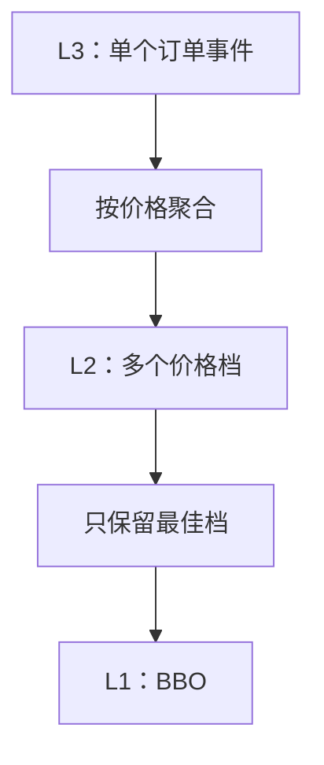

# 市场微观结构：价格是怎样在订单簿中形成的

市场微观结构（Market Microstructure）研究的不是“公司值多少钱”，而是：交易规则、参与者和订单流怎样共同形成可见价格与成交。它是 HFT 业务面试最常见的基础主题。

> 本章公式用于理解市场状态，不代表任何指标可以稳定预测价格，也不构成交易建议。

## 学习目标

- 读懂 Bid、Ask、Spread、Mid、Depth、Liquidity；
- 区分 L1、L2、L3 行情及它们能回答的问题；
- 手工应用增删改成交事件，重建一个小订单簿；
- 计算中间价、微价格和订单簿不平衡度，并说明它们的局限；
- 解释队列、逆向选择、价格冲击和市场碎片化。

## 1. 从一张最小订单簿开始

假设某合约最小价格变动为 `0.01` 元：

| 卖方（Ask）数量 | 价格 | 买方（Bid）数量 |
| ---: | ---: | ---: |
| 80 | 100.03 |  |
| 30 | **100.02** |  |
|  |  |  |
|  | **100.00** | 50 |
|  | 99.99 | 90 |

- 最高买价 `100.00` 是 Best Bid（买一）；
- 最低卖价 `100.02` 是 Best Ask/Offer（卖一）；
- BBO（Best Bid and Offer）是 `(100.00 × 50, 100.02 × 30)`；
- 买方愿意出的最高价仍低于卖方愿意接受的最低价，所以暂时没有成交。

### 1.1 Spread（买卖价差）

绝对价差：

<div class="formula" role="math" aria-label="spread equals best ask minus best bid">
spread = best ask − best bid = 100.02 − 100.00 = 0.02
</div>

这里的价差是 2 个 tick。若要跨标的比较，可使用以中间价为分母的基点（basis point，bp）表达：

<div class="formula" role="math" aria-label="spread in basis points">
spread<sub>bps</sub> = (ask − bid) / mid × 10,000
</div>

### 1.2 Mid（中间价）

<div class="formula" role="math" aria-label="mid price formula">
mid = (best bid + best ask) / 2 = 100.01
</div>

Mid 是报价的几何中心，不一定是可成交价格。此刻用普通可成交买单，通常会付出卖一价 `100.02`；用普通可成交卖单，通常会得到买一价 `100.00`。

### 1.3 Depth（深度）与 Liquidity（流动性）

深度是在一个或多个价格档位可见的数量。流动性则更广：它还与价差、隐藏量、成交概率、市场冲击、恢复速度和交易规则有关。“买一有 50”不意味着你能在所有时刻无风险地以该价卖出 50；队列可能变化，消息也有传播延迟。

## 2. Maker、Taker 与“主动性”

- **Maker**：订单先静止在订单簿中，等待别人来成交，通常被称为提供流动性；
- **Taker**：订单到达后立即与已有订单成交，通常被称为获取流动性；
- **Aggressor**：触发这笔撮合的到达订单一方。

“买方”不一定是 Taker。买单可以挂在买一等待，也可以跨过价差立即吃掉卖单。同理，卖方也可主动或被动。

### 2.1 一个吃多档的例子

沿用上面的卖盘。若提交“限价 100.03、买入 50”：

1. 先与 `100.02 × 30` 成交 30；
2. 剩余 20 再与 `100.03 × 80` 成交；
3. 总成交 50，成交金额为 `30×100.02 + 20×100.03 = 5001.20`；
4. 成交量加权平均价为 `5001.20 / 50 = 100.024`；
5. 新卖一若没有其他订单影响，将变为 `100.03 × 60`。

这展示了市场冲击最直观的一面：订单大于最优档数量时，会“走过”多个档位。

## 3. L1、L2、L3 到底差在哪里

| 层级 | 典型内容 | 能回答 | 不能可靠回答 |
| --- | --- | --- | --- |
| L1 | 最优买卖价和量，有时含最新成交 | 当前 BBO 是什么 | 更深档位、每张订单排队情况 |
| L2 / MBP | 每个价格档的聚合数量 | 某价格共有多少可见量 | 这个量由哪些订单组成 |
| L3 / MBO | 每个订单的新增、修改、删除 | 单个公开订单及队列顺序 | 隐藏订单完整信息、他人真实意图 |

MBP 是 Market By Price，MBO 是 Market By Order。命名和字段随交易场所而异，不要把某一个协议的定义套到所有市场。



更偏实现的内容见[L1/L2/L3 数据构建](../connectivity/order_book_data.md)。

## 4. 用事件重建订单簿

考虑一个简化的 L3 行情。`B` 表示买，`S` 表示卖：

| 序号 | 事件 | 事件后的关键状态 |
| ---: | --- | --- |
| 1 | Add `#A B 100.00 × 40` | 买一 `100.00 × 40` |
| 2 | Add `#B B 100.00 × 10` | 买一聚合为 `100.00 × 50`，A 排在 B 前 |
| 3 | Add `#C S 100.02 × 30` | 卖一 `100.02 × 30` |
| 4 | Reduce `#A` by 15 | A 剩 25；买一聚合为 35 |
| 5 | Execute `#A` qty 20 | A 剩 5；买一聚合为 15 |
| 6 | Delete `#A` | 买一聚合为 10，只剩 B |

从这组事件可以看到三种不同概念：

- **Reduce/Cancel**：数量减少但没有成交；
- **Execute/Trade**：数量因成交而减少；
- **Delete**：剩余订单从簿中移除。

协议可能用不同消息表达相同事实，也可能将成交与订单删除拆成两条消息。实现必须依据协议规范，不能仅凭字段名字猜测。

### 4.1 订单簿应主动检查的不变量

| 不变量 | 失败可能意味着什么 |
| --- | --- |
| 消息序号连续 | 丢包、乱序或通道切换错误 |
| 订单 ID 在新增时不存在 | 重放重复、会话处理错误 |
| 被修改/删除的订单存在 | 丢事件或本地状态损坏 |
| 减少数量不超过剩余量 | 协议解释错误或状态已失步 |
| 聚合量等于订单量之和 | L3 到 L2 聚合逻辑有 bug |
| 连续交易时 best bid < best ask | 事件顺序错误、状态失步，或处于特殊市场阶段 |

最后一条需结合交易状态判断。集合竞价、锁定/交叉市场或多源聚合行情可能有不同表现，不能看到 `bid >= ask` 就武断认定交易所错误。

## 5. Tick Size 为什么重要

Tick size 是允许报价变化的最小单位。若 tick 为 `0.01`，`100.001` 通常不是有效报价。

Tick size 会影响：

- 报价可以改善多少；
- 价差通常以几个 tick 表达；
- 同一价格排队竞争的程度；
- 价格与数量的存储方式；
- 撮合和风控中的合法性检查。

工程上建议把价格表示为整数 tick 或场所定义的整数价格单位：

```rust
#[derive(Debug, Clone, Copy, PartialEq, Eq, PartialOrd, Ord)]
struct PriceTicks(i64);

impl PriceTicks {
    fn checked_notional(self, quantity: u32) -> Option<i128> {
        i128::from(self.0).checked_mul(i128::from(quantity))
    }
}
```

为什么不用 `f64`？因为 `0.1` 等十进制小数在二进制浮点中通常不能被精确表示，直接比较、哈希和聚合可能产生边界错误。金额换算还必须明确价格缩放、合约乘数和币种，单有 `price × qty` 并不总是最终名义金额。

## 6. 订单簿不平衡度与 Microprice

这些指标经常出现在面试中。重点是会计算、会解释，也会说明局限。

令买一数量为 `Qb`，卖一数量为 `Qa`。一种常见的 L1 不平衡度定义为：

<div class="formula" role="math" aria-label="level one order book imbalance">
I = (Q<sub>b</sub> − Q<sub>a</sub>) / (Q<sub>b</sub> + Q<sub>a</sub>)
</div>

对本章开头的 `Qb=50, Qa=30`：

<div class="formula" role="math" aria-label="imbalance worked example">
I = (50 − 30) / (50 + 30) = 0.25
</div>

它的范围通常在 `[-1, 1]`。正值表示当前可见买一量更大，但不能直接推出未来价格一定上涨：队列可能撤销，隐藏量不可见，数据存在延迟，其他价位和场所也可能更重要。

一种常见 microprice 定义使用“对侧数量”加权：

<div class="formula" role="math" aria-label="microprice formula">
microprice = (P<sub>a</sub> × Q<sub>b</sub> + P<sub>b</sub> × Q<sub>a</sub>) / (Q<sub>b</sub> + Q<sub>a</sub>)
</div>

代入 `Pa=100.02, Pb=100.00, Qb=50, Qa=30`：

<div class="formula" role="math" aria-label="microprice worked example">
microprice = (100.02 × 50 + 100.00 × 30) / 80 = 100.0125
</div>

买方可见数量更大时，这个值靠近卖价。它是一个状态描述/建模特征，而非“真实价值”。不同文献或团队可能使用不同层数、衰减权重和定义，回答时应先声明公式。

## 7. Order Flow Imbalance（订单流不平衡）

订单簿不平衡度描述某一时刻的“存量”，订单流不平衡（OFI）更关注一段时间内的“变化”。一个极简的有符号事件定义可以是：

| 事件 | 简化符号 |
| --- | ---: |
| 买盘新增 20 | `+20` |
| 买盘撤销 5 | `-5` |
| 卖盘新增 12 | `-12` |
| 卖盘撤销 4 | `+4` |

则窗口内简化 OFI 为 `+20 - 5 - 12 + 4 = +7`。

现实定义会处理最优价变化、成交、多个档位和时间衰减。面试时最稳妥的回答是：先给出自己的符号约定和窗口，再计算；不要只说“OFI 大于零看涨”。

## 8. 队列位置与成交概率

在价格—时间优先的市场里，同价格通常先到先服务。假设你买 10，前方已经有 100：

- 新发生 40 的主动卖出成交后，理想化地说前方还剩约 60；
- 前方有人撤单可能使你前进；
- 你自己提高价格通常会获得更高价格优先级，但承担更激进的价格；
- 你撤单重挂或改价通常会失去原时间优先级，具体看场所规则。

只有 L2 聚合数据时，你通常不知道撤掉的是队首还是队尾，也看不到所有隐藏量，因此只能估计队列位置。估计模型必须有保守边界，不能把估计值当作交易所事实。

## 9. 价格冲击、滑点与逆向选择

### 9.1 三个相近但不同的概念

| 概念 | 通俗解释 | 一个可能的度量基准 |
| --- | --- | --- |
| 滑点 | 预期价格与实际成交结果的差 | 决策时 BBO 或到达价 |
| 市场冲击 | 自身交易对可见价格/流动性的影响 | 交易前后 mid 变化 |
| 逆向选择 | 你的被动单恰好在不利信息到来前成交 | 成交后一段时间的价格变化 |

例如你在 `100.00` 挂买单并成交，看似比当时 `100.02` 的卖价便宜；若紧接着新信息使 BBO 变成 `99.96 / 99.98`，这笔被动成交可能遭遇逆向选择。是否“不利”取决于持有目标、对冲和度量窗口，不能只看 maker/taker 标签。

### 9.2 实现落差（Implementation Shortfall）的直觉

执行大单时，可以拿最终成交结果与决策时参考价比较，并纳入费用。这个差异会混合市场移动、自身冲击、等待成本和费用。面试中不要把所有差异都粗暴归因于“系统太慢”。

## 10. 市场不是永远处于连续撮合

常见市场阶段包括：

- 开盘前；
- 集合竞价/拍卖；
- 连续交易；
- 波动中断、熔断或停牌；
- 收盘竞价；
- 收盘后。

拍卖通常在某一时点集中确定单一撮合价格，优先级和信息字段可能与连续交易不同。策略、订单网关和风险模块都必须读取交易状态，不能在所有阶段复用同一假设。

## 11. 碎片化市场与 Consolidated View

同一或相关资产可能在多个场所交易。本地系统会看到：

- 不同场所的价格、费用、队列和延迟；
- 行情到达时间不同导致的“暂时不一致”；
- 某个场所可见最优价并非全市场最优价；
- 路由、订单保护和最佳执行等合规要求（依司法辖区而异）。

把多个来源合成一本订单簿时，必须保留 `venue`、原始事件时间、接收时间和各自序号。简单按本机到达顺序拼接，不能还原绝对的全球先后顺序。

## 12. 面试高频问法

### 问：价差为什么存在？

参考答法：价差可与最小报价单位、供需、库存风险、逆向选择、费用和竞争程度有关。不能只说“做市商的利润”，因为做市商还承担成交后价格不利变化、对冲和库存风险，而且有些市场的报价来自多类参与者。

### 问：可见深度很大，为什么大单仍可能滑点？

参考答法：可见量可能在订单到达前撤销；自己前面还有其他主动订单；深度分布在多档/多场所；隐藏量和路由规则也有影响。行情是观测，不是成交承诺。

### 问：L3 一定比 L2 好吗？

参考答法：L3 信息更细，但消息量、内存、恢复和处理成本更高，并且仍不揭示隐藏意图。是否值得取决于场所是否提供、策略需求和系统预算；只做 BBO 风控可能不需要维护完整 L3。

### 问：Microprice 大于 Mid 意味着什么？

参考答法：在给定的常见对侧加权定义下，它说明当前买一可见量相对更大，使 microprice 靠近卖价。它只是基于当前有限深度的特征，不能单独保证下一次价格变化方向。

## 13. 易错点

- 把 Best Bid 说成市场中最低买价；
- 以为买单天然是 Maker、卖单天然是 Taker；
- 将 Mid 当作保证可成交的价格；
- 看到某档数量就认为自己一定能全部成交；
- 用 L2 猜到的队列位置冒充精确事实；
- 计算 microprice 时不声明公式；
- 忽视 tick size、合约乘数和价格缩放；
- 忽略竞价、停牌等市场状态；
- 把相关性特征包装成必然预测或收益承诺。

## 14. 练习

1. BBO 为 `99.98 × 120 / 100.02 × 80`。计算 spread、mid、L1 imbalance 和上述定义的 microprice。
2. 卖盘为 `10.01 × 10、10.02 × 20、10.03 × 50`。限价 `10.02` 买 25 的成交明细、均价和剩余订单是什么？
3. 设计五个订单簿不变量，并分别说明失败后的安全动作。
4. 只有 L2 数据时，某档撤量 30。列出“全部发生在你前方”和“全部发生在你后方”两个队列位置边界。
5. 为什么跨场所收到的本机时间不能证明两家交易所事件的绝对先后？

<details>
<summary>第 1 题参考答案</summary>

- spread：`100.02 - 99.98 = 0.04`；
- mid：`(99.98 + 100.02) / 2 = 100.00`；
- imbalance：`(120 - 80) / (120 + 80) = 0.20`；
- microprice：`(100.02×120 + 99.98×80) / 200 = 100.004`。

</details>

<details>
<summary>第 2 题参考答案</summary>

先在 `10.01` 成交 10，再在 `10.02` 成交 15；加权均价为 `(10×10.01 + 15×10.02)/25 = 10.016`。订单全部成交，`10.02` 档还剩 5，`10.03` 不变。

</details>

## 15. 本章速记

> Bid 是买方最高意愿，Ask 是卖方最低意愿；L1 看最优，L2 看价位，L3 看订单；行情深度不是成交承诺，指标是有限观测而非未来保证。

---

上一章：[HFT 总览与交易生命周期](index.html) ｜ 下一章：[订单类型与撮合优先级](orders_matching.md)
