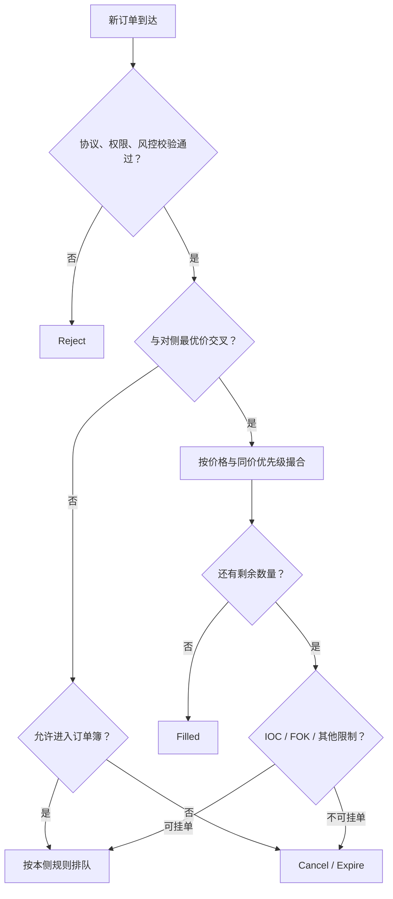
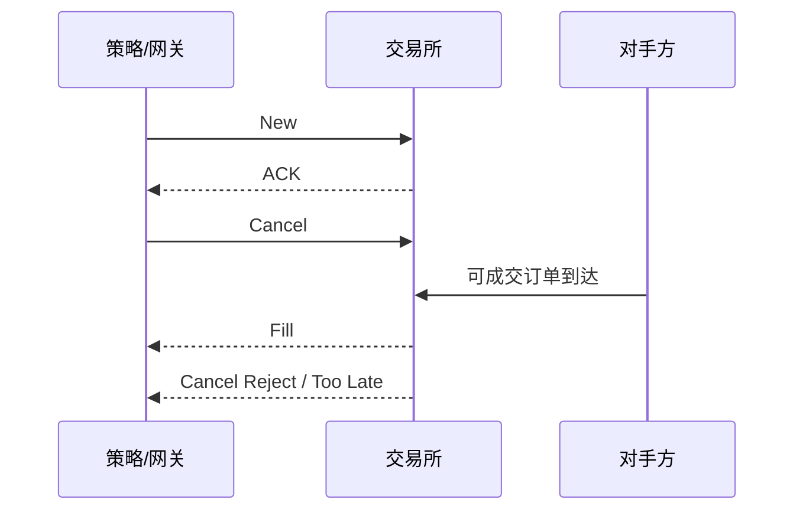

# 订单类型与撮合优先级：你的订单为什么成交或排队

订单是一组带约束的交易指令；撮合引擎则按照交易场所公开规则决定它能否成交、与谁成交、以什么价格成交，以及剩余部分如何处理。

> 本章给出通用模型。订单名称、有效期、修改是否保留优先级、隐藏量如何排队等细节因场所而异，真实系统必须以当前协议和规则手册为准。

## 1. 一张订单的核心字段

```rust
#[derive(Debug, Clone, Copy, PartialEq, Eq)]
enum Side { Buy, Sell }

#[derive(Debug, Clone, Copy, PartialEq, Eq)]
enum TimeInForce { Day, Gtc, Ioc, Fok }

#[derive(Debug, Clone, Copy)]
struct NewOrder {
    client_order_id: u64,
    instrument_id: u32,
    side: Side,
    price_ticks: i64, // 市价单应使用独立类型，而不是神奇价格 0
    quantity: u32,
    tif: TimeInForce,
    post_only: bool,
}
```

业务系统还可能需要账户、交易场所、订单容量、客户标识、显示数量、自成交防护组等字段。不同协议字段可以增减，但价格、数量、方向、标的和唯一订单标识是不同维度，不能互相替代。

## 2. 限价单与市价单

### 2.1 限价单（Limit Order）

- 限价买单：成交价格不能高于买方限价；
- 限价卖单：成交价格不能低于卖方限价。

假设 BBO 为 `100.00 / 100.02`：

| 到达订单 | 是否立即可成交 | 原因 |
| --- | --- | --- |
| 限价买 `100.01` | 否 | 低于卖一 `100.02` |
| 限价买 `100.02` | 是 | 买入限价覆盖卖一 |
| 限价买 `100.05` | 是 | 可从 `100.02` 起逐档成交，但不会高于 `100.05` |
| 限价卖 `100.01` | 否 | 卖出限价不高于买一 `100.00`？不成立 |
| 限价卖 `100.00` | 是 | 卖出限价等于买一 |

上表中特意放了一个容易口算错的例子：卖 `100.01` 不能与买一 `100.00` 成交。判断规则是：

<div class="formula" role="math" aria-label="marketable limit order conditions">
可成交买单：P<sub>buy</sub> ≥ best ask<br>
可成交卖单：P<sub>sell</sub> ≤ best bid
</div>

### 2.2 市价单（Market Order）

市价单强调尽快获取可用流动性，但通常不保证成交价；在流动性不足或价格快速变化时可能出现较大滑点。不同场所可能拒绝、保护性转换或限制某些市价单。

工程上不要用 `price = 0` 或 `i64::MAX` 暗示市价单。这会让风控、日志和比较逻辑产生歧义。用明确的枚举表达：

```rust
enum PriceInstruction {
    Market,
    Limit { price_ticks: i64 },
}
```

## 3. Time in Force（订单有效期）

| 类型 | 常见含义 | 剩余数量如何处理 |
| --- | --- | --- |
| DAY | 当日有效 | 收市或规则指定时点取消 |
| GTC | 撤销前有效 | 跨交易日保留与否视场所而定 |
| IOC | 立即成交，未成交部分取消 | 可部分成交 |
| FOK | 必须立即全部成交，否则全部取消 | 通常不允许部分成交 |

### IOC 算例

卖盘是 `100.02 × 30`，IOC 限价买 `100.02 × 50`：立即成交 30，剩余 20 被取消，不进入订单簿。

### FOK 算例

同一卖盘下，FOK 限价买 `100.02 × 50`：可用量只有 30，通常整单不成交并取消。撮合引擎必须原子地确认在价格范围内有足够可成交量，不能先成交 30 再发现不够。

## 4. 常见高级属性

### 4.1 Post-only

Post-only 表示订单只希望成为 Maker。若订单到达时会立即成交，场所通常拒绝、取消或按规则调整，而不是让它成为 Taker。具体行为必须查规则，不能假设一定“自动后退一个 tick”。

### 4.2 Iceberg / Reserve

冰山单仅显示总量的一部分。显示部分耗尽后，下一段数量可能刷新。刷新后的优先级、隐藏部分与显示部分之间的顺序因场所而异。

不要把“发现冰山”描述成确定事实：从公开行情观察到重复补量只能形成推断，不能知道参与者身份或完整剩余量。

### 4.3 Pegged Order

价格跟随某个参考，如 best bid、best ask 或 midpoint，并受价格上限/下限保护。参考价改变时可能触发重定价；它是否保留优先级取决于规则。

### 4.4 Stop Order

达到触发条件后才激活为市价或限价指令。有些场所原生支持，有些由经纪商模拟。未触发的 stop 是否出现在公开簿中，也需看规则。

### 4.5 Self-Trade Prevention（STP/SMP）

同一受益所有人或指定组的买卖订单相遇时，按配置取消新单、旧单或双方，避免非预期自成交。它是保护机制，不替代账户级治理和合规控制。

## 5. 撮合的两个层次：价格优先，再分同价队列

对普通连续限价簿，先遵守价格优先：

- 买方：更高价格优先；
- 卖方：更低价格优先。

同一价格内如何分配，常见有价格—时间、Pro-rata 及混合规则。



## 6. 价格—时间优先（Price-Time / FIFO）

同一价格通常按被交易所接受的时间先后排队。考虑卖盘：

| 优先顺序 | 订单 | 价格 | 剩余量 |
| ---: | --- | ---: | ---: |
| 1 | A | 100.02 | 20 |
| 2 | B | 100.02 | 15 |
| 3 | C | 100.03 | 50 |

现在到达限价买 `100.03 × 45`：

1. 价格更优的卖价 `100.02` 先于 `100.03`；
2. A 先成交 20，买单剩 25；
3. B 再成交 15，买单剩 10；
4. C 成交 10；
5. 买单填满，C 还剩 40；
6. 成交均价为 `(20×100.02 + 15×100.02 + 10×100.03)/45 ≈ 100.0222`。

### 6.1 成交价格为什么通常是静止单价格

许多连续订单簿使用 resting order（静止订单）的价格。例如买入限价 100.05 到达并与 100.02 的卖单成交，成交价通常为 100.02，而非 100.05。但这不是跨所有产品和阶段的绝对定律；拍卖、特殊订单和价格改善规则可能不同。

## 7. Pro-rata（按比例分配）

一些衍生品市场会按同价订单的数量比例分配成交。简化例子：同价三张买单：

| 订单 | 挂单量 | 同价占比 |
| --- | ---: | ---: |
| A | 50 | 50% |
| B | 30 | 30% |
| C | 20 | 20% |

若主动卖单为 40，理想比例为：A 得 20、B 得 12、C 得 8。

实际规则还要解决：

- 最小成交单位导致的舍入；
- 舍入余量分给谁；
- 是否先给首单/大单一个最低分配；
- 隐藏量是否参与；
- 同一参与者多张单是否合并；
- 分配后剩余量如何递归处理。

这个算例只展示理想的比例分配；最终实现必须复现具体场所算法，尤其是舍入、最低分配量和优先权部分。

## 8. 混合优先级与拍卖

现实中还可能出现：

- Size-Time：先按数量、再按时间；
- Top order + Pro-rata：先给某类首单份额，再按比例分；
- Maker priority：特定做市义务或订单属性有规则化优先级；
- 随机化或轮转机制；
- 拍卖中的价格、可成交量、市场不平衡和时间等多级优先。

回答“撮合一定 FIFO”会丢分。更好的说法是：“价格优先很常见，同价分配必须看场所和产品；我先以 FIFO 说明，再指出 Pro-rata/混合规则。”

## 9. 修改订单会不会丢队列位置

通用直觉如下，但绝不能替代规则手册：

| 修改 | 常见结果 | 为什么 |
| --- | --- | --- |
| 降低剩余数量 | 可能保留优先级 | 没有扩大对他人的竞争 |
| 增加数量 | 新增部分或整单可能失去优先级 | 防止插队 |
| 改价格 | 通常在新价格重新排队 | 已变成新的价格意图 |
| 改账户/方向 | 通常不允许原地修改 | 业务身份改变过大 |

实现上要区分 `Modify`、`Cancel/Replace` 和“先撤再新”。断线或超时后，不可仅凭本地发送结果断定修改生效。

## 10. 撤单与成交竞态

时间线：



合法结果包括：

- 撤单先被处理：收到 Cancel ACK，之后不应再有正常新增成交；
- 成交先被处理：收到 Fill，撤单被拒绝或报告无剩余；
- 部分成交后撤销剩余：先 Fill，再 Cancel ACK；
- 消息因网络或会话机制在本地呈现不同先后：需按协议序列和执行 ID 去重/排序。

因此，订单状态和风险占用不能由“我已经按下撤单按钮”决定，而必须由权威回报推进。

## 11. 一个安全的匹配器教学骨架

以下代码只演示业务循环，不是完整交易所匹配器。真正实现还需价格档、队列、订单索引、事件日志、溢出保护和精确规则。

```rust
#[derive(Clone, Copy, Debug, PartialEq, Eq)]
enum Side { Buy, Sell }

/// 只返回本次循环需要的值，不把 `book` 的内部借用带出来。
#[derive(Clone, Copy, Debug)]
struct BestLevel {
    price_ticks: i64,
    front_remaining: u64,
}

#[derive(Debug)]
struct Remainder {
    side: Side,
    price_ticks: i64,
    quantity: u64,
}

trait Book {
    fn best_opposite(&self, incoming_side: Side) -> Option<BestLevel>;
    fn execute_front(&mut self, price_ticks: i64, quantity: u64);
    fn enqueue(&mut self, order: Remainder);
}

struct Incoming {
    side: Side,
    limit_ticks: i64,
    remaining: u64,
    can_rest: bool,
}

impl Incoming {
    fn may_rest(&self) -> bool { self.can_rest }

    fn emit_fill(&mut self, _price_ticks: i64, _quantity: u64) {
        // 真实实现应产生带唯一 execution ID 的成交事件。
    }

    fn take_remainder(&mut self) -> Remainder {
        let quantity = std::mem::take(&mut self.remaining);
        Remainder { side: self.side, price_ticks: self.limit_ticks, quantity }
    }

    fn cancel_remainder(&mut self) {
        self.remaining = 0;
    }
}

fn crosses(side: Side, limit: i64, opposite_best: i64) -> bool {
    match side {
        Side::Buy => limit >= opposite_best,
        Side::Sell => limit <= opposite_best,
    }
}

fn match_limit<B: Book>(book: &mut B, incoming: &mut Incoming) {
    while incoming.remaining > 0 {
        let Some(best) = book.best_opposite(incoming.side) else { break };
        if !crosses(incoming.side, incoming.limit_ticks, best.price_ticks) {
            break;
        }

        // match_one 必须按该场所的同价优先级选择静止订单。
        let fill_qty = incoming.remaining.min(best.front_remaining);
        book.execute_front(best.price_ticks, fill_qty);
        incoming.remaining -= fill_qty;
        incoming.emit_fill(best.price_ticks, fill_qty);
    }

    if incoming.remaining > 0 && incoming.may_rest() {
        book.enqueue(incoming.take_remainder());
    } else {
        incoming.cancel_remainder();
    }
}
```

### 这段骨架还缺什么？

- FOK 需要先原子验证足量，不能使用普通循环后回滚；
- Post-only 要在撮合前决定拒绝/取消策略；
- 市价单没有普通限价边界，但可能有场所保护；
- 自成交防护要在选中对手单时处理；
- 每个成交要有唯一执行 ID，支持重放去重；
- 数量与金额运算要检查溢出；
- 事件写入持久日志的时机关系到灾难恢复；
- 并发到达必须被确定性排序。

## 12. 正确性属性：比某个测试用例更有价值

撮合器适合做性质测试（property-based testing）：

1. 任一成交数量大于 0；
2. 成交量不超过双方原剩余量；
3. 买方成交价不高于其限价，卖方成交价不低于其限价；
4. 每次成交后，双方剩余量按相同数量减少；
5. 普通连续簿在稳定点不会保留可互相成交的买卖订单；
6. 总新增量 = 总成交消耗 + 总撤销量 + 当前剩余量（在同一口径下）；
7. 相同输入事件序列得到相同输出事件序列。

第 6 条是守恒思想。需要明确改单、拒单、外部导入状态等事件的口径，才能用于生产核对。

## 13. 费用不是撮合优先级的同义词

Maker rebate、Taker fee 和阶梯费率可能影响执行成本，但并不自动决定撮合顺序。撮合顺序由场所规则决定，费用由费率规则计算。比较执行质量时还要同时考虑成交价、成交概率、逆向选择、路由成本和风险，不应只追逐返佣。

## 14. 合规边界

- 不得提交没有真实交易意图、旨在误导市场的虚假订单；
- Spoofing、Layering、Wash Trading 等行为可能违反法律或场所规则；
- 高频改撤单要遵守消息速率、订单成交比等限制；
- 自成交防护、kill switch、限额和审计日志应作为系统设计的一部分；
- 不同账户/策略之间的协调可能带来合规风险，应遵循公司制度和法律意见。

“系统做得到”不等于“业务允许做”。订单行为还要同时满足交易场所规则、适用法规和内部控制。

## 15. 面试追问与参考答法

### 问：限价 105 的买单为什么可能在 102 成交？

参考答法：105 是最高可接受价，不是要求成交在 105。若当前静止卖单在 102，许多连续订单簿会按静止单价格成交，所以买方获得价格改善。最终以场所规则为准。

### 问：IOC 与 FOK 的区别？

参考答法：两者都强调立即处理；IOC 允许可成交部分先成交，再取消剩余；FOK 通常要求立刻全部成交，否则整单取消。

### 问：发出撤单后还能成交吗？

参考答法：可以。在交易所确认取消之前，原单仍可能先被撮合。状态应进入 PendingCancel，而不是直接 Canceled，并继续保留剩余量的风险占用。

### 问：怎样实现 FOK？

参考答法：在同一确定性撮合上下文中，先检查价格范围内符合规则的可成交量是否足够；足够才一次性执行，不足则不产生部分成交。并发环境要保证检查与执行之间没有状态被其他线程改变。

### 问：修改数量会保留队列位置吗？

参考答法：取决于场所。常见规则是减量可能保留，增量或改价通常失去部分或全部优先级；我会把该语义做成 venue-specific 配置并用规则样例测试。

## 16. 易错点

- 把卖出限价理解为“最高卖价”，其实它是最低可接受价格；
- 认为限价单一定挂单、市价单一定全部成交；
- 混淆 IOC 和 FOK；
- 默认所有市场都 FIFO；
- 忽视同价规则中的舍入、隐藏量和特殊优先权；
- 发出 Cancel 便释放风险；
- 用本地时间决定交易所真实撮合顺序；
- 把费用优惠当作稳定收益；
- 讨论订单探测技巧却忽略市场操纵和消息速率边界。

## 17. 练习

1. BBO 为 `50.00 / 50.02`。判断以下订单是否可立即成交：买 50.01、买 50.02、卖 50.01、卖 50.00。
2. FIFO 卖盘依次为 A `10.00×5`、B `10.00×8`、C `10.01×10`。限价买 `10.01×17` 的成交明细是什么？
3. 同价订单 A/B/C 数量为 60/30/10，主动订单数量为 33。计算理想 Pro-rata 份额，并说明整数舍入为什么需要场所规则。
4. 画出 Working、PartiallyFilled、PendingCancel、Canceled、Filled 的合法转换。
5. 给上述教学匹配器设计三个性质测试和一个 FOK 测试。

<details>
<summary>第 1 题参考答案</summary>

- 买 50.01：否；买 50.02：是；卖 50.01：否；卖 50.00：是。

</details>

<details>
<summary>第 2 题参考答案</summary>

A 成交 5，B 成交 8，C 成交 4；买单全部成交，C 剩 6。成交均价为 `(5×10.00 + 8×10.00 + 4×10.01)/17 ≈ 10.00235`。

</details>

## 18. 本章速记

> 限价是边界，不是指定成交价；先比较价格，再应用同价优先级；IOC 可部分、FOK 要全部；撤单未确认仍有成交风险；所有细节以场所规则为准。

---

上一章：[市场微观结构](market_microstructure.md) ｜ 下一章：[延迟预算与关键路径](latency_critical_path.md)
