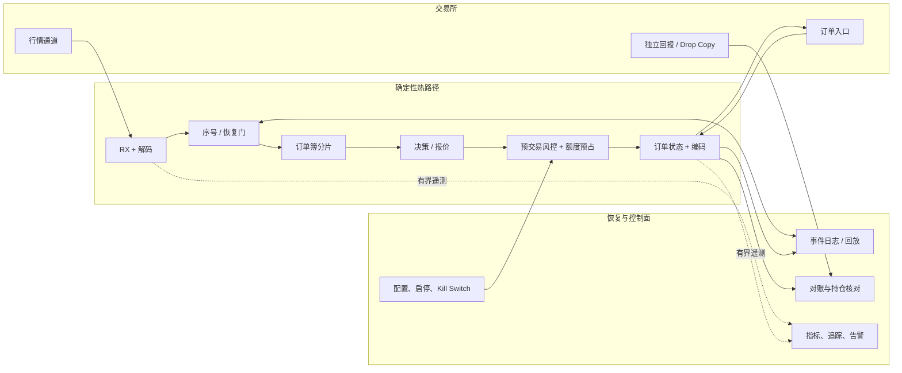
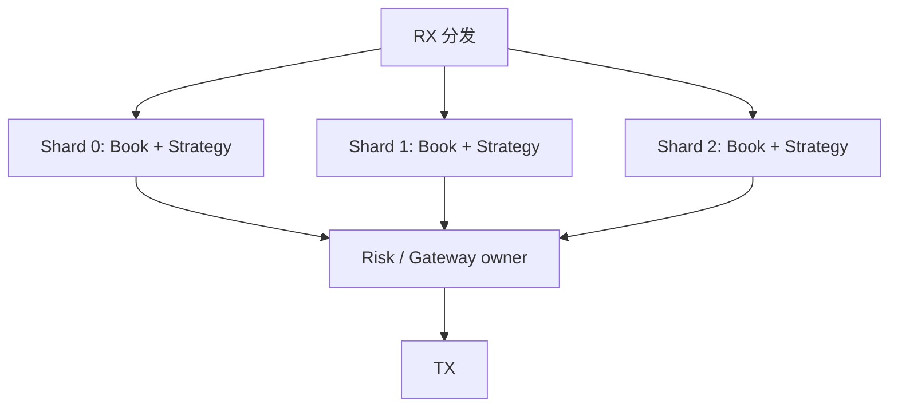

# HFT 系统设计面试：从需求澄清到故障恢复

HFT 系统设计面试不是比谁能说出更多“DPDK、无锁、FPGA”。面试官更想看到你能否把业务正确性、数据流、容量、延迟、风险、恢复和合规连成一个可落地的设计。

本章用一个典型题目贯穿：

> 设计一个接收交易所行情、维护订单簿、产生订单并处理成交回报的低延迟交易系统。

## 1. 面试官究竟在考什么

| 能力 | 好答案的表现 | 危险信号 |
| --- | --- | --- |
| 需求理解 | 先问场所、产品、负载和 SLO | 上来就画 Kafka/微服务 |
| 业务正确性 | 讲序号、订单状态、撤单竞态 | 把 send 成功当成交 |
| 性能思维 | 定义边界、预算和尾延迟 | 只说平均延迟或“Rust 很快” |
| 权衡能力 | 说清单写者、分片、批处理代价 | 所有地方都“无锁、零拷贝” |
| 可靠性 | 设计失步、断线、重放、对账 | 只画 happy path |
| 风险与合规 | 风控、kill switch、审计不缺席 | 为速度绕过安全检查 |
| 沟通 | 先总图再下钻，数字有假设 | 细节很多但没有主线 |

## 2. 一套可复用的八步框架

```text
1. 澄清范围与假设
2. 写功能需求和非功能 SLO
3. 画端到端数据流
4. 定义核心状态与不变量
5. 选择线程、分片和通信模型
6. 设计故障恢复与幂等
7. 做容量估算和性能预算
8. 说明测试、监控、发布和合规
```

步骤 1 决定系统究竟要解决什么，步骤 4 给出判断结果正确与否的规则，步骤 6 说明数据缺口和未知订单状态怎样收敛。缺少其中任何一步，架构图都无法证明系统在真实故障下仍然正确。

## 3. 第一步：先问清楚，不要自说自话

### 3.1 市场与接入

- 单一交易所还是多交易所？
- 股票、期货、期权还是加密资产？
- 行情是 L1、L2 还是 L3？UDP 多播还是 TCP？
- 订单会话协议是什么？是否有独立 drop copy？
- 连续撮合、拍卖和停牌状态是否都在范围内？

### 3.2 规模与负载

- 标的数量、平均和峰值消息率；
- 单条消息平均/最大大小；
- 订单、改撤单、成交回报峰值；
- 突发持续时间和日内数据总量；
- 一个策略、多个策略，还是多租户？

### 3.3 正确性和风险

- 是否允许行情失步期间继续发新单？
- 持仓、敞口和消息速率限额在哪一级执行？
- 断线时场所会保留还是自动撤销订单？
- 恢复后以哪个来源为权威？
- 是否有审计、留存、时间同步和最佳执行要求？

### 3.4 延迟与可用性

- 延迟从哪里量到哪里？目标是 p50 还是 p99.9？
- 是否包含交易所网络往返？
- 吞吐目标是在多大突发下成立？
- 恢复时间目标（RTO）和可容忍状态缺口是什么？
- 一致性与可用性冲突时，更安全的行为是什么？

若面试官没有给数字，可以明确说“我先用一组教学假设，之后可替换”。

## 4. 建立一组可计算的假设

下面仅是面试练习数据：

| 项目 | 假设 |
| --- | ---: |
| 场所 | 单一交易所，连续限价簿 |
| 标的数 | 10,000 |
| 行情平均/峰值 | 800k / 2.5M msg/s |
| 峰值持续 | 100ms |
| 解码后平均事件大小 | 64 bytes（不含索引开销） |
| 出站订单峰值 | 100k msg/s，另有场所限流 |
| 关键路径 SLO | NIC RX → NIC TX，p99 < 10µs |
| 恢复策略 | 行情失步后禁止依赖该簿发新单，只允许安全动作 |

面试官若改数字，你应更新容量推导，而不是守住某个结论。

## 5. 总体架构：先给一张能讲清主线的图



讲图时遵循事件方向：行情进来，可信状态产生意图，风险放行后发单，回报推进订单和持仓；旁边再解释日志、恢复、控制和监控。

## 6. 模块职责与边界

### 6.1 行情接收与解码

职责：

- 收包、协议校验和零/低分配解码；
- 提取频道、序号、事件时间和业务字段；
- 识别重复、乱序、缺口和会话重置；
- 将协议类型转换为内部规范化事件。

内部事件要保留足够来源信息，不要为了统一格式丢掉 venue-specific 语义。

### 6.2 Recovery Gate（恢复门）

它回答“当前订单簿是否可信”。建议显式状态：

```rust
enum FeedState {
    Cold,
    Live { next_sequence: u64 },
    Recovering { missing_from: u64 },
    Stale,
}
```

当序号缺口出现时，状态从 `Live` 进入 `Recovering/Stale`。策略不应仅检查“订单簿非空”，还要检查 feed state 和市场交易状态。

### 6.3 订单簿

职责：确定性应用事件，维护 BBO/深度/队列和不变量。数据结构选择由行情层级、价格空间与访问模式决定：

- 价格范围紧密：数组 price ladder 可能高效；
- 稀疏大范围：排序结构或分段数组；
- L3：订单 ID 索引 + 价格档队列；
- 按标的分片，每个分片尽量单写者。

### 6.4 决策/策略

输入是带版本的可信市场状态，输出是 `OrderIntent`。策略不直接操作 socket，也不直接篡改持仓。这样才能回放、测试，并在发单前统一执行风控。

### 6.5 风控

至少考虑：静态合法性、单笔数量/金额、价格偏离、持仓与敞口、未结订单、消息速率、自成交防护和全局 kill switch。

关键语义是 **check-and-reserve**：发出订单时先占用最坏成交风险；拒绝、取消确认或成交后再按状态转换/释放。若多线程共享同一额度，需要单一所有者、额度切片或原子事务，不能“先读后写”留下竞态。

### 6.6 订单网关与状态

职责：

- 分配唯一 Client Order ID；
- 协议编码、会话序号和限流；
- 维护 PendingNew、Working、PartiallyFilled、PendingCancel 等状态；
- 回报去重，处理拒绝、成交和未知状态；
- 断线重连、会话恢复和订单查询；
- 产出审计事件。

详细状态机见[HFT 总览](index.html)与[订单类型与撮合优先级](orders_matching.md)。

## 7. 核心数据模型与不变量

### 7.1 订单记录

```rust
#[derive(Debug, Clone, Copy)]
enum OrderStatus {
    PendingNew,
    Working,
    PartiallyFilled,
    PendingCancel,
    Filled,
    Canceled,
    Rejected,
    Unknown,
}

struct OrderRecord {
    client_id: u64,
    venue_id: Option<u64>,
    instrument_id: u32,
    original_qty: u32,
    cum_filled_qty: u32,
    leaves_qty: u32,
    canceled_qty: u32,
    reserved_risk_qty: u32,
    status: OrderStatus,
    last_exec_sequence: u64,
}
```

应满足（按协议口径调整）：

<div class="formula" role="math" aria-label="order quantity conservation">
original_qty = cum_filled_qty + leaves_qty + canceled_qty
</div>

并且所有数量非负、累计成交单调不减、终态转换受限、同一执行 ID 不重复计入持仓。

### 7.2 为什么需要 `Unknown`

如果发单后连接断开，本地不知道交易所是否已收到，不能武断归类为 Rejected 或 Working。安全做法是标记 Unknown：

1. 禁止基于“它一定不存在”的假设释放风险；
2. 通过会话重放、订单查询、drop copy 或经纪商状态恢复；
3. 对账确认后进入确定状态；
4. 超时仍未知则升级人工/自动 kill 流程。

## 8. 线程模型：先用所有权消除竞争

### 8.1 推荐起点：按标的/频道分片的单写者



优点：

- 分片内事件顺序明确；
- 订单簿和策略状态无需锁；
- 故障回放更确定；
- 容易做 CPU/NUMA 亲和。

难点：

- 跨标的策略需要一致快照或明确异步语义；
- 热门标的会造成分片倾斜；
- 全局风险状态可能成为串行瓶颈；
- 分片到网关的队列会产生排队和背压。

### 8.2 全局风险如何处理

可选方案：

| 方案 | 优点 | 缺点 |
| --- | --- | --- |
| 单一风险所有者 | 强一致、容易审计 | 可能增加一跳和容量瓶颈 |
| 为分片静态分额度 | 热路径本地化 | 额度利用率低，需再平衡 |
| 原子共享计数 | 实现直接 | 缓存争用、复合规则难原子化 |
| 层级额度 | 本地快速、全局受控 | 协议和回收更复杂 |

面试时要根据“全局限额是否必须强一致”选择，而非直接说“用 Atomic”。

## 9. 顺序、幂等与 Exactly-once 迷思

网络可能重复、丢失、重连和重放。端到端“恰好一次”很难靠一句中间件配置保证。更现实的设计是：

- 每个来源有明确序号/执行 ID；
- 接收端检测缺口并对重复事件幂等；
- 状态更新与日志有可恢复顺序；
- 对外副作用以稳定 Client Order ID 关联；
- 重启后从快照 + 日志重放；
- 用独立权威来源对账。

成交去重的键优先使用协议保证唯一的 execution ID/会话语义，而不是 `(价格, 数量, 时间)` 这种可能碰撞的业务字段组合。

## 10. 故障矩阵：系统设计答案的分水岭

| 故障 | 检测 | 安全动作 | 恢复 |
| --- | --- | --- | --- |
| 行情序号缺口 | 序号不连续 | 标记 stale，暂停依赖该簿的新单 | 重传或快照 + 增量 |
| 行情通道断开 | 心跳/套接字/无消息告警 | 切备用源或安全降级 | 校验序号后恢复 Live |
| 订单连接断开 | 心跳、写失败、会话告警 | 未知订单保留风险；按政策 kill | 会话重放、查询、drop copy 对账 |
| 风控服务不可用 | 超时/健康状态 | fail closed，允许受控撤单通道 | 恢复配置和状态一致性 |
| 日志队列满 | 水位与丢弃计数 | 不静默丢审计；触发降级/停发 | 扩容、排障、核对缺口 |
| 单分片过载 | 队列深度、事件 age | 限制新动作、降低非关键工作 | 重分片或提升容量 |
| 时钟失步 | PTP offset/holdover 告警 | 标记时间质量，禁用依赖精确时序功能 | 重同步并审计影响窗口 |
| 进程崩溃 | 监控/监督进程 | 场所断线撤单或独立 kill | 快照、日志、场所状态重建 |

“自动重启”不是完整恢复策略。重启之后最难的问题是：哪些订单仍在场内、哪些成交本地没看到、风险是否还能被证明正确。

## 11. 持久化与恢复

### 11.1 什么需要记录

- 原始或规范化行情（取决于重放要求）；
- 每个订单意图、风控结果和配置版本；
- 实际发送的协议消息及会话序号；
- ACK、Reject、Fill、Cancel ACK、drop copy；
- 状态快照和校验和；
- 操作员启停、限额与 kill switch 动作；
- 时钟同步质量和软件/配置版本。

### 11.2 同步落盘与关键路径

每个订单同步 `fsync` 可能无法满足微秒目标；完全异步又可能在断电时丢失最后一段日志。可讨论：

- 有界内存 journal + 批量持久化；
- 独立硬件/进程复制；
- 场所会话重放与 drop copy 作为外部恢复来源；
- 定义允许的数据丢失窗口和对应安全动作；
- UPS、持久内存或专用记录设备（取决于要求）。

没有统一答案。关键是明确故障模型、丢失边界和核对来源。

## 12. 容量估算：至少做三个数量级计算

### 12.1 内部事件带宽

峰值 `2.5M msg/s × 64 bytes ≈ 160 MB/s`。这只算紧凑事件体，不含队列槽位、对齐、索引、日志、网络头和多份复制。若事件被复制 4 次，内存流量粗略已到 `640 MB/s`，所以“避免不必要复制”要结合实测。

### 12.2 突发积压

若峰值到达 `2.5M/s` 持续 `100ms`，系统只能处理 `1.0M/s`：

<div class="formula" role="math" aria-label="burst backlog calculation">
backlog = (2.5M − 1.0M) × 0.1 = 150,000 events
</div>

按每槽 128 bytes 估算，单是队列约需 `19.2MB`。更重要的是队尾事件已经陈旧约百毫秒量级，扩大队列不能满足微秒级延迟 SLO。设计应让可持续处理能力覆盖目标峰值，或提前进入安全降级。

### 12.3 订单限流

假设场所允许会话每秒 50k 消息，而系统内部策略峰值产生 100k 意图：网关必须做有界整形、合并可取消的重复改价，并把拒绝/延迟反馈给策略和风险。不能无限排队，因为排队后的报价可能已经过时。

### 12.4 核数估算

不要用“2.5M 消息所以 3 个核”拍脑袋。先在目标硬件测单分片在目标 p99 下的可持续速率，再留突发、故障、遥测和版本回归余量，并检查热门标的倾斜。容量约束是“满足尾延迟时的吞吐”，不是 CPU 跑到 100% 时的最大数字。

## 13. 可观察性：不能为了测量把系统测慢

最低指标集：

| 类别 | 指标示例 |
| --- | --- |
| 行情 | 当前序号、缺口数、消息 age、恢复状态、每类型速率 |
| 订单 | New/Cancel/Reject/Fill 速率、Pending/Unknown 数量、ACK RTT |
| 风控 | 按原因拒绝数、额度使用、kill 状态、配置版本 |
| 性能 | 端到端及分阶段 p50/p99/p99.9、队列深度、丢遥测数 |
| 主机 | CPU、调度、page fault、NIC drop、NUMA、温度/频率 |
| 对账 | 本地与 drop copy 差异、持仓差异、最后成功核对时间 |

告警要能回答“谁需要做什么”，例如：`Feed shard 3 stale > 500ms，已阻止 12 个新单意图，恢复通道失败`，而不是只报“错误码 42”。

## 14. 测试策略

### 14.1 分层测试

- 单元测试：价格、数量、状态转换和风控边界；
- 性质测试：订单簿守恒、成交不越限、重放确定性；
- 协议 golden test：给定二进制输入得到精确事件；
- 仿真/回放：真实消息分布、乱序、重复、缺口；
- 集成测试：交易所认证环境或模拟器；
- 性能测试：稳态、峰值、突发、冷启动与尾延迟；
- 故障注入：断网、日志满、时钟漂移、进程重启；
- 对账测试：故意漏/重成交，确认系统发现而非静默吞掉。

### 14.2 发布与回滚

- 可复现构建和配置版本；
- 影子模式只读行情，不发真实订单；
- 小范围 canary，严格限额；
- 新旧版本并行比较决策和状态；
- 明确 kill switch、回滚和场内订单处置；
- 发布后先核对正确性，再看性能收益。

## 15. 一个完整参考答案

> 我先假设单场所 L3 行情、峰值 2.5M 消息每秒，目标是 NIC RX 到 NIC TX 的 p99 小于 10 微秒。行情入口先做协议和序号检查，只有 Live 状态才更新可供决策使用的本地订单簿。按频道或标的分片，每个分片由单写者维护簿和策略状态，避免锁并保证回放确定性。
>
> 策略只产生订单意图。统一风控做合法性、价格、数量、持仓、未结订单、消息速率和自成交检查，并以 check-and-reserve 预占最坏成交风险。订单网关分配稳定 Client ID、执行场所限流、编码发送，并由 ACK、Reject、Fill 和 Cancel ACK 驱动状态机；发出撤单但未确认时仍保留剩余风险。
>
> 行情缺口会将对应分片标为 stale，阻止依赖该簿的新订单，通过重传或快照加增量恢复。订单连接断开则把不确定订单标为 Unknown，通过会话重放、查询和 drop copy 对账，不能猜测订单不存在。热路径使用预分配和有界队列，日志与指标异步但有明确背压策略。
>
> 性能上我会先给每阶段预算，并用相同 trace ID 的硬件/软件时间戳测端到端 p50/p99.9，不直接相加模块百分位。容量按峰值和突发估算，并在目标硬件验证满足尾延迟的可持续速率。最后通过协议 golden test、确定性回放、故障注入、峰值压力和影子/canary 发布保证正确性。kill switch、审计和适用场所规则始终保留。

## 16. 高频追问与参考答法

### 追问：策略跨两个分片，需要一致看到两个订单簿怎么办？

参考答法：先问业务需要严格同一时刻快照，还是允许带版本的最新值。严格全局一致会引入同步和延迟。常见做法是将强相关标的放同一分片，或让跨标的策略成为独立单写者，接收带 source sequence/时间戳的更新并明确陈旧度上限；超过上限停止新动作。

### 追问：风险模块成为瓶颈怎么办？

参考答法：先测规则和共享状态。标的/策略级规则可移到分片本地，全局强限额可用静态额度切片或层级租约，中央管理额度转移。任何方案都要保证总额度不被超卖，并处理线程崩溃后的额度回收。

### 追问：为什么不用 Kafka 连接热路径？

参考答法：Kafka 很适合某些持久化和异步数据管道，但微秒级热路径通常需要更可控的复制、调度和尾延迟。它可用于离线分析或非关键事件流；是否使用由 SLO 和故障模型决定，而不是一概排斥。

### 追问：进程重启后怎样重建订单？

参考答法：先保持交易禁用，恢复本地快照和日志；建立订单会话后请求协议重放/查询，并以 drop copy 或经纪商权威状态核对。未知订单继续占风险，差异未清零前不进入 Live。还要确认场所断线撤单策略。

### 追问：怎样防止重复成交更新两次持仓？

参考答法：按协议唯一 execution ID 和会话序列做幂等去重，将“是否已应用”和持仓更新放在同一确定性状态机/日志顺序中；重放测试必须证明多次输入同一回报只产生一次业务副作用。

### 追问：日志队列满了怎么办？

参考答法：先区分可采样遥测和必须保留的审计/订单事件。前者可按策略采样并计数，后者不能静默丢弃；高水位应触发告警和受控降级，必要时停止新发单但保留撤单/kill 通道。

## 17. 易错点

- 不问市场类型便假设所有场所规则相同；
- 只画热路径，遗漏恢复和控制路径；
- 用共享 `Mutex<HashMap>` 包住全部状态；
- “异步”二字代替背压和失败语义；
- 把无限队列当作流量高峰解决方案；
- 宣称 exactly-once，却没有序号、幂等和对账；
- 忽略订单 Unknown 状态；
- 容量估算只有带宽，没有突发、内存和尾延迟；
- 只做性能测试，不做故障与重放测试；
- 为了低延迟删除风控、日志或 kill switch。

## 18. 练习题

1. 将假设改为 4 个场所，重画架构，说明每场所订单状态和全局风险怎样协调。
2. 峰值 3M msg/s 持续 200ms，系统可持续处理 2.2M msg/s。计算理论积压，并说明为什么仅扩队列不够。
3. 设计一个 crash recovery 流程，列出进入 Live 前必须满足的五个条件。
4. 让 `Risk owner` 崩溃，设计额度恢复协议，避免新进程和旧进程同时使用同一额度。
5. 给订单状态机写一套乱序、重复和断线重放测试矩阵。
6. 用三分钟回答本章题目，录音后检查是否同时提到了数据连续性、撤单竞态、对账和合规。

<details>
<summary>第 2 题参考答案</summary>

积压为 `(3.0M - 2.2M) × 0.2 = 160,000` 个事件。即使内存装得下，最后一批事件也会显著陈旧，破坏低延迟目标；需要让目标峰值下的处理能力足够，或及时阻止基于陈旧状态的新动作并恢复。

</details>

## 19. 本章速记

> 先问范围和 SLO，再画生命周期；状态有不变量，线程有所有者；失步要停、未知要核、重复要幂等；容量算峰值，延迟看尾部；测试恢复，保留风控与审计。

---

上一章：[延迟预算与关键路径](latency_critical_path.md) ｜ 下一章：[HFT 高频面试题库](interview_question_bank.md)
