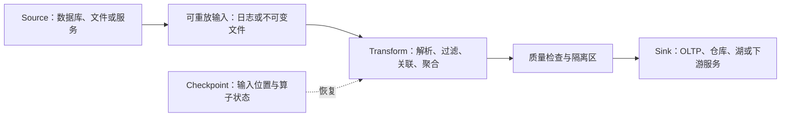

# 数据流水线基础：从一条记录到可重放的结果

交易研究平台会持续接收行情、订单和参考数据，AI 数据平台会持续接收文档、样本和训练日志。两者的业务不同，但底层问题相同：数据从哪里来，按什么顺序处理，迟到或重复时怎么办，程序崩溃后从哪里继续，以及怎样证明最终结果仍然可信。

一条最小的数据流水线可以画成：



这里最重要的不是某个产品名称，而是图上的边界。Source 是否还能重读？Transform 的状态是否与输入位置一起恢复？Sink 能否去重或参与事务？如果这些问题没有答案，“实时”“高吞吐”“exactly-once”都只是标签。

## 1. Batch 与 Stream 先按输入边界区分

**Batch（批处理）**面对一个有界输入。例如“处理 2026-08-09 的全部成交文件”有明确的开始和结束；读到最后一条后，作业可以完成。

**Stream（流处理）**面对一个持续增长、事先不知道终点的输入。例如订单事件会不断到达，程序通常长期运行，只能说“目前处理到哪里”，不能说“全量已经读完”。

二者不是两套互不相干的数学：

- 对有界记录做 `map → filter → group → aggregate` 是 batch；
- 对持续到达的记录做相同变换是 stream，但必须额外定义时间、状态何时清理、结果何时输出；
- 每分钟启动一次小批次仍然是周期性 batch；一个系统内部用 micro-batch 实现，不会自动改变它对外承诺的结果语义；
- “stream 一定快、batch 一定慢”不成立。延迟取决于触发、排队、计算和落盘，不取决于名字。

因此，设计第一问不是“用 Kafka 还是 Flink”，而是：**输入有界吗？结果需要多快可见？历史数据是否必须用同一份逻辑重算？**

## 2. Record、Partition 与 Offset 分别是什么

### 2.1 Record 是流水线处理的逻辑单位

一条 record（记录）通常至少包含：

| 字段 | 作用 |
|---|---|
| `record_id` | 标识一次业务事实，供去重、追踪和重放 |
| `key` | 决定分区或业务归属，例如账户、证券、文档来源 |
| `payload` | 真正的数据内容 |
| `event_time` | 业务事实发生的时间 |
| `schema_version` | 说明 payload 应按哪一版结构解释 |
| 来源元数据 | 例如文件名、分区、offset、采集时间，供定位问题 |

record 是逻辑概念；消息是它的一种传输形式，文件中的一行或一个列式 row group 也可以承载 record。不要把“record ID”“消息队列 offset”和“数据库主键”当成同一个东西：三者可能有关联，但解决的问题不同。

### 2.2 Partition 同时决定并行度与局部顺序

持续增长的日志通常被拆成多个 partition（分区）。每个分区是一条独立的有序序列，不同分区可以并行消费。

如果按 `account_id` 分区，同一账户的事件会进入同一分区，就能在该分区内保持顺序。但系统通常不提供不同分区之间的全局顺序。例如分区 0 的 offset 105 与分区 1 的 offset 105 没有先后关系。

分区键要同时检查三件事：

1. **正确性**：哪些记录必须在同一顺序域内处理？
2. **均衡性**：键的流量是否均匀，是否存在超级账户或超大数据源？
3. **可扩展性**：增加分区时，状态和路由怎样迁移？

随机分区可能很均衡，却破坏同一 key 的顺序；按 key 分区保留顺序，却可能产生热点。不存在只看吞吐、不看业务不变量的“最佳分区键”。

### 2.3 Offset 是分区内的位置

offset 可以理解为“这条记录在某个分区日志中的位置”。消费者保存各分区已安全处理到的 offset，重启后从相应位置继续。

它不等于：

- 事件发生时间：迟到记录的 event time 可以早于当前 offset 对应记录；
- 全局序号：offset 只在所属分区和日志生命周期内有意义；
- 业务唯一 ID：同一业务事件可能被重复写入两个 offset；
- “已经产生业务效果”的证明：只有当提交 offset 的时机与 Sink 效果配合正确时，它才是恢复点。

假设输入峰值为 120,000 records/s，一个分区的单个消费者最多稳定处理 25,000 records/s。只按平均能力计算，至少需要 `ceil(120000 / 25000) = 5` 个活跃分区。若规定正常运行只使用单分区能力的 60%，每个分区预算变为 `25000 × 0.6 = 15000 records/s`，则需要 `ceil(120000 / 15000) = 8` 个。这个结果还没有覆盖 key 倾斜、故障降级和未来增长，所以“能跑满五个分区”不是安全容量设计。

## 3. Event Time、Processing Time 与 Window

### 3.1 同一条记录至少有两种时间

**Event time（事件时间）**是业务事实发生的时间。例如成交所携带的撮合时间，或文档在源系统被创建的时间。

**Processing time（处理时间）**是流水线机器实际处理这条记录的时间。网络抖动、批量上传、重试和停机会让它晚于 event time。

有些系统还记录 **ingestion time（进入平台的时间）**。它有助于区分“上游迟到”和“平台处理慢”，但不能替代 event time。

若题目问“10:00 到 10:05 实际发生了多少事件”，应按 event time 分组；若问“处理程序每分钟承受多少请求”，processing time 更合适。先说明业务问题，再选时间轴。

### 3.2 Window 把无界输入切成可计算范围

无界流没有“全部结束”，聚合必须说明范围：

- **Tumbling window（滚动窗口）**：窗口不重叠。例如每 5 分钟一段，`[10:00,10:05)` 后接 `[10:05,10:10)`；每条记录只属于一段。
- **Sliding/Hopping window（滑动窗口）**：窗口长度大于滑动步长，因此会重叠。例如长度 10 分钟、每 1 分钟滑动一次，一条记录可能参与 10 个结果。
- **Session window（会话窗口）**：同一 key 的相邻事件间隔小于阈值时归入同一会话，适合用户访问或一段连续活动；会话结束取决于“多久没有新事件”。

半开区间 `[start,end)` 能让边界记录只归入一个相邻 tumbling window。例如 10:05:00 不属于 `[10:00,10:05)`，而属于下一段。

### 3.3 Watermark 表示事件时间的处理进度

系统不能等待“所有迟到数据”，因为无界流没有终点。watermark（水位线）是系统根据已观察数据和 Source 状态给出的事件时间进度估计。水位越过某个窗口末尾时，系统可以产生该窗口的按时结果，并按既定政策处理之后到达的旧事件。

watermark 不是证明未来绝不会出现更早的事件。更准确地说，**event time 落在当前 watermark 之前的记录会被系统视为 late data（迟到数据）**；丢弃、更新旧结果、产生撤回记录，还是写入旁路，需要业务显式决定。

看一个简化例子。使用 5 分钟 tumbling window，并暂时规定 `watermark = 当前见过的最大 event_time - 2 分钟`：

| 到达顺序 | event time | 到达/处理时间 | 更新后的 watermark | 结果 |
|---|---:|---:|---:|---|
| A | 10:01 | 10:01:10 | 09:59 | 进入 `[10:00,10:05)` |
| B | 10:04 | 10:04:20 | 10:02 | 同一窗口仍等待 |
| D | 10:07 | 10:07:10 | 10:05 | 水位到达窗口末尾，可输出 A+B |
| C | 10:02 | 10:08:00 | 10:05 | C 对该窗口已经迟到 |

若允许迟到 10 分钟，可以把 C 加入状态并发出修正后的结果；若下游只接受 append，修正就可能被误当成一条新结果，因此还要定义输出是 **append、upsert 还是 retract（撤回旧结果）**。

上表的水位算法只是计算练习，不是生产建议。真实系统常有多个分区，整体 watermark 往往受最慢分区约束；一个长期空闲的分区可能让水位停住，因此还要定义空闲检测。水位策略在“更早输出”和“接纳更多迟到数据”之间取舍，不存在对所有业务都正确的固定延迟。

## 4. At-least-once 为什么通常需要幂等

### 4.1 三种交付语义描述的是失败后的次数

| 语义 | 一条输入可能产生的处理次数 | 典型风险 |
|---|---:|---|
| at-most-once | 0 或 1 次 | 先提交位置再处理，崩溃可能丢效果 |
| at-least-once | 1 次或更多次 | 处理后再提交位置，崩溃可能重复 |
| exactly-once | 对承诺边界内的逻辑状态恰好一次 | 需要原子提交、事务或确定性去重，边界外仍可能重复 |

假设消费者按以下顺序工作：

1. 读取 offset 42；
2. 把结果写入数据库；
3. 提交“42 已完成”；

如果在步骤 2 成功后、步骤 3 之前崩溃，重启会再次读取 offset 42。这样不会漏处理，却可能重复写结果，这就是 at-least-once 的典型崩溃窗口。

若把步骤 3 放到步骤 2 之前，崩溃时数据库效果可能还没发生，但恢复会跳过 42，于是变为丢数据风险。仅仅调整两行代码不能同时消除“丢失”和“重复”。

### 4.2 幂等要以业务意图为单位

数学上，操作 `f` 满足 `f(f(x)) = f(x)` 时是幂等的。工程上常见对比是：

- “把订单状态设置为 `CANCELLED`”在前置条件相同时可以幂等；
- “把计数器加 1”重复执行会得到不同结果，不幂等；
- “按 `event_id` 把目标行 upsert 成确定值”通常可做成幂等；
- “重新发送一封邮件”即使输入相同，也会产生两次外部效果。

数据库 Sink 可以在一个本地事务中同时保存去重键和业务效果：

```text
BEGIN
  INSERT processed_events(event_id) ...
  如果 event_id 已存在：不再执行业务更新
  否则：执行由该事件产生的业务更新
COMMIT
```

关键不在 SQL 拼法，而在两个动作必须同一事务提交。去重表的保留期也是正确性条件：如果重试可能在 30 天后出现，而去重键只保留 7 天，系统只能承诺 7 天窗口内的幂等。

## 5. End-to-end Exactly-once 的边界

流水线可以把以下三类状态放进一个一致的 checkpoint 或事务协议：

1. Source 已消费到的 offset；
2. Transform 的状态，例如窗口累加值和去重集合；
3. 支持事务的 Sink 输出，或可按稳定键覆盖的结果版本。

恢复时，三者要么一起前进，要么一起回到旧快照。这样可以让**承诺边界内的逻辑结果**看起来恰好产生一次。但它不表示每个网络包、每次函数调用或每次物理写入只发生一次；失败恢复仍可能重读和重算。

边界一旦跨到不能参加同一事务的外部系统，保证就会变弱。例如作业先提交数据库，再调用邮件服务：

- 数据库提交后调用前崩溃，可能漏邮件；
- 邮件发送后记录结果前崩溃，重试可能发两封；
- 若邮件服务接受稳定的 idempotency key，或系统有可重试 outbox 和最终对账，才能把业务效果收敛到一次。

因此面试中不要只说“框架支持 exactly-once”。要依次说明：**Source、状态快照、Sink、外部副作用各自是否在保证边界内，以及用户最终观察到什么。** 这正是端到端原则在数据系统中的应用。

可重放还要求计算尽量确定。若每次运行都读取“当前时间”、无种子的随机数、会变化的在线维表或未经版本化的模型，同一批输入可能产生不同结果。需要把时间、随机种子、代码版本、配置版本和维表快照作为输入或元数据保存。

## 6. Schema Evolution 不是“JSON 多一个字段没关系”

schema 说明字段名称、类型、可空性和嵌套结构。生产者与消费者不会同时升级，因此要分别考虑：

- **Backward compatibility（向后兼容）**：新 reader 能读取旧 writer 产生的数据；
- **Forward compatibility（向前兼容）**：旧 reader 能读取新 writer 产生的数据；
- **Full compatibility**：两个方向都成立。

具体兼容规则由序列化格式和注册策略决定。例如在支持“忽略未知字段”和“reader default”的格式中，新增一个带默认值的字段通常让新 reader 可以补齐旧数据，旧 reader 也能忽略新字段。但不能把这个结论机械套到所有格式和程序：有的手写解析器会拒绝未知字段，有的语言类型没有表达缺失值。

常见变更要逐项审查：

| 变更 | 可能的问题 | 更安全的做法 |
|---|---|---|
| 新增字段 | 旧数据没有值，旧 reader 不认识 | 明确默认值/可空性，做双向兼容测试 |
| 删除字段 | 旧 reader 仍把它当必填 | 先停止依赖，再停止写入，最后才删除 |
| 重命名字段 | 系统可能视为“删旧增新” | 格式支持时使用 alias；否则双写迁移 |
| 改类型 | 溢出、精度、反序列化失败 | 只做规范允许的 promotion，并验证各语言消费者 |
| 改字段含义/单位 | 结构检查可能完全通过，但语义错误 | 新字段名或新版本，并记录单位和口径 |

一次安全迁移通常是：先发布能同时读取 v1/v2 的消费者，再让生产者写 v2；观察旧消费者退出后，才停止兼容路径。历史文件仍可能保留 v1，所以 backfill 程序不能只认识最新 schema。

## 7. 数据质量要验证业务不变量

能反序列化只说明字节结构合法，不说明数据可用。常见质量维度包括：

| 维度 | 可执行检查例子 |
|---|---|
| 完整性 | 每日清单声明 1,000 个文件，实际必须全部到齐 |
| 唯一性 | `record_id` 在约定范围内不能重复 |
| 有效性 | 数量非负，枚举值属于已知集合，时间不过度偏离 |
| 一致性 | `end_time >= start_time`，明细合计与汇总相等 |
| 关联完整性 | 事实记录引用的账户或数据源版本确实存在 |
| 新鲜度 | 最新成功分区距当前时间不超过 SLA |
| 分布稳定性 | 空值率、行数、分位数或类别比例没有异常跃迁 |

完整性尤其容易被误判：如果 Source 静默丢掉 10% 的记录，流水线内部看到的每条记录都合法，也无法凭空知道缺了什么。需要上游序号、文件 manifest、独立计数或对账基准。

质量检查应分三层：入口阻止明显坏格式；变换后检查业务不变量；发布前检查分区数量、覆盖范围和统计分布。坏数据不要无声丢弃，应进入带原因的 quarantine（隔离区），同时产生指标和告警。隔离区也要限制容量和访问权限，否则会变成无人管理的第二份数据湖。

## 8. Replay 与 Backfill 怎样安全执行

**Replay（重放）**是从已有 Source 重新读取记录，常用于故障恢复、重新生成状态或验证新代码。

**Backfill（回填）**是针对一个历史范围补算缺失或修正后的结果。例如发现 7 月份解析规则有错，使用修复后的代码重新生成 7 月分区。backfill 通常通过 replay 实现，但它还包含范围、版本、发布和资源隔离等管理问题。

安全回填应满足：

1. **输入可复现**：原始数据不可变，或能定位到确定快照；
2. **逻辑可复现**：保存代码、配置、schema、随机种子和依赖的维表版本；
3. **范围明确**：使用半开时间区间，并说明按 event time 还是 ingestion time；
4. **输出隔离**：先写入新的 dataset version 或 staging 分区，不直接覆盖在线正确结果；
5. **写入可重试**：使用稳定的输出键、upsert 或事务发布，作业重跑不会不断追加重复结果；
6. **质量可比较**：与旧版本比较行数、主键覆盖、关键聚合和抽样差异；
7. **发布原子化**：验证后切换元数据指针或分区版本，保留回滚入口；
8. **资源受控**：backfill 有独立配额和背压，不能把在线消费挤到无限积压。

历史关联还要使用历史版本。例如重算 7 月订单时若连接“今天的账户等级”，会把未来信息写进过去结果。正确做法是使用 as-of join、版本化快照或有效时间区间。

## 9. OLTP、OLAP、Warehouse 与 Lake 不是四个同级产品名

OLTP/OLAP 描述主要工作负载；warehouse/lake 描述数据平台的组织方式。它们经常组合出现，但不能简单一一等同。

| 概念 | 主要保存什么 | 典型访问 | 适合做什么 | 不擅长什么 |
|---|---|---|---|---|
| OLTP | 当前业务状态 | 按主键短事务、小范围读写 | 订单、账户、作业元数据和约束 | 扫描全表做大型聚合 |
| OLAP | 历史事实与分析结果 | 大范围扫描、过滤、Join、聚合 | 报表、研究查询、质量趋势 | 高频逐行更新和严格在线事务 |
| Data warehouse | 经过建模、治理、可直接查询的分析数据 | SQL/BI/分析任务 | 稳定口径、权限、目录和高性能分析 | 低成本保存所有原始非结构化数据 |
| Data lake | 文件/对象中的原始及中间数据 | 多种计算引擎按文件和元数据读取 | 大规模原始数据、开放格式、训练样本、重放 | 缺少表管理时容易出现小文件、脏分区和口径混乱 |

Lakehouse 是一种架构主张：在开放文件之上增加事务、版本、schema、索引和治理能力，让一份数据同时服务更多分析与 ML 工作负载。它不是“所有公司必须迁移的最终答案”；是否采用取决于并发写入、查询延迟、治理和运维成本。

一个量化研究平台可以把订单当前状态放在 OLTP，把不可变行情和研究原始输入放在 lake，把可复用的清洗结果和研究表放在 warehouse/lakehouse。一个 AI 数据平台可以把任务与权限元数据放在 OLTP，把原始文档、图像和版本化训练集放在 lake，把数据质量、样本分布和训练运行分析放在 OLAP。业务名称不同，选择依据仍是更新模式、查询模式、保留期和一致性要求。

## 10. Backpressure 与容量必须算成数字

通用背压机制已经在[吞吐量优化](throughput.md)讲过。本节只把它放到数据流水线的积压、保留与重放语境中。

设输入速率为 `λ`，稳定处理速率为 `μ`：

- 当 `λ <= μ` 时，理想稳态不会持续新增积压；
- 当 `λ > μ` 时，积压增长率为 `λ - μ`；持续 `t` 秒后新增 `B = (λ - μ)t` 条；
- 流量恢复后若 `μ > λ`，清空已有积压需要 `B / (μ - λ)` 秒，而不是 `B / μ`，因为清理期间新数据仍在进入。

例：输入 120,000 records/s，处理能力 90,000 records/s，过载持续 20 分钟。积压为：

```text
(120000 - 90000) × 20 × 60 = 36,000,000 records
```

若每条平均 800 bytes，仅 payload 就约 `36,000,000 × 800 = 28.8 GB`（十进制）。之后输入降到 60,000 records/s，处理仍为 90,000 records/s，净清理速率为 30,000 records/s，因此还需 `36,000,000 / 30,000 = 1,200 s = 20 min`。若误用 `B/μ`，会低估恢复时间。

保留空间也要复算。若平均 80,000 records/s、每条 500 bytes、保留 24 小时，原始 payload 为：

```text
80000 × 500 × 86400 = 3.456 × 10^12 bytes = 3.456 TB
```

若压缩后是原来的 `1/2.5`，并保存 3 个副本，则约为 `3.456 / 2.5 × 3 = 4.1472 TB`。实际还要加索引、日志段、元数据、未达平均压缩率的分区和安全余量。

容量题至少检查：峰值而非日均、最大 key 倾斜、单分区上限、故障时剩余能力、checkpoint 状态大小、保留期是否覆盖最长停机，以及 backfill 会占用多少共享带宽。

## 11. 一次完整设计推演

需求如下：平台接收两类事件——量化研究所需的行情记录或 AI 清洗所需的样本记录；峰值 100,000 records/s；同一 `source_key` 必须有序；允许事件迟到 5 分钟；要生成 10 分钟聚合；原始数据保留 7 天以便重放；结果进入分析存储；处理采用 at-least-once。

先给机制设计：

1. 每条 record 带稳定 `record_id`、`source_key`、event time、schema version 和来源位置；
2. 按 `source_key` 分区，先测 key 倾斜；超大 key 不能随意拆分，除非聚合可交换且能在第二阶段合并；
3. 原始记录先进入可重放日志/不可变文件，再做解析和聚合；
4. 按 event time 使用 10 分钟 tumbling window，watermark 与 allowed lateness 分开配置；迟到记录触发 upsert 修正或进入旁路，不能静默丢弃；
5. checkpoint 保存各分区 offset 与窗口状态；结果以 `(window_start, source_key, metric_version)` 作为稳定键 upsert，使重放不重复追加；
6. schema 先做兼容检查，坏数据进入隔离区；发布前检查输入数量、唯一率、空值率和窗口覆盖；
7. 原始数据保留 7 天只意味着“最多能从 Source 自助重放 7 天”，不是永久恢复保证；需要根据 RPO/RTO 判断是否还要更长期归档；
8. backfill 写新版本，核验后再切换分析表指针；在线流与回填使用独立资源配额；
9. 依据峰值、单分区能力和降级目标计算分区数，并计算 7 天原始 payload、复制和压缩后的空间。

最后说边界：这个设计能让分析 Sink 中的逻辑结果通过稳定键收敛到一次；如果下游还发送邮件、调用未提供幂等键的 API，不能把它们自动包含在 exactly-once 承诺里。

## 12. 常见误区

- **“有 offset 就不会重复。”** offset 只是读取位置；效果与位置不能原子提交时仍有崩溃窗口。
- **“watermark 之前绝不再来数据。”** watermark 是进度判断和迟到分类边界，不是对未来的物理证明。
- **“at-least-once 加一张去重表就永远正确。”** 还要检查业务键、事务范围、保留期与并发竞态。
- **“框架支持 exactly-once，所以邮件也恰好发送一次。”** 外部副作用不在 checkpoint/Sink 事务内时，该结论不成立。
- **“schema 能解析就兼容。”** 单位或业务含义变化可能通过结构检查却产生错误结果。
- **“回填就是把旧任务再跑一遍。”** 没有版本化输入、历史维表、隔离输出和原子发布，重跑可能制造第二次事故。
- **“湖比仓库新，所以应该取代仓库。”** 二者解决的访问、治理和成本问题不同，常常协作而非互斥。
- **“平均吞吐小于处理能力就够了。”** 峰值、倾斜、单分区顺序和故障余量都可能让平均数失去意义。

## 做题方法

遇到流水线设计或故障题，按以下顺序回答：

1. **定义记录**：业务唯一 ID、分区 key、event time、schema 和单条大小是什么？
2. **定义顺序与时间**：需要全局还是 per-key 顺序？按 event time 还是 processing time？窗口和迟到政策是什么？
3. **画失败边界**：Source offset、算子状态、Sink 效果分别何时提交；在每两个动作之间插入一次崩溃。
4. **说明重试收敛方式**：幂等键、唯一约束、upsert、事务、outbox 或对账由谁提供？保留多久？
5. **说明历史可复现性**：原始输入、代码、配置、schema 和维表是否版本化；backfill 怎样隔离和发布？
6. **计算容量**：用 records/s 和 bytes/record 算分区、积压、清空时间、保留空间和降级余量，所有数字写单位。
7. **最后才选产品**：用上述约束解释需要什么能力，而不是先报一串组件名。

## 13. 练习与完整解答

### 练习 1：判断 Batch 与 Stream

每天凌晨处理前一天已经封存的 24 个小时文件；另一个常驻程序每到一条记录就更新指标。两者分别是什么？如果前者每分钟运行一次，是否自动变成 stream？

<details>
<summary>参考答案与解答</summary>

封存文件有明确终点，是 batch；常驻程序面对持续增长的输入，是 stream。把 batch 调度周期缩短为一分钟只降低可见延迟，输入仍是一批批有界快照，所以不能仅凭调度频率改名。应继续追问结果语义：一分钟批次之间怎样去重、迟到数据进入哪一批、历史是否可重跑。

</details>

### 练习 2：计算分区数并检查顺序

峰值输入为 150,000 records/s，单分区消费者稳定上限为 30,000 records/s。要求保留 25% 余量，并保证同一用户事件有序。至少需要几个活跃分区？分区键应优先选什么？

<details>
<summary>参考答案与解答</summary>

保留 25% 余量表示每分区只预算 `30000 × 0.75 = 22500 records/s`。因此至少需要 `ceil(150000 / 22500) = ceil(6.67) = 7` 个活跃分区。为保证同一用户有序，应优先按稳定的 `user_id` 分区，而不是随机轮询。随后必须检查用户流量倾斜；若一个用户本身超过单分区能力，仅增加总分区数不能解决该热点，需要重新审视顺序范围或把可合并计算拆成两级。

</details>

### 练习 3：Watermark 与迟到记录

使用 `[10:00,10:05)` 的 event-time 窗口。系统 watermark 已到 10:05，随后收到 event time 为 10:03 的记录。它是否属于该窗口？是否必须丢弃？

<details>
<summary>参考答案与解答</summary>

按 event time，它仍属于 `[10:00,10:05)`；但相对于当前 watermark，它已经是迟到记录。“迟到”不等于“必须丢弃”。若配置 allowed lateness 并且状态尚未清理，可以更新窗口并向支持 upsert/retract 的下游发修正；也可以写入迟到旁路，等待离线回填；只有业务明确接受损失时才丢弃。答案必须同时说明归属窗口和迟到处理政策。

</details>

### 练习 4：找出 At-least-once 的崩溃窗口

消费者读取事件 E，先执行 `counter += 1`，再提交 offset。计数成功后进程崩溃，恢复会发生什么？怎样修正？

<details>
<summary>参考答案与解答</summary>

offset 尚未提交，所以 E 会被重读，`counter += 1` 再执行一次，得到重复效果。不能简单改成先提交 offset，因为那会在提交后、计数前崩溃时丢效果。可给 E 一个代表业务意图的稳定 `event_id`，在同一数据库事务内插入去重键并只在首次插入时更新计数；或者把结果写为由输入确定的绝对值/稳定键 upsert。还要说明去重键保留期覆盖最大重放窗口。

</details>

### 练习 5：Exactly-once 是否覆盖邮件

流处理框架把 Source offset、窗口状态和数据库 Sink 放进一致 checkpoint；数据库提交后，业务代码调用邮件服务。能否声称用户恰好收到一封邮件？

<details>
<summary>参考答案与解答</summary>

不能。checkpoint 只覆盖到数据库 Sink，邮件服务没有参加同一原子提交。发送成功后本地未记录就崩溃会导致重试再发；先记录再发送则可能漏发。可把“待发送邮件”与数据库结果同事务写入 outbox，由投递器重试，并向邮件服务传稳定 idempotency key；若服务不支持去重，还需要对账并把承诺表述为 at-least-once 投递，而不是无条件 exactly-once。

</details>

### 练习 6：设计一次 Schema 迁移

事件 v1 有必填字段 `price_cents: int32`。现在希望改成能表示更大范围的 `price_micros: int64`。为什么不应直接改名改类型？给出安全迁移顺序。

<details>
<summary>参考答案与解答</summary>

直接修改同时改变字段名、类型和单位。旧 reader 可能找不到必填字段，新 reader 可能无法读取历史数据，即使解析成功也可能把 cents 当 micros，产生 1,000,000 倍与 100 倍口径之间的严重错误。安全做法是新增含明确单位的新字段，先发布能读取 v1/v2 并做受控换算的消费者；再让生产者在过渡期双写或只写带版本号的 v2；核对所有消费者和历史 backfill 后才停止旧字段。整个过程要做新读旧、旧读新的兼容测试和数值边界测试。

</details>

### 练习 7：Backfill 为什么不能直接覆盖

7 月数据因解析错误需要重算。工程师准备使用最新代码读取原文件，直接覆盖线上 7 月分区。指出至少四个风险并给出替代流程。

<details>
<summary>参考答案与解答</summary>

风险包括：最新代码或配置无法复现预期逻辑；连接了今天的维表而引入未来信息；任务半途失败留下半新半旧分区；重试产生重复；结果未核验就对用户可见；大量回填挤压在线流水线。替代流程是固定输入范围与快照，记录代码/config/schema/维表版本，写入新的 dataset version 或 staging 分区，以稳定键保证可重试；完成后比较行数、主键、关键聚合和样本差异，验证通过再原子切换元数据指针，并保留旧版本以便回滚。回填使用独立限额和监控。

</details>

### 练习 8：区分存储职责

某 AI 数据平台要保存任务状态、原始文档、版本化训练集、每日质量报表。分别更适合放在哪类系统，为什么？

<details>
<summary>参考答案与解答</summary>

任务状态需要按主键小事务、并发更新和约束，适合 OLTP。原始文档体积大、格式多、需长期重放，适合对象存储式 data lake。版本化训练集也适合 lake 或带事务元数据的 lakehouse，以便保存不可变版本并供多种训练引擎读取。每日质量报表需要扫描、分组和趋势查询，适合 OLAP/warehouse。实际系统可以组合这些能力；选择依据是访问和一致性模式，而不是把全部数据塞进一个“最新”的系统。

</details>

### 练习 9：计算积压与恢复时间

输入从 70,000 records/s 升到 110,000 records/s，处理能力为 80,000 records/s，过载持续 15 分钟。每条 600 bytes。之后输入降到 50,000 records/s。求积压条数、payload 大小和清空时间。

<details>
<summary>参考答案与解答</summary>

过载时净增长为 `110000 - 80000 = 30000 records/s`，15 分钟是 900 秒，所以积压 `30000 × 900 = 27,000,000 records`。payload 为 `27,000,000 × 600 = 16,200,000,000 bytes = 16.2 GB`（十进制，不含索引和副本）。流量下降后净清理能力为 `80000 - 50000 = 30000 records/s`，因此清空需要 `27,000,000 / 30,000 = 900 s = 15 min`。不能除以总处理能力 80,000，因为恢复期间仍有每秒 50,000 条新输入。

</details>

### 练习 10：端到端设计复述

设计一个支持 3 天 replay、按用户有序、10 分钟 event-time 聚合、at-least-once 消费和历史 backfill 的最小流水线。回答必须说明 correctness boundary，不能只列产品。

<details>
<summary>参考答案与解答</summary>

记录包含稳定 `record_id`、`user_id`、event time、schema version 和来源位置；按 `user_id` 分区以保留局部顺序，并检查热点。原始输入写入至少保留 3 天的可重放日志或不可变文件。聚合使用 10 分钟 event-time window，定义 watermark、allowed lateness、状态清理和迟到输出政策。checkpoint 同时保存各分区 offset 与窗口状态；分析 Sink 用 `(user_id, window_start, metric_version)` upsert，或在事务内保存去重键，使 at-least-once 重放收敛。质量层检查 schema、重复、空值、输入覆盖和窗口数量。backfill 固定代码/config/schema/历史维表，写新数据版本，核验后原子发布并限速。保证边界止于可重放 Source、checkpoint 状态和可幂等/事务 Sink；未提供幂等能力的外部 API 不在 exactly-once 边界内。

</details>

## 14. 面试复述

> Batch 处理有界输入，stream 处理持续增长的无界输入。record 用稳定业务 ID 表示事实，partition 决定并行度和局部顺序，offset 只是分区内恢复位置。event time 决定业务窗口，watermark 决定何时先输出以及怎样分类迟到数据。at-least-once 会在“效果成功、offset 未提交”的崩溃窗口重放，所以 Sink 要用事务内去重或稳定键 upsert。exactly-once 必须逐段说明 Source、状态、Sink 和外部副作用的边界。schema、质量、回填和容量都是正确性的一部分；最后才根据这些约束选择具体产品。

## 一手资料与可靠来源

- [Google / VLDB：The Dataflow Model](https://research.google.com/pubs/archive/43864.pdf)：有界/无界数据、event time、window、watermark，以及正确性、延迟与成本的统一模型。
- [Apache Beam Programming Guide](https://beam.apache.org/documentation/programming-guide/)：window、trigger、event-time timer、watermark 与 late data 的官方语义参考。
- [Apache Kafka Design](https://kafka.apache.org/41/design/design/)：partition、consumer position、at-least-once、幂等生产与事务边界；本章只引用机制，不依赖具体命令。
- [Apache Avro Specification](https://avro.apache.org/docs/1.12.0/specification/)：writer/reader schema resolution、default、alias 与类型 promotion 的规范定义。
- [Saltzer、Reed、Clark：End-to-End Arguments in System Design](https://web.mit.edu/Saltzer/www/publications/endtoend/endtoendA4.pdf)：为什么局部可靠性不能自动推出端到端业务效果正确。
- [Carbone 等：State Management in Apache Flink](https://www.vldb.org/pvldb/vol10/p1718-carbone.pdf)：分布式有状态流处理的 checkpoint、一致快照与恢复机制。
- [Amazon / VLDB：Automating Large-Scale Data Quality Verification](https://assets.amazon.science/a6/88/ad858ee240c38c6e9dce128250c0/automating-large-scale-data-quality-verification.pdf)：把完整性、唯一性、分布等数据假设变成可执行验证。
- [Armbrust 等，CIDR 2021：Lakehouse](https://www.vldb.org/cidrdb/papers/2021/cidr2021_paper17.pdf)：warehouse、lake 两层架构的分工与 lakehouse 主张；它是一种架构论证，不是唯一选型答案。
