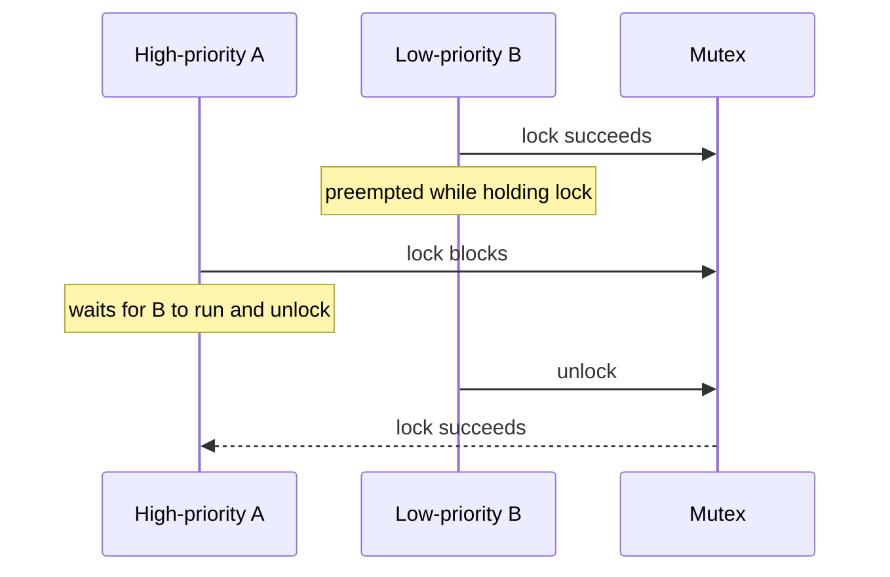
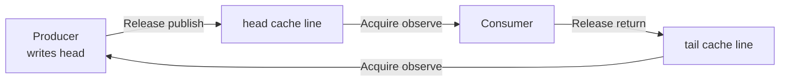

# 无锁数据结构 (Lock-Free Structures)

锁不是“性能毒药”，无锁也不是“速度魔法”。两者首先是不同的**进展保证与状态协调方式**：Mutex 允许线程等待持锁者；lock-free 算法要求系统整体持续完成操作，即使某个参与者暂停。HFT 关心它们，是因为这种差异会影响尾延迟、调度依赖和缓存行争用。

本章的目标是让你在面试中准确回答三个问题：lock-free 到底保证谁能前进？为什么它仍可能很慢？什么时候应当选择分片/SPSC，而不是继续堆 CAS？

## 1. 锁带来的风险，也要讲边界

### 1.1 优先级反转

假设低优先级日志线程 B 持有一把锁后被抢占，高优先级行情线程 A 随后请求同一把锁：



这叫**优先级反转**：高优先级任务的完成依赖低优先级持锁者先获得 CPU。优先级继承（priority inheritance）、缩短临界区和合理调度策略可以缓解，但无法把所有排队与缓存干扰变没。

无锁算法没有“持有互斥锁的线程”，因此能消除这类锁所有者依赖；但它不保证高优先级线程立刻成功：

- 线程仍可能被操作系统抢占；
- CAS 可能反复失败，单个线程可能饥饿；
- 某些队列中，线程抢到槽位后被暂停，会留下尚未发布的洞，其他角色是否受影响取决于算法；
- 缓存 miss、page fault、SMT 与 IRQ 仍然存在。

所以准确说法是：**lock-free 给系统整体进展保证，不给单次操作固定延迟，也不等于“不会被 OS 挂起”。**

### 1.2 死锁、活锁与饥饿不是同一个词

- **死锁 (deadlock)**：参与者互相等待，形成无法自行打破的环；
- **活锁 (livelock)**：线程一直执行、彼此响应，却没有任何操作完成；
- **饥饿 (starvation)**：系统不断有操作完成，但某一个不走运的线程长期失败。

严格的 lock-free 算法不应出现“所有线程无限重试却没有任何完成”的永久活锁，否则它不满足系统整体进展定义；但它**允许个别线程饥饿**。面试中把“我的 CAS 连续失败”直接称为整个算法 livelock，容易暴露概念混淆。

### 1.3 无锁仍会严重争用

Mutex 的状态字和 CAS 热点本质上都可能成为被多个核心写的缓存行。竞争激烈时，缓存行会在核心之间反复取得独占权，导致：

- CAS 失败与重试增多；
- 互连和一致性流量上升；
- 吞吐量不再线性扩展；
- P99/P999 变差，即使平均延迟看起来不错。

HFT 常见的第一选择不是“把 Mutex 改成 CAS”，而是改变所有权拓扑：按 symbol/account 分片、单写者拥有状态、每个生产者使用独立 SPSC，再由消费者聚合。

## 2. 四级进展保证

“无锁”有严格含义，不是泛指代码里没出现 `Mutex`。

| 级别 | 保证 | 某线程暂停时会怎样 | 常见直觉 |
| :--- | :--- | :--- | :--- |
| Blocking | 不提供非阻塞进展保证 | 持锁者暂停可能阻塞所有等待者 | 一把钥匙 |
| Obstruction-free | 线程单独运行足够久可完成 | 持续冲突时可能无人完成 | 没人干扰就能做完 |
| Lock-free | 系统整体在有限步骤内不断有操作完成 | 个别线程可饥饿 | 总有人完成 |
| Wait-free | 每个操作都在有界步骤内完成 | 其他线程暂停不阻止本操作结束 | 每个人都有完成上界 |

这里的“步骤”是算法模型中的操作步数，不等于墙钟时间。wait-free 线程仍可能被 OS 抢占 10ms；算法只承诺它重新执行后不需要无限等待其他参与者。

### 2.1 一个重要的 API 边界

有界 SPSC 的 `try_push` 可以在固定步骤内返回 `Ok` 或 `Full`，因此可具有 wait-free 风格的进展保证。但下面这个完整标准库示例把 `SyncSender::try_send` 包成自旋重试；只要消费者不腾出容量，它就不再有完成上界：

```rust,no_run
use std::sync::mpsc::{SyncSender, TrySendError};

fn send_with_spin<T>(sender: &SyncSender<T>, mut value: T) -> Result<(), T> {
    loop {
        match sender.try_send(value) {
            Ok(()) => return Ok(()),
            Err(TrySendError::Full(returned)) => {
                // try_send 失败时会归还所有权，下一轮才能再次提交。
                value = returned;
                std::hint::spin_loop();
            }
            Err(TrySendError::Disconnected(returned)) => return Err(returned),
        }
    }
}
```

只要消费者不前进，循环就不会结束。分析进展保证时，必须明确讨论的是**单次 try 操作**、阻塞包装，还是整个业务请求。

## 3. 为什么 SPSC 快，但不是“零通信”

本书统一约定：

- 生产者独占写 `head`，消费者只读 `head`；
- 消费者独占写 `tail`，生产者只读 `tail`。

它不需要 CAS，是因为每个游标只有一个写者，没有 write/write 抢占新序号。但读者要观察写者的新值，缓存行仍需跨核传播：写者修改后是独占/Modified 状态，另一核心读取会触发共享或转移；写者下一次修改时又需要写权限。

因此更准确的描述是：

1. SPSC 消除了**多写者 CAS 热点**；
2. head 与 tail 分缓存行，避免两个游标互相伪共享；
3. 生产者缓存远端 tail、消费者缓存远端 head，只在可能满/空时刷新，减少跨核读取；
4. 数据槽位本身仍要从生产者发布给消费者，不可能完全没有一致性通信。



完整、安全的双句柄实现见 [Ring Buffer](ring_buffer.md)。

## 4. CAS：工具，不是 lock-free 证明

CAS（Compare-And-Swap）表达：“只有当前值仍等于我观察到的旧值，才写入新值。”多个线程竞争时，失败者根据新状态重试。

下面用 CAS 更新最大序号；这里只关心原子值本身，不发布其他数据，所以 `Relaxed` 足够：

```rust
use std::sync::atomic::{AtomicU64, Ordering};

fn update_max(max_seen: &AtomicU64, candidate: u64) {
    let mut current = max_seen.load(Ordering::Relaxed);

    while candidate > current {
        match max_seen.compare_exchange_weak(
            current,
            candidate,
            Ordering::Relaxed,
            Ordering::Relaxed,
        ) {
            Ok(_) => return,
            Err(observed) => current = observed,
        }
    }
}
```

`compare_exchange_weak` 允许伪失败，放在循环中通常合适。若 CAS 成功还负责发布此前写入的数据，成功 Ordering 可能需要 `Release`/`AcqRel`；若失败后要读取对方发布的数据，失败 Ordering 可能需要 `Acquire`。

> CAS 循环只是实现形状，不是 lock-free 证明。你还必须证明：所有可能交错中，只要线程持续执行，系统就会不断有操作完成；还要处理内存回收、ABA 和 panic/取消路径。

Ordering 的完整推导见 [原子操作与内存顺序](atomics.md)。

## 5. ABA 与内存回收

### 5.1 什么是 ABA

线程 1 读取状态 A 后暂停；线程 2 把状态改为 B，再改回数值相同的 A。线程 1 的 CAS 只比较比特，可能误以为“期间什么都没发生”。

```text
Thread 1: read A ---------------------- CAS(A -> C) succeeds?
Thread 2:          A -> B -> A
```

在无锁栈/链表中，A 常是节点地址。节点被移除、释放并在同一地址重新分配后，地址相同但对象身份已变；更严重的是，线程 1 可能已经持有悬垂指针。

### 5.2 预分配能降低风险，但不自动免疫

固定 Ring Buffer 不回收链表节点，确实避开了经典的“地址释放后复用”问题。但 ABA 也可以发生在任何会回到旧比特模式的状态机中；有限位宽序号最终还会 wrapping。

每槽位 generation/sequence 能区分不同轮次，配合容量不变量可把风险控制在算法证明内。不能只说“u64 只会增加所以天然免疫”：`u64` 会溢出，Rust 代码还常主动使用 wrapping 算术。工程上 64 位回绕可能极其遥远，数学证明仍需说明回绕为什么不会造成歧义。

### 5.3 常见方案

1. **Tagged pointer / 版本号**：把地址与 generation 一起比较；注意位宽与回绕；
2. **Epoch-based reclamation (EBR)**：等所有相关线程离开旧 epoch 后再释放；
3. **Hazard pointer**：线程先公布自己可能解引用的节点，回收者延迟释放；
4. **所有权重构**：固定槽位、单写者或索引句柄，减少动态共享指针。

内存回收通常比 CAS 本身更难。错误的 Ordering 也许在 ARM 压测才暴露，错误的回收则可能直接变成 use-after-free。

## 6. 怎么选：Mutex、无锁还是分片

| 场景 | 推荐起点 | 理由 |
| :--- | :--- | :--- |
| 冷路径、临界区短、竞争低 | Mutex | 最容易证明和维护，未必比复杂 CAS 慢 |
| 配置快照、读多写少 | 不可变快照/RCU 风格 | 读路径简单，更新集中 |
| 一对一流水线 | 有界 SPSC | 单写者、无 CAS、背压明确 |
| 多生产者日志 | 每生产者 SPSC + 聚合，或成熟 MPSC | 避免共享 tail 热点，按复杂度取舍 |
| 通用动态无锁容器 | 优先成熟库 | 回收、ABA、取消与 panic 安全很难自行覆盖 |

评估时至少同时报告：吞吐量、P50/P99/P999、CPU 占用、CAS 失败次数、队列满/空次数、线程与 NUMA 拓扑。只展示单线程平均耗时，无法说明并发结构是否适合 HFT。

## 7. 常见陷阱

1. **把 lock-free 当 wait-free**：系统前进不代表我的订单能在固定步数完成；
2. **把无锁当无调度**：线程照样会被抢占、迁核和中断；
3. **自己写回收协议**：能通过功能测试远远不够，应使用 Loom 等模型测试小交错，并优先选择审计过的库；
4. **忽略退避**：CAS 失败后所有线程立即猛冲，会加重缓存行流量；退避改善吞吐，却也会改变尾延迟与公平性；
5. **无界重试没有过载策略**：系统过载时，自旋可能把宝贵 CPU 全耗在失败上；
6. **把 x86 成功当跨平台证明**：弱内存架构更容易暴露错误 Ordering。

## 8. 面试快问快答

### Q1：Lock-free 是否保证当前线程不会饿死？

不保证。它只保证系统整体持续有操作完成。保证每个操作在有界步骤内结束的是 wait-free。

### Q2：无锁为什么仍可能比 Mutex 慢？

高竞争 CAS 会制造失败重试和缓存行迁移；Mutex 在低竞争、短临界区时可能走很快的用户态路径。算法复杂度还会增加指令和 I-cache 压力。

### Q3：SPSC 为什么不用 CAS？

head 与 tail 各有唯一写者，不需要多个线程竞争“谁获得下一个值”。但游标和数据仍通过 Acquire/Release 跨核发布，并非没有同步成本。

### Q4：预分配是否彻底解决 ABA？

它能规避动态节点地址释放/复用这一经典来源，但任何状态回到旧比特模式都可能产生 ABA。仍需 generation、容量/回绕证明或其他协议。

## 9. 本章小结

- Lock-free 保证系统整体进展，wait-free 才保证每个操作的步骤上界；
- 无锁减少对持锁者的依赖，却不消除调度、饥饿和缓存争用；
- SPSC 的优势来自单写者和明确槽位所有权，不是“完全没有缓存通信”；
- CAS、Ordering、ABA 与内存回收必须形成一条完整证明链；
- HFT 中最有效的无锁优化常常是减少共享：分片、单写者和有界消息通道。

进一步阅读：[内存布局与缓存效率](../foundations/memory_layout.md#12-mesi-协议与伪共享-mesi--false-sharing)、[Ring Buffer](ring_buffer.md) 与 [Rust Atomics and Locks](https://marabos.nl/atomics/)。

---
下一章：[Ring Buffer 实现](ring_buffer.md)。
