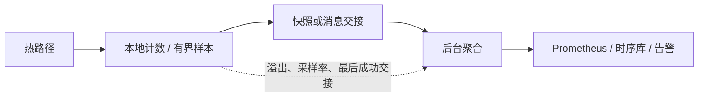

# 指标监控与遥测 (Metrics & Telemetry)

指标用于回答“系统现在是否健康、容量是否足够、变化从何时开始”。它不是订单审计账本：计数和采样可以聚合，但任何采样、溢出或上报缺口都必须可见。

Prometheus、InfluxDB 或其他后端不是天然“禁止进入 HFT”。通常做法是让热路径只更新本地/原子状态，由后台线程转换成后端格式；是否满足延迟目标要靠测量。

## 1. 分层架构



设计目标不是“测量完全隐形”，而是开销有预算、缺口可检测、关闭或降采样后行为可预测。

## 2. Counter、Gauge 与复合状态

```rust
use std::sync::atomic::{AtomicU64, Ordering};

pub struct Counters {
    orders_sent: AtomicU64,
    diagnostic_samples_dropped: AtomicU64,
}

impl Counters {
    pub fn record_order(&self) {
        self.orders_sent.fetch_add(1, Ordering::Relaxed);
    }
}
```

`Relaxed` 可用于“只关心这个计数最终值”的独立统计；它不发布其他业务状态，也不能让 `orders_sent` 与 `bytes_sent` 形成同一时刻的一致快照。如果告警依赖多个字段的不变量，应由单一所有者生成快照，或使用带版本的安全发布机制。

全局原子计数器在多核高写入下可能造成缓存行争用。可使用每线程/每分片计数，后台求和；代价是快照可能不是严格同一时刻，因此必须先说明读者需要单字段近似值还是跨字段一致快照。

Gauge 还要定义语义：队列 depth 是瞬时值，高水位是窗口最大值，最老消息 age 才能说明数据有多陈旧。

## 3. 延迟直方图不是“神器”

HdrHistogram 是一种有用的近似直方图实现，但仍需配置和验证：

- 最小/最大可记录值；
- 有效数字带来的精度与内存权衡；
- 超范围值是报错、钳制还是另计；
- 直方图单位是 ns、µs 还是 cycle；
- 不同线程合并时配置是否一致；
- reset/快照期间样本是否遗漏或重复。

不要对 `record()` 的错误直接 `.ok()`。至少增加 `histogram_out_of_range`，否则真正的极端尾延迟可能恰好被静默丢掉。

### 3.1 Thread-local 的安全交接

线程局部直方图避免多个生产者争同一结构，但后台线程不能直接借用别的线程的 `RefCell`。常见安全方案：

1. 生产者在安全点把完整快照发送到有界队列；
2. 使用双缓冲，每次只交换“已封存、不再写”的缓冲区，并正确管理生命周期；
3. 每线程维护固定 buckets，聚合器读取原子 bucket（接受非同时快照）；
4. 使用库提供的同步 recorder。

不要为省一次消息交接就手写未经证明的 `unsafe` 跨线程访问。

### 3.2 不能平均百分位数

两个分片各自的 p99 不能取平均后当作全局 p99。应合并原始直方图/bucket 计数，再从合并分布计算百分位。百分位还要同时报告：

- 样本数和观察窗口；
- 测量边界、负载与消息类型；
- 最大值和超范围计数；
- 时钟来源与精度；
- 是否采样、采样概率和采样方式。

只有 1,000 个样本时，讨论 p99.99 没有足够分辨率；稳定估计极端尾部通常需要远多于“分位点倒数”数量的样本。

## 4. Coordinated Omission（协调遗漏）

这是延迟测试最常见的陷阱之一。

假设系统应每 1ms 收到一个事件，但处理一个事件突然卡住 100ms。若负载生成器必须等上一个请求完成才发下一个，它只记录一个 100ms 慢样本；现实中原本计划到达的约 99 个事件也会排队等待，却没有被发送和计入。

```text
闭环生成器：完成一个 -> 再发一个      容易少记排队等待
开放环生成器：按计划时间持续到达      能暴露过载与排队
```

应按目标到达计划发压，记录 `scheduled_time → completion` 或真实 ingress → egress，并监控队列 age。某些直方图库提供 coordinated-omission correction，但它依赖“期望间隔”等假设；不能不说明模型就打开一个选项。

生产请求本身如果有自然闭环，仍应如实报告该业务模型；关键是不要把生成器的自我降速误称为系统在固定负载下的尾延迟。

## 5. 采样与开销

| 方法 | 适合 | 风险 |
| --- | --- | --- |
| 精确计数器 | 订单数、错误数、丢包数 | 共享原子争用 |
| 固定概率采样 | 高频阶段耗时 | 可能漏掉稀有尾部 |
| 每 N 条采样 | 开销可控 | 与周期性负载产生偏差 |
| 慢事件全采 + 正常事件抽样 | 排查尾部 | 需要先有低成本慢事件判定 |
| 动态降采样 | 过载保护 | 时间段之间不可直接比较 |

采样必须记录分母和当前概率。若缓冲区满导致的丢样与高负载相关，剩余样本会产生系统性偏差；不能只把它当随机丢失。

时间戳读取、trace ID、缓存写入和聚合都有成本。用开启/关闭遥测的 A/B 测试量化 p50/p99、吞吐和缓存计数变化，而不是规定“每次必须几十纳秒”。

## 6. Prometheus 与标签基数

Prometheus 客户端可以放在后台导出路径。热路径更新何种 recorder，要根据库实现和基准选择。更常见的实际风险是高基数：

- 不要把 `order_id`、`execution_id` 或完整错误文本作为 label；
- `symbol`、`strategy`、`venue` 的组合也要预算时间序列数量；
- 单笔追踪进入受控日志/trace，而不是无限指标标签；
- scrape 失败和最后成功上报时间本身要监控。

Pull 还是 Push 主要是部署与故障语义选择，不决定热路径是否安全。

## 7. 最小指标集

| 类别 | 建议指标 |
| --- | --- |
| 行情 | 序号缺口、消息 age、恢复状态、每类型速率 |
| 订单 | Pending/Unknown 数量、Reject 原因、Fill/Cancel 速率、ACK RTT |
| 风控 | 额度使用、拒绝数、kill 状态、配置版本 |
| 队列 | depth、高水位、最老事件 age、push 失败 |
| 延迟 | 明确定义的端到端和分阶段 p50/p99/p99.9、max、样本数 |
| 主机 | CPU、迁核、上下文切换、IRQ/softirq、page fault、NIC drop、NUMA |
| 遥测自身 | 采样率、丢样、超范围、聚合落后、最后成功导出 |

PnL/持仓指标还要带估值来源和新鲜度，不能替代成交审计与对账。

## 8. 面试追问与验证清单

**Prometheus 能否用于低延迟系统？** 可以把抓取、格式化和网络发送放在后台；热路径 recorder 是否可接受要测量。不要在每笔订单上构造高基数字符串标签。

**怎样合并多个线程的 p99？** 合并相同配置的直方图/bucket，再算全局 p99，不能平均线程 p99。

**什么是 coordinated omission？** 负载生成器等待响应后才继续发，系统越慢它发得越少，从而漏记本应排队的请求延迟。

验证清单：

- [ ] 每个延迟指标写清起点、终点、单位、时钟和负载；
- [ ] p99 同时报告窗口、样本数、max 与超范围数；
- [ ] 直方图交接不会数据竞争、重复或静默漏样；
- [ ] 开放环突发测试能暴露排队；
- [ ] 高基数预算和遥测自身健康指标已配置；
- [ ] 开启/关闭遥测的端到端 A/B 已完成；
- [ ] 缓冲区满时采样偏差与降级动作已演练。

## 9. 做题方法：先固定统计边界，再计算分布

1. 为每个指标写五元组：事件、起点、终点、单位、窗口。`request_latency` 若没有说明是否含排队和网络，就不能与另一条同名曲线比较。
2. 判断类型：只增事件用 Counter；可升可降的当前状态用 Gauge；需要分布才用 Histogram。跨字段必须同一时刻一致时，不能把几个独立 Gauge 假装成原子快照。
3. 合并分位数题时先合并相同边界的 bucket/count，再从累计计数找分位点。严禁平均各分片 p99；同时检查样本数是否足以讨论目标尾部。
4. Coordinated omission 题画计划到达时刻。例如每 1 ms 应到一项而系统暂停 100 ms，开放环会留下约百项等待；闭环生成器只发出一个慢请求，缺失的计划请求就是偏差来源。
5. 采样题写出分母和选择概率。若只在缓冲区未满时采样，丢样概率与高负载相关，不能用简单乘以 `1/p` 当作无偏恢复。
6. 标签题先相乘估算时间序列数：`venue × symbol × strategy × status`。任何 request/order ID 都会让基数随事件增长，应转入日志或 trace。

验算结果时同时报告 count、窗口、max、超范围和遥测自身丢样；只有一条漂亮的 p99 曲线不能证明测量完整。

直方图聚合和标签基数的规则可对照 [Prometheus 官方 Histogram 文档](https://prometheus.io/docs/practices/histograms/)与[指标命名文档](https://prometheus.io/docs/practices/naming/)逐项复核。

---

返回：[高性能日志](logging.md)
