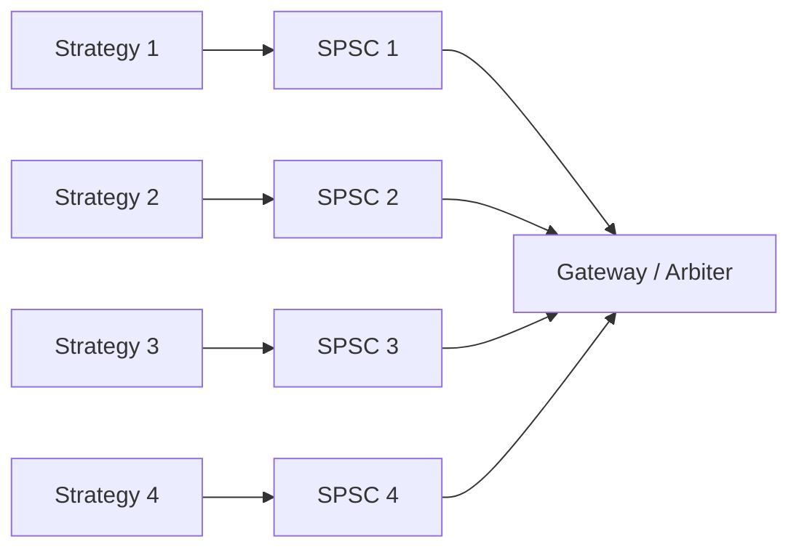

# 队列拓扑：SPSC、MPSC 与 MPMC 怎么选

> **面试优先级：P0/P1。** P0 是先数清生产者和消费者、说明有界队列的背压；P1 是解释竞争、分片和每槽位序号。除非岗位要求手写无锁容器，不必背一整段 MPMC `unsafe` 实现。

队列用来把数据从一个执行单元交给另一个执行单元。这里最重要的不是名字，而是**谁可以写、谁可以读、队列满时怎么办**。

生产者（producer）把元素放入队列，消费者（consumer）取出元素：

| 缩写 | 完整名称 | 写者 / 读者 | 常见场景 |
| --- | --- | --- | --- |
| SPSC | Single Producer, Single Consumer | 1 / 1 | 行情线程 → 单个策略线程 |
| MPSC | Multiple Producer, Single Consumer | 多 / 1 | 多个工作线程 → 日志线程 |
| SPMC | Single Producer, Multiple Consumer | 1 / 多 | 一个分发源 → 工作线程池 |
| MPMC | Multiple Producer, Multiple Consumer | 多 / 多 | 通用任务池 |

约束越强，实现通常越简单、越容易证明，也越容易获得稳定性能。不要因为 MPMC “功能最多”就默认选它。

## 1. 为什么先画通信拓扑

假设四个策略都把订单写入同一个 MPSC 队列。它们必须协调“谁获得下一个槽位”，共享游标所在的缓存行会在核心间迁移，CAS（compare-and-swap，比较并交换）也可能失败重试。

另一种结构是每个策略各有一条 SPSC 队列，网关按固定规则轮询四条队列：



这样减少了多写者争用，但消费者要做仲裁，并定义公平性和优先级。结构选择改变的是争用位置，不是凭空消灭工作。

## 2. 有界和无界解决不同问题

### 2.1 有界数组队列

创建时固定容量，元素槽位通常连续：

- 稳态可以不分配；
- 内存预算明确，局部性较好；
- 满时立即暴露过载，迫使上层定义策略；
- 容量估错时会更早出现 `Full`。

### 2.2 逻辑无界队列

常通过链表或分段数组继续增长：

- 能吸收更长突发；
- 可能产生分配、回收和指针追踪成本；
- 最终仍受内存限制；
- 消费跟不上时，排队延迟可能无限增长。

无界队列没有消灭背压，只是把“队列满”改成“内存增长、数据变旧，最后 OOM（out of memory，内存耗尽）”。核心交易路径通常更偏向有界结构，因为故障边界可见。

## 3. 容量从哪里来

容量不应来自“取个好看的 65536”。先估计：

```text
最低容量 ≥ 峰值到达率 × 最长消费者暂停时间 × 安全余量
```

若最坏突发为每秒 2,000,000 条，消费者可能因调度或批处理停顿 2 ms，安全余量取 2，则至少需要约 8,000 个槽位。还要检查单元素大小、总内存、缓存工作集以及恢复时间。

容量越大，短突发越不容易溢出，但最坏排队时间也可能越长。队列需要同时监控水位、入队失败、元素年龄和消费速率。

## 4. 队列满了才是业务问题

`try_push` 返回 `Full` 只说明没有空槽，不告诉应用该怎样处理：

| 数据 | 可考虑的策略 | 不能接受的行为 |
| --- | --- | --- |
| 订单请求 | 明确拒绝、有限重试、熔断并报警 | 静默丢弃后假装已发送 |
| 行情增量 | 标记状态失效并触发恢复（recovery）/快照（snapshot） | 丢一条后继续信任订单簿 |
| 指标 | 合并、采样或丢低优先级指标 | 阻塞关键交易线程很久 |
| 审计日志 | 进入降级或同步路径，触发严重告警 | 无痕丢失 |

这就是**背压**（backpressure）：下游变慢的信息必须沿系统向上游传播，促使上游减速、拒绝或降级。

## 5. SPSC 为什么通常更简单

SPSC 中，生产者是写入游标的唯一写者，消费者是读取游标的唯一写者，因此不需要多个线程用 CAS 争抢同一个新序号。

但仍需要两条方向相反的原子同步链来交接槽位：

```text
生产者写完元素
  → Release 发布写入进度
  → 消费者用 Acquire 观察进度
  → 消费者读取或移出元素
  → 消费者用 Release 发布读取进度
  → 生产者用 Acquire 观察进度
  → 生产者才可安全复用该槽位
```

“不需要 CAS”不等于“可以全部用普通整数”，也不等于“没有缓存一致性通信”。完整 SPSC 所有权和 `unsafe` 证明见 [Ring Buffer](./ring_buffer.md)。

## 6. MPSC/MPMC 为什么更难

多生产者至少要解决两件事：

1. **预留**：多个线程怎样唯一取得不同槽位；
2. **发布**：某生产者取得较早槽位后被暂停，后面的生产者完成了，消费者是否可以越过这个“洞”。

常见有界 MPMC 算法会为每个槽位保存一个 **sequence/stamp**：它同时表示槽位属于哪一轮，以及当前可由生产者还是消费者使用。生产者和消费者用 CAS 预留全局位置，再以 Release/Acquire 交接槽位。

这比只用一个 `head` 和一个 `tail` 复杂得多，还要证明：

- 整数回绕不会把新旧代次混淆；
- 一个线程预留后暂停不会破坏安全性；
- `T` 的初始化、移动和析构恰好一次；
- 进展保证究竟是 lock-free、blocking，还是只提供 `try_*`。

这正是面试中应优先说“使用经过审计的库并验证语义”，而不是现场自信地写一百行 `unsafe` 的原因。

## 7. 性能不是只看每秒操作数

比较队列时必须固定：线程数、生产/消费比例、核心与 NUMA 位置、元素大小、批量大小和等待策略。至少报告：

- P50、P99、P99.9 入队到出队延迟；
- 吞吐量与 CPU 核时；
- CAS 失败或重试；
- 队列水位与 `Full` 次数；
- 消费者暂停时的恢复曲线。

单线程里连续 push/pop 的基准测不到跨核缓存行迁移；只报告平均吞吐也会掩盖生产者暂停造成的尾延迟。

## 8. 工程选型顺序

1. 先确认是否可以不跨线程，或按 key 分片后各自独占状态；
2. 能用 SPSC 就先用 SPSC；
3. 多生产者是否可以改成多条 SPSC 加仲裁；
4. 确实需要共享 MPSC/MPMC 时，选择成熟库并核对有界性、顺序、阻塞和析构语义；
5. 用真实拓扑测量，最后才考虑 padding、退避和批量预留。

Rust 常见选择包括 `std::sync::mpsc`、Tokio channels 和 Crossbeam 的队列/通道。它们的 bounded、blocking、async、断开和公平性语义不同，不能只按 crate 名字互换。

## 9. 一分钟面试回答

> 我会先数生产者和消费者：SPSC 只有一个写者和一个读者，不需要 CAS 抢游标，通常最容易获得稳定延迟；MPSC/MPMC 要协调槽位预留和发布，会增加 CAS 竞争与缓存行迁移。核心路径优先用有界数组队列，容量按峰值速率乘最长消费暂停估算，并监控水位和元素年龄。队列满不是单纯调大容量，而要按数据类型定义拒绝、恢复、合并或降级。如果能把一个共享 MPSC 拆成每生产者一条 SPSC，也会评估仲裁公平性和总 CPU 成本。

## 10. 高频追问

### lock-free 是否表示不会等待？

不是。lock-free 只描述系统整体能持续取得进展，不保证某个线程在固定步数内成功。上层遇到队列满时还可能自旋，或 park（让线程挂起等待唤醒）。

### FIFO 是否保证多个生产者的“真实先后”？

通常只保证成功线性化后的队列顺序。**线性化**是把一次并发操作看作在某个瞬间对外生效；两个核心几乎同时调用时，并不存在无需额外时钟就能观察的绝对现实顺序。业务若需要优先级或时间排序，应显式建模。

### 为什么不用无界队列避免丢数据？

无界只是逻辑概念。下游长期变慢时，内存和排队延迟持续增长，最后可能以更难恢复的方式失败。

进一步阅读：[Ring Buffer](./ring_buffer.md)、[原子操作](./atomics.md)、[吞吐量与背压](./throughput.md)。
