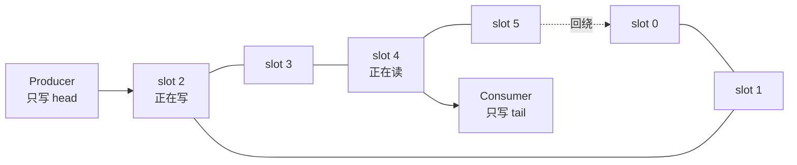

# Ring Buffer 实现 (Ring Buffer)

Ring Buffer（环形缓冲区）是低延迟系统最常用的数据结构之一。它的价值不只是“首尾相接”，而是把三个目标放在一起：**启动时预分配、运行时复用固定槽位、用清晰的所有权协议完成跨线程传递**。

本章先建立直觉，再实现一个真正由类型系统约束“单生产者、单消费者”的 SPSC 队列。代码中的 `unsafe` 不是为了炫技，而是为了把必须证明的安全不变量集中在一个很小的边界里。

## 1. 为什么 Ring Buffer 适合 HFT



### 1.1 三个直接收益

1. **固定容量**：缓冲区在启动时一次性分配，热路径不再扩容；
2. **缓存友好**：槽位连续，顺序访问更容易命中缓存和硬件预取；
3. **天然背压信号**：满时必须明确选择拒绝、丢弃、降级或等待，不会悄悄把延迟变成无限内存。

“零分配”指的是稳态 push/pop 不分配，并不代表创建 Ring Buffer 时没有分配，也不代表放进槽位的 `T` 自身不会分配。例如，移动一个已经分配好的 `String` 不会复制其堆缓冲区，但构造这个 `String` 仍可能分配。

### 1.2 为什么容量常取 2 的幂

序号 `sequence` 对应的槽位是 `sequence % capacity`。当 `capacity` 是 2 的幂时，可写成：

```rust
let sequence = 13_usize;
let capacity = 8_usize;
assert!(capacity.is_power_of_two());
let index = sequence & (capacity - 1);
assert_eq!(index, 5);
```

这省去了通用除法，也让回绕计算简单。但别把“位运算一定快很多”当成无条件结论：容量若是编译期常量，编译器也可能把 `%` 优化掉。这里选择 2 的幂，更重要的是让算法不变量和生成代码都可预测。

## 2. 先写出安全不变量

SPSC 的快来自限制，而不是某条神奇指令：

- 只有生产者写 `head`，只有消费者读 `head`；
- 只有消费者写 `tail`，只有生产者读 `tail`；
- 当 `head - tail < capacity` 时，`head` 指向的槽位归生产者；
- 当 `tail != head` 时，`tail` 指向的槽位归消费者；
- 生产者写完槽位后，才用 Release 发布 `head`；
- 消费者 Acquire 读到新 `head` 后，才读取槽位；
- 消费者取走值后，才用 Release 发布 `tail`，允许生产者复用槽位。

当前常见的错误写法是给共享队列提供 `try_push(&self)`，然后在注释里说“调用者只能有一个生产者”。这不是安全抽象：两个线程完全可以同时调用，最终对同一 `UnsafeCell` 并发写，产生未定义行为。安全 API 必须让错误用法无法通过普通 Rust 构造出来。

## 3. 用双句柄编码 SPSC 约束

下面先把同一个实现拆成 3.1–3.6 六段讲解。后五段依赖 3.1 中的类型与导入，不能作为独立 crate 编译，因此围栏标为 `rust,ignore`；3.7 会给出拼接后的**完整可编译版本**，由 `mdbook test` 实际校验。工业使用还应补充 Miri、Loom、析构计数和双线程压力测试。

<details>
<summary>进阶：完整类型设计、unsafe 安全证明与可编译实现</summary>

### 3.1 内部存储与缓存行隔离

```rust
use std::cell::UnsafeCell;
use std::mem::MaybeUninit;
use std::sync::Arc;
use std::sync::atomic::{AtomicUsize, Ordering};

// 128 是保守的隔离粒度；目标机器的真实 cache line 应通过测量确认。
// 包装类型的 size 会按 alignment 向上取整，所以两个游标不会共享这 128 字节。
#[repr(align(128))]
struct CachePadded<T>(T);

struct Inner<T> {
    buffer: Box<[UnsafeCell<MaybeUninit<T>>]>,
    capacity: usize,
    mask: usize,

    // producer 写、consumer 读
    head: CachePadded<AtomicUsize>,
    // consumer 写、producer 读
    tail: CachePadded<AtomicUsize>,
}

pub struct Producer<T> {
    inner: Arc<Inner<T>>,
    // 生产者私有缓存：只有“看起来满”时才刷新共享 tail。
    cached_tail: usize,
}

pub struct Consumer<T> {
    inner: Arc<Inner<T>>,
    // 消费者私有缓存：只有“看起来空”时才刷新共享 head。
    cached_head: usize,
}
```

为什么不能只在字段之间塞一个零大小的 `CacheLinePad`？因为 padding 是否把**目标字段本身**完整包在独立缓存行里并不直观，结构体布局也不应靠肉眼猜。把原子变量放进带对齐的包装类型，意图更明确；工业代码也可使用经过验证的 `CachePadded` 实现。

### 3.2 唯一一处 `unsafe impl Sync`

```rust,ignore
// SAFETY:
// 1. buffer 不会扩容，slot 地址创建后保持稳定；
// 2. Producer/Consumer 各只有一个，且方法需要 &mut self；
// 3. head/tail 协议保证同一 slot 不会被双方同时访问；
// 4. Release/Acquire 在 slot 交接时建立 happens-before；
// 5. T: Send，因为 T 的所有权会从生产者线程转移到消费者线程。
unsafe impl<T: Send> Sync for Inner<T> {}
```

`UnsafeCell` 默认是 `!Sync`，所以编译器要求我们明确作出承诺。只说“因为用了原子变量所以安全”并不成立；真正关键的是上面五条组合起来，覆盖了**地址稳定、角色唯一、槽位所有权、内存可见性、元素跨线程移动**。

### 3.3 构造两个不可克隆的角色

```rust,ignore
pub fn spsc_channel<T: Send>(capacity: usize) -> (Producer<T>, Consumer<T>) {
    assert!(capacity > 0, "capacity must be positive");
    assert!(capacity.is_power_of_two(), "capacity must be a power of two");
    // 序号使用 wrapping 算术；容量小于半个地址空间可避免新旧距离歧义。
    assert!(capacity <= usize::MAX / 2, "capacity is too large");

    let buffer = (0..capacity)
        .map(|_| UnsafeCell::new(MaybeUninit::uninit()))
        .collect::<Vec<_>>()
        .into_boxed_slice();

    let inner = Arc::new(Inner {
        buffer,
        capacity,
        mask: capacity - 1,
        head: CachePadded(AtomicUsize::new(0)),
        tail: CachePadded(AtomicUsize::new(0)),
    });

    let producer = Producer {
        inner: Arc::clone(&inner),
        cached_tail: 0,
    };
    let consumer = Consumer {
        inner,
        cached_head: 0,
    };
    (producer, consumer)
}
```

这里的 `Arc` 只在创建和销毁句柄时修改引用计数；每次 push/pop 不会 clone `Arc`，所以热路径没有引用计数开销。

### 3.4 生产者：写完后再发布

```rust,ignore
impl<T> Producer<T> {
    pub fn try_push(&mut self, value: T) -> Result<(), T> {
        // 只有生产者写 head，因此读取自己的进度只需 Relaxed。
        let head = self.inner.head.0.load(Ordering::Relaxed);

        if head.wrapping_sub(self.cached_tail) >= self.inner.capacity {
            // 看起来满了，再 Acquire 消费者发布的最新 tail。
            self.cached_tail = self.inner.tail.0.load(Ordering::Acquire);
            if head.wrapping_sub(self.cached_tail) >= self.inner.capacity {
                return Err(value);
            }
        }

        let index = head & self.inner.mask;
        // SAFETY: 根据容量检查，该 slot 已由消费者归还且现在只归本 Producer。
        unsafe {
            (*self.inner.buffer[index].get()).write(value);
        }

        // 发布顺序：slot 写入 happens-before 看见新 head 的消费者读取 slot。
        self.inner
            .head
            .0
            .store(head.wrapping_add(1), Ordering::Release);
        Ok(())
    }
}
```

本地 `cached_tail` 允许它“偏旧”。旧值最多让生产者误以为队列可能已满，于是刷新一次；绝不能让它误以为一个尚未消费的槽位可写。因此这是安全的保守缓存。

### 3.5 消费者：看见发布后再读取

```rust,ignore
impl<T> Consumer<T> {
    pub fn try_pop(&mut self) -> Option<T> {
        // 只有消费者写 tail，因此读取自己的进度只需 Relaxed。
        let tail = self.inner.tail.0.load(Ordering::Relaxed);

        if self.cached_head.wrapping_sub(tail) == 0 {
            // 看起来空了，再 Acquire 生产者发布的最新 head。
            self.cached_head = self.inner.head.0.load(Ordering::Acquire);
            if self.cached_head.wrapping_sub(tail) == 0 {
                return None;
            }
        }

        let index = tail & self.inner.mask;
        // SAFETY: Acquire 已观察到该 slot 的发布；该 slot 现在只归本 Consumer。
        let value = unsafe {
            (*self.inner.buffer[index].get()).assume_init_read()
        };

        // 读走 T 之后才归还 slot，生产者随后才可以覆盖它。
        self.inner
            .tail
            .0
            .store(tail.wrapping_add(1), Ordering::Release);
        Some(value)
    }
}
```

`assume_init_read` 会把 `T` 移出槽位。此后该槽位逻辑上未初始化，直到生产者再次写入。对 `String` 等带 `Drop` 的类型也成立，并不要求 `T: Copy`。

### 3.6 队列销毁时释放尚未消费的元素

Ring Buffer 被销毁时，队列中可能仍有元素。若不处理，`String`、`Vec` 等资源会泄漏。

```rust,ignore
impl<T> Drop for Inner<T> {
    fn drop(&mut self) {
        // 能进入 Inner::drop，说明两个 Arc 句柄都已销毁，不再有并发访问。
        let mut tail = *self.tail.0.get_mut();
        let head = *self.head.0.get_mut();

        while tail != head {
            let index = tail & self.mask;
            // SAFETY: [tail, head) 正是仍处于已初始化状态的槽位。
            unsafe {
                self.buffer[index].get_mut().assume_init_drop();
            }
            tail = tail.wrapping_add(1);
        }
    }
}
```

这段 Drop 逻辑也是安全证明的一部分。一个容器不仅要在“正常 pop”时正确，还要在任意一端提前退出时正确释放剩余元素。

### 3.7 可编译的完整版本

下面把前六段原样组装，并加入最小行为断言。`mdbook test` 能证明它在当前工具链下通过编译并跑通单线程边界示例；这**不能替代并发安全证明**，跨线程交错仍应使用 Loom/Miri 和目标硬件压力测试。

```rust
use std::cell::UnsafeCell;
use std::mem::MaybeUninit;
use std::sync::Arc;
use std::sync::atomic::{AtomicUsize, Ordering};

#[repr(align(128))]
struct CachePadded<T>(T);

struct Inner<T> {
    buffer: Box<[UnsafeCell<MaybeUninit<T>>]>,
    capacity: usize,
    mask: usize,
    head: CachePadded<AtomicUsize>,
    tail: CachePadded<AtomicUsize>,
}

struct Producer<T> {
    inner: Arc<Inner<T>>,
    cached_tail: usize,
}

struct Consumer<T> {
    inner: Arc<Inner<T>>,
    cached_head: usize,
}

// SAFETY: 两个不可克隆句柄保证角色唯一；游标协议保证槽位独占，
// Release/Acquire 负责跨线程发布；T: Send 允许元素转移到另一线程。
unsafe impl<T: Send> Sync for Inner<T> {}

fn spsc_channel<T: Send>(capacity: usize) -> (Producer<T>, Consumer<T>) {
    assert!(capacity > 0, "capacity must be positive");
    assert!(capacity.is_power_of_two(), "capacity must be a power of two");
    assert!(capacity <= usize::MAX / 2, "capacity is too large");

    let buffer = (0..capacity)
        .map(|_| UnsafeCell::new(MaybeUninit::uninit()))
        .collect::<Vec<_>>()
        .into_boxed_slice();
    let inner = Arc::new(Inner {
        buffer,
        capacity,
        mask: capacity - 1,
        head: CachePadded(AtomicUsize::new(0)),
        tail: CachePadded(AtomicUsize::new(0)),
    });

    (
        Producer { inner: Arc::clone(&inner), cached_tail: 0 },
        Consumer { inner, cached_head: 0 },
    )
}

impl<T> Producer<T> {
    fn try_push(&mut self, value: T) -> Result<(), T> {
        let head = self.inner.head.0.load(Ordering::Relaxed);
        if head.wrapping_sub(self.cached_tail) >= self.inner.capacity {
            self.cached_tail = self.inner.tail.0.load(Ordering::Acquire);
            if head.wrapping_sub(self.cached_tail) >= self.inner.capacity {
                return Err(value);
            }
        }

        let index = head & self.inner.mask;
        // SAFETY: 容量检查证明该槽位已由消费者归还，且只有本 Producer 写。
        unsafe { (*self.inner.buffer[index].get()).write(value) };
        self.inner.head.0.store(head.wrapping_add(1), Ordering::Release);
        Ok(())
    }
}

impl<T> Consumer<T> {
    fn try_pop(&mut self) -> Option<T> {
        let tail = self.inner.tail.0.load(Ordering::Relaxed);
        if self.cached_head.wrapping_sub(tail) == 0 {
            self.cached_head = self.inner.head.0.load(Ordering::Acquire);
            if self.cached_head.wrapping_sub(tail) == 0 {
                return None;
            }
        }

        let index = tail & self.inner.mask;
        // SAFETY: Acquire 已观察到发布，且只有本 Consumer 读取该槽位。
        let value = unsafe { (*self.inner.buffer[index].get()).assume_init_read() };
        self.inner.tail.0.store(tail.wrapping_add(1), Ordering::Release);
        Some(value)
    }
}

impl<T> Drop for Inner<T> {
    fn drop(&mut self) {
        let mut tail = *self.tail.0.get_mut();
        let head = *self.head.0.get_mut();
        while tail != head {
            let index = tail & self.mask;
            // SAFETY: [tail, head) 是仍包含有效 T 的槽位。
            unsafe { self.buffer[index].get_mut().assume_init_drop() };
            tail = tail.wrapping_add(1);
        }
    }
}

let (mut producer, mut consumer) = spsc_channel(2);
assert_eq!(consumer.try_pop(), None);
assert_eq!(producer.try_push(String::from("A")), Ok(()));
assert_eq!(producer.try_push(String::from("B")), Ok(()));
assert_eq!(producer.try_push(String::from("full")), Err(String::from("full")));
assert_eq!(consumer.try_pop().as_deref(), Some("A"));
assert_eq!(consumer.try_pop().as_deref(), Some("B"));
assert_eq!(consumer.try_pop(), None);
```

</details>

## 4. 从代码到 happens-before

生产者与消费者有两条对称的同步链：

```text
生产者写 slot
   happens-before
生产者 Release-store head
   synchronizes-with（消费者读到该值）
消费者 Acquire-load head
   happens-before
消费者读 slot
```

以及：

```text
消费者移出 slot 中的 T
   happens-before
消费者 Release-store tail
   synchronizes-with（生产者读到该值）
生产者 Acquire-load tail
   happens-before
生产者复用 slot
```

如果把两边都换成 `Relaxed`，缺少的不是“也许慢一点”，而是普通槽位内存的跨线程同步证明。反过来，把所有操作都换成 `SeqCst` 也不能修复“有两个 Producer”这种所有权错误。

## 5. 性能优化应按这个顺序

1. **先决定通信拓扑**：能用一组 SPSC，就不要急着让所有线程争一个 MPSC；
2. **隔离热游标**：确认 head/tail 没有伪共享，并测目标 CPU；
3. **缓存远端游标**：只在可能满/空时读取对方缓存行；
4. **批量发布**：减少共享游标更新次数，但会增加单条消息等待时间；
5. **调节等待策略**：忙轮询、退避、park 必须结合延迟预算和 CPU 预算；
6. **最后才看指令细节**：在目标硬件测 P50/P99/P999，而不是引用别人的单一吞吐数字。

批处理有一个容易忽略的正确性问题：如果 handler 处理中途 panic，哪些元素已经被移出、tail 应发布到哪里？工业实现需要 guard 记录已消费进度，不能只把 `tail.store` 随手挪到循环末尾。

## 6. 满队列不是异常，而是架构决策

固定容量必然会满。`try_push` 返回 `Err(value)` 是把决定交还给调用者：

| 数据类型 | 常见策略 | 风险 |
| :--- | :--- | :--- |
| 订单请求 | 拒绝并报警，绝不能静默丢弃 | 上游必须处理失败 |
| 行情增量 | 丢弃后触发 snapshot/recovery | 恢复逻辑必须可靠 |
| 指标 | 可合并、采样或丢弃 | 监控会有误差 |
| 审计日志 | 切换同步落盘或进入降级模式 | 关键线程尾延迟上升 |

队列设计必须明确“满了怎么办”。无界队列只是把“满”推迟成内存耗尽（Out of Memory，OOM）或不可控排队，并没有消灭背压。

## 7. 常见陷阱

1. **把 SPSC 当 MPSC 用**：这是内存安全问题，不只是性能下降；
2. **只 padding，不验证布局**：使用包装类型，并用 `size_of`、地址或性能计数器在目标构建上验证；
3. **忽略 Drop**：`MaybeUninit<T>` 不会自动 drop 内部的 `T`；
4. **把空/满与序号回绕混为一谈**：使用单调 wrapping 序号和受限容量，不要只保存取模后的下标；
5. **基准中没有生产者/消费者并发**：单线程 push/pop 测不到缓存行迁移；
6. **只报平均吞吐量**：队列优化要同时报告分位延迟、CPU 占用、满队列次数和测试拓扑。

## 8. 面试快问快答

### Q1：SPSC 为什么不需要 CAS？

因为 head 与 tail 各自只有一个写者，不存在多个线程抢同一个新值；原子 load/store 用于发布和观察进度。CAS 解决的是多写者竞争，不能替代槽位可见性的同步证明。

### Q2：为什么 slot 用 `UnsafeCell<MaybeUninit<T>>`？

`UnsafeCell` 是 Rust 允许通过共享容器进行内部修改的底层出口；`MaybeUninit` 表达槽位有时没有合法的 `T`。两者都不会自动保证安全，安全来自角色唯一和游标协议。

### Q3：为什么 head/tail 要分缓存行？

生产者频繁写 head、消费者频繁写 tail。若它们同处一条缓存行，即使访问不同字段，整条缓存行仍会在两个核心间反复取得独占权，形成伪共享。

### Q4：无锁是否等于无等待？

不等于。`try_push` 本身立即返回，但上层可能选择自旋等待空间；消费者若暂停，生产者仍会持续遇到满。进展保证、排队策略与线程调度要分别讨论。

## 9. 本章小结

- Ring Buffer 的核心是固定槽位的所有权交接，不只是取模；
- SPSC 限制应由不可克隆的 Producer/Consumer 句柄编码，而不是写在注释里；
- Release/Acquire 负责发布槽位，角色唯一负责避免并发访问；
- Drop、回绕、背压与尾延迟都是完整实现的一部分。

## 10. 做题方法：逐槽验算一个完整代次

选定逻辑序号 k 对应的槽位 `k mod capacity`，只追踪它的一轮生命周期：

```text
Empty(k) → producer 独占写 → Full(k) → consumer 独占读/移出 → Empty(k+capacity)
```

1. 检查 head 只有生产者写、tail 只有消费者写；若句柄可克隆或 API 允许第二个写者，SPSC 前提已经失败。
2. 队列非满才能从 Empty 进入写入，元素完全初始化后才能 Release 发布 head；消费者 Acquire 观察到该 head 后才可读取。
3. 消费者移出元素后 Release 发布 tail，生产者 Acquire 观察到该 tail 后才可复用槽位。两条方向相反的同步链都不能少。
4. 分别推演空队列、满队列、游标接近整数回绕、生产者写一半暂停、消费者取出后 panic。每条路径都要满足一个 `T` 最多初始化一次、最多移出或析构一次。
5. 计算容量和索引时同时保留单调逻辑序号与取模下标；若只剩下标，就无法区分同一槽位的不同代次。

最后用 Drop 计数器验算：成功 pop 的元素由调用者负责析构，仍留在队列中的元素由队列析构，未初始化槽位绝不能当作 `T` drop。

进一步阅读：[Rust 原子操作与内存顺序](atomics.md)、[SPSC/MPSC 队列](queues.md)、[rigtorp/SPSCQueue](https://github.com/rigtorp/SPSCQueue)。

---
下一章：[SPSC/MPSC 队列 (Queues)](queues.md)
