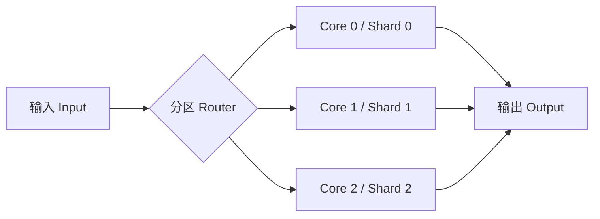

# 可扩展性设计：分片、Share-Nothing 与核间通信

可扩展性（Scalability）在高性能语境下常被简化为“加机器就行”。但对很多以 Rust 编写的系统软件而言，更直接、也更常见的挑战是**单机扩展**：在一台多核机器上，如何让吞吐量随着核心数增长，同时不让尾延迟和资源开销失控。

这一章讨论的可扩展性主要限定在单机与多核范围内：share-nothing 架构、分片与分区策略、核间通信模型，以及 NUMA 等硬件因素如何改变“理论上的线性扩展”。

## 1. 先定义问题：扩展的是吞吐量还是并发度

扩展能力往往体现在两个指标上：

- 给定延迟预算下的最大吞吐量，核心数增加时是否上升
- 给定吞吐量目标下的资源占用是否合理，核心数增加时是否恶化

在系统负载较低时，扩展性问题往往不明显；真正的困难出现在持续负载和共享状态较多的场景。此时，性能瓶颈通常不是计算本身，而是同步与共享：锁竞争、原子一致性、缓存线抖动、跨核数据迁移。

## 2. Share-Nothing：从“共享状态”转向“消息传递”

Share-nothing 的核心思想是尽量减少跨线程共享状态，把并发问题从“共享内存一致性”转化为“消息路由与数据归属”。在工程上，它通常采取以下形式：

- 每个核心维护自己的局部状态（local state）
- 输入数据按 key 分区（partition by key）
- 跨分区交互通过显式消息完成

这个模型的主要好处是减少多个核心反复写同一状态。每个核心持续访问自己的一段状态，通常更利于缓存局部性并降低伪共享风险；路由器、队列和共享硬件资源仍会产生协调成本。

其代价是：你必须更认真地处理数据分区策略、负载倾斜（skew）和跨分区操作。

## 3. 分片与分区策略

分片（Sharding）与分区（Partitioning）在很多资料中被混用。在本书里，可以用一个实用区分：

- 分片强调“状态如何被切分并归属到某个处理单元”
- 分区强调“输入如何被路由到对应的分片”

常见分区策略包括：

- Hash 分区：`shard = hash(key) % N`，实现简单，平均意义上较均匀；`N` 改变时大量 key 可能迁移
- 范围分区：按 key 范围切分，利于范围查询，但容易产生热点区间
- 业务分区：按业务属性切分，便于隔离，但需要更强领域假设

在高性能系统中，分区策略不只是正确性问题，也会显著影响延迟与吞吐量。一个典型风险是热点 key：即使只有极少数 key 极热，也足以让某个 shard 饱和，最终把系统整体吞吐量上限拉低到最慢 shard 的水平。

## 4. 核间通信：从“共享变量”到“队列”

在 share-nothing 体系下，跨核通信几乎必然通过队列完成。对低延迟系统而言，SPSC 队列通常最容易做到高性能与可预测；对更复杂的拓扑，则可能需要 MPSC 或更一般的结构。

核间通信要关注的不是“队列能否工作”，而是它的成本结构：

- 生产者写入时触发的缓存一致性成本
- 消费者读取时的内存序与可见性成本
- 队列满时背压如何传播

这也是为什么本部分先讨论原子操作与无锁结构，再讨论 Ring Buffer 与队列：它们并不是孤立的数据结构题，而是多核扩展的基础语言。

## 5. NUMA：非一致内存访问带来的扩展边界

当机器进入多 socket 或多 NUMA 节点配置后，内存访问不再等价。远端内存会经过处理器互连，延迟和可用带宽通常不同于本地节点，具体差距必须在目标机器测量。扩展性问题会在此时变得更“物理”：

- 线程被调度到远端 socket，会导致访问状态的代价增加
- 共享状态跨 NUMA 节点，会导致一致性协议与互连链路压力上升
- 队列跨节点传递数据，会导致更严重的缓存线迁移

因此，多核扩展往往需要配合：

- 线程绑核与隔离策略
- NUMA 感知的内存分配与分片归属
- 尽量减少跨节点共享写入

## 6. 可扩展性与延迟、资源效率的冲突

扩展性设计经常引入新的权衡：

- 更多分片意味着更多元数据、更复杂路由逻辑与更高内存占用
- 更严格的隔离有利于尾延迟，却可能降低资源利用率
- 通过消息传递避免锁竞争，会增加排队与复制风险，需要与零拷贝策略协同

在高性能系统中，正确做法通常不是追求某一指标的极致，而是把目标写成“在给定延迟预算与资源预算下达到最大吞吐量”，并用基准测试与 profiling 持续验证。

## 7. 小结

单机扩展不是简单地“多开线程”，而是把共享状态拆解成可归属的分片，把并发协调从共享内存同步转化为显式消息传递，并在 NUMA 现实约束下维持可预测行为。完成这些设计后，吞吐量才能更接近线性扩展，而尾延迟与资源占用也更容易被控制在可分析范围内。
