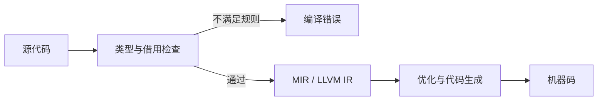

# 为什么选择 Rust 构建低延迟系统

Rust 不是“自动比 C++ 快”的语言，也不是写了 `unsafe` 就会更快的语言。它真正有吸引力的地方是：在保留底层控制力的同时，把许多内存和并发错误提前到编译期发现。对需要长期维护的低延迟系统，这种组合很有价值。

> **本章目标**
>
> 学完后，你应能解释 Rust 的优势、限制和适用边界；能区分语言特性与真实性能证据；也能回答“为什么不用 C++/Java”而不贬低其他技术栈。

## 先建立正确的判断框架

选择语言不是做速度排行榜，而是在多种成本之间取舍：

| 维度 | 需要问的问题 |
|---|---|
| 延迟 | P50、P99、P99.9 和最大值是否满足预算？抖动来自哪里？ |
| 控制力 | 能否控制布局、分配、系统调用、线程和 SIMD？ |
| 正确性 | 内存越界、悬垂引用、数据竞争怎样被发现？ |
| 生态 | 协议库、驱动、监控、调试和招聘是否成熟？ |
| 迁移成本 | 能否与现有 C/C++、Java 或硬件 SDK 协作？ |
| 运维成本 | 故障是否容易定位？升级和应急处理是否可控？ |

一个团队继续使用成熟 C++ 平台完全可能是正确决定；另一个团队用 Java 的堆外内存和精心调优的 GC 也可能满足预算。Rust 的价值应由目标负载和团队约束证明，而不是由口号证明。

## 1. 延迟关注的是分布，不只是平均值

假设某段处理执行了 10,000 次：9,999 次耗时 5 微秒，1 次耗时 5 毫秒。平均值看起来仍不算离谱，但那一次长暂停可能恰好发生在开盘或行情突发时。

```text
平均值（mean）  ── 描述总体成本，但会隐藏少量长暂停
P50             ── 一半请求不超过它，代表“常态”
P99             ── 100 次约有 1 次更慢
P99.9           ── 1,000 次约有 1 次更慢
max             ── 容易受样本和噪声影响，但能暴露灾难性停顿
```

低延迟系统通常同时关注吞吐、分位数、队列深度、丢包和正确性。只优化平均值，可能把工作推迟到队列里，使尾延迟更差。

### GC 语言为什么需要额外关注抖动

垃圾回收器可能引入暂停、并发标记线程和读写屏障，但现代 GC 的行为差异很大，不能简单概括成“有 GC 就不能做低延迟”。工程上真正要问的是：

- 热路径是否持续创建短命对象？
- 堆大小、分配速率和暂停目标如何配置？
- 后台 GC 线程是否与关键线程争抢核心或内存带宽？
- 能否用对象池、值类型或堆外缓冲区减少压力？
- 目标是数毫秒、数十微秒，还是更严格的预算？

Rust 没有追踪式 GC，因此不会出现 GC 周期本身带来的暂停；但它仍可能因分配器锁竞争、页错误、析构工作、内核调度或错误的 `Drop` 实现产生抖动。**没有 GC 不等于没有尾延迟。**

## 2. 所有权把一部分运行期风险前移到编译期

Rust 通过所有权、借用和生命周期约束引用的使用方式。借用检查主要发生在编译期，不需要在每次普通引用访问时维护一张运行时追踪表。



当拥有资源的值到达其析构点时，Rust 会运行 `Drop`。析构时机通常容易推理，但需要注意三点：

1. `Drop` 本身可以执行昂贵操作，不应把阻塞 I/O 藏在热路径对象的析构中。
2. `Rc`、`Arc`、锁和堆分配是显式选择，它们各自仍有运行期开销。
3. 编译器可以在不改变可观察语义的前提下优化代码，所以不要把源代码行号当成精确机器指令时序。

### Safe Rust 能保证到什么程度

在语言和所依赖库都满足安全契约的前提下，Safe Rust 会阻止数据竞争、悬垂引用和许多越界访问。`Send` 表示值可以安全转移到另一个线程，`Sync` 表示 `&T` 可以安全在线程间共享。

它并不保证：

- 没有业务竞态，例如“先检查限额、后更新持仓”被其他事件插入；
- 没有死锁、活锁或饥饿；
- `unsafe`、FFI 或有缺陷的底层库一定正确；
- 算法一定快，缓存局部性一定好。

这正是一个常见面试区分：**data race（语言层面的未同步冲突访问）** 与 **race condition（结果依赖时序的逻辑竞态）** 不是同一件事。

## 3. 布局控制与缓存局部性

现代 CPU 以缓存行为单位搬运数据。若热路径只需要价格和数量，却把几十个冷字段一起拉入缓存，处理器会浪费带宽。Rust 允许使用结构体、数组、枚举与 `#[repr(...)]` 控制或表达布局，但必须理解保证边界。

```rust
// 默认 Rust 表示：字段不重叠并满足对齐，但字段顺序和整体布局不稳定。
struct OrderState {
    order_id: u64,
    price_ticks: i64,
    quantity: u32,
    side: Side,
}

#[repr(u8)]
enum Side {
    Buy = 0,
    Sell = 1,
}

// repr(C) 固定为 C 兼容的字段顺序和填充规则，常用于 FFI。
#[repr(C)]
struct COrderState {
    order_id: u64,
    price_ticks: i64,
    quantity: u32,
    side: Side,
}
```

默认 Rust 布局可能发生字段重排，且不同编译版本可以改变，不能把它当作稳定磁盘或网络格式。`#[repr(C)]` 主要解决 ABI/布局兼容，也 **不等于可以直接发送到网络**：填充字节、字节序、协议版本和无效枚举值仍需单独处理。Rust Reference 的 [Type layout](https://doc.rust-lang.org/stable/reference/type-layout.html) 给出了准确保证。

### 伪共享

若核心 A 和核心 B 频繁写入同一缓存行里的两个不同计数器，缓存一致性协议仍会让整行在核心之间来回转移，这叫伪共享。

```rust
use std::sync::atomic::AtomicU64;

// 教学示例：64 字节是许多 x86_64 处理器的常见缓存行大小，
// 但生产代码应确认目标硬件，并测量对齐增加的内存代价。
#[repr(align(64))]
struct CachePaddedCounter(AtomicU64);
```

对齐会增大对象和数组步长，不应给所有类型机械地加 `align(64)`。只有多个核心频繁写相邻状态，并且性能计数器或基准显示缓存一致性流量显著时，才值得采用。

## 4. 零拷贝：少复制，但不牺牲生命周期

行情解析常希望直接借用接收缓冲区，而不是为每条消息创建 `String` 或 `Vec`。生命周期可以表达“解析结果不能活得比原始字节更久”。

```rust
#[derive(Debug)]
struct TeachingMessage<'a> {
    symbol: &'a [u8],
    price_ticks: u64,
}

fn parse_teaching_message(data: &[u8]) -> Result<TeachingMessage<'_>, &'static str> {
    // 这是自定义教学格式，不代表真实 ITCH 报文。
    let symbol = data.get(0..8).ok_or("message too short")?;
    let mut price_bytes = [0_u8; 8];
    price_bytes.copy_from_slice(data.get(8..16).ok_or("message too short")?);

    Ok(TeachingMessage {
        symbol,
        price_ticks: u64::from_be_bytes(price_bytes),
    })
}
```

这个例子强调的是借用关系，不是推荐的错误类型。生产解析器还必须处理消息长度、类型、字节序、版本、字符编码和协议约束，并对任意输入保持内存安全。

零拷贝也不是“零成本”：借用可能让大缓冲区无法及时复用，分散字段可能增加不规则访问，跨线程传递缓冲区所有权也会改变架构。正确做法是同时测量复制成本和生命周期管理成本。

## 5. Rust 与 C++ 的性能应怎样比较

没有上下文的精确数字没有意义。本书不提供一组虚构的“Rust 1,245 微秒、C++ 1,250 微秒”来证明结论。公平实验至少应控制：

| 项目 | 控制方法 |
|---|---|
| 语义 | 两边完成相同校验、错误处理和输出 |
| 编译 | 记录编译器版本、优化级别、LTO、目标 CPU |
| 数据 | 使用相同消息和真实分布，区分冷启动与稳态 |
| 硬件 | 同一机器、核心、NUMA 节点和电源策略 |
| 测量 | 同时报 P50/P99/P99.9、吞吐与硬件计数器 |
| 正确性 | 对输出做逐事件或最终状态哈希比对 |

Rust 的独占可变引用能向优化器提供有用的别名信息，迭代器也常能优化为与手写循环相当的机器码；但这不是对任意程序的速度保证。泛型单态化可能增加代码体积，边界检查可能保留，抽象也可能引入分配或间接调用。最终答案始终来自生成的汇编、剖析结果和目标负载基准。

## 6. 热路径中的常见陷阱

### 边界检查：先帮助优化器，再考虑 `unsafe`

下面的安全写法通常比索引循环更容易消除重复边界检查，也更容易审查：

```rust
fn sum_prices(prices: &[f64]) -> f64 {
    prices.iter().copied().sum()
}
```

只有剖析和汇编确认边界检查仍是瓶颈、且安全不变量能被完整记录与测试时，才考虑局部 `get_unchecked`。把 `unsafe` 当作第一步，通常只是把可见成本换成隐藏风险。

### 分配与引用计数

- `Box` 会分配，但访问盒内值不一定慢；问题取决于频率与局部性。
- `Arc` 的克隆/释放会执行原子引用计数；只读访问本身不是每次都做原子操作。
- `String`/`Vec` 可通过预留容量和复用降低分配，但要防止意外增长。
- 格式化日志即使最终被过滤，也可能先构造参数或字符串；要检查日志宏行为。

### Panic 策略

`panic = "abort"` 可以减少展开相关支持，并让不可恢复错误直接终止进程，但它不是普适配置：

```toml
[profile.release]
panic = "abort"
lto = "thin"
codegen-units = 1
```

采用前必须确认进程边界、订单状态恢复、审计日志和看门狗策略。核心交易进程崩溃后“自动重启”并不代表可以安全继续报单；系统必须先恢复会话、核对未决订单和持仓。

## 面试现场

### Q1：Rust 没有 GC，所以延迟一定稳定吗？

**参考骨架**：不一定。Rust 避免了追踪式 GC 周期，但分配器、页错误、调度、中断、缓存未命中、锁竞争和析构仍会造成抖动。我会通过预分配、锁页/预触页、绑核与中断规划降低已确认的噪声，并用分位数和火焰图验证。

### Q2：Safe Rust 是否消除了所有并发问题？

**参考骨架**：它能在安全契约成立时防止数据竞争和许多内存错误，但不防死锁、逻辑竞态或错误的原子协议。仍需定义状态不变量、单写者边界、内存顺序和并发测试。

### Q3：为什么不直接用 C++？

**参考骨架**：先承认成熟 C++ 生态和团队经验可能更重要。若选择 Rust，我会强调它在保留布局、FFI、SIMD 和线程控制力的同时，能把一部分所有权与线程安全问题移到编译期。最终决定还要比较人才、现有系统、库成熟度和迁移风险，而不是只比较微基准。

### 追问：怎样证明“零成本抽象”？

不要回答“官方说的”。应说：先定义等价的低层基线，检查是否出现额外分配或动态分发，再比较汇编、硬件计数器和端到端分位数；如果抽象让代码体积或编译时间显著增加，也要把它计入成本。

## 小结

Rust 适合低延迟系统，不是因为它承诺神奇速度，而是因为它提供了底层控制、可表达的安全边界和较强的工程工具链。优秀的面试答案应同时讲出优势与限制：**所有权减少一类风险，布局和并发仍需设计；没有 GC 减少一种抖动来源，系统仍需测量；零成本是可验证目标，不是自动成立的结论。**
