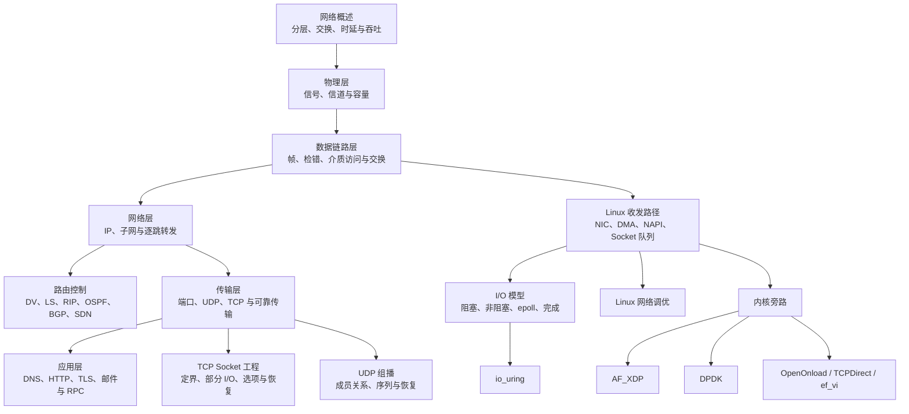

# 计算机网络与 Linux I/O 知识地图

本部分从物理信号、链路帧和 IP 分组逐层推进到传输协议与应用协议，再进入 Linux 收发、I/O 接口和用户态高速数据面。每个核心概念只在一章完整定义，工程章节直接引用这些定义。

## 协议基础

| 核心问题 | 主讲章节 |
| --- | --- |
| 网络、协议、接口、服务、分层、封装、交换、时延和吞吐分别是什么 | [计算机网络概述](network_overview.md) |
| 比特怎样变成信号，Nyquist 与 Shannon 上限怎样计算 | [物理层](physical_layer.md) |
| 怎样成帧、检错、可靠交付并通过以太网交换 | [数据链路层](link_layer.md) |
| IPv4/IPv6、CIDR、分片、ARP、DHCP、ICMP、NAT 与转发怎样工作 | [网络层](network_layer.md) |
| 路由表怎样由 DV、LS、RIP、OSPF、BGP 或 SDN 控制面产生 | [路由控制](routing_control.md) |
| 端口与套接字怎样分用，UDP 与 TCP 分别提供什么语义 | [传输层](transport_layer.md) |
| DNS、HTTP、TLS、邮件和 RPC 怎样定义应用消息与状态 | [应用层](application_layer.md) |

## Linux Socket 与 I/O

| 核心问题 | 主讲章节 |
| --- | --- |
| 一帧怎样经过 NIC、DMA、驱动、NAPI、协议栈和 Socket 队列 | [Linux 网络收发路径](basics.md) |
| 阻塞、非阻塞、就绪通知、完成通知和事件循环有什么区别 | [I/O 模型](io_models.md) |
| TCP 应用怎样做消息定界、处理部分读写、选择 Socket 选项并恢复连接 | [TCP Socket 工程](tcp_optimization.md) |
| IP 组播怎样加入组，接收方怎样发现缺口并通过双线、重传和快照恢复 | [UDP 组播](udp_multicast.md) |
| 怎样按 NIC、驱动、内核、Socket 和应用队列定位丢包与排队 | [Linux 网络调优](tuning.md) |

## 高速数据面

| 技术 | 它改变的边界 | 主讲章节 |
| --- | --- | --- |
| `io_uring` | 以提交队列和完成队列批量交换 I/O 操作 | [io_uring](io_uring.md) |
| Kernel bypass | 应用更直接管理数据面并接管缓冲、协议和运维责任 | [内核旁路](kernel_bypass.md) |
| AF_XDP | 在 Linux XDP、驱动队列与用户态 UMEM 之间交接数据包 | [AF_XDP](af_xdp.md) |
| DPDK | 使用用户态轮询驱动、mbuf 和 mempool 管理网卡队列 | [DPDK](dpdk.md) |
| OpenOnload、TCPDirect、ef_vi | 从 Socket 兼容用户态栈到厂商 packet API 的不同抽象层 | [AMD/Solarflare 网络栈](openonload.md) |
