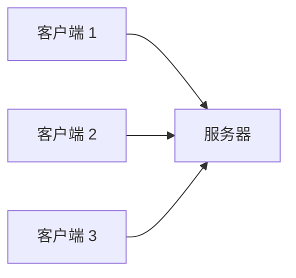
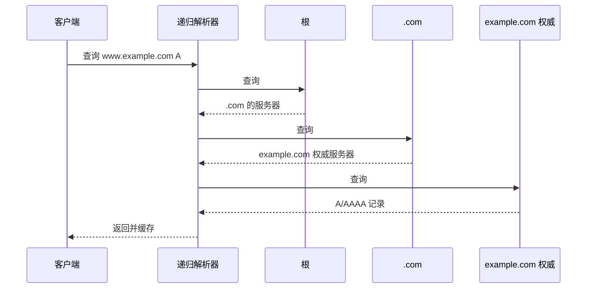
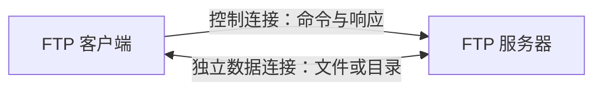
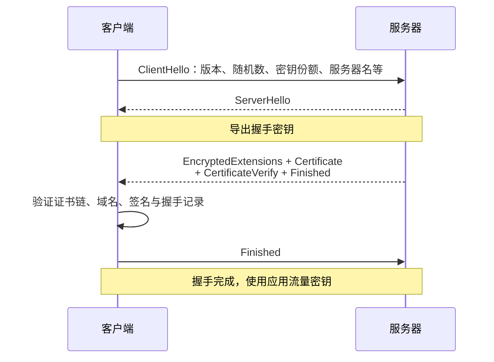
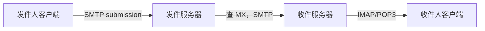

# 应用层：DNS、HTTP、TLS、邮件与 RPC

IP 负责把分组送到目标主机，TCP/UDP 负责送到目标进程。**应用层协议**再规定双方交换的消息长什么样、每个字段是什么意思、谁先发送以及失败后怎样继续。

浏览器访问网页、服务调用 RPC、邮件客户端收信，本质上都在使用传输层提供的通信能力，但它们的消息格式和状态机完全不同。

## 1. 客户端—服务器与对等结构

**客户端—服务器（client-server）**结构中，服务器在稳定地址上等待请求，客户端主动连接：



服务器不一定是一台机器。一个域名可以对应负载均衡器和许多后端实例；“服务器”描述角色，不描述数量。

**对等（peer-to-peer，P2P）**结构中，节点可以同时提供和请求资源。它能利用参与节点资源，却要解决节点动态上下线、发现、信任和数据一致性。

现实系统常混合使用：中心服务负责身份和索引，数据在对等节点间传输。

## 2. 应用协议运行在传输服务之上

应用协议选择传输层提供的字节流或数据报，再定义自己的消息格式、顺序和错误语义。端口、Socket、四元组、TCP 和 UDP 由[传输层](transport_layer.md)统一定义；Linux 的阻塞、非阻塞与部分读写分别见 [I/O 模型](io_models.md)和 [TCP Socket 工程](tcp_optimization.md)。

同一个应用协议也可能使用不同传输。例如 DNS 可以使用 UDP、TCP 或加密封装；HTTP/1.1 和 HTTP/2 通常运行在 TCP 上，HTTP/3 则运行在 QUIC 上。应用层不能把某种底层传输的偶然分段方式当作自己的消息边界。

## 3. DNS 为什么需要分层命名

人更容易记 `www.example.com`，网络转发却使用 IP 地址。**DNS（Domain Name System，域名系统）**是分布式、分层的命名数据库，把域名映射到 IP 和其他记录。

域名从右向左形成层次：

```text
www.example.com.
│   │       │  └─ 根
│   │       └──── 顶级域 com
│   └──────────── example 域
└──────────────── 主机/服务名 www
```

没有一台 DNS 服务器保存并回答全球全部名字。层次与委派让不同组织管理自己的区域。

## 4. DNS 查询经过哪些角色

客户端通常把问题交给**递归解析器**。缓存未命中时，解析器可能依次询问：

1. 根服务器：`.com` 应该问谁；
2. `.com` 顶级域服务器：`example.com` 的权威服务器是谁；
3. `example.com` 权威服务器：`www.example.com` 的记录是什么。

TLD（Top-Level Domain，顶级域）服务器负责 `.com`、`.org` 等顶级域的委派信息；权威服务器负责被委派区域中的最终记录。



实际解析器可能已有缓存、使用转发器或并行查询，不会每次都走完整链路。

## 5. 常见 DNS 记录

| 记录 | 表示什么 |
|---|---|
| A | 名字对应 IPv4 地址 |
| AAAA | 名字对应 IPv6 地址 |
| CNAME | 一个名字是另一个规范名字的别名 |
| NS | 某区域由哪些权威服务器负责 |
| MX（Mail Exchange） | 某域的邮件交换服务器及优先级 |
| TXT | 文本数据，常用于域名验证和邮件策略 |
| PTR | 反向解析：地址到名字 |

记录有 **TTL（Time To Live）**，缓存可以在这段时间复用答案。TTL 降低查询量和延迟，也意味着记录修改后旧答案可能继续存在一段时间。

DNS 通常使用 UDP 53 端口查询，也可以因响应过大、区域传送或现代加密传输而使用 TCP/其他封装。不能把“DNS 只用 UDP”作为通用规则。

## 6. URL（统一资源定位符）把一次 Web 请求的目标写清楚

**URL（Uniform Resource Locator，统一资源定位符）**例如：

```text
https://api.example.com:8443/v1/items?id=7#detail
\___/   \_____________/\__/\_______/\__/\_____/
scheme        host      port   path   query fragment
```

- scheme 说明协议语义，如 `https`；
- host 用于 DNS 与服务器身份；
- port 选择服务端点，省略时使用 scheme 默认值；
- path 与 query 由服务器解释；
- fragment 通常只由客户端使用，不随普通 HTTP 请求发送给服务器。

URL 解析、百分号编码和路径规范化有明确标准。安全代码应使用成熟解析器，不要靠字符串切分猜测 host 或路径。

## 7. HTTP 是请求—响应协议

**HTTP（Hypertext Transfer Protocol）**定义客户端请求和服务器响应的语义。HTTP/1.1 请求示例：

```http
GET /items/7 HTTP/1.1
Host: api.example.com
Accept: application/json

```

响应：

```http
HTTP/1.1 200 OK
Content-Type: application/json
Content-Length: 22

{"id":7,"name":"book"}
```

首行描述方法/目标/版本或状态，header 提供元数据，空行后是可选 body。HTTP 消息边界由版本的 framing 规则确定，不能依赖一次 TCP `read` 恰好得到一个请求。

## 8. 方法、状态码与幂等性

常见方法：

| 方法 | 通常语义 | 是否安全 | 是否幂等 |
|---|---|---|---|
| GET | 获取资源表示 | 是 | 是 |
| HEAD | 只取响应头 | 是 | 是 |
| POST | 提交处理或创建从属资源 | 否 | 不保证 |
| PUT | 用给定表示创建/替换目标资源 | 否 | 是 |
| PATCH | 部分修改 | 否 | 不保证 |
| DELETE | 删除目标资源 | 否 | 是 |

**安全（safe）**表示客户端只请求读取语义，不应主动改变服务器状态；日志等附带效果仍可能发生。**幂等（idempotent）**表示同一请求执行一次或多次，目标状态的预期效果相同，不表示每次响应完全相同，也不表示网络重试自动安全。

常见状态码类别：

- 1xx：临时信息；
- 2xx：请求成功处理；
- 3xx：重定向或缓存相关；
- 4xx：客户端请求问题；
- 5xx：服务器处理失败。

具体码比类别更重要，例如 `404` 是未找到，`409` 常表示状态冲突，`429` 表示请求过多，`503` 表示服务暂不可用并可能建议稍后重试。

## 9. HTTP 连接怎样演进

### HTTP/1.0 与 1.1

早期每个对象常使用独立连接。HTTP/1.1 默认持久连接，可复用 TCP，避免为每个小对象重建连接。流水线请求理论上可连续发送，但响应顺序造成队头阻塞，部署并不普遍。

### HTTP/2

HTTP/2 把消息分成二进制帧，在一条连接上多路复用多个 stream，并压缩 header。不同 stream 的应用层帧可交错，减少 HTTP/1.1 层面的队头阻塞；但它仍运行在一条 TCP 字节流上，底层丢包会暂时影响这条连接中的所有流。

### HTTP/3

HTTP/3 使用 QUIC。QUIC 是协议名称，当前标准不把它展开成英文缩写；它基于 UDP 实现可靠传输、加密和多流，使一个流的丢包不必阻塞其他流的数据交付，并支持连接迁移和减少部分建连往返。

版本选择由客户端、服务器和网络环境协商。不能把 HTTP/3 简化成“不可靠 UDP”；可靠性由 QUIC 提供。

## 10. FTP 为什么分成控制连接与数据连接

**FTP（File Transfer Protocol，文件传输协议）**使用 TCP。服务器通常在端口 21 接受长期控制连接，用它传递登录、目录和传输命令；文件或目录列表则使用单独的数据连接。这种“控制与数据分离”让双方在传输数据时仍能交换控制命令。



- **主动模式**：经典流程中，客户端告诉服务器自己的数据端口，服务器通常从端口 20 主动连接客户端；防火墙和地址转换可能阻挡这条入站连接。
- **被动模式**：服务器告诉客户端一个监听的数据端口，由客户端主动连接，通常更容易穿过客户端侧防火墙和地址转换。

经典 FTP 不加密用户名、密码和内容。FTPS 表示以 TLS 保护 FTP；SFTP（SSH File Transfer Protocol，SSH 文件传输协议）运行在 SSH（Secure Shell，安全外壳协议）之上，是另一套协议，不能把二者混为一谈。

## 11. Cookie、Session 与 Token

HTTP 请求本身可独立处理，应用却常需要登录状态。

- **Cookie** 是浏览器按域、路径、安全属性等规则保存并随请求发送的小段数据；
- **Session** 常指服务器保存状态，用随机会话标识把请求关联起来；
- **Token** 是客户端携带的凭据，可能是不透明随机值，也可能自包含声明。

三者不是互斥层级：session ID 可以放在 cookie 里，token 也可以放 cookie 或 Authorization header。

Cookie 的关键安全属性包括 `Secure`（只通过安全连接发送）、`HttpOnly`（禁止脚本直接读取）和 `SameSite`（限制跨站发送）。短有效期、轮换与服务端撤销也要按威胁模型设计。JWT（JSON Web Token）只是一种 token 格式，不自动解决泄露、撤销、权限或密钥管理。

## 12. 缓存怎样减少重复传输

HTTP 缓存可以位于浏览器、代理和 CDN。服务器用 `Cache-Control` 表达可缓存性与新鲜时间；过期后可用条件请求验证：

- `ETag` / `If-None-Match` 比较实体标签；
- `Last-Modified` / `If-Modified-Since` 比较修改时间；
- 未变化时服务器返回 `304 Not Modified`，无需再传 body。

缓存键必须考虑 `Vary` 等响应头。把带用户身份或敏感信息的响应误设为公共缓存会造成数据泄露。

## 13. CDN 与代理

**CDN（Content Delivery Network，内容分发网络）**把可缓存内容部署到靠近用户的边缘节点。DNS、Anycast 或应用重定向把用户导向合适节点；未命中时边缘从源站取得并缓存。

**正向代理**代表客户端访问外部服务；**反向代理**位于服务器前，代表后端接收客户端流量，可完成 TLS 终止、路由、负载均衡和缓存。

代理增加一层故障和信任边界。应用要明确真实客户端地址由谁认证、超时预算怎样传递、body 大小限制和重试是否会重复副作用。

## 14. TLS 解决什么

HTTPS 是 HTTP 运行在 TLS 保护的连接上。**TLS（Transport Layer Security）**主要提供：

- 机密性：旁路观察者难以读取内容；
- 完整性：传输内容被修改可被发现；
- 身份认证：客户端通过证书链和域名验证服务器身份；也可选择双向认证。

简化的 TLS 1.3 建连：



公钥算法用于认证和协商共享秘密，对称加密用于大量应用数据。证书有效不代表业务请求已授权；TLS 证明连接对端身份与传输完整性，应用仍要做登录、权限和输入验证。

## 15. 电子邮件协议各负责一段

邮件不是一个协议完成：

- **SMTP（Simple Mail Transfer Protocol，简单邮件传输协议）**用于客户端提交邮件以及邮件服务器之间传输；
- **POP3（Post Office Protocol version 3，邮局协议第 3 版）**以下载邮箱消息为主，模型较简单；
- **IMAP（Internet Message Access Protocol，互联网消息访问协议）**支持服务器端文件夹、状态同步和多设备访问；
- **MIME（Multipurpose Internet Mail Extensions，多用途互联网邮件扩展）**规定非 ASCII 文本、附件和多部分内容怎样编码进邮件格式；
- DNS MX 记录告诉发送方某域由哪些邮件服务器接收。



SMTP 的一次成功响应表示对端服务器按协议接收了责任，不等于收件人已经阅读，也不保证后续不会退信。

## 16. RPC 与 HTTP API

**RPC（Remote Procedure Call，远程过程调用）**让调用远端服务看起来像调用函数，但网络会引入本地函数没有的失败：超时后不知道对端是否已执行、响应可能丢失、版本可能不兼容。

gRPC 常使用 Protocol Buffers 描述消息并运行在 HTTP/2 上，提供类型化接口和流式通信。REST（Representational State Transfer，表述性状态转移）风格 HTTP API（Application Programming Interface，应用程序接口）更强调资源、标准方法和可见协议语义。二者都必须处理：

- deadline，而不只是每层独立超时；
- 取消信号能否传到下游；
- 重试是否安全、是否有退避和上限；
- 幂等键或操作 ID 怎样去重；
- schema 怎样向前/向后兼容；
- 错误怎样映射而不丢语义。

“像本地函数”只是一种编程接口，不能抹去分布式失败边界。

## 17. 常见误解

- **“DNS 每次都从根服务器查起。”** 多级缓存通常会直接回答或缩短路径。
- **“DNS 只使用 UDP。”** 大响应、传送和加密 DNS 等情况可使用 TCP/其他传输。
- **“一次 TCP read 就是一条 HTTP 消息。”** TCP 没有应用消息边界，HTTP 自己定义 framing。
- **“POST 一定是创建，PUT 一定是更新。”** 方法语义取决于目标资源和 API 契约；PUT 强调幂等替换/创建。
- **“HTTP/2 彻底消除所有队头阻塞。”** TCP 丢包仍影响同连接的数据交付。
- **“HTTP/3 使用 UDP，所以不可靠。”** QUIC 在 UDP 之上实现可靠多流传输。
- **“SFTP 就是加密版 FTP。”** SFTP 属于 SSH 协议族；FTPS 才是在 FTP 上增加 TLS。
- **“有 TLS 就不需要鉴权。”** TLS 与业务授权解决不同问题。
- **“RPC 超时说明服务器没有执行。”** 可能请求或响应在任一阶段丢失，结果未知。

## 18. 应用中的协议选择

| 场景 | 可能使用 | 重点 |
|---|---|---|
| 浏览器与 Web API | HTTPS/HTTP/2 或 3 | 缓存、身份、幂等、跨版本 |
| 内部后端服务 | HTTP API、gRPC、消息系统 | deadline、重试、过载与可观测性 |
| AI 模型服务 | HTTP/gRPC 流式响应 | 大 body、取消、首 token 与完整结果 |
| HFT 接入 | FIX/TCP、二进制 TCP/UDP | 会话状态、序号、恢复和场所规范 |

应用层协议由业务语义决定；传输层只提供字节流或数据报等基础服务。

## 19. 做题方法：DNS、HTTP 与应用事务

1. **DNS 题画角色链**：客户端、递归解析器、根、顶级域和权威服务器按查询顺序排列；标每一步是递归还是迭代、命中何种缓存以及 TTL 是否有效。
2. **HTTP 报文题先定版本**：HTTP/1.1 按起始行、首部、空行、消息体解析，并用 `Content-Length`、分块编码或连接关闭确定长度；HTTP/2/3 不套用文本报文边界。
3. **缓存题画时间轴**：记录对象生成时间、缓存时间、有效期、验证请求与响应码，区分“新鲜可直接用”和“过期后条件验证”。
4. **连接/时延题列往返次数**：分别计算 DNS 查询、传输层建连、TLS 握手、HTTP 请求响应所需 RTT；是否复用连接、并行请求或已有缓存必须从题设确认。
5. **事务题分协议成功与业务成功**：超时只说明调用方未及时得到结果；根据方法幂等性、请求 ID 和服务端状态查询判断能否重试。
6. **验算**：CNAME 链最终应落到地址记录；HTTP body 长度必须与定界方式一致；安全方法、幂等方法和“绝无副作用”不能画等号。

常见陷阱：把递归解析器当权威服务器；忽略 DNS 缓存；默认每个对象都新建 TCP；把 HTTP 200 当业务一定成功；认为 TLS 会验证应用收到的数据是否真实。

## 20. 思考题与面试追问

1. DNS 根、TLD、权威服务器和递归解析器各做什么？

<details><summary>参考答案</summary>

递归解析器代客户端完成查询并缓存结果；根服务器指向相应 TLD（顶级域）服务器；TLD 服务器指向该域的权威服务器；权威服务器保存并回答该域最终记录。典型迭代链是“递归解析器→根→TLD→权威”，但任一级缓存命中都可能缩短过程。

</details>

2. A、AAAA、CNAME、NS 与 MX 记录分别表示什么？

<details><summary>参考答案</summary>

A 把名称映射到 IPv4 地址，AAAA 映射到 IPv6 地址，CNAME 把别名指向规范名称，NS 指出某 DNS 区的权威名称服务器，MX 指出接收某域邮件的服务器及优先级。CNAME 通常还需继续解析目标名称，MX/NS 中的主机名也可能需要地址记录。

</details>

3. DNS TTL 为什么既降低查询量又减慢变更生效？

<details><summary>参考答案</summary>

TTL（生存时间）允许解析器在有效期内直接复用记录，减少递归查询、权威负载和等待时间。但权威记录改变后，旧缓存可以合法保留到 TTL 到期，因此各客户端不会同时看到新值。迁移前常提前降低 TTL，而不是变更瞬间才降低。

</details>

4. HTTP 消息怎样在无消息边界的 TCP 上确定长度？

<details><summary>参考答案</summary>

HTTP/1.1 先解析起始行和首部，再依协议规则使用 `Content-Length`、`Transfer-Encoding: chunked`、特定响应无 body 的语义或连接关闭确定消息体边界；不能把一次 `read` 当一条消息。HTTP/2 和 HTTP/3 使用各自的二进制帧格式与流边界，不沿用 HTTP/1.1 文本定界。

</details>

5. 安全方法与幂等方法有什么区别？为什么幂等仍不代表可以无限重试？

<details><summary>参考答案</summary>

安全方法按语义只读取，不请求改变资源状态；幂等方法重复执行的预期效果与执行一次相同，但可能写入日志、刷新时间等。即使幂等，请求仍消耗容量，重试风暴会加重故障，而且调用链中的实现可能违反契约，所以还需 deadline、退避、上限和请求去重。

</details>

6. HTTP/2 与 HTTP/3 分别在哪一层改善多路复用和队头阻塞？

<details><summary>参考答案</summary>

HTTP/2 在一个 TCP 连接内用应用层二进制流多路复用，消除了 HTTP/1.1 应用层串行队头阻塞，但 TCP 丢一个字节仍会阻塞同连接所有流的有序交付。HTTP/3 运行在 QUIC 之上，不同流具有独立可靠顺序，单流丢包通常不阻塞其他流；网络路径拥塞仍然存在。

</details>

7. FTP 为什么分开控制连接和数据连接？主动与被动模式的连接方向有何不同？

<details><summary>参考答案</summary>

FTP 用持久控制连接传命令和响应，为目录/文件传输另建数据连接，使控制与数据生命周期分离。主动模式由服务器从数据端口主动连向客户端声明的地址；被动模式由服务器告知监听地址，客户端主动连接，更容易穿过客户端侧 NAT/防火墙。具体端口按协商结果判断。

</details>

8. Cookie、session、token 三者怎样组合，而不是互相替代？

<details><summary>参考答案</summary>

Cookie 是浏览器保存并按作用域随请求发送的小段数据；session 是服务器保存的会话状态，Cookie 常只携带其随机会话 ID；token 是可由服务验证的凭证，也可放在 Cookie 或 Authorization 首部。它们分别描述存储/传递机制、服务端状态模型和凭证，不是同一层概念；都需过期、保护与撤销策略。

</details>

9. TLS 1.3 中服务器和客户端的 Finished 谁先发送？TLS 又不提供哪些业务保证？

<details><summary>参考答案</summary>

常规 TLS 1.3 握手中，服务器先发送自己的 Finished，客户端验证后再发送客户端 Finished；0-RTT 等流程另有额外消息。TLS 提供对端身份认证（客户端认证可选）、机密性和传输完整性，但不保证用户有业务权限、请求内容真实合法、服务端一定执行成功或操作可安全重试。

</details>

10. SMTP、IMAP、POP3、MIME 各解决邮件系统的哪一段？

<details><summary>参考答案</summary>

SMTP 负责邮件提交和服务器间转交；IMAP 让客户端在服务器上管理邮箱、文件夹和同步状态；POP3 主要提供较简单的下载式取信；MIME 定义附件、非 ASCII 内容和多部分正文怎样编码进邮件。DNS MX 另负责找到收件域的邮件服务器。

</details>

11. RPC 调用超时后，为什么结果可能未知？怎样设计可安全重试的扣款/下单操作？

<details><summary>参考答案</summary>

超时可能发生在请求未到、服务端执行中、已经提交但响应丢失等任一步，所以调用方只知道“没及时看到结果”。安全方案是让客户端生成唯一操作 ID；服务端在同一事务中记录 ID 与结果，重复 ID 返回旧结果；调用方先查询状态再按有界退避重试。验算要模拟“提交成功后响应丢失”，余额或订单只能变化一次。

</details>

## 参考依据

- [高校公开转载的《2025 年计算机学科专业基础考试大纲》](https://www.uwh.edu.cn/uploads/article/20250609/660428d58334252302af691bf99e064e.pdf)
- [Kurose 与 Ross：应用层官方知识检查](https://gaia.cs.umass.edu/kurose_ross/knowledgechecks/)
- [RFC 1034: Domain Names—Concepts and Facilities](https://www.rfc-editor.org/rfc/rfc1034.html) 与 [RFC 1035: Domain Names—Implementation and Specification](https://www.rfc-editor.org/rfc/rfc1035.html)
- [RFC 9110: HTTP Semantics](https://www.rfc-editor.org/rfc/rfc9110.html)、[RFC 9112: HTTP/1.1](https://www.rfc-editor.org/rfc/rfc9112.html)、[RFC 9113: HTTP/2](https://www.rfc-editor.org/rfc/rfc9113.html)、[RFC 9114: HTTP/3](https://www.rfc-editor.org/rfc/rfc9114.html)
- [RFC 959: File Transfer Protocol](https://www.rfc-editor.org/rfc/rfc959.html)
- [RFC 8446: TLS 1.3](https://www.rfc-editor.org/rfc/rfc8446.html) 与 [RFC 9000: QUIC](https://www.rfc-editor.org/rfc/rfc9000.html)
- [RFC 5321: Simple Mail Transfer Protocol](https://www.rfc-editor.org/rfc/rfc5321.html) 与 [RFC 9051: Internet Message Access Protocol](https://www.rfc-editor.org/rfc/rfc9051.html)
