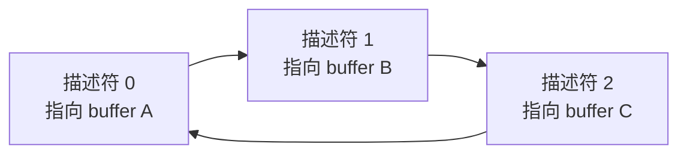
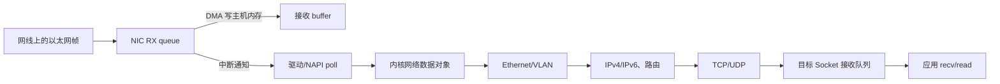
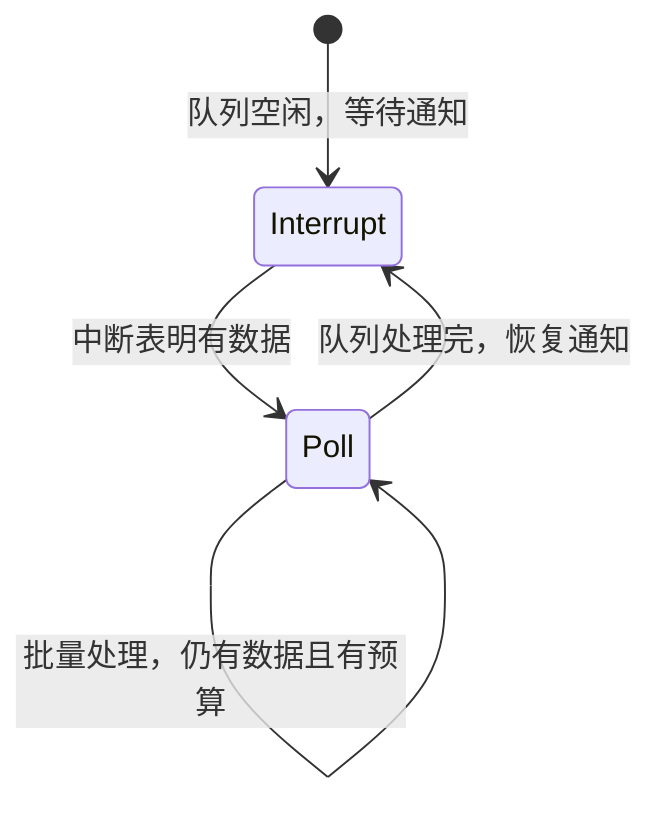
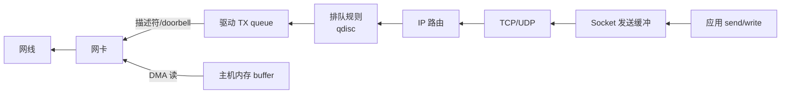

# Linux 网络收发路径：数据怎样走进 Socket

前面的网络协议章节解释了帧、IP 分组和 TCP/UDP 报文怎样传输。本章把视角切到一台 Linux 主机内部：网卡把数据放到哪里，驱动和协议栈做什么，阻塞在 `recv` 的线程又怎样被唤醒。

下面描述现代 Linux 以太网的典型路径，不是所有驱动版本都必须使用的固定函数链。需要掌握的是各层职责、队列和完成边界。

## 1. Linux 收发路径中的对象

帧、分组、TCP 和 UDP 的协议语义分别由链路层、网络层和传输层章节定义。这里追踪数据进入 Linux 后由哪些内核对象保存和传递。

| 对象 | 是什么 | 为什么需要 |
| --- | --- | --- |
| DMA（Direct Memory Access，直接内存访问） | 设备直接读写主机内存的机制 | 网卡搬运数据时不要求 CPU 逐字节复制 |
| descriptor（描述符） | 记录缓冲区地址、长度和状态的队列元数据 | 驱动和网卡用它交接“哪块内存可用、哪项工作已完成” |
| buffer（缓冲区） | 真正保存数据字节的内存区域 | 数据必须有明确存放位置和生命周期 |
| `sk_buff` | Linux 网络栈常用的数据与元数据对象 | 追踪协议位置、长度、校验和状态和底层缓冲区 |
| Socket queue（套接字队列） | 某个通信端点的收发排队空间 | 把协议栈处理结果与应用读取速度解耦 |
| FD（file descriptor，文件描述符） | 进程引用已打开内核对象的小整数 | 应用通过它调用 `recv`、`send` 等接口 |

## 2. 网卡接收前，内核先准备缓冲区

网卡（Network Interface Card，NIC）通常有一个或多个**接收队列（receive queue，RX queue）**。驱动在内存中建立环形描述符队列，每个描述符告诉网卡一块可用于接收的内存缓冲区。发送方向对应 **TX（transmit，发送）queue**。

描述符是队列元数据，buffer 才保存帧内容。驱动必须及时补充可用 buffer；若接收速度超过驱动处理和补充速度，网卡队列会溢出并丢帧。

## 3. 一帧进入 Linux 的完整主线

典型步骤是：

1. 网卡接收帧，通过 DMA 把内容写到驱动准备的主机内存，并更新完成状态；
2. 在通知启用时，网卡以中断告诉 CPU 某个接收队列有工作；
3. 驱动进入 NAPI 轮询，在一轮预算内批量取出多个完成描述符；
4. 内核用自己的数据对象追踪 buffer、长度和协议位置；
5. 链路层检查 Ethernet/VLAN，网络层处理 IP 与本机路由；
6. TCP/UDP 根据端口和连接状态找到目标 Socket；
7. 数据进入 Socket 接收队列；等待数据的线程可被唤醒，或事件循环收到就绪通知；
8. 应用调用 `recv/read` 取得数据。

每一层都可能只调整元数据，也可能因聚合、分片、加密或接口要求复制数据；不能从简化图断言“固定发生几次复制”。

## 4. 为什么 Linux 同时使用中断与轮询

若每个包都触发一次完整中断，高包率时 CPU 会频繁切入处理中断。若 CPU 永远轮询队列，空闲时又会浪费算力。

Linux 常用 **NAPI** 事件处理机制组合二者。NAPI 是当前内核文档使用的机制名称，不再展开成某个英文短语：

1. 流量较低时，由中断及时通知新数据；
2. 内核调度该队列的 poll；
3. poll 在预算内批量处理描述符；
4. 队列暂时清空后重新启用中断。

NAPI 的 poll 不是应用线程在循环 `recv`，而是内核网络接收机制。应用层的 busy polling 是另一项选择。

## 5. 数据进入 Socket 后发生什么

Socket 接收队列有容量。应用读取不及时，队列占用会增长；队列满后的传输行为由具体协议决定，详见[传输层](transport_layer.md)。Linux 这一层需要关注的是队列占用、内存记账、丢弃计数和线程唤醒。

`SO_RCVBUF` 设置的是 Socket 接收缓冲相关上限，内核可能按自身规则调整实际记账。增大它可以吸收短暂突发，却会占更多内存，并可能把“及时处理不了”变成“更晚才发现积压”。

阻塞线程在队列无数据时睡眠。数据到达后内核把它变为 Runnable；线程仍要等调度器选中。非阻塞程序通常由 `epoll` 等接口获知 Socket 可读，再重复读取到 `EAGAIN`。详见[I/O 模型](io_models.md)。

## 6. 应用取得数据的完成边界

应用调用 `recv` 或 `read` 后，返回值说明本次调用向用户缓冲区交付了多少字节，或返回关闭、暂时不可用和错误状态。它不表示远端业务已经完成，也不表示套接字队列已经排空。

流式套接字的消息定界、部分读写与错误处理见 [Linux TCP Socket 工程](tcp_optimization.md)；阻塞、非阻塞和就绪通知见 [I/O 模型](io_models.md)。系统调用返回是本章 Linux 收发路径的应用边界。

## 7. 发送路径与接收路径方向相反但不完全对称

Linux 把软件发送排队与调度机制称为 qdisc（queueing discipline，排队规则）。它位于协议处理与驱动发送队列之间。

应用写入 Socket 不等于字节已经离开网卡：

1. 内核先按 Socket 语义接受数据，可能进入发送缓冲；
2. TCP 进行分段、序号与重传管理，IP 选择下一跳；
3. qdisc 决定请求何时进入网卡发送队列；
4. 驱动提交描述符并通知网卡，网卡通过 DMA 读取主机内存并发送；
5. 硬件完成描述符后，驱动才可回收相关 buffer。

TCP `write` 成功只说明相应字节被本机内核接受，不说明对端应用已经读取，更不说明对端业务副作用成功。

## 8. Offload 把哪些工作交给网卡

**Offload（卸载）**让内核或网卡批量完成部分协议工作：

| 名称 | 方向 | 基本用途 |
|---|---|---|
| checksum offload | 收/发 | 由硬件计算或验证部分校验和 |
| TSO（TCP Segmentation Offload，TCP 分段卸载） | 发送 | 内核交较大 TCP 数据块，网卡切成线上报文段 |
| GSO（Generic Segmentation Offload，通用分段卸载） | 发送 | Linux 中把分段推迟到发送路径较后位置 |
| GRO（Generic Receive Offload，通用接收卸载） | 接收 | 内核把同一流的多个包合并后交给上层处理 |
| RSS（Receive Side Scaling，接收侧扩展） | 接收 | 网卡按流哈希把包分到多个 RX queue |

Offload 减少每包固定工作，却会让抓包点看到的包形状与线上不同。诊断 MTU、校验和或包长时，要知道抓包发生在卸载之前还是之后。

RSS 的目标是让同一流通常进入同一队列，同时把不同流分散到多个 CPU。队列过少会限制并行，队列过多会增加配置、内存和调度成本。

## 9. 包可能丢在哪里

| 位置 | 可能原因 | 先看什么 |
|---|---|---|
| 交换机/链路 | 拥塞、物理错误、MTU 问题 | 交换机端口和链路计数 |
| NIC RX queue | 突发超过队列和驱动补充能力 | 网卡每队列 drop/missed 计数 |
| 驱动/NAPI backlog | CPU 未及时处理、预算反复耗尽、backlog 满 | softnet、NAPI 与 CPU 分布 |
| IP/传输层 | 校验、分片重组、无监听端口、协议状态错误 | 协议栈统计与抓包 |
| Socket 接收队列 | 应用读取不及时、缓冲满 | socket drop、队列长度、应用处理率 |
| 应用协议 | 序号缺口、解析失败、主动丢弃 | 应用指标、日志和序列号 |

“softnet 指标增长”也要区分：预算/时间被用尽更多表示处理跟不上或被延后，真正 drop 通常与 backlog 容量等条件有关。不要用一个指标名称代替因果定位。

## 10. MTU 怎样影响本机发送

MTU、路径 MTU 和分片由[网络层](network_layer.md)定义。在 Linux 发送路径中，路由与设备 MTU 决定一个分组能否直接交给目标网卡；超出限制时，内核会按协议和 Socket 选项执行分段、分片或返回错误。

GSO/TSO 让内核内部暂时携带比线上单个分组更大的数据对象，不表示网线可以发送超出 MTU 的帧。诊断“大包只在本机抓包出现”时，应同时检查抓包位置、offload 状态、路由 MTU 和实际线上包长。

## 11. “零拷贝”到底省了哪一次工作

“零拷贝”不是一个全局布尔属性。一个方案可能避免用户缓冲与内核缓冲间的 CPU 字节复制，却仍有：

- NIC 与内存之间的 DMA；
- 共享 buffer 的所有权转移；
- 页固定、映射和元数据操作；
- 协议头处理、校验、加密；
- 生命周期结束后的回收。

讨论时应画出数据从哪块 buffer 到哪块 buffer、由 CPU 复制还是 DMA、哪个组件何时可以复用。`sendfile`、`splice`、`io_uring` 注册缓冲、AF_XDP 和 DPDK 避免的步骤不同，不能都用“零拷贝所以快”概括。

## 12. 从外到内的诊断顺序

1. 明确影响范围：单连接、单主机、单队列还是整条路径；
2. 对齐两端与交换机时间线，确认发送、到达、重传和应用处理时刻；
3. 查看链路、交换机、NIC、驱动/softnet、协议栈和 Socket 的分层计数；
4. 检查每队列和每 CPU 分布，避免总量掩盖热点；
5. 抓包验证序号、重传、窗口、ICMP 与 MTU，但说明抓包点；
6. 最后做单一配置改动并复验，不一次修改所有缓冲和 offload。

常用工具和内核参数见[Linux 网络调优](tuning.md)。参数名和默认值会随内核/发行版变化，应查目标系统文档。

## 13. 常见误解

- **“网卡收到包后应用立即运行。”** 还要经过 DMA 完成、驱动/NAPI、协议栈、Socket 队列、唤醒和调度。
- **“中断和轮询只能选一个。”** NAPI 在低负载用中断通知，在有工作时批量轮询。
- **“DMA 等于零拷贝。”** DMA 是设备访问内存；CPU/缓冲区之间是否复制是另一个问题。
- **“增大 `SO_RCVBUF` 能解决处理能力不足。”** 它只能吸收有限突发，不能提高长期处理率。
- **“GRO 后抓到大包，说明线上就是大包。”** 抓包可能发生在聚合之后。
- **“TCP write 成功表示对端收到。”** 它通常只表示本机接受了字节。

## 14. 应用中的路径差异

| 场景 | 通常先使用 | 主要观察点 |
|---|---|---|
| Web/RPC | 内核 TCP Socket + 事件循环/async | 连接、Socket 队列、重传、应用背压 |
| AI 推理流式响应 | TCP/HTTP 或 gRPC | 大请求、取消、发送积压与 worker 阻塞 |
| UDP 实时数据 | UDP Socket | 数据报边界、drop、序号与应用恢复 |
| HFT 市场数据 | 组播/内核或旁路路径 | 每队列 drop、序号缺口、恢复协议 |

无论场景如何变化，都要回答：数据在哪个队列、谁拥有 buffer、队列满怎么办、完成由谁通知。

## 15. 思考题与面试追问

1. 描述一帧从 NIC RX queue 到应用 `recv` 的每个主要阶段。
2. RX 描述符与接收 buffer 分别保存什么？
3. NAPI 为什么能同时减少低流量等待和高流量中断风暴？
4. 数据进入 Socket 队列后，阻塞线程还要经过什么才能继续？
5. `recv` 返回后，为什么不能据此断言套接字队列已经排空或远端业务已经完成？
6. 应用 `send` 返回后，数据到网线还要经过哪些队列和步骤？
7. TSO/GSO/GRO 分别在哪个方向做什么？为什么会影响抓包观察？
8. NIC drop、softnet backlog drop 和 Socket drop 的原因怎样区分？
9. 为什么只增大接收缓冲无法解决长期到达率大于处理率？
10. 评价一个“零拷贝”方案时必须画清哪些 buffer、复制和所有权？
11. 一个“零拷贝”接口的完成通知至少要说明哪些 buffer 所有权？

## 参考依据

- [Linux 内核 NAPI 文档](https://docs.kernel.org/networking/napi.html)
- [Linux 网络栈扩展文档](https://docs.kernel.org/networking/scaling.html)
- [Linux 分段卸载文档](https://docs.kernel.org/networking/segmentation-offloads.html)
- [Linux `socket(7)`](https://man7.org/linux/man-pages/man7/socket.7.html)、[`recv(2)`](https://man7.org/linux/man-pages/man2/recv.2.html)、[`send(2)`](https://man7.org/linux/man-pages/man2/send.2.html)
- Jonathan Corbet 等，《Linux Device Drivers》，网络驱动与 DMA 的基础职责；版本级接口以当前内核文档为准。
- 协议语义以本书链路层、网络层与传输层章节所列 IEEE/RFC 为准。
