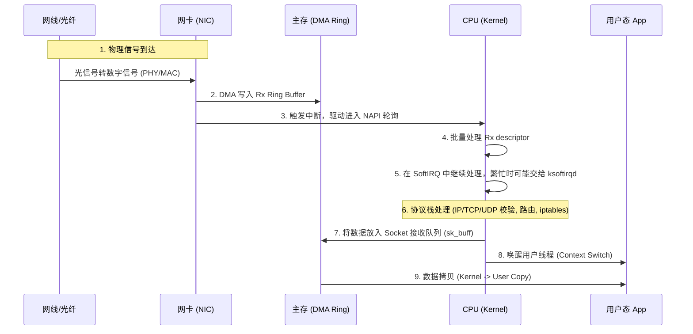
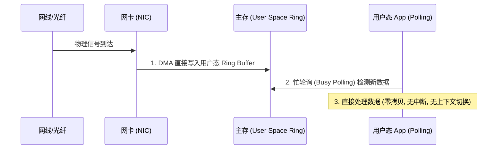
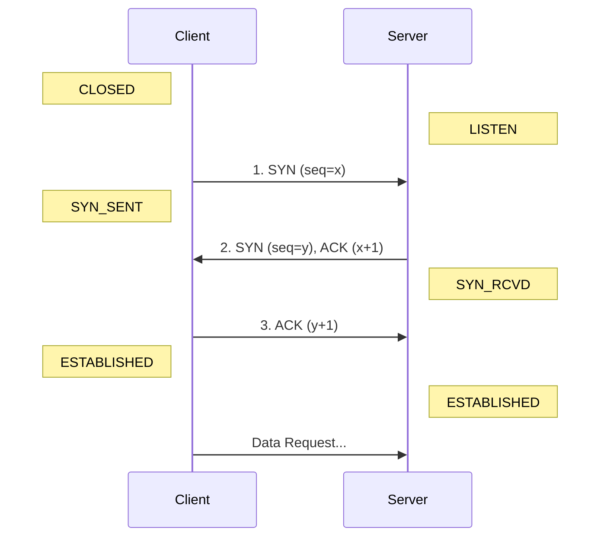
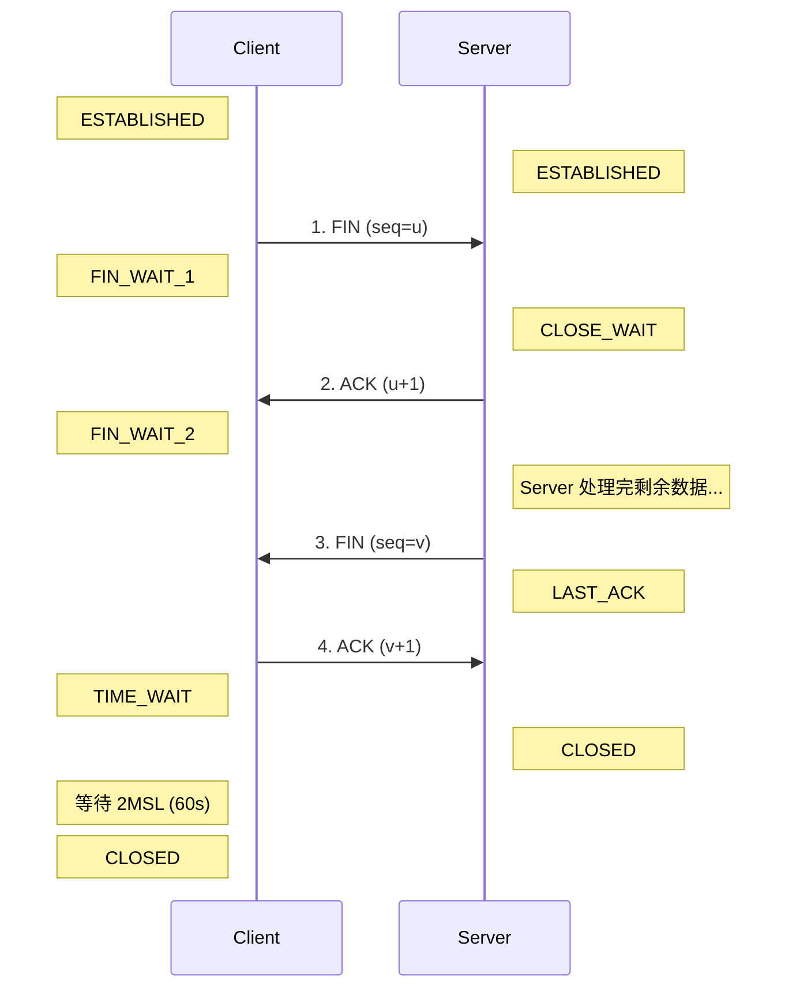
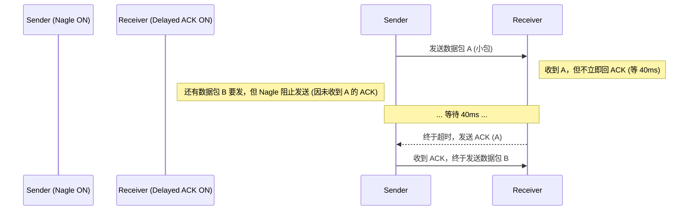
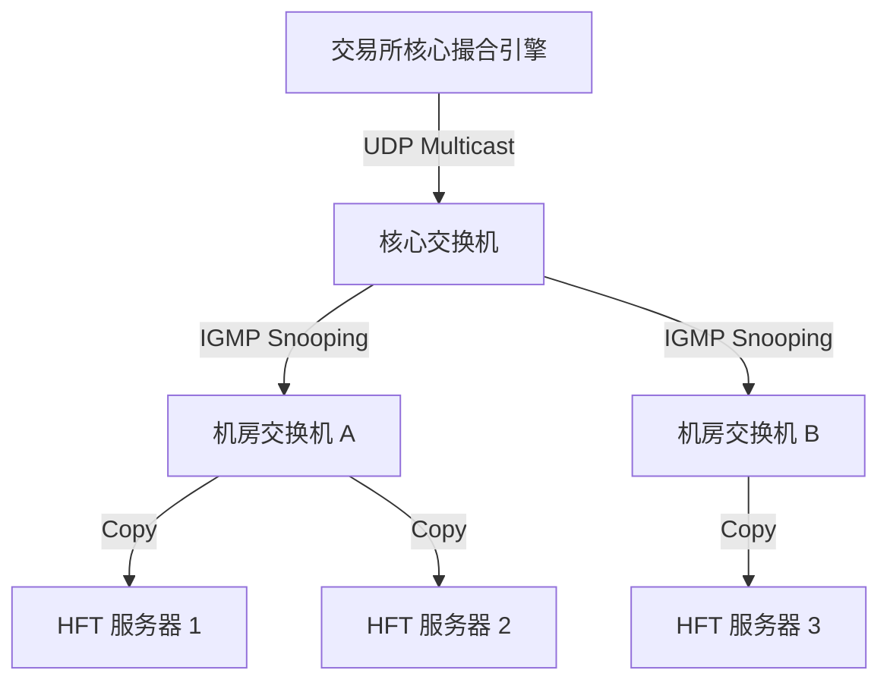
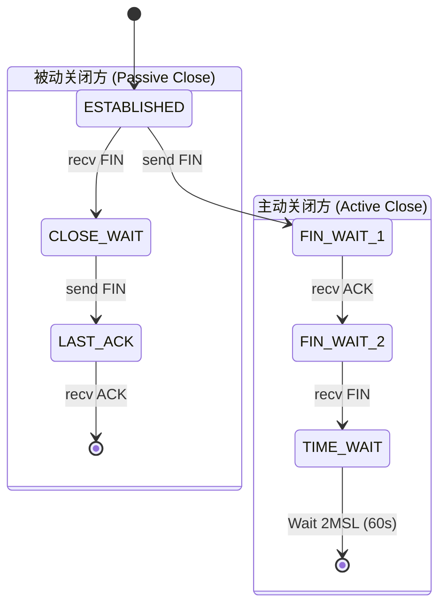

# 网络协议栈基础 (Network Stack Basics)

在高频交易的世界里，网络就是生命线。如果你的代码执行只需 100 纳秒，但网络传输花了 50 微秒，那么你的优化就毫无意义。

本章将剖析操作系统网络栈的开销，并解释为什么行情分发常使用 UDP 组播，而订单入口又常选择可靠、有会话语义的 TCP。协议没有脱离场景的“快慢排名”：是否可靠、能否恢复、交易所接口要求和尾延迟目标共同决定选择。

## 1. 从网卡到用户态：数据的漫长旅程

当一张网卡（NIC）收到一个以太网帧时，它需要经过一系列繁琐的步骤才能到达你的 Rust 程序。理解这个路径是优化的前提。

### 1.1 传统内核路径 (Kernel Path)

在标准的 Linux 网络栈中，数据包的处理流程如下：



**延迟来源分析**：
1.  **中断与批处理 (Interrupt/Batching)**: 现代 Linux 通常通过 NAPI 和中断合并批量收包，并非“一包一次中断”。批处理降低每包开销，却可能让首包等待，形成吞吐与延迟的取舍。
2.  **上下文切换 (Context Switch)**: 当数据准备好后，内核需要唤醒用户线程。调度器（Scheduler）可能不会立即调度你的线程，导致不可预测的延迟。
3.  **内存拷贝 (Memory Copy)**: 数据从内核空间的 `sk_buff` 拷贝到用户空间的 buffer。这不仅消耗 CPU 周期，还会污染 CPU Cache（Cache Pollution），导致后续计算变慢。
4.  **协议栈处理**: 路由、过滤、socket 查找和 TCP/UDP 处理都需要 CPU。部分功能对特定专线可能不需要，但防火墙和隔离也承担安全职责，不能为了性能一概关闭。

### 1.2 内核旁路 (Kernel Bypass)

为了减少上述开销，部分 HFT 系统采用 **Kernel Bypass** 或加速技术（如 OpenOnload、DPDK、AF_XDP）。它们的旁路程度并不相同：DPDK PMD 通常完全由用户态轮询，AF_XDP 仍借助内核中的 XDP，OpenOnload 则透明加速 socket API。



**优势**：
*   **减少拷贝**: 合适配置下，NIC 可 DMA 到用户态可访问的缓冲区。
*   **减少中断**: 忙轮询让收包路径不依赖每次由中断唤醒。
*   **减少调度抖动**: 绑核与 CPU 隔离可减少迁核和抢占，但不能保证“永远不被调度”；NMI、SMI 和内核活动仍可能产生噪音。

## 2. 协议栈解剖：从 Bit 到 Byte (Protocol Deep Dive)

为了深入优化，我们必须了解数据包在网络中传输的真实形态。网络协议是分层的，每一层都有其特定的职责和优化空间。

### 2.0 分层模型概览 (Layered Model)

在 HFT 语境下，我们主要关注 TCP/IP 模型的下四层：

| 层级 | 名称 | 主要协议 | 硬件/软件 | HFT 优化关键点 |
| :--- | :--- | :--- | :--- | :--- |
| **L4** | 传输层 (Transport) | TCP, UDP | OS Kernel / Userspace | Kernel Bypass, 拥塞控制调优, 零拷贝 |
| **L3** | 网络层 (Network) | IP, ICMP | 路由器, OS Kernel | 路由选择, DSCP 优先级, 分片处理 |
| **L2/L3 边界**| 地址解析 | **ARP / IPv6 ND** | OS Kernel | 邻居缓存、避免首包解析延迟 |
| **L2** | 链路层 (Link) | Ethernet, VLAN | 网卡 (NIC), 交换机 | Jumbo Frames, VLAN Offload, 轮询驱动 |
| **L1** | 物理层 (Physical)| - | 网线, 光纤, SFP+ | 低延迟光交换机, 短距离布线 (Twinax) |

### 2.1 链路层 (L2): Ethernet 与 ARP

最外层是 Ethernet II 帧，它是数据链路层的标准。

*   **MAC 地址 (Media Access Control)**: 硬件地址（如 `52:54:00:12:34:56`）。
    *   **HFT 场景**: 同一二层网络中的交换机按 MAC 转发；跨子网流量会先交给网关，再由路由器按 IP 路由。组播网络还依赖 IGMP、PIM 等控制机制，不能只看数据帧的目的 MAC。
*   **VLAN Tag (802.1Q)**: 许多交易所使用 VLAN 将不同的会员（Members）隔离，或将行情数据与交易数据隔离。如果你的网卡没有正确配置 VLAN Offload 或 stripping，你可能会在接收到的数据包中看到额外的 4 字节 Tag，导致解析错误。

#### ARP: 地址解析协议 (Address Resolution Protocol)
你问到的 ARP，正是连接 L2 (MAC) 和 L3 (IP) 的桥梁。
*   **原理**: 当你知道对方的 IP (`192.168.1.10`) 但不知道 MAC 时，必须广播一个 ARP Request：“谁是 192.168.1.10？”。拥有该 IP 的机器会回复 ARP Reply：“我是，我的 MAC 是 XX:XX...”。
*   **代价**: 邻居项未知时，内核会发 ARP Request；待发送包可能在解析期间排队，给首包带来额外延迟。缓存不会在“到期”瞬间总是失效，Linux 邻居状态机会先进入 stale，再在使用中探测。
*   **优化**: 开盘前主动预热邻居项；只有网络拓扑和故障切换策略允许时才配置静态项，见后文 [ARP 缓存抖动](#52-arp-缓存抖动)。

### 2.2 IP: 路由与服务质量

*   **TTL (Time To Live)**: 防止数据包在网络中无限循环。
*   **Protocol**: 标识上层协议（TCP=6, UDP=17）。
*   **TOS (Type of Service) / DSCP**: 这是一个常被忽视的字段。
    *   **优化**: 某些交易所或 ISP 允许高频交易商通过设置 DSCP 标记（如 EF - Expedited Forwarding）来获得更高优先级的路由转发。检查你的交易网关文档，看是否支持此功能。
*   **DF (Don't Fragment)**: 现在的应用通常设置此标志，禁止中间路由器分片。

### 2.3 TCP: 复杂的精密仪器

TCP 头部通常为 20 字节（不含 Options）。

*   **Flags (标志位)**:
    *   **PSH (Push)**: 提示接收栈尽快把当前数据交给应用，但它**不是消息边界**。TCP 只提供字节流，应用必须依赖长度字段或分隔符完成 framing。
    *   **RST (Reset)**: 表示连接被异常终止或对应连接不存在。RST 可能让未发送数据丢失，不应把它当作“更快的正常关闭方案”。
*   **Window Size**: 告诉对方“我还剩多少接收缓冲区”。如果此值为 0，发送方将停止发送（Zero Window），导致通信暂停。
*   **MSS (Maximum Segment Size)**:
    *   **定义**: MSS 是 TCP 层的概念，指 TCP Payload 的最大长度。
    *   **计算**: 对“IPv4 且没有 IP/TCP options”的常见情况，`MSS = MTU - 20 - 20`；IPv6 与 options 会改变结果。
    *   **意义**: 双方在 SYN 中通告自己愿意接收的 MSS，发送栈还会结合路径 MTU。设置过小会增加头部占比；路径 MTU 配置错误可能造成分片或黑洞。
    *   **HFT 建议**: 确保 MSS 与路径 MTU 匹配，避免任何形式的分片。

### 2.4 UDP: 极简主义

UDP 头部只有 8 字节：Source Port, Dest Port, Length, Checksum。

*   **Checksum**: IPv4 UDP 的校验和可以为 0，但 IPv6 UDP 通常要求校验和。生产系统不应为了微小收益盲目关闭；校验和 offload 通常能把计算交给 NIC。
*   **优势**: 相比 TCP 繁杂的状态维护，UDP 就像是一张明信片，发出去就不管了。这正是低延迟所需的特质。

## 3. TCP: 可靠性与延迟的博弈

TCP 的设计目标是**在不可靠的网络上提供可靠的字节流传输**。为了实现这一点，它引入了大量机制，而这些机制在低延迟场景下往往反而是阻碍。

### 3.1 三次握手 (Three-Way Handshake)

从客户端发 SYN 到收到 SYN-ACK，大约经过 1 个 RTT；第三个 ACK 到达服务端后，双方完成握手。客户端通常可以把首批数据与第三个 ACK 一起发送，因此“发出首批数据前的额外等待”通常按 1 RTT 理解，而不是固定 1.5 RTT。



1.  **SYN**: 客户端发送 SYN 包，告诉服务器“我想连你，我的初始序号是 x”。
2.  **SYN-ACK**: 服务器回复“收到了，我的初始序号是 y，期待你的下一个包是 x+1”。
3.  **ACK**: 客户端回复“收到，连接建立”。

**HFT 影响**:
*   **握手代价**: 如果策略运行时才建连接，会多付握手、认证和会话恢复成本。
*   **优化**: 订单会话通常在交易前建立并保持；应用层心跳用于检测会话健康。这里的“保持长连接”不要与 TCP 的 `SO_KEEPALIVE` 探测机制混为一谈。

### 3.2 四次挥手 (Four-Way Wave)

TCP 是**全双工**的，每一方都要单独关闭发送方向。典型示意是四个报文，但 ACK 与本端 FIN 可以合并，因此线上抓包不一定总是恰好四个包。



1.  **FIN**: 客户端说“我发完了”。进入 `FIN_WAIT_1`。
2.  **ACK**: 服务器说“知道了”。此时服务器进入 `CLOSE_WAIT`，客户端进入 `FIN_WAIT_2`。**注意：此时服务器可能还有数据要发给客户端，连接处于半关闭状态。**
3.  **FIN**: 服务器发完数据后，也说“我也发完了”。进入 `LAST_ACK`。
4.  **ACK**: 客户端说“好的，再见”。进入 `TIME_WAIT`。

理解这个流程，是理解后文 `TIME_WAIT` 和 `CLOSE_WAIT` 陷阱的前提。

### 3.3 Nagle 算法与 Delayed ACK 的延迟放大

两者叠加是小消息交互中常见的延迟来源。

*   **Nagle 算法**: 为了减少小包（Tinygram）造成的网络拥塞，发送方会缓冲数据，直到凑够一个 MSS 或收到前一个包的 ACK。
*   **Delayed ACK**: 接收方为了减少 ACK 包数量，可能短暂等待后续数据或可捎带的反向数据；具体计时与内核、路由和连接状态有关。

当应用采用“写一小段、再写一小段、最后读”的模式时，两者可能形成等待，直到 ACK 定时器触发。它是有限时延停顿，并非双方永远无法前进的严格死锁：



**优化**:
*   **发送端**: 对延迟敏感的小消息连接通常设置 `TCP_NODELAY`；仍要测量小包数量和整体网络负担。
*   **接收端**: 可以设置 `TCP_QUICKACK` 强制立即回复 ACK（但在 Linux 上这通常是一次性的，需要每次 recv 后重新设置，或者依赖 OS 调优）。

### 3.4 拥塞控制 (Congestion Control)

TCP 假设丢包意味着网络拥塞，因此会降低发送速率。

*   **慢启动 (Slow Start)**: 连接建立时从有限的初始拥塞窗口起步。低消息量的长连接通常感受不强，高带宽长距离突发传输更明显。不要擅自增大 `initcwnd`，它是路由级设置，应结合网络方要求与拥塞风险验证。
*   **丢包恢复**: 重复 ACK、SACK、RACK 等机制可能在 RTO 前触发重传；若只能等超时，等待可能达到数百毫秒。TCP 的可靠有序语义对订单会话仍然重要，但应用必须监控 session heartbeat 和业务超时，不能把“TCP 最终重传”当作风险控制。

## 4. UDP: 速度与危险

UDP (User Datagram Protocol) 是无连接的数据报协议，头部开销小，也不提供 TCP 的可靠、有序字节流。许多交易所使用 UDP 组播发布行情，但具体协议仍以交易所接口规范为准。

### 4.1 组播 (Multicast) 架构

交易所通过组播将一份数据同时分发给所有订阅者，保证公平性。



**关键概念**:
*   **IGMP (Internet Group Management Protocol)**: 程序通过 `IP_ADD_MEMBERSHIP` 告诉内核加入组，内核发送 IGMP membership report；交换机可以 snoop 这些报文，三层组播网络还需要 querier/路由配置。
*   **IGMP Snooping**: 交换机据此限制组播只发往成员端口。没有 snooping 时，未知组播通常会在 VLAN 内泛洪（flood），行为还取决于交换机配置，并不等同于改写成广播帧。

### 4.2 丢包与乱序处理

UDP 不保证顺序。你收到的包可能是：`Seq 1, Seq 3, Seq 2`。

**应用层处理策略**:
1.  **序列号检测 (Gap Detection)**: 每个 UDP 包头都包含一个递增的序列号。
2.  **乱序缓冲**: 收到 `Seq 3` 时，如果 `Seq 2` 没到，先不处理，放入缓冲区等待一小会儿。
3.  **丢包判断**: 如果 `Seq 2` 迟迟不到，或者收到了 `Seq 4, 5`，则判定 `Seq 2` 丢失。
4.  **补救措施**:
    *   **按协议处理**: 某些独立增量可以跳过，维护订单簿的增量通常不能随意忽略，否则状态会永久错误。应严格遵循 feed 的重传与快照规则。
    *   **重传请求 (Replay Request)**: 通过 TCP 连接向交易所请求重传丢失的包（通常很慢，只用于恢复状态）。
    *   **快照恢复 (Snapshot)**: 如果丢包太多，直接请求最新的全量快照 (Snapshot)。

### 4.3 内核缓冲区溢出

Socket 缓冲区溢出是常见原因之一；丢包也可能发生在交换机、NIC ring、驱动预算、内核 backlog 或应用解析层。

*   **现象**: 交易所突发推送大量行情（Micro-burst），网卡瞬间收到 1000 个包，但内核缓冲区只能存 500 个。剩下的 500 个直接在内核层面被丢弃，应用层甚至不知道它们来过。
*   **优化**:
    *   增大 OS 全局 UDP 缓冲区限制: `sysctl -w net.core.rmem_max=26214400` (25MB)
    *   代码中设置 Socket 选项: `socket.set_recv_buffer_size(26214400)`

### 4.4 组播实战 (Multicast in Practice)

在代码层面，加入组播组需要特殊的 Socket 选项：

1.  **`IP_ADD_MEMBERSHIP`**: 告诉内核“我要订阅这个组播 IP (如 224.0.0.1)”。
2.  **`SO_REUSEADDR` / `SO_REUSEPORT`**: 多进程绑定同一地址/端口的语义在 Linux 与 BSD 系统上不同，且 `SO_REUSEPORT` 可能做负载分流而非复制。要先明确需要“一份流量复制给每个进程”还是“在进程间分担”，再按目标 OS 实测。
3.  **`IP_MULTICAST_LOOP`**: 如果发送端和接收端在同一台机器上，是否允许回环。通常设为 0 (禁用)，防止自己收到自己发的数据。
4.  **`IP_MULTICAST_IF`**: 指定从哪个网卡接口发送 IGMP 请求。如果不指定，内核可能默认走 eth0 (管理口)，导致你连不上位于 eth1 (光口) 的交易所网络。

## 5. 链路层与驱动优化 (L2/Driver Optimization)

### 5.1 MTU 与分片 (Fragmentation)

*   **MTU (Maximum Transmission Unit)**: 标准以太网帧最大 1500 字节。
*   **分片危害**: 如果一个 IP 包大小为 4000 字节，它会被切分成 3 个片。
    *   **CPU 开销**: 重组分片需要 CPU 计算。
    *   **可靠性降低**: 只要丢失 1 个分片，整个 4000 字节的包都作废。
*   **Jumbo Frames**: MTU 9000 常用于提升大吞吐效率，但必须保证 NIC、交换机和整条路径一致支持。小订单包不会因为 MTU 更大自动变快；错误配置反而会造成丢包或 PMTU 黑洞。

### 5.2 ARP 缓存抖动

当你的程序试图向网关发送第一个包时，操作系统需要查找网关的 MAC 地址。如果 ARP 缓存过期，OS 会发送 ARP Request 并阻塞等待 ARP Reply。这会造成毫秒级的延迟。

*   **优化**: 开盘前用真实流量预热并监控邻居项。只有对端 MAC 固定且网络团队允许时才使用静态项，否则网关故障切换后可能仍发往旧 MAC。
    ```bash
    sudo ip neigh replace 192.168.1.1 lladdr aa:bb:cc:dd:ee:ff nud permanent dev eth0
    ```

### 5.3 网卡卸载 (Offloading) 的双刃剑

现代网卡有很多智能功能（Offloading），旨在降低 CPU 负载，但对延迟不一定友好。

| 功能 | 描述 | HFT 建议 | 原因 |
| :--- | :--- | :--- | :--- |
| **TSO (TCP Segmentation Offload)** | 网卡负责将大块数据切割成 TCP 包 | 延迟路径常评估关闭 | 可能改变成包与排队行为，吞吐路径常受益 |
| **GRO/LRO (Generic Receive Offload)** | 将多个包合并后交给上层 | 延迟路径常评估关闭 | 合并减少 CPU 开销，但会改变包到达粒度 |
| **Checksum Offload** | NIC 计算或验证校验和 | 通常保留，再实测 | 可减少 CPU 工作；抓包时要理解“未完成校验和”的假象 |
| **Interrupt Coalescing** | 累积一定包数/时间后触发中断 | 降低或关闭自适应后实测 | 设为 0 可降等待，也会制造中断风暴和更差长尾 |

**总结**: Offload 是吞吐、CPU 和延迟之间的取舍。一次只改一个开关，并用相同流量比较 P50 到 P99.99、CPU 与丢包；不要照抄一张“全部关闭”的清单。

## 6. HFT 面试核心考点与陷阱 (Advanced Interview Topics)

面试官通常不只问术语，还会追问故障现象、测量方法和取舍。下面这些主题适合用“定义 → 风险 → 验证”三步回答。

### 6.1 TCP 状态机的幽灵：TIME_WAIT 与 CLOSE_WAIT

这是 TCP 状态机中最容易混淆的两个状态，也是线上事故的高发区。



*   **TIME_WAIT (主动关闭方)**:
    *   **现象**: 当你主动断开连接（如爬虫、短连接客户端），你会进入 TIME_WAIT 状态，并持续 2MSL (通常 60 秒)。
    *   **危害**: 占用五元组（Source IP/Port, Dest IP/Port, Proto）。如果在高并发场景下频繁建立短连接，会导致 **端口耗尽 (Port Exhaustion)**，无法建立新连接。
    *   **HFT 策略**:
        *   首选 **Keep-Alive**，不主动断开。
        *   先消除不必要的短连接、检查端口范围和连接目标分布。`tcp_tw_reuse` 的语义随内核版本与时间戳条件变化，不能作为通用“快速回收”按钮；`tcp_tw_recycle` 已从 Linux 删除。
*   **CLOSE_WAIT (被动关闭方)**:
    *   **现象**: 对方发了 FIN，你也回了 ACK（内核自动回的），但你的**应用程序没有调用 `close()`**。
    *   **本质**: 这是一个 **Bug**。意味着代码逻辑卡住了（比如死锁、阻塞），没有正确处理 EOF。
    *   **面试回答**: "如果发现大量 CLOSE_WAIT，我会直接去查代码里的 `read() == 0` 分支是否漏了 `close()`，或者是否被锁阻塞了。"

> **Q: 那个 `close()` 到底是什么？**
> 
> *   **在代码层面**: 它是系统调用 `close(fd)`（在 Rust 中通常对应 `drop(TcpStream)`）。
> *   **在内核层面**: 它告诉操作系统“我不再需要这个 Socket 了”。OS 会将该 Socket 的引用计数减一。如果计数归零，OS 就会发送 **FIN 包** 给对方，正式发起断开流程。
> *   **为什么重要**: 如果你不调用它，文件描述符 (File Descriptor) 就不会释放，连接也不会真正关闭。对于被动关闭方（即收到了对方 FIN 的一方），如果不调用 `close()`，连接就会一直卡在 `CLOSE_WAIT` 状态，直到程序崩溃或重启。
>
> **Q: 为什么操作系统不自动帮我 close？**
>
> 这是一个非常好的直觉问题。答案在于 **TCP 是全双工协议**。
> *   **半关闭 (Half-Close)**: 当对方发来 FIN，只代表**对方**不说了。但这不代表**你**也不说了。
> *   **场景**: 比如客户端发来 FIN (表示请求发完了)，服务器收到了，但服务器还需要处理请求并把结果发回去。如果 OS 收到 FIN 就自动关闭整个连接，服务器就没法发回结果了！
> *   **控制权**: 因此，OS 必须等待应用程序显式调用 `close()`，确认“我也没话说了”，才会发送属于你的那个 FIN，彻底结束连接。

### 6.2 时间同步：PTP vs NTP

在 HFT 中，需要知道行情到达和订单发出的可追溯时间。监管精度取决于市场、角色和适用法规，不能把单个数字当作所有系统的统一要求。

*   **NTP (Network Time Protocol)**:
    *   精度受网络、实现和硬件影响，不能简单等同于固定“毫秒级”。
    *   适用于管理系统或要求较宽的场景；是否满足交易审计必须根据实际测量和规则判断。
*   **PTP (Precision Time Protocol, IEEE 1588)**:
    *   精度：微秒甚至亚微秒级 (µs)。
    *   原理：硬件打戳 (Hardware Timestamping)。网卡在收到包的物理时刻直接记录时间戳，消除了操作系统中断和调度带来的抖动。
    *   **常见选择**: 低延迟与审计链路常使用硬件时间戳 PTP，并以 GNSS 或其他受控时源作为 grandmaster 的参考。仍需监控 offset、path delay、holdover 和失锁状态。

### 6.3 交换机模式：Cut-through vs Store-and-forward

面试官可能会问：“你了解交换机的转发模式吗？”

*   **Store-and-forward (存储转发)**:
    *   机制：交换机收完**整个**数据包，校验 CRC (FCS)，确认无误后才转发。
    *   延迟：与包长成正比。一个 1500 字节的包在 10GbE 上需要约 1.2µs 的序列化延迟。
*   **Cut-through (直通转发)**:
    *   机制：交换机只要读到 **目的 MAC 地址** (前 14 字节)，就开始向出口端口转发，不管后面数据是否完整或正确。
    *   延迟：无需等待整个帧，通常更低；具体值受芯片、端口速率、拥塞和转发路径影响，而且可能转发后续才发现 FCS 错误的帧。
    *   **HFT 选择**: 延迟敏感网络常评估 cut-through，但还要考虑可靠性、buffer、拥塞遥测、端口速率转换和整体拓扑，不是只看一个模式标签。

### 6.4 进阶 Socket 选项

除了 `TCP_NODELAY`，你还应该知道：

*   **`SO_REUSEPORT`**: 允许多个 socket 绑定同一地址/端口，并按内核策略分流。它适合并行服务，但可能改变包的线程归属；有顺序要求的行情必须验证 flow steering 与单流有序性。
*   **`SO_BUSY_POLL`**: Linux 内核提供的一种折衷方案。在 socket 层进行轮询，减少中断，延迟介于标准中断和 DPDK 之间，但无需重写代码。
