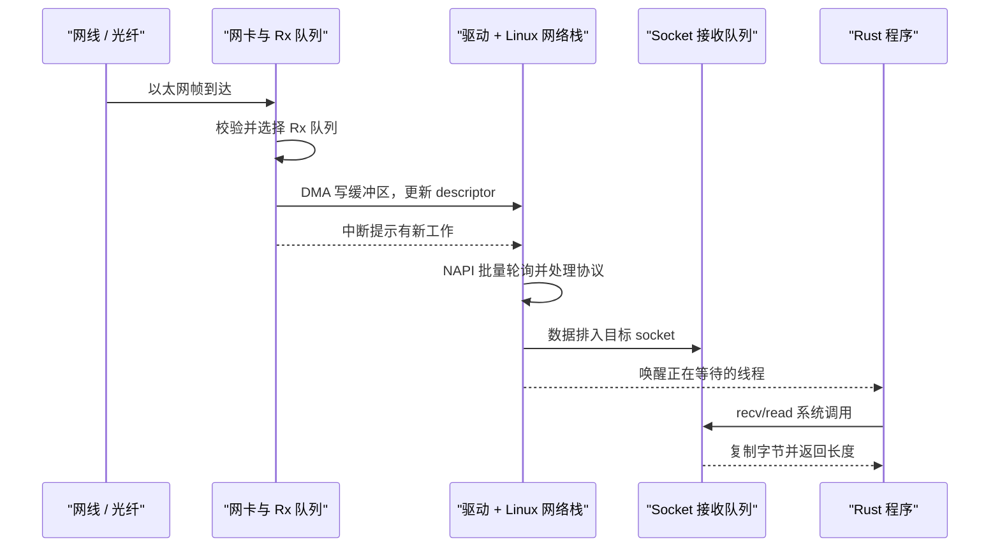

# 网络基础：一条消息如何从网线走进程序

> **面试优先级：P0。** 必须理解收包路径、TCP/UDP 的语义差异、短读/丢包以及 MTU。VLAN、PTP、网卡 offload 和交换机模式先知道用途，网络岗位再深入。

网络不是一个只有“快或慢”的黑盒。程序发出的订单和收到的行情，会经过网卡、主存、内核协议栈、socket 缓冲区和用户缓冲区。理解这条路径，才能回答：延迟花在哪里、包可能丢在哪里、某项优化为什么有效。

本章只建立地图；TCP 参数、UDP 组播、`io_uring` 和内核旁路分别由后续章节深入，避免在一页里重复所有细节。

## 1. 先把基本名词对齐

| 名词 | 是什么 | 为什么需要 |
| --- | --- | --- |
| NIC | Network Interface Card，网卡 | 把线缆上的信号转换为帧，并与主存交换数据 |
| DMA | Direct Memory Access，直接内存访问 | 让设备搬运数据，不要求 CPU 逐字节复制 |
| descriptor | 描述一块缓冲区位置和状态的小记录 | 驱动与网卡用它交接“哪块内存可写/已完成” |
| socket | 内核中的通信端点 | 保存协议状态、收发队列和地址等信息 |
| FD | file descriptor，文件描述符 | 进程用一个小整数引用 socket |

`Rx`（receive）表示接收，`Tx`（transmit）表示发送。不同层还会给数据单位不同名字：L2 常称 **frame（帧）**，IP 层常称 **packet（包）**，TCP 常称 **segment（段）**，UDP 常称 **datagram（数据报）**；**payload（载荷）**指当前这一层头部之外承载的数据。日常交流会混用“包”，面试解释路径时应说明所处层次。

DMA 不等于“数据直接进入业务结构体”，也不自动等于零拷贝。普通 Linux 收包时，网卡通常 DMA 到驱动管理的缓冲区；应用调用 `recv` 后，payload 仍常被复制到用户缓冲区。

## 2. 普通 Linux 收包路径

下面是现代 Linux 的典型路径，不是每块网卡和每个内核版本都完全相同：



### 2.1 为什么既有中断又有轮询

如果每个包都触发一次中断，高包率会让 CPU 忙于进出中断。Linux 的 NAPI（New API，Linux 驱动的收包轮询框架）通常让中断先提示“有工作”，随后由内核在预算内批量轮询队列。

批处理会摊薄每包开销，但也可能让第一个包多等一会。这就是高吞吐和低等待之间的基本取舍。

### 2.2 中断、系统调用和上下文切换不是一回事

- **中断**：设备提醒 CPU 处理事件；
- **系统调用**：用户程序主动进入内核请求服务；
- **模式切换**：CPU 在用户态与内核态权限之间切换；
- **线程上下文切换**：调度器停止一个线程，改运行另一个线程。

一次 `recv` 会发生用户态/内核态的模式切换，但线程若不阻塞，不一定切换成另一个线程。准确区分这些词，是 OS 与网络面试的常见考点。

### 2.3 包可能丢在哪里

```text
交换机出口队列
  → NIC Rx ring
  → 驱动 / NAPI 预算
  → 内核 backlog
  → socket 接收缓冲区
  → 应用自己的队列
```

`SO_RCVBUF` 是 socket 接收缓冲区选项。只增大它只能缓解其中一层；若应用长期处理速度低于到达速度，更大的缓冲区只会延后丢包，并让程序处理已经过时的数据。

## 3. 协议为什么要分层

分层让每一层只解决一类问题：

| 层 | 常见对象 | 回答的问题 |
| --- | --- | --- |
| L2 链路层 | Ethernet、MAC、VLAN | 同一个二层网络里把帧交给哪个接口？ |
| L3 网络层 | IPv4/IPv6、IP、路由 | 跨网络时下一跳和最终主机是谁？ |
| L4 传输层 | TCP、UDP | 进程之间提供怎样的传输语义？ |
| 应用层 | FIX、ITCH、SBE、自定义协议 | 字节代表哪种业务消息？ |

例如 TCP 能保证有序字节流，却不知道某 46 个字节是不是一条订单；应用协议必须用长度字段、固定布局或分隔符定义消息边界。

### 3.1 MAC、IP 和端口分别做什么

- **MAC 地址**用于当前二层链路的帧转发；
- **IP 地址**用于跨网络路由；
- **端口**帮助操作系统把报文交给正确进程中的 socket。

数据跨过路由器时，二层 MAC 头通常会改变，目标 IP 和传输层端口仍用于端到端识别。

### 3.2 ARP / Neighbor Discovery 为什么存在

应用通常知道下一跳 IP，但以太网发送还需要 MAC。IPv4 使用 ARP，IPv6 使用 Neighbor Discovery 来解析邻居地址。邻居项未知时，首批数据可能等待解析，因此低延迟系统会在开盘前预热并监控邻居状态。

不要无条件写死静态 MAC：网关故障切换后，旧映射可能把流量送错地方。

## 4. MTU、MSS 与分片

**MTU**（Maximum Transmission Unit）是某条链路一次可承载的最大网络层包大小；常见以太网 MTU 是 1500 字节，但这不是所有路径的固定值。

**MSS**（Maximum Segment Size）是 TCP 一段中可放的最大 TCP payload。对最简单的 IPv4、无 options 情况，可以用：

```text
MSS = MTU - 20 字节 IPv4 头 - 20 字节 TCP 头
```

IPv6、TCP options 和隧道封装会改变这个值。

IP 分片的问题是：多个分片中任意一个丢失，原始数据报就无法重组；重组也消耗状态与 CPU。低延迟专线通常尽量避免分片，并确保主机、交换机和中间封装对 MTU 的理解一致。

Jumbo Frame（巨型帧）是大于常见 1500-byte MTU 的以太网配置，可以提高大块传输效率，但不会让几十字节的订单消息自动更快。若包过大、禁止分片，而返回的“需要分片”控制消息又被过滤，发送端就可能不断发出无法通过的包，这叫 **Path MTU 黑洞**。

## 5. TCP 与 UDP：选的是语义，不是排行榜

| 问题 | TCP | UDP |
| --- | --- | --- |
| 数据形态 | 有序字节流 | 独立数据报 |
| 连接状态 | 有连接建立与协议状态 | UDP 协议本身没有连接握手 |
| 丢失处理 | 协议栈重传并按序交付 | 应用协议自行检测和恢复 |
| 拥塞/流量控制 | 有 | UDP 本身没有 |
| 消息边界 | 不保留 | 保留每个数据报边界 |
| 常见交易用途 | 订单会话、恢复服务 | 行情组播、遥测 |

### 5.1 为什么订单连接常用 TCP

订单要求可靠、有序、可检测断线的会话语义，交易所接口也常直接规定 TCP。应用仍需处理：

- 一次 `read` 只读到部分消息；
- 多条消息一次到达；
- 连接恢复与业务序列号；
- 内核“已发送”不等于交易所已经接收或成交。

TCP 的握手、Nagle、Delayed ACK 和状态机在 [TCP 优化](./tcp_optimization.md) 中讲解。

### 5.2 为什么行情常用 UDP 组播

组播让网络复制一份 feed 给多个订阅者，发送端不必为每位接收者维护一条 TCP 流。但 UDP 不保证送达、顺序或“参与者绝对公平”。feed 必须用序列号、A/B 线路、重传和快照建立应用层恢复协议，详见 [UDP 组播](./udp_multicast.md)。

Rust 的 `UdpSocket::connect` 只是给 socket 记录默认对端并过滤接收来源，不会像 TCP 那样在网络上执行握手，也不会获得可靠传输。

## 6. “零拷贝”和内核旁路到底省什么

性能技术通常在减少以下一种或多种工作：

- 用户态与内核态之间的数据复制；
- 每批数据所需的系统调用；
- 睡眠、唤醒和调度抖动；
- 通用协议栈中当前业务不需要的处理。

但“内核旁路”是一个家族而不是单一机制：DPDK 常由用户态轮询驱动接管队列；AF_XDP 仍使用内核 XDP 基础设施；OpenOnload 保留 socket API 并加速数据路径。是否零拷贝、是否用中断、是否与内核栈共存，都要看具体模式和配置。

因此不要回答“旁路就是零拷贝、零中断、零上下文切换”。更好的答案是说明被绕过的层、缓冲区所有权、轮询线程和故障恢复分别怎么处理。

## 7. 优化前如何定位

先判断问题发生在哪一层：

| 现象 | 优先检查 |
| --- | --- |
| 网卡统计已有 drop | NIC ring、流量突发、队列映射 |
| backlog/softnet 丢包增长 | 内核待处理队列是否溢出、CPU 是否长期处理不过来 |
| NAPI `time_squeeze` 等预算压力增长 | 轮询预算是否频繁耗尽、IRQ/线程亲和性与 CPU 负载 |
| socket drop 增长 | 接收缓冲、应用是否及时读取 |
| 应用队列积压 | 解析/策略速度、背压设计 |
| 平均值好但 P99.99 差 | 调度、IRQ（中断请求）迁移、批量等待、NUMA（非一致内存访问）、缺页 |

调优顺序应是：建立时间戳和计数器 → 复现实测流量 → 一次只改一个变量 → 同时比较延迟分位数、CPU 和丢包。直接复制一组 `sysctl` 或把所有 offload 都关闭，无法知道究竟哪项有效，也可能牺牲可靠性和吞吐。

## 8. 岗位相关选读

<details>
<summary>PTP、VLAN、Offload 与交换机模式分别是什么？</summary>

- **PTP（Precision Time Protocol）**：在支持硬件时间戳的网卡和网络中同步时钟，用于可追溯时间与单向延迟测量；仍需监控 offset、path delay 和失锁。
- **VLAN**：在同一物理网络上划分逻辑二层广播域，常用于隔离行情、订单和管理网络。
- **Checksum offload**：由网卡计算/验证校验和，通常降低 CPU；抓包时可能看到尚未由网卡补完的校验和。
- **TSO/GSO、GRO/LRO**：发送端分段或接收端合并，能提高吞吐，但会改变应用看到的处理粒度与等待。
- **Interrupt coalescing**：网卡积累包数或时间后再中断，减少中断率但可能增加首包等待。
- **Cut-through switch**：交换机收到足够头部后便开始转发，可能降低转发等待；拥塞、端口速率转换和队列仍会影响延迟。

这些开关没有通用“最佳值”。面试时说明测量方法与副作用，比背某个数字更重要。

</details>

## 9. 一分钟面试回答

> 收包时，网卡通常把数据 DMA 到驱动缓冲区，通过中断提示并由 NAPI 批量处理；内核完成 Ethernet、IP 和 TCP/UDP 等处理后，把数据放进 socket 接收队列，唤醒应用，`recv` 再把字节交给用户缓冲区。延迟可能来自批处理、调度、协议处理和复制，丢包也可能发生在交换机、NIC ring、内核队列、socket 或应用队列。TCP 提供可靠有序字节流，适合订单会话；UDP 保留数据报边界但不保证可靠，组播行情要靠序列号、双线、重传和快照恢复。优化必须先用分层计数器定位，不能看到丢包就只增大一个缓冲区。

## 10. 高频追问

### DMA 为什么不等于零拷贝？

DMA 只说明设备能直接访问主存。普通 socket 路径中，应用取数据时仍可能从内核缓冲区复制到用户缓冲区。

### UDP 一定比 TCP 快吗？

UDP 协议状态更少，但完整系统还包括可靠性、恢复、排队和应用处理。若业务需要有序可靠传输，把这些能力搬到应用层未必更简单或更快。

### 增大接收缓冲区为什么不是万能方案？

它只能吸收短暂突发。长期消费不足时，积压会增加数据年龄和内存占用，最终仍会溢出。

下一章用 [I/O 模型](./io_models.md) 解释线程怎样等待这些 socket。
