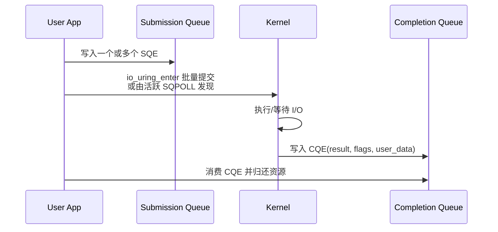

# io_uring 深度解析：提交了，不等于上网线了

> **面试优先级：P2。** 通用面试能区分 SQE、CQE 和 completion 边界即可；注册资源、多次完成和各 opcode 生命周期只在岗位或项目确实使用时深入。

`io_uring` 是 Linux 的异步 I/O 接口。与 `epoll` 常见的“先等 readiness，再调用 `recv`/`send`”不同，它允许应用直接提交读写操作，再从完成队列取得结果。

它的主要价值是批量提交、减少 syscall 次数、注册资源和统一 completion 模型。它不会自动绕过 TCP/IP 协议栈，也不承诺运行期间完全避免 syscall 或 payload copy。

## 1. 先分清四种状态

HFT 面试很爱追问“完成到底完成了什么”。先记住这条阶梯：


这些状态可能重合，也可能相隔很远：

- **SQE 已写入**：只代表用户态 ring 中有一个请求。
- **CQE 已产生**：代表该 opcode 按内核定义完成，具体语义要看是 `read`、`send` 还是 `send_zc`。
- **Buffer 可复用**：内核不再引用这块用户内存；对 zero-copy send 往往需要额外 notification。
- **线上可见**：应由 NIC TX hardware timestamp 或外部设备测量，不能从普通 CQE 推断。
- **对端/业务确认**：分别依靠 TCP ACK、会话 ACK、订单 ACK/Fill 等不同证据。

## 2. SQ、CQ 与系统调用



- **SQE（Submission Queue Entry）**描述操作、fd、buffer、长度和 `user_data`。
- **CQE（Completion Queue Entry）**通常用 `result` 返回字节数或负 errno，用 `flags` 表达 multishot、buffer ID、notification 等附加语义。

普通模式下，应用写 SQE 后仍需 `io_uring_enter`，crate 通常用 `submit`/`submit_and_wait` 封装。一次 enter 可以提交一批请求，所以重点是**摊薄** syscall，而不是假装 syscall 不存在。

### 2.1 SQPOLL 何时仍会 syscall

`IORING_SETUP_SQPOLL` 使用内核线程轮询 SQ。线程活跃时，它可以主动发现新请求；但线程可能睡眠。当 ring 标记 `IORING_SQ_NEED_WAKEUP` 时，应用仍需 enter 唤醒。

还要确认：

- 目标内核及发行版是否支持所需 flag/opcode，是否有 backport 差异。
- 创建 SQPOLL ring 的权限、cgroup、`RLIMIT_MEMLOCK` 和安全策略。
- poll thread 的 CPU affinity、功耗与 housekeeping 规划。
- CQ 满、SQ 满或 poll thread 被抢占时的背压策略。

所以正确说法是：“SQPOLL 在特定状态下可省掉部分提交 syscall”，而不是把整个生命周期描述成不进入内核。

## 3. Rust 中的 buffer 生命周期

下面示例同步等待一个文件读取，仅用于展示所有权边界。它依赖第三方 `io-uring` crate、Linux 内核和有效文件描述符，因此标为 `ignore`；验证时应固定 crate/内核版本，在独立项目执行 `cargo add io-uring`、`cargo check`，再用临时文件覆盖短读、错误 CQE、取消和 ring 满等集成测试。

```rust,ignore
use io_uring::{opcode, types, IoUring};
use std::io;

fn read_once(fd: i32, buf: &mut [u8]) -> io::Result<usize> {
    let mut ring = IoUring::new(8)?;
    let sqe = opcode::Read::new(types::Fd(fd), buf.as_mut_ptr(), buf.len() as _)
        .build()
        .user_data(0x42);

    // SAFETY: buf 的地址在 CQE 到来前保持有效，且没有其他代码并发访问它。
    unsafe {
        ring.submission().push(&sqe).map_err(|_| io::Error::other("SQ full"))?;
    }

    ring.submit_and_wait(1)?;
    let cqe = ring.completion().next().ok_or_else(|| io::Error::other("CQ empty"))?;
    if cqe.result() < 0 {
        return Err(io::Error::from_raw_os_error(-cqe.result()));
    }

    // read 的成功 CQE 表示这些字节已写入 buf；短读是合法结果。
    Ok(cqe.result() as usize)
}
```

低层 crate 接受裸指针，Rust borrow checker 无法自动知道异步操作何时结束。安全封装至少要保证：

- 在途期间 buffer 地址稳定，不能移动、释放或被另一请求重用。
- 读操作完成前，应用不能读取内核正在写的区域。
- 写操作允许复用的时点按 opcode 区分。
- 取消请求也要等到明确 completion 后再回收相关内存。

## 4. 网络收发的完成语义

### 4.1 `recv` / `recvmsg`

成功 CQE 的 `result = n` 表示内核把 `n` 字节交付到所提供的用户 buffer，应用现在可以解析 `buf[..n]`。它不表示 CQE 的时刻就是 NIC DMA 完成时刻；此前还经过驱动、NAPI、协议栈与 socket 队列。

对 UDP，单次 completion 对应一个数据报读取，但仍要检查 truncation、control message 和真实报文长度。对 TCP，它只是一段字节流，可能是半条或多条应用消息。

### 4.2 普通 `send` / `sendmsg`

成功 CQE 通常表示 socket send 操作接受了若干字节进入内核发送路径。它不证明：

- NIC 已经读取 descriptor 或完成 DMA。
- 报文已经在线路或交换机可见。
- TCP 对端已经 ACK。
- 交易所会话或订单网关已经处理。

非阻塞语义仍可能出现 short send。应用必须保存剩余 offset，不能把整帧从头再提交。

## 5. Multishot receive 与 provided buffers

Multishot receive 允许一个 armed 请求产生多个 CQE，减少不断补 SQE 的成本。真正使用时通常要配合 provided-buffer ring/buffer selection：内核为每次接收选择一个可用 buffer，CQE 返回其 ID。

关键规则：

- CQE 带 `IORING_CQE_F_MORE` 才表示请求仍然 armed。
- CQE 带 buffer flag 时，按 flags 解析 buffer ID。
- 处理完数据后，应用要把 buffer 安全归还 buffer ring。
- buffer 耗尽、CQ 溢出、取消或错误都会终止/阻塞接收路径。
- One-shot 补充慢不必然立刻丢包，socket queue 可能暂存；queue 最终溢出才丢 UDP 数据。

下面明确是**教学骨架**，函数名不是某个 crate 的稳定 API。落地时要按固定版本的 `io-uring` 文档替换，并在目标内核探测 opcode/flag 后，用 buffer 耗尽、CQ overflow、取消和 UDP microburst 测试验证。

```rust,ignore
// 教学骨架：实际 API 随 crate 与内核能力变化。
let request = build_multishot_recv(socket_fd, buffer_group_id)?;
submit(request)?;

while let Some(cqe) = next_completion() {
    let buffer_id = buffer_id_from_flags(cqe.flags())?;
    process(provided_buffers.get(buffer_id), cqe.result())?;
    provided_buffers.recycle(buffer_id)?;

    if cqe.flags() & IORING_CQE_F_MORE == 0 {
        rearm_multishot_receive()?;
    }
}
```

这可能适合突发行情流，但必须用目标内核、NIC 驱动、buffer 数量和真实 microburst 验证 P99.99 与丢包。

## 6. `send_zc`：两个 CQE 解决两个问题

Zero-copy send 尝试避免把用户 payload 复制进内核 buffer。内核或驱动可能因协议、对齐、设备能力等原因回退到复制路径，因此“请求了 zc”不等于硬件一定 DMA 用户页。

概念上要区分：

1. **发送操作 CQE**：给出 send 的字节数或错误。
2. **notification CQE**：带 notification flag，表示内核不再引用该用户 buffer，此后才能修改、释放或用于另一条消息。

notification 解决的是**内存所有权**，不是 wire-time 证明。即使 buffer 已可复用，也不能直接断言交易所已收到。如果需要不同层证据：

| 问题 | 更合适的证据 |
| :--- | :--- |
| 用户 buffer 何时可复用？ | zero-copy notification CQE |
| 报文何时离开 NIC？ | NIC TX hardware timestamp/设备文档 |
| TCP 对端是否收到字节？ | TCP ACK（仍不是业务处理） |
| 交易所是否接受订单？ | 协议 Order ACK/Reject |

大块回放可能受益于减少复制；极小订单的 notification、注册与 bookkeeping 成本可能抵消收益。不要设固定包长分界，应该实测。

## 7. Registered buffers 与 files

- **Registered buffers**：预先注册地址稳定的内存，减少每次映射/固定页面的工作；它会占用锁页等资源，并强化生命周期约束。
- **Registered files**：减少每次从 fd table 查找 file 的工作；更新、注销和关闭顺序需要明确。
- **Fixed/provided buffer**不是同一个概念：前者给请求指定已注册 buffer index，后者由内核从 buffer group 选择。

注册通常发生在初始化阶段，但并不代表系统运行期绝无注册、更新、取消或唤醒 syscall。

## 8. HFT 选型表

| 方案 | 优势 | 关键边界 | 常见用途 |
| :--- | :--- | :--- | :--- |
| epoll + socket | 生态成熟、语义清晰 | readiness 后仍要 partial recv/send | 多连接网关 |
| io_uring 普通模式 | 批量 SQE/CQE，多类 I/O 统一 | enter/wait、ring 背压、版本 | 持久化、记录、网关 |
| io_uring SQPOLL | 某些状态减少提交 syscall | 权限、NEED_WAKEUP、专用 CPU | 高频提交且可承担运维成本 |
| multishot + buffer ring | 减少接收请求补充 | F_MORE、buffer/CQ 回收 | 突发 UDP 接收 |
| send_zc | 可能降低复制与内存带宽 | 双 completion、fallback、所有权 | 大块/高带宽发送 |
| 用户态网络 | 更直接控制 NIC queue | 驱动接管、协议栈、权限与工具 | 极端数据路径 |

## 9. 面试追问

### Q1：SQPOLL 能否让整个生命周期都不调用 syscall？

不是。它在 poll thread 活跃时可省掉部分提交 syscall；线程睡眠且出现 `NEED_WAKEUP` 时仍需 enter。初始化、注册、等待、取消和资源管理也可能进入内核。

### Q2：收到 send CQE 能不能复用 buffer？

普通 copy send 通常可以在操作返回后复用，因为内核已经复制/接受了数据；`send_zc` 要等额外 notification，不能只看首个发送 CQE。具体必须按 opcode 文档和 flags 实现。

### Q3：CQE 是否等于 NIC DMA completion？

不能这样概括。CQE 表示内核定义的操作完成。`recv` CQE 表示字节已在用户 buffer；send CQE/notification 各有自己的语义。线上可见性需硬件时间戳或外部测量。

## 10. 总结

`io_uring` 的价值是可批量的 operation/completion 模型，而不是一个“自动更快”的标签。选择前要固定内核、crate、权限、驱动和 opcode 能力，设计 SQ/CQ 与 buffer 背压，并用真实流量测量完整延迟分布。

---

下一章：[市场连接：协议概述](../connectivity/protocols.md)
