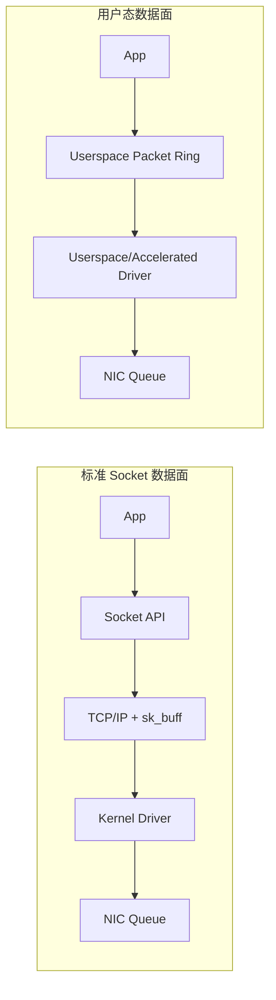
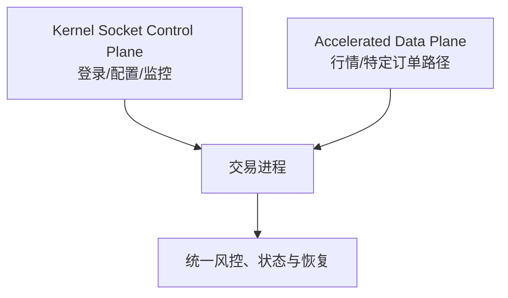

# 内核旁路：更直接控制数据面，也接管更多责任

标准 socket 路径会经过系统调用、协议栈、socket buffer 和内核驱动。一次 syscall 是用户态/内核态切换，但不一定发生线程上下文切换；现代 Linux 还会使用 NAPI、批处理和 offload，不能简化成“一包一次中断”。

内核旁路的目标是减少通用路径开销，让应用更直接地管理 packet buffer 与 NIC queue。不同方案旁路程度不同：DPDK 往往接管设备数据面，AF_XDP 仍依赖 XDP/内核驱动，OpenOnload 则保留 socket API 并使用用户态协议栈。

## 1. 旁路的是数据面，不是整个操作系统



即便数据包不走通用 socket 栈，系统通常仍依赖内核完成：

- PCIe/IOMMU、设备权限和资源隔离。
- 内存 pin/map、hugepage 或 UMEM 注册。
- 网卡初始化、控制面、链路状态和故障恢复。
- 进程调度、CPU/NUMA、cgroup 和安全审计。

所以“完全跳过内核”适合描述某段 packet fast path，不适合描述整套系统。

## 2. 三类完成语义

### 2.1 RX：描述符交给应用

收到 RX descriptor/event 通常表示 NIC/驱动已把某个 packet buffer 的所有权交给应用。应用可以读取有效长度内的字节，但必须确认：

- descriptor 是否跨多个 segment。
- checksum/VLAN/timestamp offload 的 metadata。
- buffer 在何时、以什么顺序归还 fill/RX ring。
- 归还后应用不得继续持有指向该 buffer 的引用。

它不代表 packet 到达 NIC 的精确线缆时刻；需要 RX hardware timestamp 才能获得更靠近 wire 的时间证据。

### 2.2 TX enqueue：NIC 接受了 descriptor

把 descriptor 写入 TX ring 或 `tx_burst` 返回成功，通常只说明该 descriptor 被软件/驱动队列接受。它不自动证明：

- NIC 已经完成 DMA 读取。
- 报文已从端口发出。
- 对端、TCP 或交易所已确认。

### 2.3 TX completion：buffer 可回收

TX completion/clean 通常允许应用回收 packet buffer，因为设备不再需要它。这个“可复用”语义仍不等于对端业务可见。需要 wire time 时看 NIC timestamp，需要业务接受时看协议回报。

## 3. 主流方案对比

| 方案 | 数据面模型 | 保留的内核能力 | 主要依赖 | 运维边界 |
| :--- | :--- | :--- | :--- | :--- |
| DPDK | PMD 轮询 mbuf/ring | 控制面仍依赖 Linux；设备常绑定 VFIO | NIC PMD、hugepage、IOMMU | 接管设备、专用核、独立观测链路 |
| AF_XDP | XDP redirect 到 UMEM ring | Linux 驱动、BPF/XDP 控制面 | 内核、驱动 zero-copy 能力、BPF 权限 | queue/UMEM 生命周期、fallback 模式 |
| OpenOnload | 用户态 TCP/UDP 栈，兼容 socket | 文件描述符与部分控制语义 | 支持的 AMD/Solarflare NIC、驱动版本 | preload/stack 配置、fallback 监控 |
| ef_vi | 直接管理 VI Rx/Tx/Event queue | 驱动负责资源与保护域 | 厂商 NIC/驱动/API | 自己处理协议、buffer 与恢复 |
| 内核 socket + busy poll | 仍走 Linux 网络栈 | 工具、协议栈和可观测性完整 | 内核、驱动 busy-poll 支持 | CPU/功耗，但迁移成本较低 |

不存在脱离硬件、协议与团队能力的“最快方案”。

## 4. Rust FFI 的真正难点是所有权

下面是**教学骨架**，使用 DPDK 风格的 C FFI 名称和项目自定义 `Mbuf` 封装，不是可独立编译的 Rust。真实验证需要锁定 DPDK、PMD、bindgen/wrapper 与 NIC 固件版本，先做 ABI/layout 测试和 `cargo check`，再在测试端口覆盖多 segment、空指针、异常长度、队列溢出与 shutdown drain。

```rust,ignore
fn run_rx(port: u16, queue: u16) {
    let mut raw = [std::ptr::null_mut::<rte_mbuf>(); 32];

    loop {
        let count = unsafe {
            rte_eth_rx_burst(port, queue, raw.as_mut_ptr(), raw.len() as u16)
        } as usize;

        for mbuf_ptr in &raw[..count] {
            // 从这里开始应用拥有/借用 mbuf；FFI wrapper 应验证非空、长度和 segments。
            let packet = unsafe { Mbuf::from_rx_owned(*mbuf_ptr) };
            parse_packet(packet.bytes());
            // Drop 归还 mempool；若转发则显式转移所有权，不能再 Drop 两次。
        }
    }
}
```

安全封装需要表达：

- RX 后谁拥有 mbuf/UMEM frame。
- 零拷贝切片不能活过底层 descriptor。
- clone 是引用计数、深拷贝还是非法操作。
- TX 接受了多少个 descriptor；未接受部分仍归调用者。
- completion 之前哪些 buffer 不能复用。
- shutdown 时如何 drain RX/TX/completion 并注销 DMA 内存。

不要直接把 packet pointer 强转为 `&MarketData`。网络字节可能未对齐、长度不足且字节序不同；应从 `&[u8]` 做边界检查和显式 endian 转换。

## 5. 混合架构通常更容易上线



- 控制面可继续用 `TcpStream`、TLS、DNS 和成熟运维工具。
- UDP 行情可使用 DPDK、AF_XDP 或 ef_vi。
- TCP 订单是否加速取决于交易所接口、用户态协议栈成熟度和恢复需求。
- 管理口与数据口分离，避免接管设备后失去 SSH/监控路径。

关键不是“旁路比例越高越好”，而是每条路径有清晰的 ownership、风控、时间戳和 fallback 契约。

## 6. 能力、权限与部署检查

### 6.1 硬件与驱动

- NIC 型号、固件、queue 数和所需 offload 是否匹配。
- PCIe link、NUMA node、IOMMU group 与 DMA 隔离是否正确。
- 驱动/PMD/XDP zero-copy/厂商库版本是否经过组合验证。
- SR-IOV、虚拟机或容器是否暴露所需 queue 和权限。

### 6.2 权限与资源

- VFIO、BPF、hugepage、锁页和设备节点权限遵循最小权限。
- 不以“运行方便”为理由长期给交易进程完整 root/capability。
- DMA 内存、mempool、UMEM、ring 和 file descriptor 都有容量预算。

### 6.3 CPU 与 NUMA

轮询线程通常绑核，并规划 IRQ/housekeeping 与 SMT sibling。`isolcpus` 是一种部署手段，不是运行 DPDK 的强制前提；cpuset/cgroup、调度策略和 IRQ affinity 也可参与隔离。任何方案都要通过 migrations、interrupts 与尾延迟验证。

## 7. 常见陷阱

### 7.1 控制协议没有消失

DPDK/ef_vi 的 raw Ethernet 路径可能需要应用或配套栈处理 ARP/ND、VLAN、IP、组播 membership 和 TCP。AF_XDP/OpenOnload 的责任边界不同，不能统一说“旁路后必须自己回复 ARP”。

### 7.2 抓包位置改变

通用 `tcpdump` 可能看不到被硬件 filter/用户态 queue 消费的 fast-path packet，但 AF_XDP/XDP 的 tap 点、OpenOnload fallback 和厂商工具各不相同。设计 port mirror、硬件 timestamp、应用采样和 ring 计数器，且避免采样本身阻塞热路径。

### 7.3 轮询也会丢包

用户态轮询不能消除：交换机 drop、NIC FIFO/ring 溢出、descriptor/buffer 耗尽、PCIe/NUMA 问题和应用处理过慢。仍需从交换机、NIC、ring、应用 sequence 四层对账。

### 7.4 升级与回滚

内核、固件、BIOS、PMD 和用户态库构成兼容矩阵。发布前要验证绑定/解绑设备、fallback 网络、进程崩溃后的资源清理，以及旧版本能否重新附着 queue。

## 8. 面试追问

### Q1：Kernel bypass 是否等于 zero copy？

不等于。旁路描述数据路径是否经过通用内核栈；zero copy 描述 payload 是否被复制。方案可能旁路但仍复制，也可能内核路径使用 registered/zero-copy buffer。

### Q2：`tx_burst` 返回成功是否表示订单已经发出？

通常只表示若干 descriptor 被 TX queue 接受。TX completion 更接近“buffer 可回收”；wire timestamp 才回答端口发送时刻，订单 ACK 才回答交易所是否接受。

### Q3：为什么不是所有 HFT 都使用 DPDK？

它需要设备接管、专用 CPU、内存与权限配置，还可能失去内核 TCP、抓包和成熟运维能力。若 socket busy poll/OpenOnload 已满足 SLA，更复杂方案未必值得。

## 9. 延伸阅读

- [DPDK Documentation](https://doc.dpdk.org/guides/)
- [Linux AF_XDP Documentation](https://docs.kernel.org/networking/af_xdp.html)
- [smoltcp](https://github.com/smoltcp-rs/smoltcp) —— 适合研究用户态协议栈，不代表可直接替代生产交易 TCP 栈。

---

下一章：[TCP 协议优化](tcp_optimization.md)
