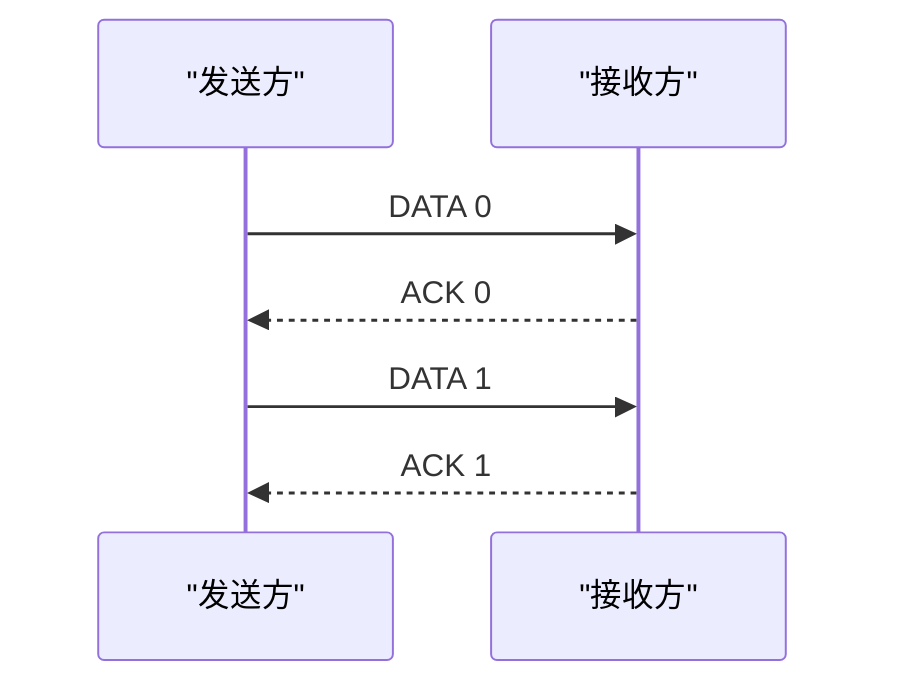
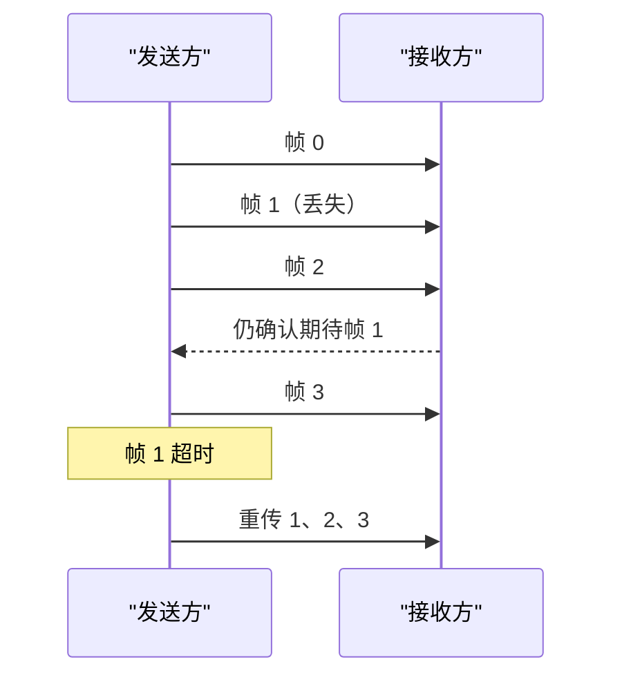
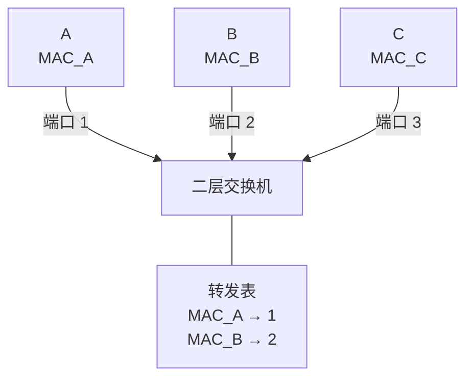

# 数据链路层：在一段链路上组织并交付帧

物理层能够把比特变成信号，但它不回答这些问题：一串连续比特从哪里开始、在哪里结束？传输中发生了错误怎样发现？多台主机共用一条介质时，谁先发送？

**数据链路层（data link layer）**工作在相邻节点之间。它把网络层交来的分组装进帧，在一段链路上传递，并按照具体链路技术提供成帧、差错检测、介质访问等能力。


帧 1 和帧 2 可以采用不同格式。网络层分组负责跨越多段网络，链路层帧只负责当前这一段交付。网卡和操作系统怎样处理帧见 [Linux 网络收发路径](basics.md)。

## 1. 帧是什么，为什么必须成帧

**帧（frame）**是链路层的传输单位。发送方通常在网络层分组前后加入链路层首部和尾部：

```text
┌──────────────┬──────────────────┬──────────────┐
│ 链路层首部   │ 网络层分组       │ 链路层尾部   │
└──────────────┴──────────────────┴──────────────┘
```

**成帧（framing）**是把连续比特流划分成一帧一帧的过程。没有边界，接收方就无法判断某个地址字段属于哪一帧，也无法对一帧单独检错。

常见的边界方法包括：

| 方法 | 怎样识别边界 | 需要解决的问题 |
| --- | --- | --- |
| 长度字段 | 首部写明帧长 | 长度字段损坏会影响后续解析 |
| 字节定界 | 特殊字节标记开始或结束 | 数据中出现同一字节时要转义 |
| 比特定界 | 特殊比特模式标记边界 | 数据中出现相同模式时要填充 |
| 物理层编码违例 | 使用正常数据编码不会出现的信号 | 依赖具体物理编码 |

### 1.1 透明传输与字节填充

如果协议用特殊字节 `FLAG` 表示帧边界，而用户数据恰好含有 `FLAG`，接收方不能把它误认为结束。发送方可以在数据中的 `FLAG` 和转义字节 `ESC` 前再插入 `ESC`；接收方看到 `ESC` 后，把下一个字节按普通数据处理。

这种机制称为**字节填充（byte stuffing）**。它实现了**透明传输**：用户可以发送任意字节内容，链路层的控制符不会改变用户数据的含义。

### 1.2 比特填充推演

某些比特定界协议使用 `01111110` 作为标志。为避免数据中自然出现这个模式，发送方在数据里每连续出现五个 `1` 后自动插入一个 `0`。

```text
原始数据：  01111110111110
填充后：    0111110101111100
                  ^       ^
                插 0    插 0
```

接收方在帧内部看到连续五个 `1` 后的 `0`，便删除这个填充位。填充位只帮助识别边界，不属于上层数据。

## 2. 差错检测：知道比特是否被破坏

噪声和干扰可能让 `0` 变成 `1`，也可能让连续多个比特出错。差错处理要先分清两件事：

- **差错检测（error detection）**：判断收到的数据可能有错；
- **差错纠正（error correction）**：在不重传的情况下恢复原数据。

增加冗余信息可以提高检错或纠错能力，但不能用有限冗余保证发现任意错误。链路层常用奇偶校验和 CRC；更强的纠错码通常需要更多冗余和计算。

### 2.1 奇偶校验的边界

偶校验让整个码字中 `1` 的数量为偶数。若数据 `1011001` 中有四个 `1`，偶校验位为 `0`；若有奇数个 `1`，校验位为 `1`。

单个比特翻转会改变奇偶性，因此能被发现；两个比特同时翻转可能仍保持偶数个 `1`，所以奇偶校验不能检测所有多比特错误。

## 3. CRC：把比特串当作多项式

**CRC（Cyclic Redundancy Check，循环冗余校验）**把比特串看作系数只取 0 或 1 的多项式。发送方和接收方预先约定一个生成多项式对应的比特串 `G`，发送方计算余数并附在数据后。

CRC 除法使用模 2 运算：加减都等价于异或，不产生进位或借位。

### 3.1 完整数字推演

设原始数据和生成串为：

```text
D = 1101011011
G = 10011
```

`G` 有 5 bit，最高次数为 4，所以先在 `D` 后补 4 个 `0`：

```text
1101011011 0000
```

从左向右，只要当前最高位为 `1`，就把对齐的 `10011` 与当前串异或：

```text
11010110110000
10011
-------------- XOR
01001110110000
 10011
-------------- XOR
00000010110000
      10011
-------------- XOR
00000000101000
        10011
-------------- XOR
00000000001110
```

最后 4 bit 余数为：

```text
R = 1110
```

发送的码字是：

```text
T = D || R = 11010110111110
```

接收方用同一个 `G` 除 `T`。若余数不是全零，说明检测到了错误；余数为零表示“没有检测到错误”，不等于数学上证明一定没有错误。

### 3.2 CRC 能做什么

若生成多项式选择合理，CRC 能检测所有单比特错误，并能检测许多多比特错误。对于首尾系数均为 1 的 `r` 次生成多项式，可以检测长度不超过 `r` 的所有突发错误。实际以太网使用标准规定的 CRC-32 生成多项式，不能随意采用本节为了方便手算而选择的 `10011`。

CRC 通常负责**检测**而不是纠正。检测失败后是丢弃、重传还是上报，由具体链路和上层协议决定。

## 4. 可靠传输、流量控制与拥塞控制

这三个概念解决不同问题：

| 机制 | 保护谁或处理什么 | 典型手段 |
| --- | --- | --- |
| 差错控制 / 可靠传输 | 处理帧损坏、丢失和重复 | 序号、确认、计时器、重传 |
| 流量控制 | 防止发送方长期快于接收方处理能力 | 接收窗口、暂停或限制发送 |
| 拥塞控制 | 防止网络内部长期承载超过能力的流量 | 调整发送速率、避开拥塞 |

链路层可靠传输发生在相邻节点，TCP（Transmission Control Protocol，传输控制协议）可靠传输发生在端系统之间。并非每种链路都需要重传：现代全双工以太网通常检错后丢弃错误帧；无线链路更容易出错，常使用链路层确认与重试。

### 4.1 流量控制的基本模型

接收方处理帧的速度可能暂时低于帧到达速度，因此通常要先把正确帧放进有限的**接收缓冲区**。如果发送方持续灌入数据，缓冲区最终会满；之后即使链路没有任何比特错误，帧也会因无处存放而丢失。


因此，流量控制的基本闭环是：接收方报告自己还能接收多少，发送方据此限制未确认数据量。停止等待把未确认帧数限制为 1；滑动窗口把上限扩展为多个帧。流量控制只保护接收端，不能解决许多发送者同时挤压网络内部队列的拥塞问题。

### 4.2 ARQ（自动重传请求）的四个零件

**ARQ（Automatic Repeat reQuest，自动重传请求）**通常需要：

1. **序号**：区分新帧与重传帧；
2. **ACK（Acknowledgment，确认）**：接收方说明哪些帧已正确收到；
3. **计时器**：发送方等待太久仍未收到确认时判定超时；
4. **重传规则**：决定重发一帧还是一段窗口。

确认本身也可能丢失，所以接收方必须能识别重复帧，不能把每次重传都再次交给上层。

## 5. 停止等待协议

**停止等待（stop-and-wait）**每发送一帧就停下来等待确认，确认后才发送下一帧。



### 5.1 为什么需要 1 bit 序号

假设 `DATA 0` 已正确到达，但 `ACK 0` 丢失。发送方超时后重发 `DATA 0`。接收方看到序号仍为 0，知道它是重复帧，只重新确认而不重复交付。

当同一时刻最多只有一帧未确认时，序号 `0` 和 `1` 交替就足以区分新旧帧。

### 5.2 利用率算例

设一帧长 `L` bit、链路速率为 `R` bit/s，则帧发送时间为 `L/R`。忽略确认帧发送时间和两端处理时间，这里的 RTT（Round-Trip Time，往返时间）表示数据帧最后一个比特送上链路后，到相应确认返回发送方的等待时间；停止等待的链路利用率近似为：

```text
U = (L/R) / (RTT + L/R)
```

若 `L = 12,000 bit`、`R = 100 Mbit/s`、`RTT = 20 ms`：

```text
L/R = 0.12 ms
U = 0.12 / (20 + 0.12)
  ≈ 0.006
  = 0.6%
```

长距离高速链路大部分时间都在等待确认，因此需要允许多帧同时在途的滑动窗口协议。

## 6. 滑动窗口、回退 N 帧与选择重传

**滑动窗口（sliding window）**允许发送方在没有逐帧等待的情况下连续发送多个有序帧。确认到达后，窗口向前移动，新的序号才获得发送资格。

### 6.1 GBN（回退 N 帧）：出错后从缺口开始重发

**GBN（Go-Back-N，回退 N 帧）**的发送方可以连续发送多帧；接收方只按序接收下一帧，通常丢弃失序帧，并返回累计确认。



GBN 的优点是接收方简单，只需一个按序位置；代价是单帧丢失可能让已经到达的后续帧也被重传。

### 6.2 SR（选择重传）：只重传缺失帧

**SR（Selective Repeat，选择重传）**分别确认每一帧。接收方可以缓存窗口内失序到达的帧；发送方通常为未确认帧分别维护状态，只重传超时或被判定丢失的帧。

SR 减少无谓重传，但接收缓存、计时器和状态管理更复杂。

### 6.3 序号空间为什么限制窗口大小

若序号字段有 `m` bit，序号会在 `0` 到 `2^m - 1` 之间循环。

- GBN 的发送窗口通常必须满足 `W_s ≤ 2^m - 1`；
- SR 为避免旧帧与新一轮同序号帧产生歧义，发送和接收窗口通常满足 `W ≤ 2^(m-1)`。

例如 `m = 3`，序号为 0 到 7：GBN 发送窗口最多为 7；SR 窗口最多为 4。若 SR 窗口大于序号空间的一半，延迟到达的旧帧可能落入新接收窗口，接收方无法仅凭序号判断它是哪一轮的数据。

| 协议 | 发送窗口 | 接收失序帧 | 确认 | 丢失后的重传 |
| --- | ---: | --- | --- | --- |
| 停止等待 | 1 | 不涉及 | 每帧确认 | 当前帧 |
| GBN | 多帧 | 通常丢弃 | 累计确认 | 从缺口起的一批帧 |
| SR | 多帧 | 缓存窗口内帧 | 分别确认 | 只重传缺失帧 |

## 7. 共享介质：谁可以发送

如果多台设备共用一条广播介质，同时发送可能互相干扰。**MAC（Media Access Control，介质访问控制）协议**规定设备怎样竞争或分配发送机会。

介质访问方法可以粗分为：

- **信道划分**：按频率、时隙或码序列预先分配；
- **随机访问**：设备有数据便尝试发送，冲突后重试；
- **轮流访问**：轮询或令牌控制发送次序。

频分、时分、波分和码分的物理直觉已在物理层讲过；本章关注随机访问时如何处理竞争。

### 7.1 ALOHA

纯 ALOHA 允许设备随时发送；若没有收到成功确认，随机等待后重传。一个帧发送期间前后各一个帧时长内，其他帧都可能与它重叠，因此冲突窗口较大。

时隙 ALOHA 把时间划成等长时隙，只允许在时隙边界发送，缩小冲突窗口。理想模型中，纯 ALOHA 最大吞吐约为 18.4%，时隙 ALOHA 约为 36.8%。这些数值来自特定随机到达模型，用于理解机制上限，不是现实网络的固定利用率。

若 `G` 表示一个帧时长内平均尝试发送的帧数，`S` 表示成功帧数，则理想模型给出：

```text
纯 ALOHA： S = G · e^(-2G)，G = 0.5 时最大，S = 1/(2e) ≈ 0.184
时隙 ALOHA：S = G · e^(-G)， G = 1   时最大，S = 1/e    ≈ 0.368
```

时隙化把一个帧的易冲突时间从前后共两个帧时长缩短为一个帧时长，所以理论上限恰好提高一倍。

### 7.2 CSMA（载波侦听多路访问）：发送前先听

**CSMA（Carrier Sense Multiple Access，载波侦听多路访问）**要求设备发送前先监听介质是否忙。若忙则等待，若空闲才发送。

监听不能彻底消除冲突，因为信号传播需要时间：两台相距较远的设备可能都还没听到对方，便几乎同时开始发送。

### 7.3 CSMA/CD（带冲突检测的载波侦听多路访问）：有线以太网中的冲突检测

**CSMA/CD（Carrier Sense Multiple Access with Collision Detection，带冲突检测的载波侦听多路访问）**用于早期共享式、半双工以太网：

1. 发送前监听；
2. 介质空闲时发送，同时继续监听；
3. 检测到冲突后停止并发送干扰信号；
4. 使用二进制指数退避随机等待，再重新竞争。

最小帧长保证发送方在发送完之前仍有机会检测最远端产生的冲突。现代交换式全双工以太网的每条链路只有两个端点，可以同时双向发送，不再使用 CSMA/CD 解决碰撞。

<details>
<summary>怎样由传播时间推出最小帧长？</summary>

设最远两个端点间的单程传播时间为 `τ`。发送方必须持续发送至少 `2τ`，才能在最坏情况下等到冲突信号返回，因此：

```text
最小发送时间 ≥ 2τ
最小帧长 L_min ≥ 2τR
```

若速率 `R = 10 Mbit/s`、`τ = 25.6 μs`，则 `L_min ≥ 2 × 25.6 μs × 10 Mbit/s = 512 bit = 64 byte`。这是经典以太网最小帧长的直觉来源。

二进制指数退避则让连续冲突越多的设备从越大的随机范围选等待时间，降低再次同时发送的概率。

</details>

### 7.4 CSMA/CA（带冲突避免的载波侦听多路访问）：无线网络中的冲突避免

无线设备在自己发送时很难可靠听出其他弱信号，因此 IEEE（Institute of Electrical and Electronics Engineers，电气电子工程师学会）802.11 无线局域网主要使用 **CSMA/CA（Carrier Sense Multiple Access with Collision Avoidance，带冲突避免的载波侦听多路访问）**：先监听，再经过帧间间隔和随机退避发送，接收方用链路层确认说明成功。

<details>
<summary>隐藏终端与“请求发送 / 允许发送”握手解决什么问题？</summary>

两台无线终端可能互相听不到，却都能听到同一个接入点，这叫隐藏终端。可选的 RTS（Request to Send，请求发送）/CTS（Clear to Send，允许发送）握手让接入点附近的其他设备知道介质将被占用。握手本身也有开销，通常不会对每个很小的帧无条件使用。

</details>

## 8. MAC（介质访问控制）地址：标识当前链路上的接口

以太网使用 **MAC 地址**标识链路层接口。常见 MAC 地址为 48 bit，通常写成六组十六进制数，例如：

```text
3C:52:82:1A:7B:90
```

MAC 地址服务于当前链路或局域网中的帧交付；IP（Internet Protocol，网际协议）地址服务于跨网络寻址。访问远端主机时，以太网帧的目的 MAC 地址通常是默认网关的接口地址，而不是远端服务器的 MAC 地址。

路由器转发到下一段链路时会去掉旧帧并生成新帧，所以源、目的 MAC 地址会逐跳改变。

<details>
<summary>单播、组播和广播 MAC 地址</summary>

单播地址指向一个接口；组播地址指向一组接收者；全 `1` 的 `FF:FF:FF:FF:FF:FF` 是以太网广播地址。地址首字节的最低有效位用于区分单播与组播，紧邻的一位表示全局管理或本地管理。厂商前缀由 IEEE 注册分配，本章关注地址作用域和转发行为。

</details>

## 9. 以太网帧

Ethernet（以太网）的常见帧结构如下。其中 SFD（Start Frame Delimiter，帧开始定界符）标记正式帧字段开始，FCS（Frame Check Sequence，帧校验序列）保存帧的 CRC 结果。

```text
┌────────┬─────┬────────┬────────┬──────────┬─────────────┬─────┐
│ 前导码 │ SFD │ 目的MAC│ 源MAC  │ 类型/长度│ 数据与填充  │ FCS │
│ 7 B    │ 1 B │ 6 B    │ 6 B    │ 2 B      │ 46~1500 B   │ 4 B │
└────────┴─────┴────────┴────────┴──────────┴─────────────┴─────┘
```

- **前导码**帮助接收端同步；
- **SFD** 标记正式帧字段开始；
- 目的、源 MAC 地址说明当前链路上的接收者和发送者；
- 类型字段说明载荷中的上层协议；
- 数据不足 46 byte 时需要填充，以满足最小帧长；
- **FCS** 保存 CRC 结果。

从目的 MAC 到 FCS 的标准以太网帧最小 64 byte、通常最大 1518 byte。常说的 1500-byte MTU（Maximum Transmission Unit，最大传输单元）是以太网帧可承载的网络层载荷上限，不是整个帧长度。前导码、SFD 和帧间间隔通常不计入 64 到 1518 byte 的帧长。

## 10. 交换机怎样学习与转发

二层交换机维护一张转发表，记录“某个源 MAC 地址最近从哪个端口出现”。这种学习不需要管理员为每台主机手工配置。



处理一帧时，交换机执行：

1. 用**源 MAC 地址**更新“源地址 → 入端口”记录；
2. 查找**目的 MAC 地址**；
3. 若目的端口已知且不同于入端口，只转发到该端口；
4. 若目的未知，向同一广播域内除入端口外的端口泛洪；
5. 若目的就在入端口一侧，可以过滤而不转发。

表项会老化，以适应主机移动。交换机与集线器不同：集线器在物理层复制信号，交换机理解帧地址，并把不同端口划成不同冲突域。

<details>
<summary>为什么二层环路很危险？</summary>

以太网帧没有像 IP 那样逐跳减少的生存字段。若交换机之间形成环，广播帧和未知单播可能不断复制，造成广播风暴，源地址也会在端口间来回抖动。工程上使用生成树等机制阻断逻辑环路。

</details>

## 11. VLAN（虚拟局域网）：在同一设备上划分广播域

**VLAN（Virtual Local Area Network，虚拟局域网）**把同一组物理交换设备划分成多个逻辑广播域。不同 VLAN 的广播默认互不传播，需要路由器或三层交换功能才能互通。

IEEE 802.1Q 在以太网帧中加入 4 byte 标签。标签包含：

- **TPID（Tag Protocol Identifier，标签协议标识）**：说明这是 802.1Q 标签；
- **TCI（Tag Control Information，标签控制信息）**：包含优先级、丢弃资格和 VLAN 编号；
- 其中 **VID（VLAN Identifier，VLAN 标识）**使用 12 bit，可表示约 4094 个可用 VLAN 编号，0 和 4095 有保留用途。

标签会让传统最大 1518-byte 以太网帧增加到 1522 byte；这两个长度都不计前导码和帧开始定界符。网络层载荷上限通常仍由接口 MTU 决定。

面向终端的**接入端口（access port）**通常只属于一个 VLAN，帧离开端口时可以不带标签；交换机之间的**干道端口（trunk port）**可以承载多个 VLAN，通常使用标签区分。

VLAN 能限制广播范围并帮助网络分区，但它不是完整安全边界。错误配置、二层攻击和跨 VLAN 的三层策略仍需要单独防护。

## 12. 三类应用中的链路层

| 场景 | 链路层基础怎样使用 |
| --- | --- |
| 传统后端 | 判断同网段通信、广播域、交换机转发和 VLAN 隔离；理解“网络通但服务不通”可能发生在不同层 |
| AI（Artificial Intelligence，人工智能）基础设施 | 理解机架内交换、链路拥塞、帧错误和多租户 VLAN；先有二层基础，再学习数据中心专用网络 |
| HFT（High-Frequency Trading，高频交易）系统 | 理解交易专线仍由帧、交换机和 VLAN 承载；组播恢复属于应用协议，不由以太网自动保证 |

## 13. 408 推演题

### 题 1：CRC

数据 `101100` 使用生成串 `1101`。应补几个 `0`？最终发送码字怎样求？

<details>
<summary>参考答案</summary>

生成串 `1101` 为 4 bit，最高次数 `r=3`，所以数据后补 3 个 0：`101100000`。模 2 长除法每步只异或：

```text
1011 xor 1101 = 0110   -> 当前有效串从第 1 位开始为 1100...
1100 xor 1101 = 0001   -> 下一处最高 1 在第 4 位
1000 xor 1101 = 0101
1010 xor 1101 = 0111   -> 最后 3 bit 余数 111
```

把余数替换补零得到码字 `101100111`。验算时无需重新猜商：`101100000` 除以生成多项式的余数是 `111`，码字就是它再异或同一余数 `000000111`，因此新余数为 `111 xor 111=000`；完整模 2 长除法也应得到 `000`。

</details>

### 题 2：窗口与序号

序号字段为 4 bit。GBN 发送窗口最大取多少？SR 窗口最大取多少？

<details>
<summary>参考答案</summary>

4 bit 序号空间为 `N=2^4=16`，画成环为 `0,1,...,15,0,...`。

| 协议 | 窗口约束 | 最大值 | 防止的歧义 |
|---|---:|---:|---|
| GBN | `W_s≤N-1` | 15 | 必须留一个序号区分整窗新帧与旧帧 |
| SR（收发窗口同大） | `2W≤N` | 8 | 窗口绕回后新旧接收范围不能重叠 |

验算 SR：窗口 8 时旧窗口可为 `0..7`，滑过后新窗口为 `8..15`，不重叠；若窗口 9，新窗口会绕回含 0，与旧窗口重叠。

</details>

### 题 3：交换机学习

交换机表为空。A 从端口 1 给 B 发帧，B 在端口 2；随后 B 回复 A。说明两次转发和表项变化。

<details>
<summary>参考答案</summary>

第一帧到达后学习 `MAC_A → 端口1`；B 未知，因此向除端口 1 外的端口泛洪。B 回复时学习 `MAC_B → 端口2`；此时 A 已知，只转发到端口 1。

</details>

## 14. 做题方法：CRC、滑动窗口与交换机

1. **CRC 题先补零**：生成多项式最高次数为 `r`，数据尾部补 `r` 个 0；除法每一步只做异或，不借位，最后保留不足 `r` 位的余数。
2. **CRC 验算**：把“原数据 + 余数”再除以生成多项式，余数应为 0；同时检查余数位数没有超过 `r`。
3. **窗口题画序号环**：写出序号空间 `0..2^k-1`、发送窗口、接收窗口和每个 ACK 的含义，再按时间线移动窗口。GBN 累计确认，SR 单独确认，二者不能混算。
4. **利用率题画一轮**：标发送一帧、传播、ACK 返回和超时位置；一轮内可连续发送的帧数受窗口限制，再用有效发送时间除以周期。
5. **交换机题维护表格**：每收到一帧先学习“源 MAC→入端口”，再查目的 MAC；未知目的泛洪，已知目的定向转发，同端口则过滤。

常见陷阱：普通二进制除法替代模 2 除法；SR 窗口超过序号空间一半造成新旧帧歧义；把 ACK 编号理解成已收到的最后一帧却不看题目定义；交换机根据目的地址学习表项。

## 15. 章末面试题

1. 为什么物理层已经能传比特，链路层还需要成帧？

<details>
<summary>参考答案</summary>

物理层只给出连续比特/信号，没有指出一条消息从哪里开始、到哪里结束。成帧用长度、定界符或固定格式划出数据单元，链路层才能添加地址、类型和差错检测字段，并在接收端判断完整性。没有边界，即使每个 bit 都正确也无法可靠区分相邻消息。

</details>

2. 字节填充和比特填充怎样实现透明传输？

<details>
<summary>参考答案</summary>

字节填充在载荷中出现定界字节或转义字节时，发送方先插入转义字节，接收方识别后删除；比特填充常在连续 5 个 `1` 后插入 `0`，避免载荷偶然形成帧标志，接收方再去掉该 `0`。透明的含义是任意载荷模式都能发送，而不会被误当控制标记。

</details>

3. CRC 的除法为什么使用异或？余数为零能否证明一定没有错误？

<details>
<summary>参考答案</summary>

CRC 把比特串视为 GF(2) 上的多项式，系数只取 0/1，加减法都没有进位和借位，因此等价于异或。收到码字除以生成多项式余数非零说明检测到错误；余数为零只说明错误模式也可能恰好被生成多项式整除，不能证明绝对无错，只能说明未检测到错误。

</details>

4. 可靠传输、流量控制和拥塞控制分别解决什么问题？

<details>
<summary>参考答案</summary>

可靠传输用序号、ACK、重传等处理丢失、损坏、重复和乱序；流量控制防止发送方压垮接收方有限缓冲；拥塞控制防止过多流量压垮网络路径。前两者可以只看通信两端，拥塞控制还必须考虑网络中的共享资源。

</details>

5. 停止等待为什么只需要 1 bit 序号？

<details>
<summary>参考答案</summary>

停止等待任一时刻最多只有一个未确认帧。超时重传时，接收方只需区分“当前期望的新帧”和“刚确认过的旧帧”，交替序号 0/1 就足够。状态循环为 `期望0→收0确认→期望1→收1确认→期望0`；更大的序号空间不会增加同时在途帧数。

</details>

6. GBN 与 SR 在接收缓存、确认和重传范围上有什么区别？

<details>
<summary>参考答案</summary>

GBN（回退 N）接收方通常只接收下一个按序帧，用累计 ACK；一帧超时后，发送方从该帧起重传所有未确认帧。SR（选择重传）可缓存接收窗口内乱序帧，对帧分别确认，只重传缺失/超时帧。SR 节省重传带宽，但需要更多缓存、计时器和不歧义的序号空间。

</details>

7. 为什么 SR 窗口不能大于序号空间的一半？

<details>
<summary>参考答案</summary>

设序号空间为 `N`。若发送、接收窗口都大于 `N/2`，窗口绕回后，新一轮序号会与上一轮可能延迟到达的旧帧落入同一接收窗口，接收方无法区分新旧。例如 `N=4`、窗口 3 时，接收窗口从 `{0,1,2}` 滑到 `{3,0,1}`，旧 `0/1` 与新 `0/1` 重叠。因此通常要求 `W_s,W_r≤N/2`。

</details>

8. CSMA/CD 与 CSMA/CA 为什么分别适合早期共享以太网和无线网络？

<details>
<summary>参考答案</summary>

共享半双工以太网发送时仍能监听介质，发现电平异常后可检测冲突、发送干扰信号并退避，因此使用 CSMA/CD。无线站点发送时自身信号会淹没远端信号，还存在隐藏终端，难以可靠边发边检测，所以 802.11 以载波侦听、随机退避、ACK 和可选 RTS/CTS 尽量避免冲突，即 CSMA/CA。

</details>

9. MAC 地址和 IP 地址的作用域有什么区别？跨路由器时哪个会改变？

<details>
<summary>参考答案</summary>

MAC 地址用于一段链路/广播域内交付帧，IP 地址用于跨网络标识源和目的接口。每经过路由器，旧帧被拆除并为下一跳重新封装，源/目的 MAC 通常改变；在没有 NAT 等地址改写时，IP 源/目的保持不变。应按每一跳分别画帧地址，不能把远端主机 MAC 一路带过去。

</details>

10. 交换机收到未知目的单播时怎样处理？它与集线器的泛洪有何本质区别？

<details>
<summary>参考答案</summary>

交换机先从源 MAC 学习“地址→入端口”，查不到目的 MAC 时才向除入端口外、同一 VLAN 的端口泛洪；之后学到目的位置便可定向转发。集线器不解析帧、不学习地址，始终在物理层复制信号。因此两者某一次外观都可能“发到很多口”，机制和后续行为不同。

</details>

11. VLAN 解决什么问题？为什么它不等于完整安全隔离？

<details>
<summary>参考答案</summary>

VLAN 在同一物理交换网络上划分逻辑广播域，限制二层广播范围并便于组织网络；跨 VLAN 通信必须经过三层转发。它本身不完成身份鉴别、端到端加密或完整访问控制，错误 trunk/access 配置、二层攻击和不当三层规则仍可能打破隔离，所以还需 ACL、防火墙和配置审计。

</details>

## 16. 权威依据与延伸阅读

- [高校公开转载的《2025 年计算机学科专业基础考试大纲》](https://www.uwh.edu.cn/uploads/article/20250609/660428d58334252302af691bf99e064e.pdf)
- [Kurose 与 Ross：链路层官方知识检查](https://gaia.cs.umass.edu/kurose_ross/knowledgechecks/)
- [IEEE 802.3 Ethernet 工作组](https://www.ieee802.org/3/)
- [IEEE 802.1Q Virtual LANs](https://www.ieee802.org/1/pages/802.1Q.html)
- [IEEE 802.11 Wireless LAN 工作组](https://www.ieee802.org/11/)

下一章进入网络层：链路层能把帧交给相邻节点后，IP 还要让分组跨越多段链路到达远端主机。
