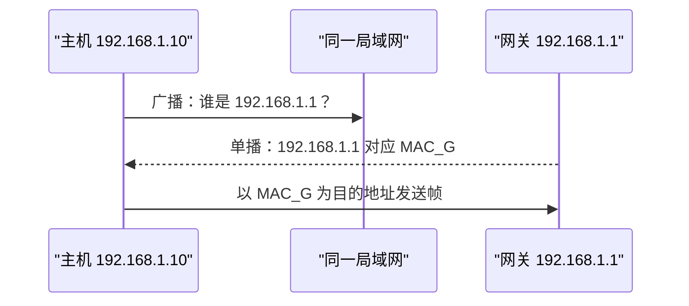

# 网络层：让分组跨越多个网络

链路层只能把帧交给同一段链路上的相邻节点。若客户端和服务器不在同一局域网，中间可能经过许多路由器和不同链路。**网络层（network layer）**负责给主机接口分配网络层地址，并把分组逐跳送向目的网络。

互联网网络层的核心协议是 IP（Internet Protocol，网际协议）。IP 提供尽力而为的数据报服务：它尝试交付分组，但不承诺一定送达、不重复、按序或在固定时间内到达。


## 1. 数据面与控制面

网络层可分成两个相互配合的部分：

- **数据面（data plane）**：分组到达某台路由器后，查哪条表、从哪个接口转发；
- **控制面（control plane）**：路由表和转发表怎样计算、分发与更新。

数据面通常逐包执行，需要快速、确定地完成查表与排队。控制面关注整个网络的可达性和路径选择，可以由分布式路由协议完成，也可以由集中控制器计算。

本章主讲数据面和网络层辅助协议。距离向量、链路状态、域内路由、域间路由和软件定义网络控制面放在后续 `routing_control` 章节，避免两处重复。

## 2. IPv4 地址与数据报

**IPv4（Internet Protocol version 4，网际协议第 4 版）**使用 32 bit 地址。点分十进制只是便于人阅读的写法，例如：

```text
192.168.10.70
= 11000000.10101000.00001010.01000110
```

IP 地址在逻辑上标识一个网络接口，而不是永远绑定某台物理机器。主机有多块网卡时可以有多个地址；同一接口也可能配置多个地址。

### 2.1 IPv4 首部关键字段

不含选项时，IPv4 首部通常为 20 byte。下图中的 IHL 是 Internet Header Length（网际首部长度），TTL 是 Time To Live（生存时间）：

```text
  0                   1                   2                   3
  0 1 2 3 4 5 6 7 8 9 0 1 2 3 4 5 6 7 8 9 0 1 2 3 4 5 6 7 8 9 0 1
 +-+-+-+-+-+-+-+-+-+-+-+-+-+-+-+-+-+-+-+-+-+-+-+-+-+-+-+-+-+-+-+-+
 |Version|  IHL  |   服务字段    |          Total Length         |
 +-+-+-+-+-+-+-+-+-+-+-+-+-+-+-+-+-+-+-+-+-+-+-+-+-+-+-+-+-+-+-+-+
 |         Identification        |Flags|      Fragment Offset    |
 +-+-+-+-+-+-+-+-+-+-+-+-+-+-+-+-+-+-+-+-+-+-+-+-+-+-+-+-+-+-+-+-+
 |      TTL      |   Protocol    |         Header Checksum       |
 +-+-+-+-+-+-+-+-+-+-+-+-+-+-+-+-+-+-+-+-+-+-+-+-+-+-+-+-+-+-+-+-+
 |                       Source Address                          |
 +-+-+-+-+-+-+-+-+-+-+-+-+-+-+-+-+-+-+-+-+-+-+-+-+-+-+-+-+-+-+-+-+
 |                    Destination Address                       |
 +-+-+-+-+-+-+-+-+-+-+-+-+-+-+-+-+-+-+-+-+-+-+-+-+-+-+-+-+-+-+-+-+
 |                    Options（可选）            |    Padding    |
 +-+-+-+-+-+-+-+-+-+-+-+-+-+-+-+-+-+-+-+-+-+-+-+-+-+-+-+-+-+-+-+-+
```

| 字段 | 是什么 | 为什么需要 |
| --- | --- | --- |
| Version | IP 版本，此处为 4 | 让接收者按正确格式解析 |
| IHL | 首部包含多少个 32-bit 字 | 因为 IPv4 选项会让首部变长；最小值 5，即 20 byte |
| 服务字段 | 分组的服务类别与拥塞标记 | 让网络按策略区分流量，并显式提示已经出现的拥塞 |
| Total Length | 整个数据报的 byte 数 | 划定本数据报边界；16 bit 字段使普通 IPv4 数据报最大为 65,535 byte |
| Identification、Flags、Fragment Offset | 标识与排列分片 | 让目的主机重组原数据报 |
| TTL | 每经一台转发路由器通常减 1 | 防止分组因路由环路无限存在 |
| Protocol | 载荷属于哪个上层协议 | 例如编号 6 表示 TCP（Transmission Control Protocol，传输控制协议），编号 17 表示 UDP（User Datagram Protocol，用户数据报协议） |
| Header Checksum | IPv4 首部校验和 | 检测首部损坏；不覆盖载荷 |
| Source / Destination Address | 源、目的 IPv4 地址 | 用于寻址、返回错误和转发 |

TTL 减到 0 时，路由器丢弃分组，并通常返回一条“超时”的网络层控制消息。由于 TTL 和其他字段会变化，IPv4 路由器需要更新首部校验和。

### 2.2 常见特殊地址

不是每个 32-bit 数值都能作为普通公网单播地址使用。面试和配置排错中最常见的是：

| 地址或前缀 | 含义 | 为什么需要 |
| --- | --- | --- |
| `10.0.0.0/8`、`172.16.0.0/12`、`192.168.0.0/16` | 私有地址 | 供组织内部复用，不在公网中作为全局目的前缀转发 |
| `127.0.0.0/8` | 环回地址 | 分组留在本机，用于测试本机协议栈；常见地址是 `127.0.0.1` |
| `0.0.0.0` | 未指定地址 | 主机尚不知道自身地址时可以使用；在路由前缀 `0.0.0.0/0` 中则表示默认路由 |
| `255.255.255.255` | 受限广播地址 | 向本地网络广播，路由器通常不会转发 |
| `224.0.0.0/4` | IPv4 组播地址范围 | 用一个目的地址表示一组接收者 |

私有地址不等于安全地址：它们不能直接作为公网全局地址使用，但访问控制仍要由防火墙、身份认证等机制完成。

<details>
<summary>为什么旧资料还会讲 A、B、C 类地址？</summary>

早期分类寻址根据地址开头的固定比特决定用途：

| 类别 | 开头比特 | 传统网络前缀 | 用途 |
| --- | --- | --- | --- |
| A 类 | `0` | `/8` | 大型单播网络；全 0 网络号和 `127/8` 另有用途 |
| B 类 | `10` | `/16` | 中型单播网络 |
| C 类 | `110` | `/24` | 小型单播网络 |
| D 类 | `1110` | 不划分网络号和主机号 | 组播 |
| E 类 | `1111` | 不划分网络号和主机号 | 保留 |

固定大小会造成地址浪费，也难以灵活聚合路由，因此现代互联网使用后文的无类别前缀。408 题可能考分类寻址的历史规则，但做现代网络规划时应使用前缀长度，而不是把任意地址机械称为某一“类”。

</details>

## 3. MTU 与 IPv4 分片

**MTU（Maximum Transmission Unit，最大传输单元）**是一段链路一次能承载的最大网络层分组大小。路径经过的链路 MTU 可能不同。

IPv4 数据报大于下一段链路 MTU 时，如果未设置 **DF（Don't Fragment，不分片）**标志，路由器可以把数据报拆成多个分片；只有最终目的主机重组。所有分片使用相同 Identification，除最后一个外设置 **MF（More Fragments，后面还有分片）**标志。

Fragment Offset（分片偏移）以 8 byte 为单位，因此除最后一片外，各分片数据长度通常必须是 8 的倍数。

### 3.1 完整分片算例

一个 IPv4 数据报总长 4000 byte，首部 20 byte，载荷 3980 byte。下一跳 MTU 为 1500 byte。

每个非最后分片最多承载：

```text
1500 - 20 = 1480 byte
1480 / 8 = 185
```

1480 是 8 的倍数，因此分为：

| 分片 | 载荷长度 | 总长度 | Fragment Offset | MF |
| --- | ---: | ---: | ---: | ---: |
| 1 | 1480 | 1500 | 0 | 1 |
| 2 | 1480 | 1500 | 185 | 1 |
| 3 | 1020 | 1040 | 370 | 0 |

第二片从原载荷第 `1480 / 8 = 185` 个单位开始；第三片偏移为 `(1480 + 1480) / 8 = 370`。

任一分片丢失都会使整个原始数据报无法完整重组。若 DF 已设置而下一跳 MTU 太小，路由器应丢弃分组并返回“需要分片”类控制消息，让源端进行路径 MTU 发现。

## 4. CIDR（无类别域间路由）：前缀表示网络，后缀表示接口

**CIDR（Classless Inter-Domain Routing，无类别域间路由）**用“地址/前缀长度”表示一段连续地址，例如 `192.168.10.70/26`。

`/26` 表示前 26 bit 是网络前缀，剩余 `32 - 26 = 6` bit 是主机部分。对应子网掩码为：

```text
11111111.11111111.11111111.11000000
= 255.255.255.192
```

把主机部分全部置为 `0` 得到**网络地址**，它表示整个子网；在传统 IPv4 广播子网中，把主机部分全部置为 `1` 得到**广播地址**，它表示该子网内的所有接口。普通主机地址位于两者之间。

### 4.1 完整子网算例

求 `192.168.10.70/26` 的网络地址、广播地址和传统可用主机范围。

最后一个 byte 的块大小为：

```text
256 - 192 = 64
```

因此网段边界为 0、64、128、192。70 落在 64 到 127：

```text
网络地址：192.168.10.64
广播地址：192.168.10.127
可用范围：192.168.10.65 ~ 192.168.10.126
地址总数：2^6 = 64
传统可用主机数：64 - 2 = 62
```

也可以按位与验证：

```text
地址末字节：01000110   (70)
掩码末字节：11000000   (192)
按位与结果：01000000   (64)
```

### 4.2 把一个 /24 划成四个等大子网

`192.168.10.0/24` 要平均划成 4 个子网，需要借 `log₂4 = 2` 个主机位，新前缀为 `/26`：

| 子网 | 网络地址 | 广播地址 | 传统可用主机范围 |
| --- | --- | --- | --- |
| 1 | `192.168.10.0/26` | `.63` | `.1 ~ .62` |
| 2 | `192.168.10.64/26` | `.127` | `.65 ~ .126` |
| 3 | `192.168.10.128/26` | `.191` | `.129 ~ .190` |
| 4 | `192.168.10.192/26` | `.255` | `.193 ~ .254` |

四段若连续且按 `/24` 边界对齐，可以聚合回 `192.168.10.0/24`。路由聚合减少表项，但不能聚合不连续或未按前缀边界对齐的网段。

<details>
<summary>/31 和 /32 为什么不能机械套“减 2”？</summary>

`/32` 表示一个确切 IPv4 地址，常用于主机路由或环回接口。RFC（Request for Comments，征求意见稿）3021 允许在点到点链路使用 `/31`，两端地址都可用，因为这类链路不需要传统广播地址。因此“可用主机数永远是 `2^h - 2`”只适用于传统广播子网题。

</details>

## 5. 最长前缀匹配

路由表中的多条前缀可能同时匹配一个目的地址。路由器选择前缀长度最大的表项，这叫 **LPM（Longest Prefix Match，最长前缀匹配）**。更长前缀代表更具体的地址范围。

| 目的前缀 | 下一跳 |
| --- | --- |
| `10.1.2.0/24` | A |
| `10.1.0.0/16` | B |
| `10.0.0.0/8` | C |
| `0.0.0.0/0` | 默认网关 D |

推演：

- `10.1.2.130` 同时匹配 `/8`、`/16`、`/24`，选择 `/24` 的 A；
- `10.1.9.7` 匹配 `/8`、`/16`，选择 B；
- `10.9.1.1` 只匹配 `/8`，选择 C；
- `8.8.8.8` 只匹配 `/0`，选择默认网关 D。

路由协议可能先用管理距离、度量等规则选出要安装的路由；数据面面对已经安装的前缀时，再执行最长前缀匹配。不要把“最长前缀”和“路径代价最低”混成同一步。

## 6. 一台路由器怎样转发 IPv4 数据报

下面是概念路径，不绑定某种硬件实现：


若没有匹配路由且没有默认路由，路由器丢弃数据报，并可能返回目的不可达消息。路由器会更换每一跳的链路层帧，不会因为转发而改掉普通数据报的源、目的 IP 地址；后面介绍的边界地址转换是例外处理。

## 7. ARP（地址解析协议）：已知下一跳 IP，怎样得到链路层地址

在 IPv4 以太网中，主机可能知道下一跳 IP 地址，却还需要链路层目的地址才能发送帧。以太网使用 MAC（Media Access Control，介质访问控制）地址标识接口；**ARP（Address Resolution Protocol，地址解析协议）**负责在同一链路上把 IPv4 地址解析为 MAC 地址。



解析结果会暂存在 ARP 缓存中，避免每帧都广播。当目的 IP 不在本子网时，主机解析的是默认网关的 MAC 地址，不是远端服务器的 MAC 地址。

ARP 没有内建强身份认证，局域网内的伪造响应可能污染缓存。交换网络中的安全机制可以降低风险，但不能把“ARP 能解析地址”误解为“ARP 能证明对方身份”。

## 8. DHCP（动态主机配置协议）：自动获得网络配置

**DHCP（Dynamic Host Configuration Protocol，动态主机配置协议）**让新接入的主机自动获得：

- IPv4 地址与租期；
- 子网掩码；
- 默认网关；
- DNS（Domain Name System，域名系统）服务器等选项。

典型过程常记为四步：

```text
Discover：客户端广播寻找 DHCP 服务器
Offer：服务器提供一个地址和配置
Request：客户端请求采用某个提议
ACK（Acknowledgment，确认）：服务器确认租约
```

客户端最初还没有可用地址，因此早期消息会使用广播；DHCP 使用 UDP 的服务器端口 67 和客户端端口 68。服务器不在同一广播域时，可由 DHCP relay（中继代理）转发请求。

DHCP 地址是有租期的。续租失败不应被理解为“原地址可以永久继续使用”。

## 9. ICMP（网际控制报文协议）：让 IP 报告控制和错误信息

**ICMP（Internet Control Message Protocol，网际控制报文协议）**封装在 IP 中，用于报告网络层错误和诊断信息。常见消息包括：

| ICMP 消息 | 为什么需要 |
| --- | --- |
| Echo Request / Reply（回显请求 / 应答） | 测试目的是否回应，`ping` 使用 |
| Destination Unreachable（目的不可达） | 没有路由、端口不可达或因 DF 无法分片等 |
| Time Exceeded（超时） | TTL 归零；`traceroute` 可利用逐步增大的 TTL 发现路径节点 |
| Redirect（重定向） | 告诉主机同一网络中可能有更合适的下一跳 |

ICMP 不是 TCP 或 UDP 之上的应用协议，而是 IP 的控制伴侣。收到 `ping` 回复只能证明相应 ICMP 往返成功，不能证明目标 Web 服务、数据库或业务接口正常。

错误报告本身也可能丢失或被策略过滤，所以没有收到 ICMP 不足以证明网络中没有错误。

## 10. NAT（网络地址转换）：在边界改写地址与端口

**NAT（Network Address Translation，网络地址转换）**在网络边界改写 IP 地址。家庭或企业常让多台私网主机共享少量公网 IPv4 地址。

实际常见的是 **NAPT（Network Address and Port Translation，网络地址与端口转换）**，也常称 PAT（Port Address Translation，端口地址转换）：设备同时改写源地址和源端口，并保存映射表。

这里的**端口号**是传输层首部中的编号，用于区分同一主机上的不同通信端点；传输层章节会详细解释。地址与端口组合后，边界设备才能区分多台内网主机同时发出的连接。

```text
内网发出：10.0.0.8:51500  → 203.0.113.20:443
边界改写：198.51.100.9:40001 → 203.0.113.20:443

映射表：198.51.100.9:40001 ↔ 10.0.0.8:51500
```

返回流量命中映射后，边界设备再改回内网地址。映射需要状态并会超时；外部主机通常不能凭空发起一条没有静态规则或现有映射的连接。

NAT 缓解 IPv4 地址不足并方便内部地址规划，但它破坏了纯粹的端到端地址透明性，也会让入站连接、对等通信、某些加密和故障定位更复杂。NAT 的状态过滤效果不等于完整防火墙策略。

## 11. IPv6 的核心变化

**IPv6（Internet Protocol version 6，网际协议第 6 版）**把地址从 32 bit 扩展到 128 bit，并简化常用首部，把可选功能放入扩展首部。

### 11.1 地址写法

IPv6 地址写成八组十六进制数，每组 16 bit：

```text
2001:0db8:0000:0000:0000:ff00:0042:8329
```

每组前导零可以省略；一段连续全零组可以用一次 `::` 压缩：

```text
2001:db8::ff00:42:8329
```

一个地址中只能使用一次 `::`，否则无法判断每处省略了几组零。

### 11.2 固定 40-byte 基本首部

IPv6 基本首部包含 Version、Traffic Class、Flow Label、Payload Length、Next Header、Hop Limit、源地址和目的地址，固定为 40 byte。

| IPv4 | IPv6 |
| --- | --- |
| 32-bit 地址 | 128-bit 地址 |
| 首部通常 20 byte，可含选项 | 基本首部固定 40 byte，可选信息放扩展首部 |
| 有首部校验和 | 基本首部没有校验和，减少逐跳更新工作 |
| 路由器可分片 | 路由器不分片；源端通过 Fragment 扩展首部处理 |
| TTL | Hop Limit（跳数限制） |
| Protocol 字段 | Next Header（下一首部）字段 |
| 支持广播 | 不使用广播，以组播等方式完成相应功能 |
| IPv4 使用 ARP | IPv6 使用基于 ICMPv6 的邻居发现 |

**ICMPv6（Internet Control Message Protocol version 6，网际控制报文协议第 6 版）**不只是错误报告，还支撑邻居发现、路由器发现和路径 MTU 发现。IPv6 邻居发现不使用 ARP。

### 11.3 常见 IPv6 地址类型

| 地址或前缀 | 含义 |
| --- | --- |
| `::` | 未指定地址，只能表示“当前还没有地址” |
| `::1` | 环回地址，作用类似 IPv4 的 `127.0.0.1` |
| `fe80::/10` | 链路本地地址，只在当前链路有效，邻居发现会使用 |
| `ff00::/8` | 组播地址；IPv6 不定义广播地址 |
| `2000::/3` | 当前分配的全球单播地址主要范围 |

主机可以根据路由器通告获得前缀并自动配置地址；需要集中分配更多参数时，也可以使用 DHCPv6（Dynamic Host Configuration Protocol for IPv6，IPv6 动态主机配置协议）。

IPv6 地址空间大不表示“不再需要防火墙”，也不保证自动迁移。现实网络常通过双栈、隧道或协议转换逐步过渡。

## 12. 路由表从哪里来

本章的数据面读取目的地址、执行最长前缀匹配并选择下一跳；路由表中的可达前缀和路径由静态配置或控制面生成。距离向量、链路状态、域内与域间协议以及软件定义网络见[路由控制](routing_control.md)。

## 13. 三类应用中的网络层

| 场景 | 网络层基础怎样使用 |
| --- | --- |
| 传统后端 | 正确配置子网、默认路由、NAT 和服务地址；用 ICMP、路由表和最长前缀定位连接问题 |
| AI（Artificial Intelligence，人工智能）基础设施 | 规划集群地址和多网段互联；区分本机链路故障、路由错误与上层分布式通信错误 |
| HFT（High-Frequency Trading，高频交易）系统 | 理解专线仍受 IP、MTU、下一跳和路由控制；不能把应用会话序号当成 IP 可靠性 |

## 14. 408 计算题

### 题 1：子网划分

`172.16.8.0/24` 至少需要 6 个等大子网。新前缀至少是多少？每个传统子网最多多少台主机？

<details>
<summary>参考答案</summary>

需要借 3 bit，因为 `2^2 < 6 ≤ 2^3`，新前缀为 `/27`。每段共有 `2^(32-27)=32` 个地址，传统可用主机数为 30。块大小为 32，前六段网络地址依次是 `.0`、`.32`、`.64`、`.96`、`.128`、`.160`。

</details>

### 题 2：IPv4 分片

一个总长 3020 byte、首部 20 byte 的 IPv4 数据报经过 MTU 1000-byte 的链路。求各分片载荷、总长、偏移和 MF。

<details>
<summary>参考答案</summary>

非最后片最大载荷要小于等于 980 且为 8 的倍数，因此取 976 byte。原载荷 3000 byte：前三片各 976 byte，最后一片 72 byte。总长为 996、996、996、92；偏移为 0、122、244、366；MF 依次为 1、1、1、0。

</details>

### 题 3：最长前缀

路由表有 `192.168.0.0/16 → A`、`192.168.10.0/24 → B`、`192.168.10.128/25 → C` 和默认路由 `→ D`。目的 `192.168.10.200` 走哪里？

<details>
<summary>参考答案</summary>

它同时匹配 `/16`、`/24` 和 `/25`，其中 `/25` 最长，选择 C。

</details>

## 15. 章末面试题

1. 网络层为什么提供尽力而为服务？可靠性可以由哪些其他层补充？
2. 数据面和控制面分别做什么？最长前缀匹配属于哪一面？
3. IPv4 的 TTL、Protocol 和 Header Checksum 字段分别解决什么问题？
4. 为什么 Fragment Offset 使用 8 byte 为单位？分片为什么会放大丢包影响？
5. 给定任意 `a.b.c.d/p`，怎样求掩码、网络地址、广播地址和主机范围？
6. 最长前缀匹配和路由协议的路径度量有什么区别？
7. 访问远端地址时，ARP 解析的是谁的 MAC 地址？
8. DHCP 为什么早期步骤需要广播？租约有什么意义？
9. ICMP 与 `ping`、`traceroute` 有什么关系？`ping` 通为什么不代表服务正常？
10. NAT/PAT 怎样让多台内网主机共享公网地址？它为什么不等于防火墙？
11. IPv6 相比 IPv4 在地址、基本首部、分片、广播和邻居发现上有哪些核心变化？

## 16. 权威依据与延伸阅读

RFC 是 IETF（Internet Engineering Task Force，互联网工程任务组）发布互联网技术规范的主要系列。

- [高校公开转载的《2025 年计算机学科专业基础考试大纲》](https://www.uwh.edu.cn/uploads/article/20250609/660428d58334252302af691bf99e064e.pdf)
- [Kurose 与 Ross：网络层数据面和控制面官方知识检查](https://gaia.cs.umass.edu/kurose_ross/knowledgechecks/)
- [RFC 791: Internet Protocol](https://www.rfc-editor.org/rfc/rfc791.html)
- [RFC 1191: Path MTU Discovery](https://www.rfc-editor.org/rfc/rfc1191.html)
- [RFC 1918: Address Allocation for Private Internets](https://www.rfc-editor.org/rfc/rfc1918.html)
- [RFC 4632: Classless Inter-domain Routing](https://www.rfc-editor.org/rfc/rfc4632.html)
- [RFC 826: Address Resolution Protocol](https://www.rfc-editor.org/rfc/rfc826.html)
- [RFC 2131: Dynamic Host Configuration Protocol](https://www.rfc-editor.org/rfc/rfc2131.html)
- [RFC 792: Internet Control Message Protocol](https://www.rfc-editor.org/rfc/rfc792.html)
- [RFC 3022: Traditional IP Network Address Translator](https://www.rfc-editor.org/rfc/rfc3022.html)
- [RFC 8200: Internet Protocol, Version 6](https://www.rfc-editor.org/rfc/rfc8200.html)
- [RFC 4291: IP Version 6 Addressing Architecture](https://www.rfc-editor.org/rfc/rfc4291.html)
- [RFC 4861: Neighbor Discovery for IP version 6](https://www.rfc-editor.org/rfc/rfc4861.html)

下一章将专门解释路由控制：路由器怎样交换可达性信息，并把网络范围的路径选择结果变成数据面可用的路由表。
