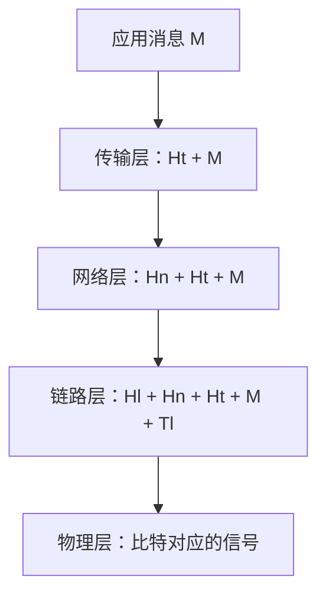
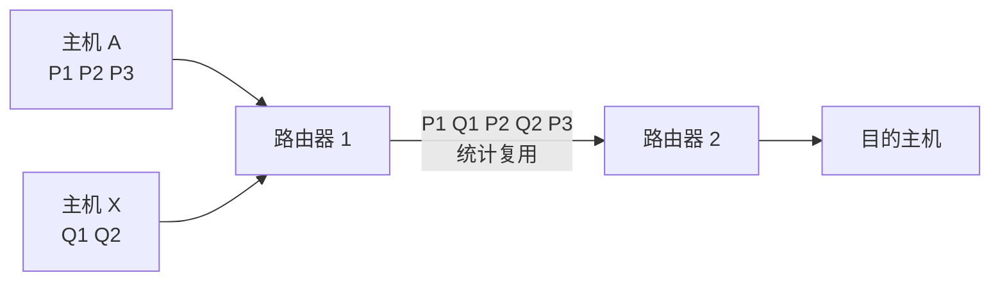
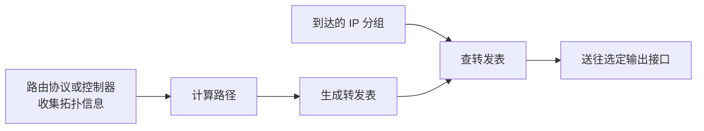

# 计算机网络概述：从两台主机通信到全球互联网

计算机网络解决的第一个问题很朴素：**一台计算机产生的数据，怎样交给另一台计算机上的正确程序？**

如果两台机器直接连接，这个问题似乎不难；当机器分布在宿舍、公司、数据中心和不同国家时，系统还要回答：走哪条路、链路忙了怎么办、数据损坏或丢失怎么办、不同厂商的设备怎样协作。网络分层和网络协议，正是为了把这些问题拆开处理。

本章先建立完整地图。网卡收包、Linux NAPI、Socket 读写和内核旁路属于协议在操作系统中的实现，放在后续章节讲，不作为认识网络的起点。

## 1. 什么是计算机网络

**计算机网络**是由通信链路连接起来的一组计算设备。设备按照共同的协议交换数据，并共享通信、存储或计算资源。

一张网络至少包含三类角色：

- **端系统（end system）或主机（host）**：真正运行应用程序的设备，例如手机、笔记本和服务器；
- **通信链路（link）**：承载信号的介质，例如双绞线、光纤和无线电波；
- **分组交换设备（packet switch）**：在中途转发数据，常见设备是二层交换机和路由器。


### 1.1 网络边缘、接入网络和网络核心

为了描述互联网，可以把它分成三个部分：

| 部分 | 包含什么 | 主要任务 |
| --- | --- | --- |
| 网络边缘 | 客户端、服务器及其应用 | 产生和消费数据 |
| 接入网络 | 家庭宽带、校园网、蜂窝网络、数据中心接入交换机 | 把端系统接入第一台网络设备 |
| 网络核心 | 大量互联的路由器和高速链路 | 在源主机与目的主机之间转发分组 |

“边缘”和“核心”描述的是角色，不是机器性能。大型服务器属于网络边缘，因为应用运行在它上面；一台性能较低的路由器仍属于网络核心，因为它负责转发经过自己的分组。

### 1.2 网络的主要功能

网络至少提供以下能力：

1. **连通**：让不同位置的端系统可以交换数据；
2. **资源共享**：共享文件、服务、打印设备和计算资源；
3. **寻址与转发**：识别目的地，并把数据送往下一跳；
4. **差错与拥塞处理**：检测异常，并在负载过高时采取控制措施；
5. **提供应用接口**：让程序通过 Socket 等接口使用网络，而不必直接控制每一段物理信号。

## 2. 协议、接口和服务不是一回事

### 2.1 协议是什么

**协议（protocol）**是通信双方共同遵守的规则。一个协议通常要规定三件事：

- **语法（syntax）**：消息有哪些字段、字段多长、怎样编码；
- **语义（semantics）**：每个字段表示什么，收到某种消息后应该做什么；
- **同步或时序（synchronization/timing）**：消息以什么顺序出现，何时发送，超时后怎么办。

例如，“客户端先发送请求，服务端返回响应”是时序；“状态码 404 表示没有找到资源”是语义；HTTP（Hypertext Transfer Protocol，超文本传输协议）报文的起始行和首部格式属于语法。

协议运行在**同一层的对等实体**之间。发送主机的传输层与接收主机的传输层遵守 TCP（Transmission Control Protocol，传输控制协议）；它们在逻辑上对等，但数据在物理上仍要逐层向下、穿过网络、再逐层向上。

### 2.2 服务是什么

**服务（service）**是一层向它的上一层提供的能力。上一层只关心“能得到什么”，不必知道这一层内部怎样完成。

例如，传输层可以向应用层提供“把字节交给另一台主机上的某个进程”的服务。至于数据怎样分段、确认和重传，是传输层的内部实现。

### 2.3 接口是什么

**接口（interface）**是相邻两层交换请求和数据的边界。程序使用 Socket API（Application Programming Interface，应用程序编程接口）创建连接或收发数据，就是通过接口使用传输层服务。

可以这样记：

```text
协议：同一层的双方怎样交流
服务：下一层能为上一层做什么
接口：上一层怎样调用下一层
```

协议可以改变而服务保持相似；接口也可以在不同操作系统上有不同形式。因此不能把 TCP 协议、可靠传输服务和 `send()` 函数说成同一个概念。

## 3. 为什么要分层

一条完整通信链路同时涉及应用格式、进程寻址、跨网络路由、局域网交付和物理信号。把所有功能写成一整块，任何修改都会影响整个系统。分层让每一层集中解决一类问题，并通过清晰接口组合起来。

### 3.1 OSI 与 TCP/IP 模型

**OSI（Open Systems Interconnection，开放系统互连）参考模型**有七层；互联网实际常用的 **TCP/IP（Transmission Control Protocol / Internet Protocol）模型**通常描述为四层。教学时也常把最下面的网络接口层拆成数据链路层和物理层，形成五层模型。

| 五层教学模型 | OSI 对应层 | TCP/IP 对应层 | 主要问题 | 常见协议或技术 |
| --- | --- | --- | --- | --- |
| 应用层 | 应用层、表示层、会话层 | 应用层 | 应用消息表示什么 | HTTP、DNS（Domain Name System，域名系统）、SMTP（Simple Mail Transfer Protocol，简单邮件传输协议） |
| 传输层 | 传输层 | 传输层 | 交给目的主机上的哪个进程，提供何种端到端传输语义 | TCP、UDP（User Datagram Protocol，用户数据报协议） |
| 网络层 | 网络层 | 网际层 | 跨越多个网络到达哪台主机 | IPv4/IPv6（Internet Protocol version 4/6，网际协议第 4/6 版）、ICMP（Internet Control Message Protocol，网际控制报文协议） |
| 数据链路层 | 数据链路层 | 网络接口层 | 在一段链路或一个局域网中交付 | Ethernet、Wi-Fi |
| 物理层 | 物理层 | 网络接口层 | 怎样把比特变成可传输的信号 | 电信号、光信号、无线信号 |

OSI 是帮助分析职责的参考模型，不表示现实中的每个软件模块都严格分成七块。TCP/IP 把 OSI 的表示层和会话层功能放进应用及应用协议，把物理层和数据链路层合称网络接口层。

### 3.2 每层怎样称呼自己的数据

| 层 | 常见数据单位 | 含义 |
| --- | --- | --- |
| 应用层 | message，消息 | 一次应用语义的数据，例如请求或响应 |
| 传输层 | TCP segment，TCP 段；UDP datagram，UDP 数据报 | 加入进程端口和传输控制信息 |
| 网络层 | packet / IP datagram，分组或 IP 数据报 | 加入源、目的 IP 地址等信息 |
| 数据链路层 | frame，帧 | 加入当前链路交付和检错信息 |
| 物理层 | bit / signal，比特或信号 | 在线缆、光纤或无线介质上传输 |

“包”是口语中的统称。严谨回答时应说明当前讨论的是帧、IP 分组、TCP 段还是 UDP 数据报。

## 4. 封装与解封装

发送数据时，每一层把上一层交来的数据当作自己的**载荷（payload）**，再加上本层控制信息。这个过程叫**封装（encapsulation）**。接收端反向检查并移除各层控制信息，叫**解封装（decapsulation）**。



图中的 `H` 表示 header（首部），`T` 表示 trailer（尾部）。并不是每层都一定同时有首部和尾部，具体格式由协议决定。

经过路由器时，旧链路帧会被移除；路由器根据网络层首部决定下一跳，再为下一段链路封装新的帧。通常，端到端的 IP 源地址和目的地址仍用于识别两端，而每一跳的链路层首部会变化。

### 4.1 不同设备看到哪一层

| 设备 | 主要工作层次 | 是否理解上层业务消息 |
| --- | --- | --- |
| 中继器、集线器 | 物理层 | 否 |
| 二层交换机 | 数据链路层 | 通常不需要 |
| 路由器 | 网络层 | 通常不需要 |
| 端系统 | 所有层 | 应用最终解释消息 |

更高层的代理、防火墙和负载均衡器可能查看更多协议字段，但这不改变各层的基础职责。

## 5. 数据怎样穿过网络核心

### 5.1 电路交换

**电路交换（circuit switching）**在通信开始前先建立一条端到端通路，并为会话保留一定资源。传统电话网络是典型例子。

优点是资源建立后较稳定；缺点是空闲时保留资源会浪费，而且建立电路需要时间。这里的“电路”不一定是一根专属物理线，也可能是通过频率或时间片划分出的逻辑资源。

### 5.2 报文交换

**报文交换（message switching）**把整份报文作为一个单位。中间节点先完整接收并存储，再转发到下一跳，这叫 **store-and-forward（存储转发）**。

大报文必须整体到齐才可继续，而且中间节点需要较大存储，因此现代互联网不以整份应用报文作为网络核心的基本转发单位。

### 5.3 分组交换

**分组交换（packet switching）**把长数据切成较小分组。多个用户的分组按需共享链路，不必为每个会话永久保留资源。



这种按需共享称为**统计复用（statistical multiplexing）**。它提高了链路利用率，但当很多分组同时到达时会产生排队；缓冲区满时还会丢包。

### 5.4 数据报与虚电路

分组交换网络可以提供不同的网络层服务模型：

| 比较 | 数据报网络 | 虚电路网络 |
| --- | --- | --- |
| 发送前是否建立网络层路径状态 | 通常不需要 | 需要建立虚电路 |
| 分组携带什么 | 完整目的地址 | 较短的虚电路标识 |
| 每个分组是否可独立选路 | 可以 | 通常沿已建立路径 |
| 中间设备是否保存会话状态 | 较少 | 保存虚电路映射 |
| 故障后的处理 | 后续分组可重新选路 | 虚电路可能需要重建 |

互联网的 IP（Internet Protocol，网际协议）提供数据报服务。TCP 虽然“面向连接”，但 TCP 连接是端系统传输层状态，不等于网络核心建立了一条虚电路。

## 6. 转发与路由

这两个词经常被混用，但它们回答不同问题：

- **转发（forwarding）**：某个分组已经到达一台路由器，应该从哪个输出接口送走？这是单台设备的局部动作；
- **路由（routing）**：整个网络有哪些路径，怎样计算较合适的路径并形成转发表？这是网络范围的控制过程。



可以把路由比作规划地图，把转发比作车辆到达一个路口时按路牌选择出口。网络层后续章节会详细解释路由表、最长前缀匹配和路由协议。

## 7. 一次传输为什么需要时间

分组在一个节点经历的时延通常拆成四部分：

```text
d_nodal = d_proc + d_queue + d_trans + d_prop
```

| 名称 | 公式或来源 | 含义 |
| --- | --- | --- |
| 处理时延 `d_proc` | 检查首部、检错、查表等 | 节点处理分组所需时间 |
| 排队时延 `d_queue` | 取决于到达流量和队列 | 等待输出链路可用的时间 |
| 发送时延 `d_trans` | `L / R` | 把 `L` bit 分组的全部比特推上速率为 `R` bit/s 的链路 |
| 传播时延 `d_prop` | `d / s` | 信号经过距离 `d`、以速度 `s` 传播所需时间 |

发送时延取决于分组长度和链路速率；传播时延取决于距离和介质中的信号速度。提高带宽能降低发送时延，却不能让光跨越同一距离传播得更快。

### 7.1 数字算例：发送与传播不要混淆

发送一个 1500 byte 的分组，链路速率为 100 Mbit/s：

```text
L = 1500 × 8 = 12,000 bit
d_trans = 12,000 / 100,000,000 s
        = 0.00012 s
        = 0.12 ms
```

若光纤长度为 1000 km，信号传播速度近似取 `2 × 10^8 m/s`：

```text
d = 1000 km = 1,000,000 m
d_prop = 1,000,000 / (2 × 10^8) s
       = 0.005 s
       = 5 ms
```

再假设本节点处理用时 0.1 ms、排队 2 ms，则这一跳约为：

```text
0.1 + 2 + 0.12 + 5 = 7.22 ms
```

其中排队时延最不稳定：空队列时接近零，拥塞时可能远大于其他三项。

### 7.2 多跳存储转发

若路径有 `N` 条相同速率链路，每台交换设备必须收到完整分组后再发送，忽略排队、处理和传播时延，单个分组到达终点所需发送时间为：

```text
N × L / R
```

若连续发送 `P` 个等长分组，链路可以流水工作；从第一个分组开始发送到最后一个分组到达的时间为：

```text
(N + P - 1) × L / R
```

这解释了为什么分组化既带来额外首部，也能让多段链路并行工作。

### 7.3 排队为什么会突然恶化

设平均每个分组长度为 `L` bit，平均到达率为 `a` packet/s，输出链路速率为 `R` bit/s，则流量强度可写为：

```text
ρ = L × a / R
```

`ρ` 远小于 1 时通常较空闲；`ρ` 接近 1 时，短暂突发就容易形成长队列；若长期大于 1，输入速度超过输出能力，有限缓冲区最终一定溢出。这个式子只能帮助判断负载趋势，不能单独给出实际排队时延，因为真实流量往往不是均匀到达。

## 8. 吞吐量、丢包与带宽时延积

### 8.1 吞吐量

**吞吐量（throughput）**是单位时间实际成功传输的数据量。链路标称速率是能力上限之一，不等于应用一定能取得同样吞吐量。

一条路径的端到端吞吐量通常受最慢的瓶颈链路限制。若源端接入为 100 Mbit/s、中间链路为 1 Gbit/s、目的端接入为 20 Mbit/s，忽略协议开销和竞争，吞吐量最多约为：

```text
min(100 Mbit/s, 1 Gbit/s, 20 Mbit/s) = 20 Mbit/s
```

如果瓶颈链路由多个数据流共享，每条流得到的速率还可能更低。

### 8.2 丢包

交换设备和主机的队列容量有限。分组到达时若没有可用缓冲区，设备可能丢弃分组。无线干扰、链路误码、设备故障和策略过滤也可能导致丢失。

可靠传输协议可以重传丢失的数据，但“最终交付给应用”不代表网络中从未发生丢包；重传会消耗带宽并增加完成时间。

### 8.3 带宽时延积

**BDP（Bandwidth-Delay Product，带宽时延积）**表示链路在一段往返时间内可以容纳多少尚未确认的数据：

```text
BDP = 带宽 × RTT
```

其中 **RTT（Round-Trip Time，往返时间）**是数据从一端到另一端再返回所需时间。

例如带宽为 1 Gbit/s、RTT 为 40 ms：

```text
BDP = 1 × 10^9 bit/s × 0.04 s
    = 40,000,000 bit
    = 5,000,000 byte
    ≈ 5 MB
```

这表示若要持续填满这条路径，发送方可能需要允许大约 5 MB 数据处于“已经发出、尚未确认”的状态。BDP 不是缓存区的通用推荐值，还要考虑协议开销、流量控制、拥塞控制和业务负载。

## 9. 把概念放进三个应用场景

| 场景 | 本章知识怎样使用 |
| --- | --- |
| 传统后端 | 从 DNS、TCP 到 HTTP 分层定位故障；区分服务响应慢与网络排队；识别接入链路瓶颈 |
| AI（Artificial Intelligence，人工智能）基础设施 | 估算模型参数或激活值跨机传输时间；用瓶颈吞吐量和 BDP 理解集群通信；区分拓扑路由与单机数据处理 |
| HFT（High-Frequency Trading，高频交易）系统 | 说明专线仍有传播、发送和排队时延；明确 IP 数据报、TCP 连接和交易应用会话属于不同层 |

应用只是在使用共同原理。不要在尚未理解分层、交换和四类时延前，先背某个框架或调优参数。

## 10. 推演题

### 题 1：封装发生了什么

浏览器生成一段 HTTP 请求后，依次经过哪些层？每层的数据单位叫什么？路由器转发时通常会替换哪一层的首部？

<details>
<summary>参考思路</summary>

应用消息向下经过传输层、网络层、数据链路层和物理层，依次可称消息、TCP 段、IP 分组、帧和信号。路由器接收一段链路上的帧，取出 IP 分组并决定下一跳，再为下一段链路生成新的链路层帧。

</details>

### 题 2：计算单跳时延

一个 1000 byte 分组经过 20 Mbit/s 链路，传播距离为 200 km，介质传播速度取 `2 × 10^8 m/s`。忽略排队和处理，求发送时延、传播时延与总时延。

<details>
<summary>参考答案</summary>

先统一单位：`L=1000×8=8000 bit`，`R=20×10^6 bit/s`，`d=200×10^3 m`，`s=2×10^8 m/s`。

| 阶段 | 公式 | 结果 |
|---|---|---|
| 把全部分组推入链路 | `t_tx=L/R` | `8000/(20×10^6)=0.0004 s=0.4 ms` |
| 最前端信号走完链路 | `t_prop=d/s` | `(200×10^3)/(2×10^8)=0.001 s=1 ms` |
| 最后一个 bit 到达 | `t_tx+t_prop` | `1.4 ms` |

验算：提高 R 只会缩短 0.4 ms 这一项；传播项只由距离和传播速度决定。总时延必须大于任一分项，`1.4>1` 且 `1.4>0.4`。

</details>

### 题 3：判断瓶颈

某服务器以 500 Mbit/s 接入，核心路径最低链路为 2 Gbit/s，客户端接入为 80 Mbit/s。忽略竞争和开销，单流吞吐量上限是多少？把服务器接入升级到 10 Gbit/s 会改变答案吗？

<details>
<summary>参考答案</summary>

上限约为 `min(500, 2000, 80) = 80 Mbit/s`。只升级服务器接入不会改变客户端 80 Mbit/s 这个瓶颈。

</details>

## 11. 做题方法：分层、时延与吞吐

1. **读题并标单位**：圈出分组长度 `L`、链路速率 `R`、距离 `d`、传播速度 `s`、节点数与是否忽略排队；统一换成 bit、bit/s、m、s。
2. **画逐跳时间线**：每段链路分别写发送时延 `L/R` 与传播时延 `d/s`，路由器旁再写处理和排队。存储转发题要确认下一跳是否必须等完整分组。
3. **按事件相加**：单跳端到端时延才是各项之和；多分组流水线要分开计算“首个分组到达”和“全部分组到达”，不能机械乘链路数。
4. **求吞吐与在途量**：吞吐先取路径瓶颈 `min(R_i)`，带宽时延积使用实际瓶颈带宽乘 RTT 或题目指定时延，并写清单位是 bit 还是 byte。
5. **验算**：带宽升高只会直接缩短发送时延，不会改变传播速度；吞吐不得超过任一链路容量；结果数量级应符合距离和速率。

常见陷阱：把 bit 与 byte 混用；把发送时延叫传播时延；漏掉最后一跳；把 OSI 层次题答成具体设备清单；看到 TCP 连接就误判网络核心采用虚电路。

## 12. 章末面试题

1. 协议、服务和接口分别是什么？请各举一个例子。

<details>
<summary>参考答案</summary>

**协议**是同层通信实体共同遵守的消息格式、顺序和处理规则，例如 HTTP 规定请求/响应怎样表达。**服务**是下层向上层提供的能力，例如 TCP 向应用提供可靠、有序的字节流。**接口**是上层使用该服务的入口，例如应用通过 Socket API 的 `connect/send/recv` 使用 TCP。协议描述“对等双方怎样交谈”，接口描述“本机上下层怎样调用”，服务描述“调用后得到什么能力”；三者不能混称。

</details>

2. OSI 七层模型与 TCP/IP 模型怎样对应？为什么现实实现不一定严格分成七个模块？

<details>
<summary>参考答案</summary>

从下到上，OSI 的物理层、数据链路层大致对应 TCP/IP 的链路层；网络层对应网际层；传输层仍对应传输层；会话、表示、应用三层通常合并进 TCP/IP 应用层。分层是职责模型，不要求代码一层一个模块：TLS 可在库、内核或硬件中实现，网卡也可能做校验和与分段卸载。判断层次应看它处理的对象和语义，而不是进程或文件名。

</details>

3. 发送时延和传播时延分别由什么决定？提高链路带宽会改变哪一个？

<details>
<summary>参考答案</summary>

发送时延是把 `L` bit 推入速率为 `R` 的链路所需时间，`t_tx=L/R`；传播时延是信号走过距离 `d` 所需时间，`t_prop=d/s`。提高 `R` 会缩短发送时延，不会改变介质中的传播速度 `s` 或地理距离。验算：即使分组只有 1 bit，跨洲传播仍不是零时间。

</details>

4. 分组交换为什么能提高共享链路的利用率，又为什么会出现排队和丢包？

<details>
<summary>参考答案</summary>

分组交换按需统计复用：一个用户暂时不发送时，其他用户可以使用链路，不必为每个会话永久预留电路。但多个流可能同时到达同一输出端口；当瞬时到达率超过输出速率，分组进入队列，等待形成排队时延，缓冲耗尽后新到分组只能被丢弃。它提高的是对突发流量的共享效率，不保证没有拥塞。

</details>

5. 转发与路由有什么区别？

<details>
<summary>参考答案</summary>

**转发**是单台路由器的数据面动作：读取分组目的地址、查转发表、送往某个输出端口。**路由**是控制面过程：根据拓扑、度量和策略计算路径并生成转发表。可用一包验证转发结果，用拓扑变化后的收敛过程验证路由；二者时间尺度和输入不同。

</details>

6. TCP 是面向连接协议，为什么不能据此说互联网 IP 核心是虚电路网络？

<details>
<summary>参考答案</summary>

TCP 连接状态保存在端系统的传输层，两端用序号、确认和窗口维护可靠字节流。普通 IP 路由器按每个数据报的目的地址独立转发，不因一条 TCP 连接而先在沿途建立端到端资源和连接状态。因此“上层面向连接”不能推出“下层网络核心采用虚电路”。

</details>

7. 带宽、吞吐量和带宽时延积有什么区别？

<details>
<summary>参考答案</summary>

带宽在本章指链路的标称传输速率上限；吞吐量是特定流实际单位时间交付的数据量，受最窄链路、竞争和协议开销限制；带宽时延积 `BDP=带宽×RTT`，表示一个往返时间内可容纳的在途数据量。验算量纲：`bit/s × s = bit`，所以 BDP 不是速率。

</details>

## 13. 延伸阅读

- [高校公开转载的《2025 年计算机学科专业基础考试大纲》](https://www.uwh.edu.cn/uploads/article/20250609/660428d58334252302af691bf99e064e.pdf)
- [Kurose 与 Ross：《Computer Networking: A Top-Down Approach》官方知识检查](https://gaia.cs.umass.edu/kurose_ross/knowledgechecks/)
- [Stanford CS144: Introduction to Computer Networking](https://cs144.github.io/)
- [CMU 15-441: Computer Networks](https://www.cs.cmu.edu/~prs/15-441-F14/)

下一章从物理层开始，解释比特怎样变成能在线缆、光纤和空气中传播的信号。
