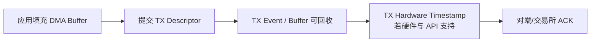

# AMD/Solarflare OpenOnload、TCPDirect 与 ef_vi

AMD/Solarflare NIC 在低延迟网络中较常见，但是否采用仍取决于交易所认证、NIC/固件、团队运维和实测结果。这个生态中有三个容易混淆的层次：

| 方案 | 抽象层 | 应用看到什么 |
| :--- | :--- | :--- |
| OpenOnload | 用户态 TCP/UDP stack，兼容 BSD socket | 大部分现有 socket 代码 |
| TCPDirect | 面向低延迟应用的用户态网络 API/stack | 厂商 API 与显式资源管理 |
| ef_vi | 更底层的 Virtual Interface packet API | Rx/Tx descriptor 与 event queue |

ef_vi 本身不是“硬件 TCP offload”。如果直接使用 ef_vi，L2/L3/L4 协议通常由应用或上层用户态 stack 处理。

## 1. OpenOnload：透明不等于零改动风险

OpenOnload 常通过 `onload` 命令或 `LD_PRELOAD` 拦截 socket 调用，让支持的流量走用户态 stack：

```bash
onload --profile=latency ./trading-gateway
```

这可能不需要修改业务源码，但上线前仍要验证：

- 当前 NIC、驱动、Onload 与内核版本组合受支持。
- 哪些 socket/route/features 被加速，哪些发生 kernel fallback。
- `fork`、`exec`、FD 传递、namespace、容器与权限语义。
- epoll、busy poll、timestamp、multicast、bond/VLAN 等实际用法。
- stack 参数、共享方式、资源上限与进程异常后的清理。

“命令能启动”不代表所有连接都在 fast path。启动日志和运行期 telemetry 应显示 accelerated/fallback socket 数与原因。

## 2. ef_vi 的资源模型

ef_vi 让应用直接使用 NIC Virtual Interface：

- **Protection Domain (PD)**：描述资源保护/映射域。
- **Virtual Interface (VI)**：Rx queue、Tx queue 与 Event Queue 的组合。
- **Memory Registration**：由驱动把 pinned memory 映射成设备可用 DMA 地址；不是应用随意传一个虚拟或“物理”地址。
- **Filter**：把匹配流量导向指定 VI，受 NIC 表容量与匹配能力约束。

初始化应是可回滚的状态机：


任一步失败都要逆序释放已获得资源。Rust 封装适合用 RAII guard 和 typestate，避免 filter 已生效但 RX descriptor 尚未 ready 的丢包窗口。

> 本章 Rust 围栏是基于厂商 API 的**教学骨架**，`DriverHandle`、`VirtualInterface`、event/filter 等类型由具体 ef_vi/TCPDirect FFI wrapper 提供，不能独立编译，所以标为 `ignore`。真实验证应锁定 NIC、固件、驱动、Onload/ef_vi SDK 与 bindgen 版本，先运行 `cargo check` 和 ABI/layout 测试，再在认证硬件覆盖 RX discard、event queue overflow、部分 TX、filter 表满、link reset 与逆序释放。

```rust,ignore
struct ReadyVi {
    driver: DriverHandle,
    pd: ProtectionDomain,
    vi: VirtualInterface,
    dma: RegisteredMemory,
    filters: Vec<InstalledFilter>,
}

impl Drop for ReadyVi {
    fn drop(&mut self) {
        // 真实 wrapper 按厂商 ABI：停止新流量、drain event/TX、移除 filter、
        // 注销 DMA，最后释放 VI/PD/driver。
    }
}
```

## 3. RX event 的语义

应用先 post 空闲 RX buffer。NIC 收包并 DMA 后，Event Queue 给出 RX event，应用根据 request ID/descriptor 找到 buffer。

```rust,ignore
for event in vi.poll_events(MAX_EVENTS)? {
    match event {
        Event::Rx { request_id, len, flags, timestamp } => {
            let frame = rx_pool.take_completed(request_id, len, flags)?;
            parse(frame.bytes())?;
            rx_pool.repost(frame, &mut vi)?;
        }
        Event::RxDiscard { request_id, reason } => {
            metrics.rx_discard(reason).increment();
            rx_pool.repost_discarded(request_id, &mut vi)?;
        }
        _ => handle_other_event(event)?,
    }
}
```

RX event 通常表示相应数据已写入注册 buffer，可以读取；它不是线缆到达的精确时刻。若 event 提供硬件 timestamp，还要确认 timestamp flag、PHC clock domain、同步状态和精度。

还需处理：

- RX discard、truncation、multi-buffer/jumbo 组合。
- Event Queue overflow 与 RX descriptor starvation。
- filter miss、checksum/VLAN metadata。
- buffer repost 后旧 Rust 引用必须失效。

## 4. TX submit、TX completion 与线上可见



- **TX submit 成功**：descriptor 被 queue 接受；buffer 所有权转给 TX 路径，不能立即修改。
- **TX completion/event**：通常表示设备不再引用 buffer，可以回收；completion 可能批量覆盖多个 descriptor，必须按 request ID 处理。
- **TX hardware timestamp**：更适合回答报文何时从 NIC 发送，但仍需理解 timestamp 点和 clock。
- **订单 ACK**：回答交易所业务层是否接受，与 buffer completion 完全不同。

不要在 TX event 分支只写一句“发送完成”就立即推断订单在市场可见。正确代码应把“buffer reclaimed”和“business acknowledged”维护为两个状态机。

## 5. Hardware filter 的能力边界

NIC filter 可以按目的 MAC、VLAN、IP、UDP/TCP tuple 等条件把流量导向 VI，但具体字段、mask、优先级与表容量取决于 NIC/固件。

```rust,ignore
let filter = Filter::udp_local(multicast_group, port)
    .with_vlan(vlan_id);
let installed = vi.install_filter(filter)?;
```

上线前检查：

- filter 是否真的落硬件，失败会报错还是 fallback。
- 相同流量是否允许复制到多个 VI，还是只能 steering 到一个目标。
- 表满后的行为和监控。
- A/B feed、管理流量与 kernel interface 是否发生冲突。
- filter 替换过程是否存在空窗或重复投递。

## 6. 能力、权限与运维

### 6.1 版本矩阵

固定并测试 NIC 型号、固件、内核 driver、Onload/TCPDirect/ef_vi 用户库和内核版本。升级任意一层都可能改变 timestamp、filter、fallback 或 queue 行为。

### 6.2 权限

设备节点、锁页、raw packet/filter 管理和 CPU 调度可能需要特定 group/capability。用启动 helper 完成高权限初始化并降权，比让整个交易进程长期 root 更稳妥。

### 6.3 CPU/NUMA

VI、poll thread、DMA 内存与 NIC PCIe node 尽量对齐。是否使用 `isolcpus`、cpuset、busy poll 或专用核要按目标机器测量，不是 ef_vi 的硬性 API 要求。

### 6.4 可观测性与 fallback

- OpenOnload 需要监控 accelerated、fallback、stack lock/contention 和 queue 状态。
- ef_vi fast path 可能不出现在普通 tcpdump tap 点，需 port mirror、厂商工具或有界应用采样。
- 进程崩溃、NIC reset、link flap 和 event queue overflow 都要有恢复手册。

## 7. 选型表

| 需求 | OpenOnload | TCPDirect | ef_vi |
| :--- | :--- | :--- | :--- |
| 保留 BSD socket 代码 | 最合适 | 通常需适配 | 不适合 |
| 用户态 TCP/UDP | 提供透明 stack | 提供显式 API/stack | 需要上层实现 |
| 直接控制 packet queue | 较少 | 中等 | 最强 |
| 硬件绑定 | 支持矩阵内 AMD/Solarflare | 厂商生态 | 厂商生态 |
| buffer 所有权复杂度 | 较低但需理解 fallback | 中等 | 最高 |
| 部署风险 | preload/stack 配置 | API/版本集成 | DMA/filter/协议全链路 |

跨厂商是硬要求时，可评估 DPDK 或 AF_XDP；但它们也有各自 PMD/驱动能力矩阵，并非天然无硬件差异。

## 8. 面试追问

### Q1：OpenOnload 与 ef_vi 的区别是什么？

OpenOnload 提供兼容 BSD socket 的用户态协议栈，迁移成本较低；ef_vi 暴露更底层的 packet queue/event API，应用接管 buffer 和更多协议责任。TCPDirect 位于显式用户态网络 API/stack 层，不能把三者都叫“硬件 TCP offload”。

### Q2：ef_vi TX event 是否表示订单已经到交易所？

不表示。它主要用于表明 TX descriptor/buffer 可以回收。wire time 要看硬件 timestamp，对端/交易所处理要看协议 ACK/Reject/Fill。

### Q3：为什么透明加速仍需大量测试？

socket feature 可能不受支持或 fallback；FD、epoll、timestamp、multicast、路由与容器语义也可能变化。必须验证实际 accelerated path、故障恢复和版本矩阵，而不是只比较 happy-path 延迟。

## 9. 总结

OpenOnload、TCPDirect 和 ef_vi 提供了不同抽象层。最合适的方案取决于是否需要 BSD socket、用户态 TCP、直接 packet control、跨硬件能力与团队运维成熟度，不能只凭“路径更短”做决定。
