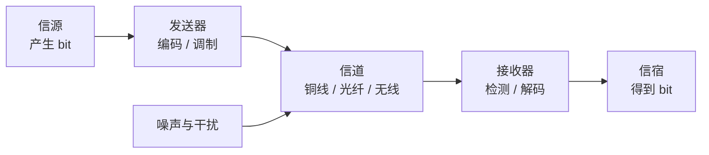
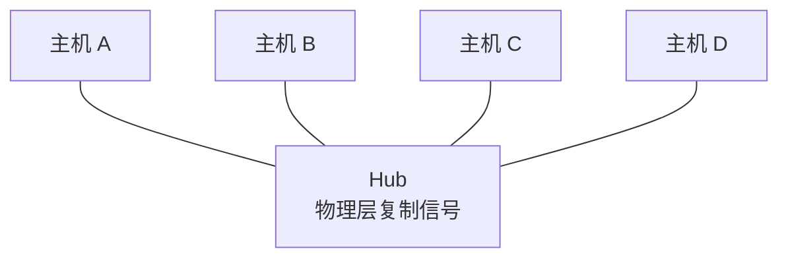
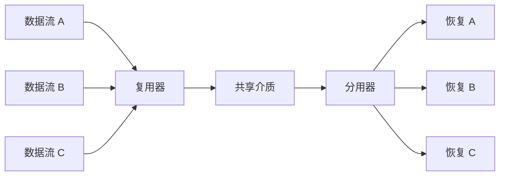

# 物理层：比特怎样变成信号

上一章把网络看成主机、链路和交换设备组成的系统。本章继续向下追问：程序中的 `0` 和 `1` 并不能自己沿着光纤前进，物理设备究竟传输了什么？

物理层负责在传输介质上发送和接收信号，并约定机械、电气、功能和过程特性。它关心“怎样传一个比特”，通常不理解这个比特属于哪个网络层地址或哪条应用请求。

## 1. 信源、信宿、信道和信号

| 名词 | 含义 | 例子 |
| --- | --- | --- |
| 信源（source） | 产生信息的一方 | 发送文件的计算机 |
| 信宿（destination / sink） | 接收信息的一方 | 接收文件的服务器 |
| 发送器（transmitter） | 把数据转换成适合介质的信号 | 网卡中的物理层芯片、光模块 |
| 接收器（receiver） | 从信号中恢复数据 | 对端物理层芯片 |
| 信道（channel） | 信号经过的传输通路 | 一对双绞线、一根光纤、一段无线频谱 |
| 信号（signal） | 随时间或空间变化、用于承载信息的物理量 | 电压、光强、电磁波的幅度或相位 |



信道不是某根线缆名称的同义词。无线频段可以是信道；一根光纤也可以通过不同波长承载多个逻辑信道。

## 2. 模拟量、数字量与信号

**模拟量（analog quantity）**在一定范围内连续变化，例如连续变化的电压；**数字量（digital quantity）**只取离散值，例如程序中的二进制 `0` 和 `1`。

数据和信号是两个维度：

- 数字数据可以用离散电平形成的数字信号传输；
- 数字数据也可以调制到连续载波上，形成模拟信号传输；
- 模拟声音可以采样、量化成数字数据，再通过数字网络传输。

因此“数字数据只能使用数字信号”是错误的。Wi-Fi 发送的是数字数据，但在空气中传播的是经过调制的电磁波。

### 2.1 周期、频率和相位

周期信号每隔一段时间重复一次。若周期为 `T` second，频率为 `f` hertz（Hz，赫兹）：

```text
f = 1 / T
```

频率表示每秒重复多少次。**幅度（amplitude）**描述信号强弱，**相位（phase）**描述信号在周期中的相对位置。常见调制方法会改变幅度、频率或相位来表示不同码元。

## 3. 比特、码元、波特率和比特率

### 3.1 比特与码元

**bit（binary digit，比特）**是二进制信息单位，只取 `0` 或 `1`。

**码元（symbol）**是一个固定时间区间内，发送端选择的一种离散信号状态。一个码元不一定只表示一个 bit：

- 若有 2 种可区分状态，每个码元最多表示 `log₂2 = 1` bit；
- 若有 4 种可区分状态，每个码元最多表示 `log₂4 = 2` bit；
- 若有 16 种可区分状态，每个码元最多表示 `log₂16 = 4` bit。

这里要求状态数 `M` 是 2 的整数次幂，并且使用理想的一一映射。实际协议还有同步、纠错和控制开销，有效数据率可能低于原始比特率。

### 3.2 波特率与比特率

- **码元速率或波特率** `R_s`：每秒发送多少个码元，单位是 Baud（波特）；
- **比特率** `R_b`：每秒发送多少 bit，单位是 bit/s，也写作 bps。

理想情况下，若一个码元有 `M` 种状态：

```text
每码元比特数 = log₂M
R_b = R_s × log₂M
```

### 3.3 数字算例

某系统每秒发送 2400 个码元，每个码元有 16 种状态：

```text
每码元比特数 = log₂16 = 4 bit
R_b = 2400 Baud × 4 bit/symbol
    = 9600 bit/s
```

所以 Baud 和 bit/s 不是同一个单位。只有每个码元恰好携带 1 bit 时，两者数值才相等。

## 4. 带宽、信噪比与信号损伤

### 4.1 两种语境中的“带宽”

“带宽”常有两种用法：

1. **模拟信道带宽**：信道能够通过的频率范围宽度，单位是 Hz；
2. **数字网络中的链路速率**：链路每秒可以发送的 bit 数，单位是 bit/s。

二者有关，但不能直接把 `20 MHz` 写成 `20 Mbit/s`。频率带宽能支持多少数据率，还取决于信号状态数、信噪比、编码和调制方式。

### 4.2 信号为什么会变差

| 损伤 | 是什么 | 可能造成什么 |
| --- | --- | --- |
| 衰减（attenuation） | 信号能量随距离减弱 | 接收端难以区分信号 |
| 失真（distortion） | 不同频率成分传播特性不同 | 波形形状改变、码元互相干扰 |
| 噪声（noise） | 信道中叠加了不希望出现的能量 | 接收端把一个状态误判为另一个 |

**SNR（Signal-to-Noise Ratio，信噪比）**是信号平均功率 `S` 与噪声平均功率 `N` 的比值：

```text
SNR = S / N
```

工程中常用分贝表示：

```text
SNR_dB = 10 log₁₀(S / N)
```

若 `SNR = 1000`，则：

```text
SNR_dB = 10 log₁₀(1000) = 30 dB
```

分贝是对数单位。`30 dB` 不能直接作为 Shannon 公式中的 `S/N`，必须先还原成 `1000`。

## 5. Nyquist：无噪声信道能多快

Nyquist（奈奎斯特）公式给出**理想无噪声、带宽受限的低通信道**可达到的最大数据率：

```text
C = 2B log₂M
```

其中：

- `C` 是最大数据率，单位 bit/s；
- `B` 是信道带宽，单位 Hz；
- `M` 是每个码元可取的离散状态数；
- `2B` 表示理想条件下每秒最多传输约 `2B` 个无符号间干扰码元。

### 5.1 二进制算例

理想低通信道带宽为 3000 Hz，使用二进制信号，即 `M = 2`：

```text
C = 2 × 3000 × log₂2
  = 6000 bit/s
```

### 5.2 多电平算例

同一信道若理想地使用 16 种状态：

```text
C = 2 × 3000 × log₂16
  = 2 × 3000 × 4
  = 24,000 bit/s
```

增加 `M` 可以让每个码元承载更多 bit，但状态越密集，接收端越难在噪声中区分它们。Nyquist 公式本身假定无噪声，因此不能靠无限增加 `M` 获得无限数据率。

## 6. Shannon：有噪声信道的理论上限

Shannon（香农）容量公式给出带宽受限、存在加性高斯白噪声信道的理论容量上限：

```text
C = B log₂(1 + S/N)
```

其中 `B` 的单位是 Hz，`S/N` 必须使用普通功率比，而不是 dB 数值。Shannon 公式说明：任何编码方式都不能在任意低错误率条件下长期超过这个容量；它不告诉我们具体应使用哪种编码或调制。

### 6.1 数字算例

信道带宽 `B = 3000 Hz`，信噪比为 `30 dB`：

先把分贝还原成功率比：

```text
S/N = 10^(30/10) = 1000
```

再代入 Shannon 公式：

```text
C = 3000 × log₂(1 + 1000)
  ≈ 3000 × 9.97
  ≈ 29,900 bit/s
```

若同一系统采用 16 种状态，Nyquist 上限为 24,000 bit/s，低于 Shannon 上限，因此这里先受到码元速率和状态数约束。实际可用速率还会低于理论上限，因为需要留出同步、纠错和协议开销。

### 6.2 两个公式怎样一起使用

| 公式 | 主要限制来源 | 回答什么 |
| --- | --- | --- |
| Nyquist | 有限带宽和有限信号状态数；理想无噪声 | 给定 `B`、`M` 时最多传多快 |
| Shannon | 有限带宽和噪声 | 给定 `B`、`S/N` 时任何方案的理论容量上限 |

真实设计同时受两类约束。做题时先判断题目给的是 `M` 还是信噪比，再选择公式；如果条件同时给出，应比较两个上限，而不是随意选择较大的答案。

## 7. 数字数据怎样变成信号

### 7.1 基带编码

**基带传输（baseband transmission）**直接用介质上的离散信号状态表示数字数据。常见思想包括：

| 方法 | 基本直觉 | 需要注意 |
| --- | --- | --- |
| NRZ（Non-Return-to-Zero，不归零编码） | 用不同电平表示 `0` 和 `1`，码元期间不回到零电平 | 长串相同比特缺少跳变，不利于时钟同步 |
| Manchester（曼彻斯特编码） | 每个 bit 中间必有一次跳变，跳变方向表示数据 | 容易提取时钟，但需要更多频率资源 |
| 4B/5B | 把 4 bit 数据映射成 5 bit 码字，避免过长的无跳变序列 | 有 `5/4` 的编码开销，通常还要配合线路编码 |

编码不仅要让接收端区分 `0` 和 `1`，还要帮助双方保持时钟同步、控制直流分量，并为差错检测提供条件。

### 7.2 载波调制

当信道适合在某个频带上传输时，可以让数字数据改变载波特征：

| 调制 | 英文全称 | 改变什么 |
| --- | --- | --- |
| ASK | Amplitude Shift Keying，幅移键控 | 幅度 |
| FSK | Frequency Shift Keying，频移键控 | 频率 |
| PSK | Phase Shift Keying，相移键控 | 相位 |
| QAM | Quadrature Amplitude Modulation，正交幅度调制 | 同时组合幅度和相位 |

QAM 的每个星座点代表一种码元状态。状态越多，每个码元携带的 bit 越多，但点之间距离通常越近，对噪声、失真和接收器精度的要求也越高。

编码把数据映射为信号状态，调制让数据改变载波。具体系统会继续规定波形、同步和解调方法。

## 8. 传输介质

### 8.1 导向介质

**导向介质（guided media）**让信号沿实体材料传播：

| 介质 | 结构与信号 | 优点 | 局限与常见用途 |
| --- | --- | --- | --- |
| 双绞线 | 两根绝缘铜线绞合，传输电信号 | 便宜、易部署 | 距离和抗干扰能力有限；以太网接入常见 |
| 同轴电缆 | 中心导体、绝缘层、屏蔽层 | 屏蔽和频带性能通常优于普通双绞线 | 较粗、部署灵活性较低；有线电视等场景常见 |
| 光纤 | 光在纤芯中传播 | 带宽高、距离远、抗电磁干扰 | 光模块和施工要求较高；骨干网、数据中心互联常见 |

光纤主要分为单模和多模。单模纤芯较细，适合更远距离和更高带宽；多模常用于较短距离。具体距离取决于光模块、波长、纤芯和标准，不能只凭“单模/多模”给出固定数字。

### 8.2 非导向介质

**非导向介质（unguided media）**通过空气或空间传播电磁波，例如无线局域网、蜂窝网络和卫星通信。

无线的优势是移动性和布线灵活；同时更容易受到遮挡、反射、同频干扰和共享频谱竞争。无线广播特性也意味着安全性不能依赖“别人接触不到线缆”，需要上层认证和加密。

## 9. 中继器和集线器

### 9.1 中继器

**中继器（repeater）**工作在物理层。它接收衰减或变形的信号，进行整形、再生并继续发送，从而延长可传输距离。

中继器不读取链路层地址或网络层地址，也不会选择路由。它再生信号，但不能修复上层协议意义上的错误帧。

### 9.2 集线器

**集线器（hub）**可以看作多端口中继器：某个端口收到的信号会被转发到其他端口。



集线器不会学习地址，也不会只把数据送到目标端口；所有端口共享同一冲突域，并共享总带宽。现代以太网通常使用二层交换机。交换机如何学习链路层地址、怎样隔离冲突域，属于数据链路层章节。

## 10. 复用：多人怎样共享一条介质

**复用（multiplexing）**把一条物理介质的资源划分给多路信号；接收端再通过**分用（demultiplexing）**把它们区分开。



| 方法 | 英文全称 | 划分资源的直觉 | 例子 |
| --- | --- | --- | --- |
| FDM | Frequency Division Multiplexing，频分复用 | 每路使用不同频段，同时发送 | 广播、部分有线系统 |
| TDM | Time Division Multiplexing，时分复用 | 每路轮流使用不同时隙 | 数字电话系统 |
| WDM | Wavelength Division Multiplexing，波分复用 | 在光纤中使用不同波长，可看作光域频分 | 光纤骨干链路 |
| CDM/CDMA | Code Division Multiplexing / Code Division Multiple Access，码分复用/码分多址 | 多路同时使用相同时间和频带，以不同码序列区分 | 蜂窝通信中的码分系统 |

本节只解释信号怎样在物理资源上被区分。谁有权在共享介质上发送、发生竞争时如何协调，属于数据链路层的 MAC（Media Access Control，介质访问控制）问题。408 常把 FDM/TDM/WDM/CDM 同介质访问一起考查，但“物理复用方法”和“链路层访问协议”仍应分清。

## 11. 从三个应用场景理解物理层

| 场景 | 物理层问题 |
| --- | --- |
| 传统后端 | 网线、光模块或无线信号异常会表现为链路断开、误码和重传；应用报错不一定来自代码 |
| AI（Artificial Intelligence，人工智能）基础设施 | 多机训练首先受网卡速率、光纤链路和集群拓扑约束；更快的 GPU（Graphics Processing Unit，图形处理器）不能消除物理链路瓶颈 |
| HFT（High-Frequency Trading，高频交易）系统 | 专线仍受传播距离和介质速度限制；更换网卡无法突破由地理距离决定的传播下限 |

## 12. 推演题

### 题 1：Baud 与 bit/s

某调制方案有 8 种码元状态，码元速率为 10 kBaud。在理想映射且忽略编码开销时，原始比特率是多少？

<details>
<summary>参考答案</summary>

`log₂8 = 3 bit/symbol`，所以 `R_b = 10,000 × 3 = 30,000 bit/s`。

</details>

### 题 2：比较 Nyquist 与 Shannon 上限

带宽为 4000 Hz，使用 4 种码元状态，信噪比为 20 dB。分别计算 Nyquist 和 Shannon 上限，并判断哪个约束更紧。

<details>
<summary>参考答案</summary>

Nyquist 上限：`2 × 4000 × log₂4 = 16,000 bit/s`。

`20 dB` 对应 `S/N = 10^(20/10) = 100`。Shannon 上限约为 `4000 × log₂(101) ≈ 26,632 bit/s`。因此在给定 4 种状态时，Nyquist 的 `16 kbit/s` 约束更紧。

</details>

### 题 3：判断设备层次

某设备把一个端口收到的电信号复制到所有其他端口，却不读取帧地址。它是什么设备？能否隔离冲突域？

<details>
<summary>参考答案</summary>

它是集线器，即多端口中继器，工作在物理层；不能按地址选择端口，也不能隔离冲突域。

</details>

## 13. 做题方法：码元速率与信道上限

1. **读题分对象**：先区分码元速率 `B`、数据率 `R`、模拟带宽 `W`、离散状态数 `M` 和信噪比；dB 必须先转换为线性比值 `S/N=10^(dB/10)`。
2. **选择模型**：无噪声且给 `M` 时用 Nyquist；给信噪比时用 Shannon；两者都给时分别计算，取更严格的上限。
3. **逐行代入**：先算每码元携带 `log₂M` bit，再算 `R=B log₂M`；公式中的 `W` 用 Hz，答案写 bit/s。
4. **画编码波形**：编码题按每个 bit 划时间格，标电平与跳变；Manchester 题不要把“中间必跳变”漏掉。
5. **验算**：`M=2` 时每码元只能携带 1 bit；状态数增加应提高 Nyquist 上限；有限带宽和有限信噪比下 Shannon 容量应有限。

常见陷阱：把 dB 数字直接放进 `log₂(1+S/N)`；把 Hz 与 bit/s 当同一量；只算一个公式就宣布可达；把集线器当成会学习 MAC 地址的交换机。

## 14. 章末面试题

1. 模拟数据、数字数据、模拟信号和数字信号之间是什么关系？

<details>
<summary>参考答案</summary>

数据描述要表达的信息，信号是承载信息的物理量。模拟数据取值连续，数字数据取离散符号；模拟信号在时间和幅值上连续变化，数字信号使用有限离散电平。二者不是固定配对：语音可调制成模拟无线波，也可采样量化为比特后用数字基带信号传输；数字比特也可调制到模拟载波上。

</details>

2. 码元和 bit 有什么区别？什么时候 Baud 与 bit/s 数值相同？

<details>
<summary>参考答案</summary>

码元是一个符号周期内发送的信号状态，bit 是二进制信息单位。若有 `M` 个可区分状态，理想映射下每码元携带 `log₂M` bit，故 `R_bit=R_baud log₂M`。只有每码元恰好携带 1 bit（例如 `M=2` 且无额外编码开销）时，Baud 与 bit/s 数值相同，但单位和含义仍不同。

</details>

3. Hz 表示的信道带宽与 bit/s 表示的链路速率为什么不能直接画等号？

<details>
<summary>参考答案</summary>

Hz 是可用频率范围的宽度，bit/s 是每秒传送的信息量。两者还通过信号状态数、编码、噪声和信噪比联系；Nyquist 与 Shannon 公式正是在给定前提下建立这种上限关系。因此 `1 Hz = 1 bit/s` 没有普遍依据。

</details>

4. Nyquist 与 Shannon 公式分别基于什么前提？题目同时给出 `M` 和 SNR 时怎样处理？

<details>
<summary>参考答案</summary>

Nyquist 上限 `2W log₂M` 面向带宽受限、理想无噪声信道和 `M` 个离散码元状态；Shannon 容量 `W log₂(1+S/N)` 面向有噪声信道，给出理论信息率上限而不指定具体编码。两项都给时分别计算，并取较小者作为同时受两类约束时的上限；实际速率还会更低。

</details>

5. `30 dB` 为什么不能把数字 30 直接代入 Shannon 公式？

<details>
<summary>参考答案</summary>

Shannon 公式需要线性的功率比 `S/N`，而 dB 是对数表示。应先换算：`S/N=10^(30/10)=1000`，再计算 `W log₂(1+1000)`。直接代 30 会混用两种量纲并严重低估容量。

</details>

6. Manchester 编码为什么有利于同步，又为什么需要更多频率资源？

<details>
<summary>参考答案</summary>

Manchester 编码在每个码元中点强制发生一次跳变，接收方可从稳定的跳变节奏恢复时钟，所以不依赖很长的同电平段。但一个数据 bit 内至少安排一次中点变化，信号变化频率高于简单不归零编码，因而在同等 bit rate 下需要更宽的频带。

</details>

7. 双绞线、同轴电缆、光纤和无线介质各有什么特点？

<details>
<summary>参考答案</summary>

双绞线便宜、易部署，常用于局域网但距离和抗干扰有限；同轴屏蔽较好、带宽较高，常见于有线接入等场景；光纤容量高、距离远、抗电磁干扰，但光模块与施工有成本；无线无需线缆且支持移动，却共享开放介质，受干扰、遮挡和安全问题影响。选择要同时看距离、速率、环境、成本和可维护性。

</details>

8. 中继器、集线器和交换机的工作层次及功能有什么不同？

<details>
<summary>参考答案</summary>

中继器在物理层再生信号；集线器是多端口中继器，把收到的比特复制到其他端口，所有端口共享冲突域；交换机工作在数据链路层，读取 MAC 地址、学习端口映射并选择性转发帧，每个端口可形成独立冲突域。交换机也可能对未知目的帧泛洪，但这是查表后的链路层决策，不是无条件复制信号。

</details>

9. FDM、TDM、WDM 与 CDM 分别怎样共享介质？物理复用与 MAC 协议的边界是什么？

<details>
<summary>参考答案</summary>

FDM 为各路划分频段，TDM 划分时隙，WDM 在光纤中划分波长，CDM 用不同码序列区分同时发送的信号。它们说明物理资源怎样分开；MAC 协议则决定共享介质上谁何时可以发送、冲突怎样避免或处理。一个系统可以同时使用复用与 MAC，二者回答的问题不同。

</details>

## 15. 延伸阅读

- [高校公开转载的《2025 年计算机学科专业基础考试大纲》](https://www.uwh.edu.cn/uploads/article/20250609/660428d58334252302af691bf99e064e.pdf)
- [Kurose 与 Ross：《Computer Networking: A Top-Down Approach》官方课程资源](https://gaia.cs.umass.edu/kurose_ross/online_lectures.htm)
- [Kurose 与 Ross：网络边缘、接入网络和物理介质知识检查](https://gaia.cs.umass.edu/kurose_ross/knowledgechecks/)
- [Stanford CS144: Introduction to Computer Networking](https://cs144.github.io/)

下一章进入数据链路层：物理层能够传递比特后，链路两端还需要解决怎样组帧、发现差错和共享介质。
