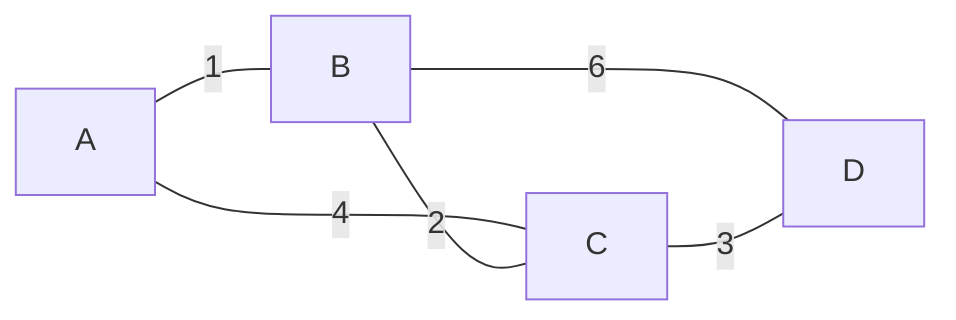
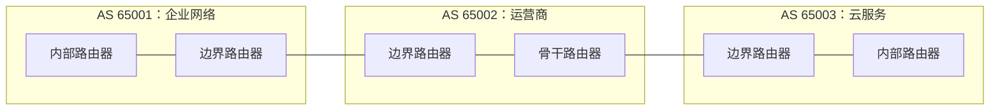
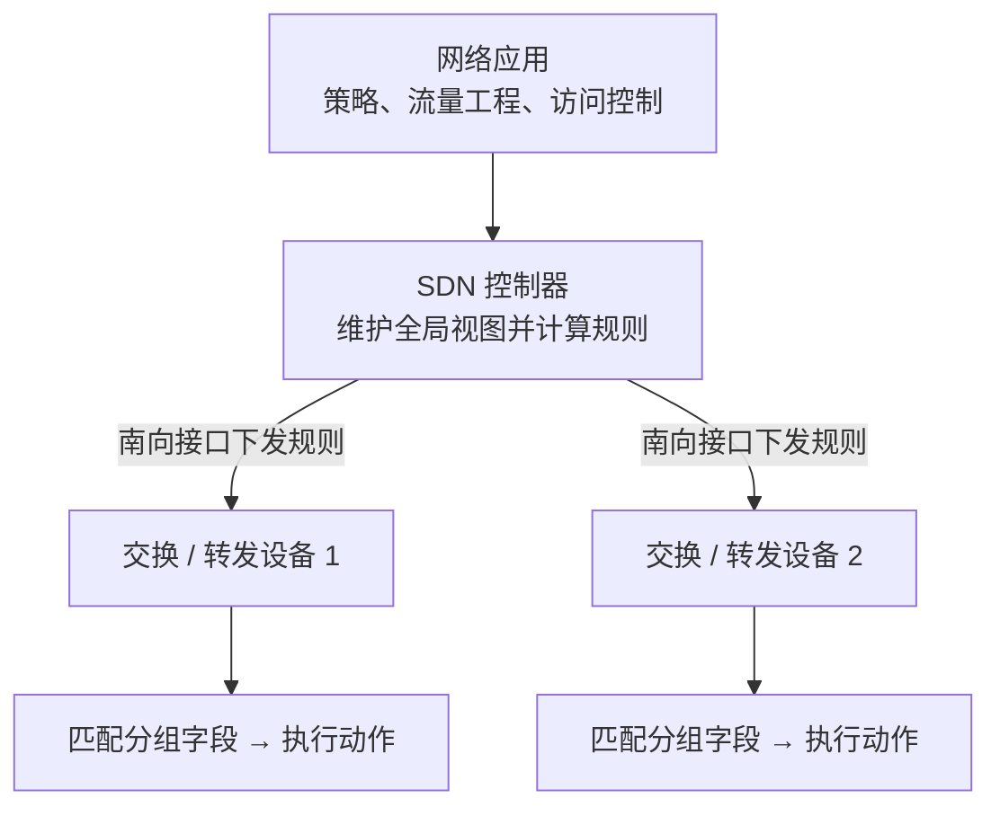

# 路由控制：路由表是怎样算出来的

网络层数据面已经知道怎样查路由表并转发分组，但路由表不会凭空出现。网络规模很小时，管理员可以手工填写；网络变大、链路会故障时，路由器必须交换信息并重新计算路径。

**路由（routing）**是为目的网络选择路径并生成路由信息的过程；**转发（forwarding）**是某个分组到达后，根据已经生成的表项把它送到输出接口。前者主要属于控制面，后者属于数据面。


本章先讲路径算法，再讲互联网协议怎样使用这些思想。IP（Internet Protocol，网际协议）首部、子网和最长前缀匹配见[网络层](network_layer.md)。

## 1. 把网络抽象成带权图

路由算法通常把网络抽象为**图（graph）**：路由器是节点，链路是边，边上的数字是**代价（cost）**。代价可以表示跳数、带宽的某种函数、管理员配置值或其他度量。



从 A 到 D 有多条路：

- `A → B → D`，总代价 `1 + 6 = 7`；
- `A → C → D`，总代价 `4 + 3 = 7`；
- `A → B → C → D`，总代价 `1 + 2 + 3 = 6`。

若目标是最小总代价，第三条最好。但“最优”必须先说明指标：最少跳数不一定有最大带宽，最低代价也不一定符合组织的商业策略。

## 2. 静态路由、动态路由与收敛

**静态路由**由管理员直接配置，设备不会仅因拓扑变化就自动换路。它简单、可预测，适合小网络、默认出口或明确的备用路径；缺点是规模扩大后维护困难，故障时也可能需要人工处理。

**动态路由**让路由器通过路由协议交换可达性，自动适应新增网络和故障。它减少人工维护，却引入协议状态、计算、错误传播和收敛时间。

**收敛（convergence）**是所有相关路由器对新拓扑形成一致、稳定可达性的过程。链路刚断而网络尚未收敛时，可能出现短暂黑洞、绕路或环路。因此动态不等于瞬间正确。

| 目标 | 含义 | 不能误解为 |
| --- | --- | --- |
| 正确性 | 最终得到可用且无环的路径 | 任意时刻绝不丢包 |
| 健壮性 | 局部故障后能重新计算 | 所有故障都能被协议识别 |
| 稳定性 | 小变化不引发长期震荡 | 永远不改变路径 |
| 公平与效率 | 合理利用资源 | 每条流量都走同一条“最短路” |

## 3. 为什么互联网必须分层路由

让全球每台路由器保存所有内部拓扑，既难扩展，也不符合不同组织独立管理网络的现实。互联网把一组受同一管理策略控制的网络和路由器称为**自治系统（Autonomous System，AS）**，每个 AS 由一个自治系统编号标识。



- **域内路由**解决一个 AS 内部怎样到达各子网，通常追求可管理的低代价路径；
- **域间路由**解决 AS 之间宣告哪些前缀、允许经过哪些组织，更重视策略和可扩展性。

这种层次化隐藏了内部细节、减小状态规模，也让每个组织保留自己的路由政策。代价是全局路径不一定等于某个单一度量下的数学最短路。

## 4. 距离向量与 Bellman-Ford 方程

**距离向量（Distance Vector，DV）**的核心是：每台路由器只知道到直连邻居的代价，并从邻居处收到“邻居到各目的地的距离”。它不需要掌握全网完整拓扑。

设路由器 `x` 到目的 `y` 的当前最小估计为 `D_x(y)`，`x` 的邻居是 `v`，直连代价为 `c(x,v)`。Bellman-Ford 递推式为：

```text
D_x(y) = min_v { c(x,v) + D_v(y) }
```

意思是：从 `x` 到 `y` 的第一步一定先到某个邻居 `v`，因此枚举每个邻居，选择“到邻居的代价 + 邻居声称到目的的距离”最小者。

### 4.1 完整数字推演

仍使用开头的四节点图。初始化时，每个节点只知道自己为 0、直连邻居的代价，其他目的为无穷大 `∞`：

| 节点 | 到 A | 到 B | 到 C | 到 D |
| --- | ---: | ---: | ---: | ---: |
| A | 0 | 1 | 4 | ∞ |
| B | 1 | 0 | 2 | 6 |
| C | 4 | 2 | 0 | 3 |
| D | ∞ | 6 | 3 | 0 |

A 收到 B、C 的初始向量后：

```text
到 C：min(经 B: 1 + 2, 经 C: 4 + 0) = 3
到 D：min(经 B: 1 + 6, 经 C: 4 + 3) = 7
```

第一轮后 A 的向量变为 `(0, 1, 3, 7)`。与此同时，B 学到经 C 到 D 的代价为 `2 + 3 = 5`。下一轮 A 再收到 B 的新结果：

```text
到 D：min(经 B: 1 + 5, 经 C: 4 + 3) = 6
```

最终 A 得到：

| 目的 | 最小代价 | 下一跳 | 路径 |
| --- | ---: | --- | --- |
| B | 1 | B | `A → B` |
| C | 3 | B | `A → B → C` |
| D | 6 | B | `A → B → C → D` |

距离向量的“轮”是理解算法的教学模型；真实协议由消息到达和计时器驱动，不要求所有路由器严格同时更新。

### 4.2 路由环路与计数到无穷

考虑目的网络 N 直连 A，A 与 B 相连。故障前 A 到 N 代价为 1，B 经 A 的代价为 2。A 到 N 的链路断开后，B 的旧消息可能仍声称“我到 N 是 2”：

```text
A 误以为可经 B 到 N：代价 1 + 2 = 3
B 又从 A 学到：代价 1 + 3 = 4
A 再学成 5，B 再学成 6……
```

错误距离逐步增大，直到协议定义的“无穷大”，这叫**计数到无穷（count-to-infinity）**。期间 A、B 还可能互相转发形成环路。

**水平分割（split horizon）**不把从某邻居学到的路由再通告回该邻居；**毒性逆转（poison reverse）**则向该邻居明确通告该目的为无穷大。它们能避免许多二节点环路，但不能消除所有复杂拓扑中的暂态环路。

## 5. RIP（路由信息协议）：以跳数为距离的域内协议

**RIP（Routing Information Protocol，路由信息协议）**是经典距离向量协议。它把经过一个路由器记为一跳，选择跳数较少的路径；最大有效跳数为 15，16 表示不可达。

RIP 路由器周期性交换距离向量，变化时也可以触发更新。跳数简单，却无法区分“低带宽的一跳”和“高速链路的两跳”，15 跳上限也限制了网络规模。因此 RIP 适合理解距离向量，不是大型现代网络的通用最优选择。

<details>
<summary>RIP 版本与报文细节</summary>

RIPv2 支持无类别前缀、下一跳和认证字段，使用 UDP（User Datagram Protocol，用户数据报协议）端口 520。协议还结合超时、垃圾回收、水平分割和毒性逆转处理失效路由；具体计时器默认值由协议版本规定。

</details>

## 6. 链路状态与 Dijkstra 算法

**链路状态（Link State，LS）**方法让每台路由器发现自己的邻居和链路代价，再把这些本地事实可靠地泛洪给区域内其他路由器。大家获得一致的**链路状态数据库**后，各自在本地运行 Dijkstra 算法，生成以自己为根的最短路径树。

距离向量交换“我到各目的多远”；链路状态交换“我有哪些邻居、边的代价是多少”。前者知道邻居的结论，后者努力获得完整拓扑事实。

### 6.1 Dijkstra 完整数字推演

仍从 A 出发。记 `N'` 为最短距离已经确定的节点集合，`D(X)` 为 A 到 X 的当前最小估计，括号内是前驱。

| 步骤 | `N'` | `D(B)` | `D(C)` | `D(D)` | 说明 |
| --- | --- | --- | --- | --- | --- |
| 初始化 | `{A}` | `1(A)` | `4(A)` | `∞` | 只使用 A 的直连边 |
| 选 B | `{A,B}` | 已确定 | `min(4,1+2)=3(B)` | `1+6=7(B)` | B 的距离最小，用 B 松弛邻边 |
| 选 C | `{A,B,C}` | 已确定 | 已确定 | `min(7,3+3)=6(C)` | C 的距离最小，再松弛 |
| 选 D | `{A,B,C,D}` | 已确定 | 已确定 | `6(C)` | 全部完成 |

**松弛（relaxation）**就是检查“经过刚确定的节点，会不会得到更小距离”。根据前驱从 D 反向追踪 `D ← C ← B ← A`，得到 `A → B → C → D`，总代价 6。

使用简单数组时，Dijkstra 的典型时间复杂度是 `O(V²)`；使用合适的优先队列和邻接表时可达到 `O((V+E) log V)`，其中 `V` 是节点数、`E` 是边数。面试重点是适用前提：边权不能为负，并且算法需要本节点拥有相应拓扑图。

## 7. OSPF（开放最短路径优先）：把链路状态用于一个自治系统

**OSPF（Open Shortest Path First，开放最短路径优先）**是域内链路状态协议。路由器发现邻居，生成描述本地连接的链路状态通告，并在区域内泛洪；每台路由器据此建立数据库并运行最短路径优先计算。

OSPF 使用**区域（area）**形成层次结构。骨干区域连接其他区域，区域边界限制部分拓扑信息的传播范围，从而减小数据库和重新计算的影响。OSPF 的代价由网络管理员和实现规则确定，不应简单理解为物理距离。

<details>
<summary>OSPF 报文与版本细节</summary>

OSPF 直接封装在 IP 中，IPv4（Internet Protocol version 4，网际协议第 4 版）的协议号为 89，不使用 TCP 或 UDP 端口。常见报文承担邻居发现、数据库摘要、链路状态请求、更新和确认等任务。在广播网络上会选举指定路由器与备份指定路由器，减少邻接和泛洪开销。OSPFv2 用于 IPv4，OSPFv3 面向 IPv6（Internet Protocol version 6，网际协议第 6 版）。

</details>

## 8. BGP（边界网关协议）：域间路由首先是策略问题

**BGP（Border Gateway Protocol，边界网关协议）**在自治系统之间传播可达前缀。它属于**路径向量（path vector）**协议：通告不仅说“这个前缀可达”，还携带经过的 AS 序列等路径属性。

最重要的属性之一是 `AS_PATH`。若 AS 65001 收到的通告中已经包含 65001，就能识别潜在环路并拒绝该路径。与只保存距离的算法相比，路径序列既帮助防环，也为策略选择提供信息。

```text
203.0.113.0/24
  路径甲：AS_PATH = 65010 65020
  路径乙：AS_PATH = 65030 65040 65050
```

路径甲的 AS 数量更少，但本地策略仍可能选择路径乙，例如组织更偏好某个客户或低成本上游。BGP 的核心不是求一个全互联网统一代价下的最短路，而是在策略约束下选择并传播可接受路径。

- **eBGP（External BGP，外部 BGP）**在不同 AS 的路由器之间交换域间路由；
- **iBGP（Internal BGP，内部 BGP）**在同一 AS 的 BGP 路由器之间传播 BGP 路由。

<details>
<summary>BGP 传输与常见属性细节</summary>

BGP 使用 TCP（Transmission Control Protocol，传输控制协议）端口 179 建立会话。常见属性包括下一跳 `NEXT_HOP`、本地优先级 `LOCAL_PREF`、多出口鉴别属性 `MED` 和 `AS_PATH`。真实选路包含本地策略和多级比较，厂商实现也有扩展；基础学习不应把“AS_PATH 最短”误背成唯一规则。

</details>

## 9. 三类协议不要混在一起

| 对比 | RIP | OSPF | BGP |
| --- | --- | --- | --- |
| 作用范围 | AS 内 | AS 内 | AS 之间为主 |
| 核心思想 | 距离向量 | 链路状态 | 路径向量与策略 |
| 交换内容 | 到目的的距离 | 本地链路状态 | 前缀、AS 路径和属性 |
| 主要度量 / 决策 | 跳数 | 配置代价上的最短路径 | 策略优先，再比较属性 |
| 防环直觉 | 有限无穷、水平分割等 | 共同拓扑上建最短路径树 | 检查 AS_PATH |
| 典型局限 | 规模小、慢收敛 | 维护拓扑数据库与计算 | 策略复杂，不能只看最短 |

## 10. SDN（软件定义网络）：把控制逻辑与转发设备解耦

**SDN（Software-Defined Networking，软件定义网络）**强调把控制逻辑从每台转发设备的封闭实现中抽离，由逻辑上集中的控制器统一编程数据面。“逻辑集中”不表示生产系统只能有一台控制器；控制器可以复制和分布部署。



传统分布式控制面让路由器互相运行协议；SDN 控制器可以根据全局拓扑计算规则，再向设备下发“匹配哪些字段、转发到哪里、丢弃或改写什么”。数据包通常仍由设备本地高速转发，不会每个都绕到控制器。

<details>
<summary>OpenFlow 与“南向接口”是什么？</summary>

**南向接口**是控制器和转发设备之间的通信接口，OpenFlow 是一个经典例子。OpenFlow 用流表的匹配字段、优先级、计数器和动作描述转发行为。SDN 是架构思想，不等于只能使用 OpenFlow，也不表示所有网络功能都必须集中实现。

</details>

## 11. 常见误解

1. **路由和转发不是同义词。** 路由生成路径信息，转发对每个到达分组执行查表。
2. **动态路由不保证立即无环。** 拓扑变化后的传播和计算需要时间。
3. **Dijkstra 不是“OSPF 本身”。** 它是 OSPF 计算最短路径时使用的算法之一；OSPF 还要发现邻居、泛洪和维护数据库。
4. **BGP 不单纯选择 AS 数最少的路。** 组织策略可以优先于路径长度。
5. **SDN 不要求每个分组询问控制器。** 控制器通常先安装规则，设备在数据面本地匹配。

## 12. 三类应用中的路由控制

| 场景 | 为什么需要这些基础 |
| --- | --- |
| 传统后端 | 判断服务不可达来自主机路由、域内故障还是域间宣告；理解多机房出口策略 |
| AI（Artificial Intelligence，人工智能）基础设施 | 理解大规模集群为什么需要分层路由、快速收敛和集中流量工程 |
| HFT（High-Frequency Trading，高频交易）系统 | 理解专线和多运营商接入仍受路由策略、故障收敛和非对称路径影响 |

## 13. 408 推演题

### 题 1：Bellman-Ford 更新

路由器 X 到邻居 A、B 的代价分别为 2、5。A 通告到目的 Y 的距离为 6，B 通告为 1。X 到 Y 的新距离和下一跳是什么？

<details>
<summary>参考答案</summary>

按 `D_X(Y)=min_v{c(X,v)+D_v(Y)}` 列候选：

| 下一跳 v | 直连代价 `c(X,v)` | 邻居通告 `D_v(Y)` | 总代价 |
|---|---:|---:|---:|
| A | 2 | 6 | 8 |
| B | 5 | 1 | 6 |

取最小值 6，下一跳 B。验算：答案必须等于某一条“X 到邻居的真实代价 + 该邻居通告值”，不能只取邻居通告的 1。

</details>

### 题 2：Dijkstra 推演

对本章四节点图，从 A 出发依次确定哪些节点？A 到 D 的路径和代价是什么？

<details>
<summary>参考答案</summary>

用 `S` 表示已确定集合，表中括号是前驱：

| 轮次 | 新确定 | S | `dist(B)` | `dist(C)` | `dist(D)` |
|---:|---|---|---:|---:|---:|
| 初始化 | A | `{A}` | `2(A)` | `4(A)` | `7(A)` |
| 1 | B | `{A,B}` | 2 | `3(B)` | 7 |
| 2 | C | `{A,B,C}` | 2 | 3 | `6(C)` |
| 3 | D | `{A,B,C,D}` | 2 | 3 | 6 |

B 把 C 从 4 松弛到 3，C 把 D 从 7 松弛到 6。沿前驱反推 `D←C←B←A`，故路径 `A→B→C→D`、代价 6。验算三段边权和应为 6，且每轮选未确定节点中最小暂定距离。

</details>

### 题 3：协议归类

某协议在一个自治系统内泛洪链路状态并让每台路由器运行最短路径算法；另一个协议在自治系统之间携带 AS_PATH。它们分别是什么？

<details>
<summary>参考答案</summary>

前者是 OSPF，属于域内链路状态协议；后者是 BGP，属于域间路径向量协议。

</details>

## 14. 做题方法：DV、LS 与协议判断

1. **读题先定范围**：辨认是单路由器转发表、自治系统内部最短路，还是自治系统之间的策略选路；不要一看到“路由”就套 Dijkstra。
2. **DV 题列距离表**：对节点 `x` 的每个目的 `y`，逐邻居计算 `c(x,v)+D_v(y)`，取最小值并记录下一跳；收到新向量后重复到一轮无变化。
3. **LS 题画带权图**：Dijkstra 每轮从未确定节点中选暂定距离最小者，固定后只松弛它的邻边；用“已确定集合、距离、前驱”三列记录。
4. **协议题按四项比较**：范围（域内/域间）、交换内容、核心算法、选路目标。RIP 是 DV，OSPF 是 LS，BGP 是带策略的路径向量。
5. **验算**：最短路树到每个节点应形成连续前驱链；DV 结果满足 Bellman-Ford 不等式；BGP 路径不能含本 AS，且未违反题设策略。

常见陷阱：Dijkstra 中重复选择已确定节点；把链路代价与跳数混用；把 count-to-infinity 当成所有 DV 更新都会发生；只按 AS_PATH 长度解释 BGP 而忽略策略优先级。

## 15. 章末面试题

1. 路由和转发分别发生在哪一面？为什么不能混为一谈？

<details><summary>参考答案</summary>

路由在控制面根据拓扑、度量和策略计算可达路径；转发在数据面按现有表项处理每个分组。一次路由收敛会改变很多后续分组的转发决定，而单包转发不会计算全网路径。排障时也应分别核对“表是否算对”和“包是否按表送出”。

</details>

2. 静态路由与动态路由怎样取舍？什么叫收敛？

<details><summary>参考答案</summary>

静态路由可预测、开销小，适合简单稳定网络，但故障后不会自动适应；动态路由能交换信息并自动选择替代路径，代价是协议状态、配置和暂态风险。收敛是拓扑变化后，各路由器重新形成一致、稳定且无持续环路的可达认知与转发表的过程。

</details>

3. 为什么互联网需要自治系统和分层路由？

<details><summary>参考答案</summary>

全球所有路由器若维护同一份平坦拓扑，状态、更新和计算都难以扩展，而且不同网络运营者有独立政策。自治系统把一个管理域内的路由交给 IGP，在域间由 BGP 交换聚合可达前缀与策略，使规模和管理边界可控。

</details>

4. 写出 Bellman-Ford 递推式，并解释每一项的含义。

<details><summary>参考答案</summary>

节点 `x` 到目的 `y` 的估计为 `D_x(y)=min_v{c(x,v)+D_v(y)}`，其中 `v` 遍历 `x` 的邻居，`c(x,v)` 是直连代价，`D_v(y)` 是邻居通告的到 `y` 距离。每次收到邻居向量就重算最小值及对应下一跳。验算：任何候选路径的第一跳都必须是一个真实邻居。

</details>

5. 距离向量为什么会计数到无穷？水平分割能否解决所有环路？

<details><summary>参考答案</summary>

链路失效后，相邻节点可能把对方仍未更新的旧距离误当替代路径，彼此反复加链路代价，形成逐轮增大的错误可达值。水平分割避免把从某邻居学到的路由再通告给该邻居，可阻止部分二节点环路，但三节点以上环路、同时变化等仍可能发生，所以不能解决全部问题。

</details>

6. Dijkstra 每一步“确定节点”和“松弛”分别做什么？为什么不能处理负边？

<details><summary>参考答案</summary>

每轮从未确定节点中取当前暂定距离最小者 `u`，把该距离固定；再对每条 `u→v` 检查 `dist[u]+w(u,v)` 是否更小，若是就更新 `dist[v]` 和前驱。正确性依赖非负边保证以后绕路不可能降低已固定距离；有负边时这个前提失效。

</details>

7. RIP、OSPF、BGP 在范围、交换信息和选路目标上有什么不同？

<details><summary>参考答案</summary>

RIP 是自治系统内距离向量协议，交换到前缀的跳数距离；OSPF 是域内链路状态协议，洪泛链路状态后各自运行 SPF；BGP 是自治系统间路径向量协议，通告前缀、AS_PATH 和属性并按政策选路。RIP/OSPF主要求域内可达和代价，BGP 首先满足域间政策，不保证全局最短。

</details>

8. BGP 为什么称为路径向量？为什么不一定选 AS_PATH 最短的路径？

<details><summary>参考答案</summary>

BGP 更新不仅给出目的前缀，还携带经过的自治系统序列 AS_PATH，可用于环路检测，所以叫路径向量。选路会先受本地偏好、商业关系、策略和其他属性影响，AS_PATH 长度只是比较因素之一；运营者可能宁愿走更长但成本更低或更可信的路径。

</details>

9. SDN 的控制器、南向接口和转发设备分别做什么？

<details><summary>参考答案</summary>

SDN 控制器维护网络视图并计算策略/转发规则；南向接口承载控制器与设备间的规则下发、状态收集等交互；转发设备按已安装的匹配—动作规则处理数据包。控制逻辑集中不等于只有一台控制器，工程上通常需要分布式复制和故障恢复。

</details>

## 16. 权威依据与延伸阅读

RFC（Request for Comments，征求意见稿）是互联网技术规范的主要系列。

- [高校公开转载的《2025 年计算机学科专业基础考试大纲》](https://www.uwh.edu.cn/uploads/article/20250609/660428d58334252302af691bf99e064e.pdf)
- [Kurose 与 Ross：网络层控制面官方知识检查](https://gaia.cs.umass.edu/kurose_ross/knowledgechecks/)
- [RFC 2453: RIP Version 2](https://www.rfc-editor.org/rfc/rfc2453.html)
- [RFC 2328: OSPF Version 2](https://www.rfc-editor.org/rfc/rfc2328.html)
- [RFC 4271: A Border Gateway Protocol 4](https://www.rfc-editor.org/rfc/rfc4271.html)
- [RFC 7426: Software-Defined Networking—Layers and Architecture Terminology](https://www.rfc-editor.org/rfc/rfc7426.html)

下一章进入传输层：路由已经把分组送到主机，操作系统还要把数据交给正确的进程，并按应用需要提供数据报或可靠字节流。
