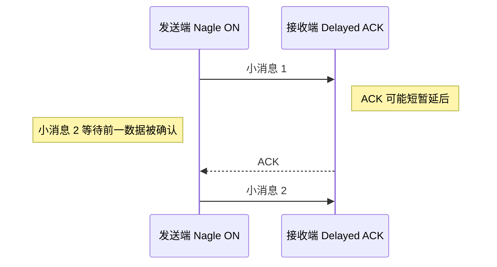

# TCP 协议优化：可靠字节流如何做到低延迟

很多交易所的订单入口使用 TCP：它提供可靠、有序的字节流，也便于构建登录、心跳和序列号会话。代价是拥塞控制、重传、缓冲和内核协议栈都可能影响延迟分布。

本章关注**单个 TCP 连接和应用读写方式**。主机级 sysctl、NIC 与 IRQ 设置放在 [Linux 网络调优](tuning.md) 中。

## 1. 第一原则：TCP 没有消息边界

下面两次 `write`：

```text
write("ABC")
write("DEF")
```

接收方可能一次读到 `ABCDEF`，也可能读到 `A`、`BCDE`、`F`。TCP 只保证字节有序，不保证“一个 write 对应一个 read”。

因此订单协议必须自带 framing：

```text
┌────────────┬──────────────┬────────────┐
│ length: u16│ type: u8     │ payload... │
└────────────┴──────────────┴────────────┘
```

解析步骤是：先累积到固定头部长度，读取并校验 `length`，再等待完整 body。`PSH` 标志不能当作消息结束标志。

> 面试加分点：先说明 TCP 是字节流，再谈 `TCP_NODELAY`。否则即使 socket 选项全背对，也可能写出错误协议解析器。

## 2. Nagle 与 Delayed ACK

### 2.1 Nagle 在解决什么问题

Nagle 算法避免在仍有未确认数据时不断发送 tinygram：小块数据可能暂存在发送栈中，等待 ACK 或凑到足够大小。这能提高网络效率，却可能伤害交互式小消息延迟。



这是一段等待 ACK 定时器的**有限停顿**，常被口语称为“Nagle/Delayed ACK 死锁”，但并非永久无法前进的严格死锁。

### 2.2 `TCP_NODELAY`

对延迟敏感的小订单消息，通常在建立连接时启用：

```rust
use std::io;
use std::net::TcpStream;

fn configure_order_session(stream: &TcpStream) -> io::Result<()> {
    stream.set_nodelay(true)?;
    Ok(())
}
```

它意味着“不要用 Nagle 等待合包”，不意味着：

- 绕过应用缓冲、内核队列或 NIC queue。
- 每次 `write` 都立刻成为一个以太网帧。
- 延迟一定下降 50% 之类的固定数字。

大量极小包会增加包率和每包处理开销。正确做法是针对协议消息大小、发送节奏和真实 RTT 测量。

### 2.3 `TCP_QUICKACK`

Linux 的 `TCP_QUICKACK` 可以请求进入 quick-ack 模式，但它是动态提示，不应理解为“永久关闭 Delayed ACK”。内核之后可以根据协议状态再次改变 ACK 行为。

订单客户端通常更能控制自己的发送端，所以先正确使用 `TCP_NODELAY` 和消息 framing；只有明确观察到 ACK 行为是瓶颈时，再在双方可控、目标内核固定的环境评估 quick ack。

## 3. 写路径：最容易漏掉的是 partial write

### 3.1 阻塞 socket

阻塞模式下，`write` 也不保证写完全部字节。普通控制路径可使用 `write_all`：

```rust
use std::io::{self, Write};
use std::net::TcpStream;

fn send_frame(stream: &mut TcpStream, frame: &[u8]) -> io::Result<()> {
    stream.write_all(frame)
}
```

但 `write_all` 在发送缓冲区拥塞时会阻塞当前线程。热路径需要明确决定：阻塞、进入有界待发送队列，还是触发风险降级。

### 3.2 非阻塞 socket

非阻塞 `write` 可能返回：

- `Ok(n)` 且 `n < frame.len()`：只写入一部分。
- `WouldBlock`：当前发送缓冲区没有空间。
- 其他错误：连接异常或参数错误。

必须保存“剩余 slice 的偏移”，等 socket 再次可写时继续，不能从头重发，否则会在字节流中制造重复数据。

下面的标准库函数可独立编译。返回 `Ok(false)` 表示还没写完，调用方必须保留 `pending` 和 `offset`，等可写事件后继续：

```rust
use std::io::{self, Write};
use std::net::TcpStream;

fn flush_pending(
    stream: &mut TcpStream,
    pending: &[u8],
    offset: &mut usize,
) -> io::Result<bool> {
    while *offset < pending.len() {
        match stream.write(&pending[*offset..]) {
            Ok(0) => return Err(io::Error::new(io::ErrorKind::WriteZero, "peer closed")),
            Ok(written) => *offset += written,
            Err(error) if error.kind() == io::ErrorKind::WouldBlock => return Ok(false),
            Err(error) if error.kind() == io::ErrorKind::Interrupted => continue,
            Err(error) => return Err(error),
        }
    }
    Ok(true)
}
```

待发送队列必须有界，并暴露深度和最老消息等待时间。无界队列会把“交易所或网络已经跟不上”伪装成内存持续增长；旧订单即使最终发出，也可能已经失去业务意义。

## 4. 读路径：EOF、错误与忙轮询

下面把解码器表示为回调，因而仍是完整的标准库代码，不依赖书外类型：

```rust
use std::io::{self, Read};
use std::net::TcpStream;

#[derive(Debug, Clone, Copy, PartialEq, Eq)]
enum ReadStatus { PeerClosed, WouldBlock }

fn drain_readable(
    stream: &mut TcpStream,
    mut on_bytes: impl FnMut(&[u8]) -> io::Result<()>,
) -> io::Result<ReadStatus> {
    let mut buffer = [0_u8; 4096];
    loop {
        match stream.read(&mut buffer) {
            // 对端发送 FIN：这是 EOF，不是“暂时没有数据”。
            Ok(0) => return Ok(ReadStatus::PeerClosed),
            Ok(read) => on_bytes(&buffer[..read])?,
            Err(error) if error.kind() == io::ErrorKind::WouldBlock => {
                return Ok(ReadStatus::WouldBlock);
            }
            Err(error) if error.kind() == io::ErrorKind::Interrupted => continue,
            Err(error) => return Err(error),
        }
    }
}
```

必须区分：

- `Ok(0)`：对端关闭发送方向，应用需要完成会话清理。
- `WouldBlock`：非阻塞 socket 目前没有数据。
- `Interrupted`：系统调用被信号打断，通常可以重试。
- `ConnectionReset` 等：异常断开，需要进入恢复流程。

### 4.1 `SO_BUSY_POLL`

Linux 可让某些 socket 在接收调用附近短时间忙轮询 NIC queue，减少睡眠/唤醒开销。它不是完整 kernel bypass，并且取决于 NIC 驱动、内核、权限和全局配置。

代价包括：

- 持续消耗 CPU 和功耗。
- 配置过长会饿死同核其他任务。
- 没有正确绑核、IRQ/queue 对齐时，收益可能消失。

从很小的微秒预算开始，逐步比较 P50 到 P99.99、CPU 与丢包。不要把某篇文章的 `50us` 原样复制到所有机器。

## 5. 缓冲区不是越小或越大越好

### 5.1 发送缓冲区

太大时，应用可能在很久后才发现对端跟不上，旧消息积压形成 queueing delay；太小时，短暂 microburst 就可能频繁 `WouldBlock`。

需要同时观测：

- 应用 pending queue 深度。
- 内核 send queue，例如 `ss -tin`。
- 消息从决策到真正交给 NIC 的时间。
- `WouldBlock` 和重传次数。

### 5.2 接收缓冲区

TCP 有流量控制，接收缓冲区压力会收缩窗口，而不是像 UDP 那样简单丢弃应用数据。但窗口受限会阻止发送方继续发送，表现为延迟或吞吐下降。

不要假定固定的 `32KB`、`1MB` 是最佳值。根据带宽时延积（BDP）、消息突发和消费速度测量，并验证 Linux autotuning 的实际结果。

```text
BDP = 链路带宽 × RTT
```

例如高带宽、长 RTT 的跨地域连接要填满链路，所需窗口远大于同机房低 RTT 会话；而订单连接通常更关心排队可见性而非填满带宽。

## 6. 选择 Blocking、Epoll、Async 还是 Busy Loop

| 模型 | 优点 | 代价 | 常见用途 |
| :--- | :--- | :--- | :--- |
| 阻塞 + 专用线程 | 简单、状态局部 | 每连接/队列占线程，仍有唤醒 | 少量订单会话 |
| Non-blocking + epoll | 一个线程管理多连接 | 事件循环与状态管理更复杂 | 多会话网关 |
| Async runtime | 组合超时、连接与控制流方便 | runtime 调度与抽象开销需测量 | 控制面、大量并发连接 |
| Non-blocking + busy loop | 可降低用户态等待 | 独占 CPU、功耗高、公平性差 | 极少数最热连接 |

Tokio 并非“天然不能用于 HFT”，阻塞线程也并非“天然最低延迟”。关键问题是：连接数、消息频率、调度模型、分配行为和 SLA 是什么？用端到端分布回答，而不是按技术标签回答。

## 7. 连接生命周期与恢复比纳秒更重要

### 7.1 交易前建立会话

运行时新建连接可能经历 DNS、ARP/ND、TCP 握手、TLS、登录和序列号协商。交易会话通常提前建立、预热并完成状态同步。

DNS 可以在非热路径解析并缓存，但直接硬编码 IP 也有故障切换和配置漂移风险。应服从交易所端点管理方案。

### 7.2 心跳与 TCP keepalive 不同

- **应用心跳**理解业务会话状态和序列号，间隔通常由协议规定。
- **TCP keepalive**由内核探测长时间空闲连接，默认周期常不适合快速故障检测。

两者可以同时存在，但不能互相替代。

### 7.3 发送结果未知

连接断开时，一条订单可能处于三种情况：未发出、交易所已收到但 ACK 丢失、交易所未收到。TCP 错误本身不能总是区分。

因此恢复流程需要：

- 稳定且唯一的 client order ID。
- 协议级序列号、重传或状态查询。
- 在确认前避免盲目重复下单。
- 恢复期间的风控与发单门禁。

## 8. 如何验证优化真的有效

使用与生产相同的消息大小、突发模式、CPU/NIC 位置和对端行为，分别测量：


至少记录：

- 单向延迟或 RTT 的 P50、P99、P99.9、P99.99 与最大值。
- `retransmits`、RTT、拥塞窗口和 send/receive queue。
- CPU、上下文切换、中断、迁核和 softirq。
- 应用队列深度、partial write、`WouldBlock` 和断线次数。

常用只读工具：

```bash
ss -tinp
nstat -az | grep -E 'TcpRetransSegs|TcpExtTCPTimeouts'
ethtool -S eth0
perf stat -e cycles,instructions,context-switches,cpu-migrations ./your-app
```

工具字段随内核和驱动变化，先保存版本和原始输出，再建立告警解析。

## 9. 面试高频问答

### Q1：为什么 HFT TCP 连接常设置 `TCP_NODELAY`？

订单消息通常很小且对交互延迟敏感。Nagle 在有未确认数据时可能暂存后续小写入，与 Delayed ACK 组合造成延迟停顿。`TCP_NODELAY` 关闭这类等待，但会增加小包率，所以仍需测量。

### Q2：一次 `write` 是否对应对端一次 `read`？

不对应。TCP 是字节流，分段、合并和每次读取长度都可能不同。应用协议必须用长度前缀、固定长度或分隔符 framing，并处理半包与粘包。

### Q3：非阻塞写返回 `WouldBlock` 怎么办？

把未写完的 frame 和 offset 保存在有界发送队列，等待可写通知后从 offset 继续；不能从头重发。队列满时执行明确的背压或风险策略，并暴露队列等待时间。

### Q4：TCP 会重传，为什么还要应用层序列号？

TCP 只保证单条连接中的字节流。重连后会话状态、业务幂等、订单是否已被交易所接受和成交回报恢复仍需协议级序列号与 ID 解决。

## 10. 检查清单

- [ ] 协议 framing 正确处理半包、粘包、非法长度与最大消息。
- [ ] 小消息连接已评估 `TCP_NODELAY`，没有把 `TCP_QUICKACK` 当永久开关。
- [ ] 阻塞/非阻塞读写都处理 EOF、partial write、`WouldBlock` 和重连。
- [ ] 应用与内核队列有界、可观测，旧订单不会无限排队。
- [ ] 忙轮询、buffer 与 I/O 模型基于目标硬件的完整延迟分布选择。
- [ ] 应用心跳、TCP keepalive、会话序列号和未知发送结果都有恢复设计。
- [ ] 优化前后同时比较尾延迟、CPU、重传、迁核与丢包。

TCP 优化的核心不是记住最多的 socket option，而是清楚每一段等待发生在哪里，并让排队、错误和恢复状态都可见、可控。

---

下一章：[UDP 多播处理 (UDP Multicast)](udp_multicast.md)
