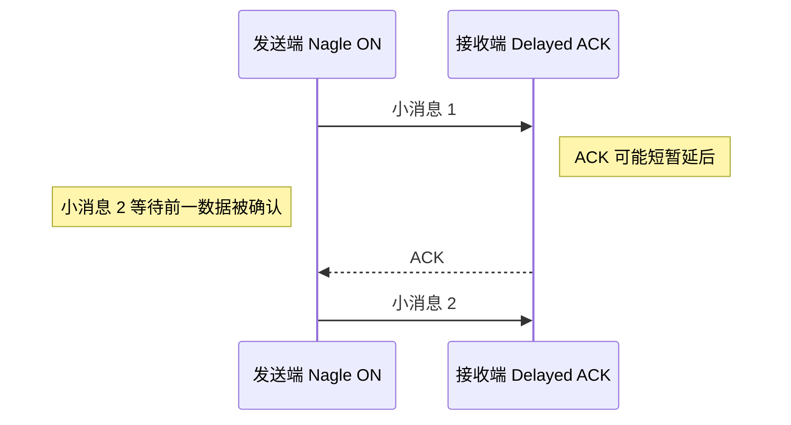

# Linux TCP Socket 工程：消息边界、读写与连接恢复

TCP 向应用提供可靠、有序的字节流，但不会替应用划分消息，也不会保证一次 `write` 写完、一次 `read` 读到完整业务记录。Web 服务器、数据库客户端、AI RPC 和交易网关都必须在 Socket 之上处理这些边界。

TCP 的握手、序号、重传、流量控制和拥塞控制见[传输层](transport_layer.md)。本章解释 Linux 应用怎样正确使用一条 TCP Socket；主机级参数、网卡与中断诊断见[Linux 网络调优](tuning.md)。

## 1. 第一原则：TCP 没有消息边界

下面两次 `write`：

```text
write("ABC")
write("DEF")
```

接收方可能一次读到 `ABCDEF`，也可能读到 `A`、`BCDE`、`F`。TCP 只保证字节有序，不保证“一个 write 对应一个 read”。

因此应用协议必须定义 **framing（消息定界）**：

```text
┌────────────┬──────────────┬────────────┐
│ length: u16│ type: u8     │ payload... │
└────────────┴──────────────┴────────────┘
```

解析步骤是：先累积到固定头部长度，读取并校验 `length`，再等待完整 body。`PSH` 标志不能当作消息结束标志。

长度前缀、固定长度、分隔符和 HTTP 自带的 framing 都可以使用。选择哪一种都要限制最大消息长度，防止损坏或恶意长度让程序无限分配。

## 2. Nagle 与 Delayed ACK 解决什么

### 2.1 Nagle 在解决什么问题

Nagle 算法避免在仍有未确认数据时不断发送 tinygram（极小 TCP 报文段）：小块数据可能暂存在发送栈中，等待 ACK 或凑到足够大小。这能提高网络效率，却可能伤害交互式小消息延迟。



这是一段等待 ACK 定时器的**有限停顿**，常被口语称为“Nagle/Delayed ACK 死锁”，但并非永久无法前进的严格死锁。

### 2.2 `TCP_NODELAY`

持续发送小型交互消息的连接可以在建立时评估启用：

```rust
use std::io;
use std::net::TcpStream;

fn configure_interactive_stream(stream: &TcpStream) -> io::Result<()> {
    stream.set_nodelay(true)?;
    Ok(())
}
```

它意味着“不要用 Nagle 等待合包”，不意味着：

- 绕过应用缓冲、内核队列或 NIC queue。
- 每次 `write` 都立刻成为一个以太网帧。
- 延迟一定下降 50% 之类的固定数字。

大量极小包会增加包率和每包处理开销。正确做法是针对协议消息大小、发送节奏、吞吐目标和真实 RTT 测量。

### 2.3 `TCP_QUICKACK`

Linux 的 `TCP_QUICKACK` 可以请求进入 quick-ack 模式，但它是动态提示，不应理解为“永久关闭 Delayed ACK”。内核之后可以根据协议状态再次改变 ACK 行为。

发送端通常更容易控制，所以先正确处理消息 framing 和写入缓冲；只有证据表明 ACK 行为是瓶颈时，再在双方可控、目标内核固定的环境评估 quick ack。

## 3. 写路径：最容易漏掉的是 partial write

### 3.1 阻塞 socket

阻塞模式下，`write` 也不保证写完全部字节。普通控制路径可使用 `write_all`：

```rust
use std::io::{self, Write};
use std::net::TcpStream;

fn send_frame(stream: &mut TcpStream, frame: &[u8]) -> io::Result<()> {
    stream.write_all(frame)
}
```

但 `write_all` 在发送缓冲区没有空间时会阻塞当前线程。程序要明确决定：允许阻塞、进入有界待发送队列，还是向上返回过载错误。

### 3.2 非阻塞 socket

非阻塞 `write` 可能返回：

- `Ok(n)` 且 `n < frame.len()`：只写入一部分。
- `WouldBlock`：当前发送缓冲区没有空间。
- 其他错误：连接异常或参数错误。

必须保存“剩余 slice 的偏移”，等 socket 再次可写时继续，不能从头重发，否则会在字节流中制造重复数据。

下面的标准库函数可独立编译。返回 `Ok(false)` 表示还没写完，调用方必须保留 `pending` 和 `offset`，等可写事件后继续：

```rust
use std::io::{self, Write};
use std::net::TcpStream;

fn flush_pending(
    stream: &mut TcpStream,
    pending: &[u8],
    offset: &mut usize,
) -> io::Result<bool> {
    while *offset < pending.len() {
        match stream.write(&pending[*offset..]) {
            Ok(0) => return Err(io::Error::new(io::ErrorKind::WriteZero, "peer closed")),
            Ok(written) => *offset += written,
            Err(error) if error.kind() == io::ErrorKind::WouldBlock => return Ok(false),
            Err(error) if error.kind() == io::ErrorKind::Interrupted => continue,
            Err(error) => return Err(error),
        }
    }
    Ok(true)
}
```

待发送队列必须有界，并暴露深度和最老消息等待时间。无界队列会把“对端或网络已经跟不上”伪装成内存持续增长；过时请求即使最终发出，也可能已经失去业务意义。

## 4. 读路径：EOF、错误与完整 drain

下面把解码器表示为回调，因而仍是完整的标准库代码，不依赖书外类型。调用前必须已经把 `TcpStream` 设置为非阻塞；否则读完当前数据后，下一次 `read` 可能睡眠而不是返回 `WouldBlock`：

```rust
use std::io::{self, Read};
use std::net::TcpStream;

#[derive(Debug, Clone, Copy, PartialEq, Eq)]
enum ReadStatus { PeerClosed, WouldBlock }

fn drain_readable(
    stream: &mut TcpStream,
    mut on_bytes: impl FnMut(&[u8]) -> io::Result<()>,
) -> io::Result<ReadStatus> {
    let mut buffer = [0_u8; 4096];
    loop {
        match stream.read(&mut buffer) {
            // 对端发送 FIN：这是 EOF，不是“暂时没有数据”。
            Ok(0) => return Ok(ReadStatus::PeerClosed),
            Ok(read) => on_bytes(&buffer[..read])?,
            Err(error) if error.kind() == io::ErrorKind::WouldBlock => {
                return Ok(ReadStatus::WouldBlock);
            }
            Err(error) if error.kind() == io::ErrorKind::Interrupted => continue,
            Err(error) => return Err(error),
        }
    }
}
```

必须区分：

- `Ok(0)`：对端关闭发送方向，应用需要完成会话清理。
- `WouldBlock`：非阻塞 socket 目前没有数据。
- `Interrupted`：系统调用被信号打断，通常可以重试。
- `ConnectionReset` 等：异常断开，需要进入恢复流程。

<details>
<summary>针对极端等待目标的选项：SO_BUSY_POLL</summary>

Linux 可让某些 socket 在接收调用附近短时间忙轮询 NIC queue，减少睡眠/唤醒开销。它不是完整 kernel bypass，并且取决于 NIC 驱动、内核、权限和全局配置。

代价包括：

- 持续消耗 CPU 和功耗。
- 配置过长会饿死同核其他任务。
- 没有正确绑核、IRQ/queue 对齐时，收益可能消失。

只有测量已经定位到睡眠/唤醒，并且可以为该连接持续提供 CPU 时才应评估。比较完整响应分布、CPU 与丢包，不要复制其他机器的固定参数。

</details>

## 5. 缓冲区不是越小或越大越好

### 5.1 发送缓冲区

太大时，应用可能很晚才发现对端跟不上，旧消息形成排队；太小时，短暂突发就可能频繁 `WouldBlock`。

需要同时观测：

- 应用 pending queue 深度。
- 内核 send queue，例如 `ss -tin`。
- 消息进入发送逻辑到被本机内核接受的时间。
- `WouldBlock` 和重传次数。

### 5.2 接收缓冲区

TCP 有流量控制，接收缓冲区压力会收缩窗口，而不是像 UDP 那样简单丢弃应用数据。但窗口受限会阻止发送方继续发送，表现为延迟或吞吐下降。

不要假定固定的 `32KB`、`1MB` 是最佳值。根据[网络概述](network_overview.md)中的带宽时延积、消息突发和消费速度测量，并验证 Linux 自动调节后的实际值。高带宽、长 RTT 的连接可能需要更大窗口；交互式连接还要避免用巨大缓冲掩盖过载。

阻塞、非阻塞、`epoll`、异步运行时和忙轮询的选择统一见 [I/O 模型](io_models.md)。

## 6. 连接从建立到关闭

### 6.1 建立连接不只包含 TCP 握手

客户端开始业务请求前，可能依次经历 DNS、ARP/Neighbor Discovery、TCP 握手、TLS 握手、身份认证和应用会话同步。哪一步失败，重试和错误信息都不同。

长连接可以复用这些建立成本，但要处理服务端重启、地址变更、负载均衡空闲超时和证书轮换。直接硬编码 IP 会绕开 DNS 的故障切换与配置能力，不应当作通用优化。

### 6.2 应用心跳与 TCP keepalive 不同

- **应用心跳**由双方协议定义，可以携带会话、进度或序列状态；
- **TCP keepalive**由内核探测长时间空闲的连接，只知道传输连接是否得到响应。

keepalive 不能证明对端业务线程仍能处理请求；应用心跳也要防止事件循环活着而核心依赖已经失效。两者可以组合，但解决的问题不同。

### 6.3 超时与断线后结果可能未知

客户端发送有副作用请求后连接断开，可能是请求未到达、服务端已执行但响应丢失，或服务端正在执行。TCP 错误不能总是区分这些情况。

恢复要依靠应用协议：

- 为操作设置稳定且唯一的 request/order ID；
- 让服务端根据 ID 去重或查询状态；
- 只对已知幂等的操作自动重试；
- 重试设置 deadline、退避和次数上限；
- 恢复期间阻止不满足前置状态的新操作。

TCP 提供一条连接内的可靠字节流，不提供跨重连的业务恰好一次语义。

## 7. 如何验证 Socket 改动

使用接近真实的消息大小、突发模式和对端行为，分别测量：


Socket 与应用层至少记录：

- 单向时间或 RTT 的典型值、尾部和最大值。
- `retransmits`、RTT、拥塞窗口和 send/receive queue。
- 应用队列深度、partial write、`WouldBlock`、超时和断线次数。
- 重连后请求 ID 的查询、去重和最终结果。

`ss` 可以只读查看连接的队列、RTT、重传和拥塞状态：

```bash
ss -tinp
```

NIC、IRQ、softirq 和主机级参数由 [Linux 网络调优](tuning.md) 主讲。工具字段随内核版本变化，保存版本和原始输出后再建立告警解析。

## 8. 代码推演方法：消息定界与断线恢复

1. **给接收流任意切块**：把一条消息拆成多次 `read`，再把多条消息合进一次 `read`；逐步更新接收 buffer，只有长度/分隔符满足时才交付完整帧。
2. **给发送端部分返回**：维护 `(frame, offset)`，每次成功只增加 offset；`WouldBlock` 保存现场等待可写，绝不能从帧头重新发送。
3. **为连接画状态表**：记录连接代数、已发送请求 ID、已确认结果与未知结果。EOF/RST 后先判定哪些业务结果未知，再决定查询、重放或人工处理。
4. **用边界输入验证 framing**：零长度、最大合法长度、超长声明、半个长度头、连续多帧和恶意不完整帧都必须有确定行为。
5. **验算**：解析器消费字节数加剩余字节数始终等于输入总数；每个业务请求最多被状态机提交一次；重连不会把旧连接字节拼到新连接。

常见陷阱：一次 `write` 对应一次 `read`；`read=0` 当成“暂时没数据”；partial write 后从头重发；用 TCP 重传替代业务幂等；只调 Socket buffer 却没有有界应用队列。

## 9. 面试高频问答

### Q1：什么时候评估 `TCP_NODELAY`？

持续发送小型交互消息且在意每次响应时，Nagle 可能在有未确认数据时暂存后续小写入，与 Delayed ACK 组合产生停顿。`TCP_NODELAY` 关闭这类等待，但会增加小包率，所以仍需测量。

### Q2：一次 `write` 是否对应对端一次 `read`？

不对应。TCP 是字节流，分段、合并和每次读取长度都可能不同。应用协议必须用长度前缀、固定长度或分隔符 framing，并处理半包与粘包。

### Q3：非阻塞写返回 `WouldBlock` 怎么办？

把未写完的 frame 和 offset 保存在有界发送队列，等待可写通知后从 offset 继续；不能从头重发。队列满时执行明确的背压或风险策略，并暴露队列等待时间。

### Q4：TCP 会重传，为什么还要请求 ID 或应用层序列号？

TCP 只保证单条连接中的字节流。重连后会话状态、业务幂等、请求是否已经执行以及结果恢复仍需协议级 ID、序列号或状态查询解决。

## 10. 检查清单

- [ ] 协议 framing 正确处理半包、粘包、非法长度与最大消息。
- [ ] 小消息连接已评估 `TCP_NODELAY`，没有把 `TCP_QUICKACK` 当永久开关。
- [ ] 阻塞/非阻塞读写都处理 EOF、partial write、`WouldBlock` 和重连。
- [ ] 应用与内核队列有界、可观测，过时请求不会无限排队。
- [ ] buffer 根据负载、带宽时延积和响应目标测量，I/O 模型由独立章节统一选择。
- [ ] 应用心跳、TCP keepalive、请求 ID 和未知发送结果都有恢复设计。
- [ ] 改动前后同时比较响应分布、吞吐、CPU、重传与丢包。

TCP Socket 工程的核心不是记住最多的选项，而是清楚消息怎样定界、部分读写怎样推进、队列满时怎么办，以及断线后业务状态怎样确认。

---

相关章节：[UDP 组播](udp_multicast.md)

## 参考依据

- [Linux `tcp(7)`](https://man7.org/linux/man-pages/man7/tcp.7.html)
- [Linux `socket(7)`](https://man7.org/linux/man-pages/man7/socket.7.html)
- [Linux `recv(2)`](https://man7.org/linux/man-pages/man2/recv.2.html)
- [Linux `send(2)`](https://man7.org/linux/man-pages/man2/send.2.html)
- [Rust `TcpStream`](https://doc.rust-lang.org/std/net/struct.TcpStream.html)
