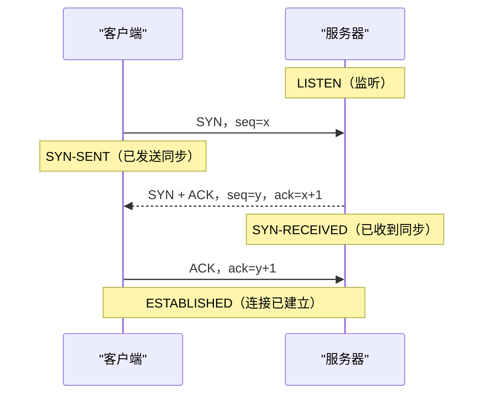
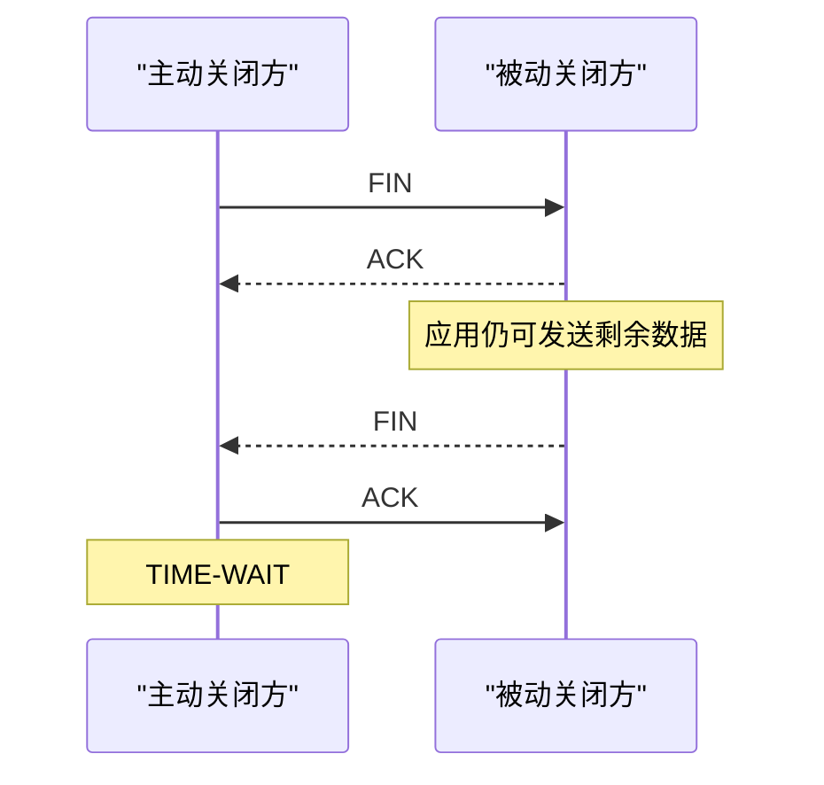
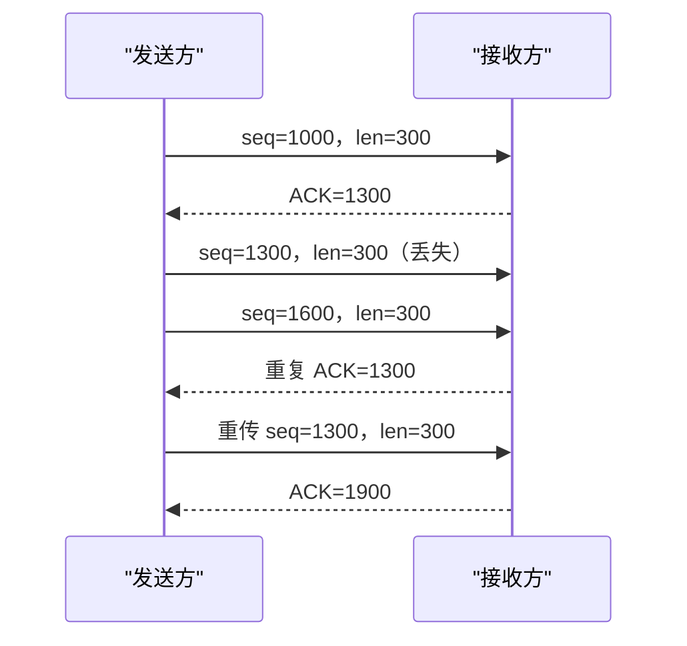

# 传输层：让主机上的进程彼此通信

网络层把 IP（Internet Protocol，网际协议）数据报送到一台主机，但一台主机可能同时运行浏览器、数据库、训练服务和监控程序。数据到达后还要回答：交给哪个进程？丢失后是否重传？接收方处理不过来怎么办？网络拥塞时发送方是否减速？

**传输层（transport layer）**在端系统之间提供进程到进程的通信。互联网最常见的两种传输协议是：

- UDP（User Datagram Protocol，用户数据报协议）：保留数据报边界，协议本身不建立连接，也不保证可靠；
- TCP（Transmission Control Protocol，传输控制协议）：建立连接，提供可靠、有序、全双工的字节流，并实施流量控制和拥塞控制。


Linux 参数、Nagle 算法、应用读写和短读短写见 [TCP Socket 工程](tcp_optimization.md)。

## 1. 复用、分用、端口与套接字

发送主机上，多个进程都可以把数据交给传输层，这叫**复用（multiplexing）**；接收主机上，传输层根据首部把数据交给正确通信端点，这叫**分用（demultiplexing）**。

### 1.1 端口号解决什么问题

IP 地址标识主机接口，仍不能区分主机上的多个进程。**端口号（port number）**是传输层首部中的 16-bit 编号，取值 0 到 65535，用于标识通信端点。

服务器通常在约定端口等待请求，客户端通常由操作系统分配临时源端口。端口属于 TCP 或 UDP 的命名空间：同一数字的 TCP 端口和 UDP 端口不是同一个通信端点。

<details>
<summary>端口范围需要背到什么程度？</summary>

互联网号码分配机构把 0～1023 称为系统端口，1024～49151 称为用户端口，49152～65535 称为动态或私有端口。面试重点是“端口帮助分用”，不应假定所有客户端临时端口都严格来自某个固定范围；具体操作系统可以配置选择范围。

</details>

### 1.2 套接字是什么

**socket（套接字）**是应用使用传输服务的通信端点。它不是一根真实的线，而是操作系统维护的协议状态、地址和收发队列等资源的抽象。

UDP 接收通常主要根据“目的 IP、目的端口和传输协议”分用；TCP 建立连接后，常用下面的**四元组**区分连接：

```text
(源 IP，源端口，目的 IP，目的端口)
```

因此服务器可以只监听一个 TCP 端口，却同时服务许多客户端：每个客户端的源 IP 或源端口不同，四元组也就不同。

```text
客户端 A 192.0.2.10:51000 ─┐
                             ├─→ 服务器 203.0.113.8:443
客户端 B 192.0.2.11:52000 ─┘

两条 TCP 连接目的端相同，但四元组不同。
```

## 2. UDP：最小的传输层封装

UDP 为应用消息加上 8 byte 首部，然后交给 IP。它的首部只有四个 16-bit 字段：

```text
 0               15 16              31
+------------------+------------------+
|     源端口       |     目的端口     |
+------------------+------------------+
|       长度       |      校验和      |
+------------------+------------------+
|               应用数据              |
+-------------------------------------+
```

| 字段 | 是什么 | 为什么需要 |
| --- | --- | --- |
| 源端口 | 发送端口；某些场景可为 0 | 让接收方知道回复端点 |
| 目的端口 | 接收端口 | 让主机把数据报交给正确套接字 |
| 长度 | UDP 首部与数据的总 byte 数 | 划定数据报长度；最小为 8 |
| 校验和 | 对伪首部、UDP 首部和数据计算 | 检测传输中发生的比特错误和部分错投递 |

**伪首部（pseudo-header）**取自 IP 层的源地址、目的地址、协议号和 UDP 长度。它不实际出现在 UDP 数据报中，只参与校验计算，帮助发现报文被错误交付到其他地址或协议。

若参与计算的总字节数为奇数，计算时在末尾临时补一个全 0 byte；这个补位不算进 UDP 长度，也不会作为数据发送给应用。

### 2.1 UDP 校验和数字推演

互联网校验和把内容划成 16-bit 字，使用**反码加法**：普通加法产生的最高位进位要绕回最低位，最后把结果逐位取反。下面用三个字演示算法；完整 UDP 还要包括伪首部和首部。

```text
0x1234 + 0xF0F0 = 0x10324
回卷进位：0x0324 + 1 = 0x0325
再加 0x0F0F：0x0325 + 0x0F0F = 0x1234
逐位取反：checksum = 0xEDCB
```

接收方把全部 16-bit 字连同校验和相加，若结果为全 `1`，说明“没有检测到错误”。校验和通过不等于数学上证明数据绝对正确。

<details>
<summary>IPv4 与 IPv6 的 UDP 校验和差异</summary>

在 IPv4（Internet Protocol version 4，网际协议第 4 版）中，UDP 校验和字段全 0 表示发送方未计算校验和；在 IPv6（Internet Protocol version 6，网际协议第 6 版）的通常用法中，UDP 校验和必须计算。某些受严格条件约束的隧道例外不属于基础面试范围。

</details>

### 2.2 UDP 提供和不提供什么

UDP 保留消息边界：发送一个数据报，接收方得到的仍是一份数据报，而不是连续字节流。但 UDP 本身不保证：

- 数据一定送达；
- 只送达一次；
- 按发送顺序到达；
- 接收方来得及处理；
- 发送速率对网络公平。

“无连接”只表示 UDP 协议没有 TCP 那样的握手与连接状态机，不表示应用不能记住固定对端，也不表示底层网络没有邻居地址解析、路由和队列状态。

## 3. 可靠传输需要哪些零件

IP 和链路都可能让报文损坏、丢失、重复或乱序。若应用需要可靠有序交付，协议至少要组合以下机制：

| 机制 | 解决的问题 |
| --- | --- |
| 校验和 | 发现比特损坏 |
| 序号 | 区分新数据、重传数据和顺序 |
| ACK（Acknowledgment，确认） | 接收方说明已经正确收到哪里 |
| 计时器与超时 | 长时间没有确认时触发重传 |
| 滑动窗口 | 允许多份数据同时在途，提高链路利用率 |
| 接收缓存 | 暂存尚未交给应用或乱序到达的数据 |

**停止等待**每发送一份数据就等待确认，逻辑简单，但往返时间较长时大量时间没有数据在链路上传输。**滑动窗口**允许发送方在未逐份确认前连续发送多个序号范围，确认到达后窗口向前移动。

链路层也可能使用确认和重传，但它只处理相邻节点的一段链路；TCP 的可靠性位于端系统之间，要面对整条路径上的丢失、乱序和重复。

## 4. TCP 的服务语义

TCP 提供：

- **面向连接**：传输数据前先建立双方协议状态；
- **可靠、有序**：丢失后重传，按序向应用交付字节；
- **字节流**：协议不保留应用每次提交数据时的消息边界；
- **全双工**：连接双方可同时发送和接收；
- **一对一**：一条连接连接两个端点，不提供 TCP 广播或组播；
- **流量控制与拥塞控制**：分别保护接收方和网络。

TCP 的“可靠”只表示连接内的字节语义。它不证明远端业务已经执行某项操作，也不能让断线重连后的两条连接自动共享业务状态。

## 5. TCP 首部关键字段

不含选项时 TCP 首部通常为 20 byte：

```text
 0                   15 16                  31
+----------------------+----------------------+
|        源端口        |       目的端口       |
+----------------------+----------------------+
|                    序号                     |
+---------------------------------------------+
|                   确认号                    |
+----+---------+----------+-------------------+
|头长| 保留/标志|          接收窗口            |
+----+---------+----------+-------------------+
|       校验和          |       紧急指针       |
+----------------------+----------------------+
|           选项（可选）与填充                 |
+---------------------------------------------+
```

| 字段 | 是什么 | 为什么需要 |
| --- | --- | --- |
| 源 / 目的端口 | 两端的传输层端点 | 复用与分用连接 |
| Sequence Number | 本段第一个数据字节的序号 | 排序、检测重复和指出重传范围 |
| Acknowledgment Number | 下一步期望收到的字节序号 | 累计确认此前连续字节 |
| Data Offset | 首部包含多少个 32-bit 字 | 因为 TCP 选项会改变首部长度 |
| 控制标志 | SYN、ACK、FIN、RST 等 | 建立、确认、关闭或异常复位连接 |
| Window | 接收方当前通告的可接收空间 | 实施流量控制 |
| Checksum | 对伪首部、TCP 首部和数据校验 | 检测端到端传输错误 |
| Options | 最大报文段长度、窗口扩展、时间戳等 | 协商或扩展基础能力 |

SYN（Synchronize，同步）用于同步初始序号；ACK 标志表示确认号有效；FIN（Finish，结束）表示本端不再发送更多字节；RST（Reset，复位）表示异常终止或拒绝连接。SYN 和 FIN 各占用一个序号位置，即使它们不携带普通应用数据。

<details>
<summary>推送标志、紧急标志和紧急指针需要怎样理解？</summary>

PSH（Push，推送）提示接收实现尽快把已有数据交给应用，但它不是应用消息结束标志。URG（Urgent，紧急）表示紧急指针字段有意义，用于标出紧急数据位置；现代应用很少依赖这套机制。基础学习应先掌握 SYN、ACK、FIN、RST，不要用 PSH 猜测 TCP 消息边界。

</details>

## 6. 三次握手：建立双向状态

假设客户端选择初始序号 `x`，服务器选择初始序号 `y`：



三步分别让服务器收到客户端的初始序号、客户端收到服务器的初始序号、服务器确认客户端确实收到了服务器的序号。这样双方都验证了当前报文能双向到达，并建立了发送与接收状态。

### 6.1 为什么不是两次

若服务器回复第二步后就认定连接完全建立，它不知道这份回复是否真正到达客户端。网络中延迟很久的旧 SYN 也可能让服务器分配一个客户端并不知情的连接。第三个 ACK 证明客户端收到了本次服务器选择的序号，减少旧重复请求造成错误半开连接的风险。

三次握手不表示“TCP 天生需要交换三份任意消息”，而是双方都要提出并确认自己的初始序号。最后一个 ACK 可以与客户端的首批数据一起发送。

### 6.2 常见连接状态

| 状态 | 位于哪一方 | 含义 |
| --- | --- | --- |
| CLOSED | 任一方 | 没有连接状态 |
| LISTEN | 服务器 | 等待连接请求 |
| SYN-SENT | 主动发起方 | 已发 SYN，等待对方回应 |
| SYN-RECEIVED | 收到 SYN 的一方 | 已回 SYN+ACK，等待最终 ACK |
| ESTABLISHED | 双方 | 可以双向传输数据 |

“握手成功”只证明 TCP 状态已建立，不等于应用登录、鉴权、数据库事务或业务准备已经完成。

## 7. 四次挥手、半关闭与 TIME-WAIT（等待状态）

TCP 两个方向的字节流可以独立关闭。收到 FIN 只表示对方以后不再发送，自己仍可继续发送尚未完成的数据，这叫**半关闭（half-close）**。因此典型正常关闭需要四个报文：



第二步 ACK 和第三步 FIN 可以在条件合适时合并，所以抓包不一定总能看到四个独立分组。“四次”描述两个方向分别关闭的逻辑，而不是绝对报文数量。

### 7.1 关闭时常见状态

| 状态 | 含义 |
| --- | --- |
| FIN-WAIT-1 | 主动方已发 FIN，等待 ACK 或对方 FIN |
| FIN-WAIT-2 | 主动方的 FIN 已确认，等待对方 FIN |
| CLOSE-WAIT | 被动方已收到 FIN，等待本地应用关闭发送方向 |
| LAST-ACK | 被动方已发 FIN，等待最后 ACK |
| TIME-WAIT | 主动关闭方通常在最后 ACK 后等待一段时间 |

TIME-WAIT 通常持续 `2 × MSL`。MSL（Maximum Segment Lifetime，报文段最大生存时间）是网络中旧报文段允许存在的时间上界。等待有两个目的：若最后 ACK 丢失，可以再次确认对方重传的 FIN；同时让旧连接的重复报文在相同四元组被重新使用前从网络中消失。

大量 CLOSE-WAIT 往往意味着本地应用收到对端关闭后没有完成自身关闭；TIME-WAIT 则是正常协议状态，不能仅凭数量多就认定为故障。

## 8. TCP 字节序号、累计确认与重传

TCP 序号按**字节**编号，不是按“第几个分组”编号。假设某段第一个数据字节序号为 1000，携带 300 byte：

```text
覆盖字节序号：1000 ～ 1299
接收方确认号：1300
```

确认号 1300 表示“到 1299 为止的连续字节已经收到，下一步期待 1300”。它是**累计确认**：即使更后的数据先到，只要中间有缺口，基本确认号仍停在缺口起点。



发送方主要通过两类信号重传：

- **重传超时**：计时器到期仍未确认，重传缺失数据；
- **重复 ACK**：多个相同确认暗示后续数据到达而中间有洞，可触发快速重传。

重传的数据使用原来的字节序号。TCP 只向应用按序交付，因此某个缺失段可能使已经到达的后续数据暂时等待，这种现象常称为队头阻塞。

## 9. 流量控制：不要淹没接收方

接收应用可能处理较慢，TCP 接收缓冲区是有限的。接收方在首部 Window 字段通告**接收窗口 `rwnd`（receiver window）**，说明从当前确认位置起还愿意接收多少字节。发送方限制未确认在途数据，避免接收缓冲区溢出。

发送方还受拥塞窗口 `cwnd` 限制，因此实际在途上限近似为：

```text
可用发送窗口 = min(rwnd, cwnd)
还能新发的数据 = 可用发送窗口 - 已发送但未确认的数据
```

例：`rwnd = 10,000 byte`、`cwnd = 6,000 byte`，已有 4,000 byte 未确认：

```text
可用发送窗口 = min(10,000, 6,000) = 6,000 byte
还能新发 = 6,000 - 4,000 = 2,000 byte
```

若接收方通告零窗口，发送方不能继续正常灌入数据，但会按协议探测窗口是否重新开放，避免“窗口更新丢失后双方永久等待”。流量控制保护接收方，不能代替拥塞控制。

## 10. 往返时间估计与重传超时

RTT（Round-Trip Time，往返时间）会波动，超时时间太短会产生无谓重传，太长又会让真实丢包恢复缓慢。TCP 用样本平滑估计 RTT，并同时估计偏差。下面公式中的：

- `SampleRTT` 是一次测得的往返时间；
- `SRTT`（Smoothed RTT，平滑往返时间）是平滑后的估计；
- `RTTVAR`（RTT Variation，往返时间偏差）估计波动；
- `RTO`（Retransmission Timeout，重传超时）决定计时器等待多久；
- `G` 是本机计时器粒度。

RFC（Request for Comments，征求意见稿）6298 的核心形式是：

```text
RTTVAR ← (1-β)·RTTVAR + β·|SRTT - SampleRTT|    β = 1/4
SRTT   ← (1-α)·SRTT   + α·SampleRTT             α = 1/8
RTO    ← SRTT + max(G, 4·RTTVAR)
```

### 10.1 完整数字算例

旧 `SRTT = 100 ms`、旧 `RTTVAR = 20 ms`，新样本 `SampleRTT = 140 ms`。更新偏差时使用旧 SRTT：

```text
新 RTTVAR = 3/4 × 20 + 1/4 × |100-140|
           = 15 + 10
           = 25 ms

新 SRTT = 7/8 × 100 + 1/8 × 140
         = 87.5 + 17.5
         = 105 ms

忽略计时器粒度和实现下限时：
RTO = 105 + 4 × 25 = 205 ms
```

发生超时后 RTO 会指数退避，避免拥塞或路径故障时不断高频重传。对已重传数据测 RTT 会分不清确认对应原发送还是重传，经典做法是不用这种模糊样本更新估计。

<details>
<summary>还没有 RTT 样本时怎样初始化？</summary>

RFC 6298 建议在首次 RTT 测量前先使用 1 秒的 RTO。得到第一个样本 `R` 后，初始化 `SRTT=R`、`RTTVAR=R/2`，再计算 `RTO=SRTT+max(G,4·RTTVAR)`。这是协议的安全起点，不表示真实连接的 RTT 就是 1 秒。

</details>

## 11. 拥塞控制：不要淹没网络

网络内部的路由器队列也有限。**拥塞控制（congestion control）**让发送方根据确认、丢包或显式信号调节注入网络的数据量。经典 TCP 用拥塞窗口 `cwnd` 控制在途数据，并以最大报文段长度为单位理解增长。

**MSS（Maximum Segment Size，最大报文段长度）**是单个 TCP 报文段通常承载的最大应用数据量，不包含 IP 和 TCP 首部。

### 11.1 慢启动与拥塞避免

- **慢启动（slow start）**：连接开始或严重超时后，`cwnd` 较小；每收到确认便增长，使窗口大约每个 RTT 翻倍。名字中的“慢”是相对一次把网络塞满，实际是指数增长。
- **慢启动阈值 `ssthresh`**：`cwnd` 到达它后进入较谨慎阶段。
- **拥塞避免**：经典 AIMD（Additive Increase, Multiplicative Decrease，加性增大、乘性减小）中，无拥塞时约每 RTT 增加 1 MSS，检测到拥塞后显著减小窗口。

### 11.2 快速重传与快速恢复

教材常用的 TCP Reno（以丢包为主要拥塞信号的经典算法）模型中，收到 3 个重复 ACK 表示后续段仍能到达，中间某段可能丢失。发送方不等待 RTO，立即**快速重传（fast retransmit）**；随后通过**快速恢复（fast recovery）**降低窗口但不完全回到初始状态。

超时通常表示更严重的拥塞：把 `ssthresh` 设为当前在途数据的大约一半，并把拥塞窗口降到很小，再重新慢启动。现代系统存在不同拥塞控制算法；408 和基础面试常用的是上述 Reno 抽象。

### 11.3 窗口增长完整推演

为方便手算，设 `MSS = 1,024 byte`，初始 `cwnd = 1 MSS`，`ssthresh = 8 MSS`：

| 阶段 | 一个 RTT 开始时的 cwnd | 下一 RTT |
| --- | ---: | ---: |
| 慢启动 | 1 | 2 |
| 慢启动 | 2 | 4 |
| 慢启动 | 4 | 8 |
| 拥塞避免 | 8 | 约 9 |
| 拥塞避免 | 9 | 约 10 |

若在 `cwnd = 10 MSS` 时出现 3 个重复 ACK，经典简化题通常令 `ssthresh = 5 MSS`，快速重传并在恢复后从约 5 MSS 继续拥塞避免。若发生超时，则同样把阈值降到约一半，但 `cwnd` 回到 1 MSS，重新慢启动。

丢包也可能由无线误码等原因造成，但经典 TCP 无法总是准确区分，往往把丢包视为拥塞信号。流量控制的 `rwnd` 来自接收端容量，拥塞控制的 `cwnd` 来自网络反馈，两者不能混为一谈。

## 12. RST：异常复位连接

RST 表示当前端没有或不愿继续维持这条 TCP 连接。常见原因包括：

- 连接请求到达一个没有监听者的 TCP 端口；
- 报文不属于接收方已知的有效连接；
- 应用选择立即中止连接，而不是完成正常 FIN 关闭。

RST 不是“更快的四次挥手”。它不会表达双向字节流已经有序结束，尚未被应用读取或确认的数据可能无法继续交付。应用看到“连接被对端复位”时，应结合业务协议判断请求是否执行，不能仅凭 TCP 错误盲目重试有副作用的操作。

## 13. 常见误解

1. **端口不等于进程号。** 它是传输层分用编号，一个进程可以使用多个端口，多个连接也能共享服务器端口。
2. **UDP 无连接不等于一定更快。** 若业务需要可靠、排序和拥塞控制，应用自己补齐也有成本。
3. **TCP 是字节流，不保存消息边界。** 应用协议必须自行定义消息格式。
4. **ACK 不等于业务完成。** TCP ACK 只确认字节到达对端协议栈的相应接收状态。
5. **三次握手不是为了“凑三次”。** 它同步并确认双方独立选择的初始序号。
6. **四次挥手不保证抓包恰有四个分组。** ACK 与 FIN 可以合并，两个方向仍各自关闭。
7. **TIME-WAIT 不天然是泄漏。** 它保护最后 ACK 和旧重复报文。
8. **流量控制不等于拥塞控制。** 前者保护接收缓冲，后者保护网络容量。

## 14. 三类应用中的传输层

| 场景 | 传输层基础怎样使用 |
| --- | --- |
| 传统后端 | 用四元组定位连接；区分 TCP 建连、连接复位、服务响应和业务成功 |
| AI（Artificial Intelligence，人工智能）基础设施 | 判断大流量通信受接收窗口、拥塞窗口、丢包恢复还是应用处理限制 |
| HFT（High-Frequency Trading，高频交易）系统 | 区分可靠订单字节流与不可靠行情数据报；业务序列号不能由 TCP ACK 替代 |

## 15. 408 计算题

### 题 1：序号与确认号

发送方从序号 5000 开始连续发送 800 byte。接收方全部按序收到后应确认多少？下一段从哪个序号开始？

<details>
<summary>参考答案</summary>

把字节范围列出来：起点 `seq=5000`，长度 800，所以末字节为 `5000+800-1=5799`，覆盖 `[5000,5800)`。累计 ACK 表示“下一期待字节”，因此 `ack=5800`，下一段若紧接着发送也从 `seq=5800` 开始。验算区间长度 `5800-5000=800`。

</details>

### 题 2：有效发送窗口

接收窗口 12,000 byte、拥塞窗口 8,000 byte，已有 3,500 byte 未确认。当前最多还能新发多少？

<details>
<summary>参考答案</summary>

先列三项状态：`rwnd=12,000`、`cwnd=8,000`、在途未确认 `flight=3,500 byte`。有效在途上限为 `min(rwnd,cwnd)=8,000 byte`，所以可新发 `8,000-3,500=4,500 byte`。

```text
已确认边界 |---- 3500 已在途 ----|---- 4500 可新发 ----| 有效窗口右边界
```

验算新发后在途量正好 8000，不超过 rwnd 12000 或 cwnd 8000；不能误算成 `12000-3500`。

</details>

### 题 3：拥塞窗口

经典简化模型中，初始 `cwnd=1 MSS`、`ssthresh=16 MSS`。没有丢包时，经过 4 个完整 RTT 后窗口是多少？

<details>
<summary>参考答案</summary>

按题目的经典简化模型列轮次：

| 完整 RTT 数 | 0 | 1 | 2 | 3 | 4 |
|---:|---:|---:|---:|---:|---:|
| `cwnd`（MSS） | 1 | 2 | 4 | 8 | 16 |
| 阶段 | 慢启动 | 慢启动 | 慢启动 | 慢启动 | 到达 `ssthresh` |

所以 4 个完整 RTT 后为 `16 MSS`，下一阶段按题设进入拥塞避免。验算窗口每轮只翻倍一次，不能把初始状态误算作“经过第 1 个 RTT”。

</details>

## 16. 做题方法：TCP 状态、序号与窗口

1. **先画双方时间线**：每个报文写 `SYN/FIN/ACK`、`seq`、`ack` 和数据长度；SYN、FIN 各消耗一个序号，纯 ACK 不消耗序号。
2. **维护两个方向的字节范围**：收到从 `seq=x` 开始、长度 `L` 的连续数据后，累计确认通常为 `x+L`；乱序段是否推进 ACK 要看前面的缺口是否补齐。
3. **状态题逐事件迁移**：分别写客户端和服务器状态，主动关闭方经过 `FIN-WAIT-*` 并通常进入 TIME-WAIT；被动关闭方经过 `CLOSE-WAIT`，不能把四次报文背成固定同步动作。
4. **窗口题分三把尺**：接收窗口 `rwnd`、拥塞窗口 `cwnd` 和已发送未确认字节分别列出；可继续发送量由有效窗口减去在途量决定。
5. **拥塞/RTO 题按轮次表格推演**：每 RTT 记录 `cwnd`、`ssthresh`、ACK/丢包事件与所处阶段；RTT 估计按题目给的递推顺序更新，避免一次代入多个样本。
6. **验算**：ACK 不能确认尚未连续收到的字节；发送量不应超过 `min(rwnd,cwnd)`；握手与挥手两端状态必须能对上同一报文。

常见陷阱：把段序号当成“第几个包”；忘记 SYN/FIN 占序号；把流量控制和拥塞控制混为一谈；声称三次握手只为“确认双方能收发”却不说明初始序号与旧连接歧义。

## 17. 章末面试题

1. 复用和分用分别是什么？端口为什么不能由 IP 地址替代？

<details><summary>参考答案</summary>

复用是多个应用进程把数据交给同一传输层与网络层发送；分用是接收主机根据协议和端口/连接标识把数据交给正确 Socket。IP 只定位主机接口，同一主机可以同时运行 Web、DNS 等许多服务，端口用于区分这些通信端点。

</details>

2. TCP 四元组是什么？服务器为什么能在一个监听端口服务许多客户端？

<details><summary>参考答案</summary>

连接通常由源 IP、源端口、目的 IP、目的端口四元组区分。服务器可以让许多连接共享目的端口，因为各客户端的源 IP/源端口不同；监听 Socket 接受新连接后，内核创建各自的已连接 Socket 和状态。

</details>

3. UDP 首部有哪些字段？伪首部为什么参与校验？

<details><summary>参考答案</summary>

UDP 首部包含源端口、目的端口、长度、校验和，均为 16 bit。校验时还纳入由 IP 源/目的地址、协议号和 UDP 长度构成的伪首部，用来发现数据报被错误交付到错误地址或协议；伪首部不在线上重复发送为 UDP 首部。

</details>

4. UDP 不保证哪些语义？“无连接”准确指什么？

<details><summary>参考答案</summary>

UDP 不保证送达、顺序、去重、重传、流量控制或拥塞控制，并保留数据报边界。无连接指发送前没有 TCP 式握手，也不由 UDP 协议维护端到端连接状态；应用和 Socket 实现仍可记录对端或业务会话状态。

</details>

5. 可靠传输为什么需要序号、ACK、计时器和窗口？

<details><summary>参考答案</summary>

序号标识数据位置并识别重复/乱序；ACK 告诉发送方哪些数据已连续收到；计时器在数据或 ACK 丢失时触发重传；窗口允许多个数据单元在途并限制发送范围。缺少任一项，协议就难以同时判断缺口、恢复丢失和利用长时延链路。

</details>

6. TCP 为什么是字节流？序号 1000、长度 300 的段应确认到哪里？

<details><summary>参考答案</summary>

TCP 给应用的是连续字节序列，不保留每次 `write` 的消息边界；分段只是传输实现。该段覆盖字节序号 `1000..1299`，若全部按序收到，累计 ACK 为下一期待字节 `1300`。验算：覆盖数量是 `1299-1000+1=300`。

</details>

7. 三次握手每一步建立了什么状态？为什么两次不够？

<details><summary>参考答案</summary>

客户端 SYN 宣告自己的初始序号；服务器 SYN+ACK 确认客户端序号并宣告服务器初始序号；客户端最后 ACK 确认服务器序号，使服务器知道自己的 SYN 已被对端接收。两次后服务器无法确认客户端是否收到服务器的初始序号，也更难排除旧重复 SYN 造成的半开状态。

</details>

8. TCP 为什么通常四次挥手？半关闭与 TIME-WAIT 分别解决什么问题？

<details><summary>参考答案</summary>

TCP 两个方向独立关闭：一端 FIN 只表示自己不再发送，对端先 ACK 后仍可继续发送，准备好后再发自己的 FIN，所以逻辑上通常四步，报文可合并。半关闭保留一个方向传输；主动关闭方的 TIME-WAIT 让最后 ACK 可重发，并等待旧重复段从网络消失。

</details>

9. 超时重传和快速重传分别由什么信号触发？

<details><summary>参考答案</summary>

超时重传由某段在 RTO 内未得到所需确认触发，能处理连 ACK 都没有的丢失；经典快速重传由多个重复累计 ACK 暗示中间存在缺口触发，通常不等待计时器到期。两者都必须结合当前 TCP 实现和确认语义，不能把一次重复 ACK 直接当成确定丢包。

</details>

10. `rwnd` 与 `cwnd` 分别由谁决定？实际发送窗口怎样计算？

<details><summary>参考答案</summary>

`rwnd` 由接收方通告剩余接收能力，保护接收缓冲；`cwnd` 由发送方拥塞控制根据网络反馈维护。可在途上限受 `min(rwnd,cwnd)` 约束；若已有 `flight_size` 字节未确认，可新发量约为 `max(0,min(rwnd,cwnd)-flight_size)`，还受应用数据和实现限制。

</details>

11. SRTT、RTTVAR 和 RTO 为什么不能只用最后一次 RTT 样本？

<details><summary>参考答案</summary>

单次 RTT 会受排队和调度抖动影响。SRTT 平滑中心趋势，RTTVAR 估计波动，RTO 在 SRTT 上加入波动裕量并受上下界规则约束。只用最后样本会让计时器剧烈跳动：过小导致伪重传，过大导致真实丢包恢复太慢。

</details>

12. 慢启动、AIMD、快速重传与快速恢复的基本过程是什么？

<details><summary>参考答案</summary>

慢启动让 `cwnd` 随 ACK 快速增长，按完整 RTT 近似翻倍，直到阈值或拥塞；拥塞避免使用 AIMD，正常时加性增长，拥塞时乘性减小。多个重复 ACK 可触发快速重传；经典快速恢复在重传后把窗口降到较低水平但不必回到 1 MSS。具体窗口更新依 RFC 与实现，答题应按题设模型逐 RTT 列表。

</details>

13. RST 与 FIN 有什么语义差别？看到复位后为什么不能盲目重试业务操作？

<details><summary>参考答案</summary>

FIN 是有序字节流中的正常方向关闭，之前字节仍应按序交付；RST 表示连接被异常中止、端点不存在或状态不匹配。复位只说明连接层状态，不能证明服务端是否已执行请求：请求可能已处理但响应未到。非幂等下单/扣款若盲目重试会重复执行，应使用业务请求 ID、去重或状态查询。

</details>

## 18. 权威依据与延伸阅读

- [高校公开转载的《2025 年计算机学科专业基础考试大纲》](https://www.uwh.edu.cn/uploads/article/20250609/660428d58334252302af691bf99e064e.pdf)
- [Kurose 与 Ross：传输层官方知识检查](https://gaia.cs.umass.edu/kurose_ross/knowledgechecks/)
- [RFC 768: User Datagram Protocol](https://www.rfc-editor.org/rfc/rfc768.html)
- [RFC 8200: Internet Protocol, Version 6](https://www.rfc-editor.org/rfc/rfc8200.html)
- [RFC 6335: Service Name and Transport Protocol Port Number Registry](https://www.rfc-editor.org/rfc/rfc6335.html)
- [RFC 9293: Transmission Control Protocol](https://www.rfc-editor.org/rfc/rfc9293.html)
- [RFC 6298: Computing TCP's Retransmission Timer](https://www.rfc-editor.org/rfc/rfc6298.html)
- [RFC 5681: TCP Congestion Control](https://www.rfc-editor.org/rfc/rfc5681.html)

下一章进入 TCP 工程优化：在协议语义正确的前提下，再讨论应用读写、消息边界、socket 选项和 Linux 行为。
