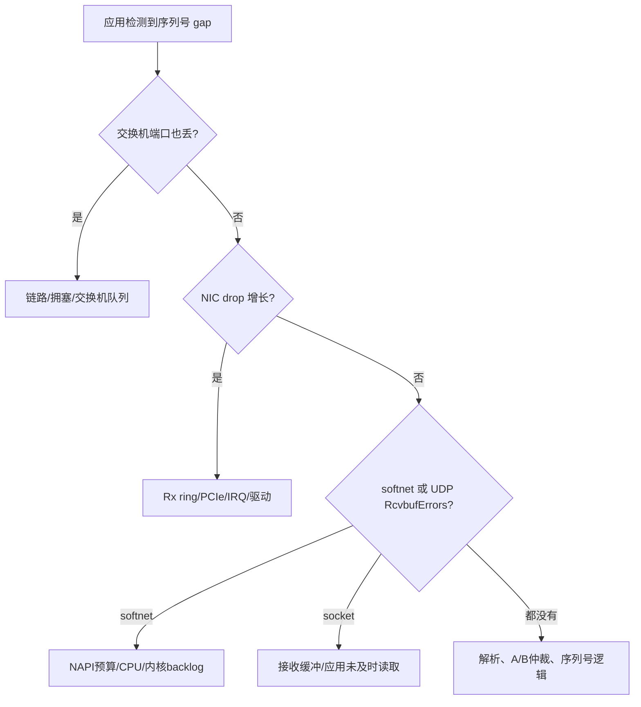

# Linux 网络调优：从网卡计数器到应用队列

网络调优不是收集一份“神奇 sysctl 清单”。同一个参数可能降低空闲时延，也可能在 microburst 时制造丢包；可能改善吞吐，又让 P99.99 更差。

正确流程是：**画清路径 → 找到排队/丢包层 → 一次改变一个参数 → 用相同流量复测 → 保留回滚值**。

本章讨论主机、NIC 和内核层。单连接读写与 `TCP_NODELAY` 见 [TCP 协议优化](tcp_optimization.md)。

## 1. 一张图看懂可能慢在哪里


每一层都有不同证据：

| 层 | 典型现象 | 首先查看 |
| :--- | :--- | :--- |
| 交换机/链路 | CRC、pause、端口 drop | 交换机遥测、`ethtool -S` |
| NIC/Rx ring | `rx_missed`、`no_buffer` 类计数增长 | 驱动统计、ring size |
| NAPI/内核 | softnet drop、softirq 饱和 | `/proc/net/softnet_stat`、`/proc/softirqs` |
| Socket | UDP `RcvbufErrors`、TCP zero window | `nstat`、`ss -u/-t -m` |
| 应用 | 协议序列号 gap、队列变深 | 应用指标与回放日志 |

计数器名字由 NIC 驱动决定，不能只 grep 一个固定字段就下结论。先保存 `ethtool -i eth0` 的驱动/固件信息，再阅读该驱动的统计含义。

## 2. 先建立可重复的基线

### 2.1 记录环境

```bash
uname -a
ethtool -i eth0
ethtool -k eth0
ethtool -c eth0
ethtool -g eth0
ethtool -l eth0
lscpu -e=CPU,CORE,SOCKET,NODE,ONLINE
cat /proc/interrupts
```

还应记录 BIOS、电源策略、网卡固件、CPU/IRQ 绑定、NUMA、内核命令行和全部修改过的 sysctl。没有基线就无法知道下一次重启或固件升级改变了什么。

### 2.2 使用真实负载形状

平均包率相同，不代表负载相同：

```text
平均 100k packets/s

平滑：每 10µs 来 1 个包
突发：每 1ms 瞬间来 100 个包
```

HFT 更容易被 microburst 击中。测试工具应重现包大小、burst、单流/多流、组播数量和 CPU 消费速度，并报告完整延迟分位数与丢包。

## 3. NIC 队列、中断合并与 Offload

### 3.1 Descriptor ring

Rx ring 是 NIC 与驱动共享的 descriptor 队列。ring 太小可能吸收不了 microburst；太大能减少丢包，却让故障时更多旧包排队，并不能修复消费速度长期不足。

```bash
# 只读查看当前值与硬件上限
ethtool -g eth0
```

修改 ring 后要同时比较：NIC drop、应用 gap、延迟和内存/NUMA 位置。若持续输入速率超过处理能力，增大 ring 只会推迟失败。

### 3.2 Interrupt coalescing

网卡可以等待若干包或若干微秒再发中断：

- 合并更多：中断少、吞吐高，但首包多等一会儿。
- 合并更少：空闲时延可能下降，但高包率下 CPU/softirq 压力可能恶化长尾。

```bash
# 查看，不修改
ethtool -c eth0
```

不要直接假定 `rx-usecs 0` 最快。禁用 adaptive 模式后，从小值逐步扫描，并在高峰 burst 下确认没有中断风暴。

### 3.3 GRO/LRO、TSO/GSO 与 checksum offload

```bash
ethtool -k eth0
```

| 功能 | 作用 | 延迟测试重点 |
| :--- | :--- | :--- |
| GRO/LRO | 接收侧合并多个包 | 合并等待、包边界/时间戳可见性 |
| TSO/GSO | 发送侧把大块数据后分段 | 小消息是否排队、CPU 与包率 |
| Checksum offload | NIC 计算/验证校验和 | CPU 收益与抓包显示差异 |

抓包中看到“bad checksum”不一定是线上坏包：发送包可能在 tcpdump 抓取时还没由 NIC 填入校验和。用接收端抓包、NIC 错误计数和 offload 状态交叉验证。

## 4. RSS、IRQ 与 CPU/NUMA 对齐

### 4.1 RSS 在做什么

RSS（Receive Side Scaling）对报文头做 hash，把不同 flow 分配到不同 NIC Rx queue。它提高并行处理能力，但不会自动保证应用线程、IRQ 和内存位于正确位置。

目标是让一条热流的路径尽量局部：


实际选择取决于应用：IRQ 和应用放同核可减少 cache 迁移，却可能互相抢占；放相邻专用核可隔离工作，却增加跨核交接。两种都要测。

### 4.2 找到网卡的 NUMA 节点和 IRQ

```bash
cat /sys/class/net/eth0/device/numa_node
grep -i eth0 /proc/interrupts
cat /proc/irq/123/smp_affinity_list
```

配置前确认：

- CPU 是物理核还是 SMT sibling。
- NIC 所在 NUMA node。
- `irqbalance` 是否会覆盖手工 affinity。
- 进程、内存、大页和 DMA 是否跨 NUMA。

`RPS/RFS` 是内核软件收包 steering，`XPS` 是发送侧选择队列。硬件 RSS 已满足时，额外软件 steering 可能增加跨核交接；虚拟机或队列受限环境中又可能有帮助。

## 5. 内核 backlog 与 Socket 缓冲区

### 5.1 先理解参数控制哪一层

| 参数 | 控制对象 | 常见误解 |
| :--- | :--- | :--- |
| `net.core.netdev_max_backlog` | 内核来不及处理时的输入 backlog 上限 | 不是 TCP listen backlog |
| `net.core.rmem_max` | socket 接收缓冲区可请求上限 | 不等于每个 socket 都自动用满 |
| `net.core.wmem_max` | socket 发送缓冲区可请求上限 | 越大不一定越低延迟 |
| `net.ipv4.tcp_max_syn_backlog` | 未完成握手的 SYN 队列 | 与 UDP 行情丢包无关 |
| `somaxconn` | listen backlog 的上限之一 | 不影响已建立连接的收包队列 |

只读检查：

```bash
sysctl net.core.netdev_max_backlog
sysctl net.core.rmem_max net.core.wmem_max
sysctl net.ipv4.tcp_rmem net.ipv4.tcp_wmem
```

Linux 报告的 socket buffer 数值可能包含内核 bookkeeping，`setsockopt` 结果也受 autotuning、最小值和上限影响。程序启动后应通过 `getsockopt` 或 `ss -m` 读取实际值，而不是只相信配置文件。

### 5.2 UDP 为什么需要 burst 余量

UDP 没有 TCP 流量控制。socket receive queue 满后，新数据报会被丢弃。估算下限时可从 burst 开始：

```text
所需 payload 空间 ≈ 峰值数据率 × 应用最长不可调度时间
```

还要为内核元数据、多个组播流同时 burst 和安全余量留空间。buffer 再大也不能解决应用长期处理不过来的问题。

检查：

```bash
nstat -az UdpRcvbufErrors UdpInErrors
ss -u -a -m
```

### 5.3 TCP 缓冲区关注排队而非丢 UDP 包

TCP 接收压力会通过窗口反馈给发送方；发送队列过深意味着旧业务消息在等待。观察 `ss -tinm` 中的 RTT、重传、拥塞窗口与内存队列，并结合应用 pending queue。不要把 TCP 和 UDP 的 buffer 策略混为一谈。

## 6. 拥塞控制与 TIME_WAIT：不要用一句 sysctl 解决

### 6.1 CUBIC、BBR 与专线

BBR 通过估算瓶颈带宽和 RTT 建模，常用于高吞吐广域网；CUBIC 是许多 Linux 环境的默认选择。哪一个适合订单连接取决于 RTT、丢包、交换机队列、内核版本和对端。

在低 RTT、低带宽用量的专线订单会话中，应用可能根本没有把拥塞窗口填满，此时更换算法不会神奇降低每条消息延迟。它还会改变与其他流的公平性和 queue 行为，必须与网络团队及对端共同验证。

```bash
sysctl net.ipv4.tcp_available_congestion_control
sysctl net.ipv4.tcp_congestion_control
```

### 6.2 Slow start after idle

`tcp_slow_start_after_idle=0` 有时用于避免长连接空闲后收缩拥塞窗口，但会让连接在网络条件变化后仍以旧速率突发。订单会话消息量小，收益可能有限。先从抓包或 `ss -ti` 证明 cwnd 确实是瓶颈。

### 6.3 TIME_WAIT

TIME_WAIT 保护旧重复报文不会污染新连接，并保证最后 ACK 有机会重传。大量 TIME_WAIT 应先检查为什么频繁创建短连接。

`tcp_tw_reuse` 的行为随 Linux 版本、时间戳和 loopback 条件变化，不应描述为“快速回收 TIME_WAIT”。交易会话通常更应建立持久连接、做好重连节流和端口容量规划。

## 7. 多播专项检查

多播能否收到，不只是调用 `IP_ADD_MEMBERSHIP`：

- 指定正确本地接口，避免 IGMP report 从管理口发出。
- 验证 VLAN、IGMP snooping、querier 与组播路由。
- 检查 source-specific multicast 时是否使用正确 source/group。
- 一个 flow 应落到哪个 Rx queue，需要查看 NIC hash/filter 能力。
- A/B feed 的序列号仲裁必须在应用层验证，不能只看包数。

```bash
ip maddr show dev eth0
ip route get 239.1.2.3
ethtool -n eth0 rx-flow-hash udp4
```

`tcpdump` 能看到包而应用仍然 gap，可能是抓包 tap 点在丢包层之前，也可能是应用解析/序列逻辑错误。对比 NIC、内核、socket 和应用四层计数器。

## 8. MTU、时间戳与 Busy Poll

### 8.1 MTU

Jumbo frame 可提高大吞吐效率，但必须整条路径一致。HFT 小包不一定受益。验证时使用带 DF 的探测、交换机配置和真实协议包；不要只确认本机 `ip link` 显示 9000。

### 8.2 时间戳

- 软件时间戳靠近内核收包点，仍包含之前的 NIC/驱动延迟。
- 硬件时间戳由 NIC 在更靠近线缆的位置记录，更适合单向延迟和审计。
- 不同时间域（PHC、`CLOCK_REALTIME`、TSC）比较前必须同步和校准。

错误时钟会让“优化后延迟降低”成为测量幻觉。

### 8.3 Busy Poll

`SO_BUSY_POLL`、NAPI busy polling 或用户态 busy loop 都在用 CPU 换唤醒延迟。要把 poll 预算、线程/IRQ affinity、功耗和同机服务公平性作为一个整体测试。若程序消费速度本来不足，忙轮询不会增加业务处理能力。

## 9. 一次可审计的调优实验

每项改动写一张实验卡：

```text
假设：Rx 中断合并造成空闲时 P99 多 4µs
唯一改动：rx-usecs 从 8 调到 2
固定条件：流量文件、包率、CPU/IRQ、频率、二进制、温度区间
成功门槛：P99/P99.9 改善，0 丢包，CPU 不超过预算
失败回滚：恢复 rx-usecs=8 与 adaptive-rx 原值
证据：原始直方图、ethtool 统计、softirq、版本信息
```

推荐顺序：

1. 保存原值和环境快照。
2. 预热后运行多轮基线。
3. 只改一个变量。
4. A/B 交错运行，避免时间和温度偏差。
5. 比较完整分布、CPU 和各层 drop。
6. 达不到门槛就回滚，不保留“也许有用”的参数。

## 10. 故障定位案例：行情 gap 增长

不要直接把 buffer 调成 32MB。按层排查：



真实系统可能多层同时丢包，所以计数器要看**同一时间窗口的增量**，不能只看自开机以来的绝对值。

## 11. 面试高频问答

### Q1：你会如何降低 Linux UDP 行情接收延迟？

先用硬件/应用时间戳建立基线并重现 burst；确认 NIC queue、IRQ、应用线程和 NUMA 对齐；评估中断合并、GRO 与 busy poll；给 Rx ring、内核 backlog 和 socket buffer 足够的 burst 余量；最后同时验证 P99.99、CPU 与 NIC/softnet/socket/application 四层丢包。

### Q2：为什么 buffer 越大不一定越好？

大 buffer 能吸收短 burst，却也允许旧数据排更久，掩盖消费速度不足。应按峰值数据率和最长调度间隙估算，再用队列深度与消息 age 设上限。

### Q3：看到 `rx_missed_errors` 是否应该立刻上 DPDK？

不应该。先确认该驱动字段语义，再检查 ring、IRQ affinity、CPU 饱和、PCIe/NUMA、固件和 burst。DPDK 是架构选择，会引入驱动接管、内存和运维复杂度，不是单个计数器的自动答案。

### Q4：BBR 是否一定比 CUBIC 低延迟？

不一定。BBR 主要是另一种拥塞模型，在高带宽长 RTT 环境常有价值；低负载订单会话可能并不受拥塞窗口限制。必须按目标内核、路径和对端用真实流量比较队列、重传和尾延迟。

## 12. 最终检查清单

- [ ] 已保存内核、驱动、固件、NIC、CPU/IRQ/NUMA 与 sysctl 基线。
- [ ] 测试包含真实包大小和 microburst，不只看平均 packet rate。
- [ ] NIC、softnet、socket 和应用序列号四层计数能关联同一时间窗口。
- [ ] RSS queue、IRQ、应用线程和内存位置经过拓扑设计与实测。
- [ ] ring、coalescing、offload 和 buffer 每次只改一项，并有回滚值。
- [ ] TCP 拥塞控制和 TIME_WAIT 参数没有脱离实际瓶颈盲调。
- [ ] 多播接口、VLAN、IGMP、A/B feed 与恢复流程均已验证。
- [ ] 结论同时包含 P50 到 P99.99、CPU、队列深度和丢包，而非单个平均值。

网络调优的专业性，不体现在你背了多少参数，而体现在你能把一个微秒或一个丢包定位到具体队列，并用可复现实验证明改动值得上线。
