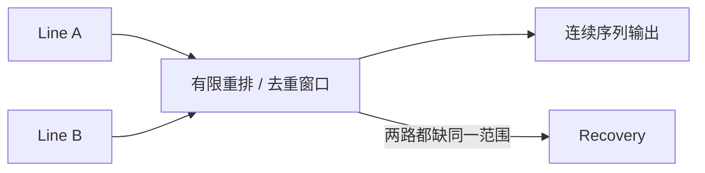

# UDP 组播：快速分发行情，可靠性由应用补齐

UDP（User Datagram Protocol，用户数据报协议）的数据报与可靠性语义见[传输层](transport_layer.md)。**IP（Internet Protocol，网际协议）组播**让发送端把数据发往一个组地址，由网络按成员关系复制给多个接收端。

交易行情常用它，是因为同一份 feed（数据流）可以高效发给很多参与者。接收方必须明确处理 gap（序列缺口）、双线重复、stale（陈旧且不可信）状态和 recovery（恢复）。

## 1. 组地址表示一组接收者

普通目的地址标识一个接口，组播目的地址标识一组动态接收者。发送端只发送一份数据；支持组播的交换机和路由器根据成员关系在需要的分支复制。发送端不为每位接收者维护一条 UDP 连接，也不会等待每位接收者确认。

组播提高的是**一对多分发效率**，不保证每个参与者在同一时刻收到，也不会因某个接收者较慢而自动降低全体发送速率。链路长度、交换机排队、接收主机和时钟都会造成差异。

## 2. 加入一个组时发生了什么

接收程序需要知道三项信息：组播 IP、UDP 端口和接收网卡。

```rust,no_run
use std::io;
use std::net::{Ipv4Addr, UdpSocket};

fn join_feed(
    group: Ipv4Addr,
    interface: Ipv4Addr,
    port: u16,
) -> io::Result<UdpSocket> {
    let socket = UdpSocket::bind((Ipv4Addr::UNSPECIFIED, port))?;
    socket.join_multicast_v4(&group, &interface)?;
    Ok(socket)
}
```

`join_multicast_v4` 告诉内核：这个 socket 希望通过指定接口接收该组的数据。IPv4 中，内核维护 **IGMP**（Internet Group Management Protocol）membership（成员关系），并在协议需要时发送或响应成员报告；支持 IGMP snooping 的交换机据此学习哪些端口需要流量。

`join` 成功只表示本机调用成功，不证明交换机 VLAN、querier（定期查询组成员的设备）、三层组播路由和交易所 feed 都正确。多网卡服务器必须显式选择接口，并用抓包与端口计数器验证实际流向。

`SO_REUSEADDR`/`SO_REUSEPORT` 在不同系统上的绑定与分流语义不同。若多个进程都要收到完整副本，不能仅凭“允许重复绑定”推断内核一定复制给每个进程。

## 3. 接收方先保护数据报边界

UDP 保留数据报边界，但接收缓冲区太小时，超出部分会被截断或以平台接口规定的方式报告。程序应按协议最大包长分配缓冲区，并把“实际长度是否合法”作为解析前置条件。

```text
NIC / kernel 收到一个 UDP 数据报
        ↓
检查来源、目的组、长度、协议版本和协议规定的校验字段（若有）
        ↓
读取 packet sequence 与 message count
        ↓
去重 / A-B 仲裁 / gap 检测
        ↓
逐条解析消息并更新状态
        ↓
推进 next_expected_sequence
```

不要先修改订单簿，再发现包尾损坏。更安全的顺序是先完成包级边界和校验，再把完整、顺序正确的消息交给状态机。

## 4. 序列号解决什么问题

feed 通常为包或消息定义递增序列号。接收方保存 `next_expected`：

- `first == next_expected`：正好接上，并按 `message_count` 推进；
- 整个序列范围都小于 `next_expected`：完整重复或迟到包；
- 序列范围跨过 `next_expected`：部分重叠，必须按协议处理；
- `first > next_expected`：中间存在缺口，当前状态可能不再可信。

下面的简化模型假设 `first_sequence` 是**包内第一条消息的序号**，一包可含多条消息，因此要同时读取它和 `message_count`。若目标协议给的是“每包一个序号”，下一包通常按协议规定的包步长推进，不能套用这里的消息数量。只记录“见过的最大序号”会错误跳过包内范围。

```rust
#[derive(Debug, PartialEq)]
enum Decision {
    Apply { next_expected: u64 },
    DuplicateOrLate,
    Overlap { first_new: u64, end_inclusive: u64 },
    Gap { missing_from: u64, missing_to: u64 },
}

fn classify(next_expected: u64, first: u64, count: u64) -> Option<Decision> {
    if count == 0 {
        return None;
    }
    let end_exclusive = first.checked_add(count)?;

    if end_exclusive <= next_expected {
        Some(Decision::DuplicateOrLate)
    } else if first < next_expected {
        Some(Decision::Overlap {
            first_new: next_expected,
            end_inclusive: end_exclusive - 1,
        })
    } else if first == next_expected {
        Some(Decision::Apply { next_expected: end_exclusive })
    } else {
        Some(Decision::Gap {
            missing_from: next_expected,
            missing_to: first - 1,
        })
    }
}

assert_eq!(classify(103, 103, 2), Some(Decision::Apply { next_expected: 105 }));
assert_eq!(classify(105, 103, 2), Some(Decision::DuplicateOrLate));
assert_eq!(
    classify(104, 103, 3),
    Some(Decision::Overlap { first_new: 104, end_inclusive: 105 })
);
assert_eq!(
    classify(103, 106, 1),
    Some(Decision::Gap { missing_from: 103, missing_to: 105 })
);
```

`Apply` 明确返回下一期望序号，所以 `message_count` 真正参与推进。`Overlap` 表示一部分范围已处理、一部分是新的；除非 feed 规范明确允许按消息去重，否则不要擅自只应用后半包，应进入协议规定的错误或恢复路径。这里的 `None` 表示 `count == 0` 或加法溢出，调用者应按协议错误处理。真实实现还要遵循序列号回绕、session reset、空包和消息计数规则，不能从这个简化函数猜测交易所语义。

## 5. A/B 线路怎样仲裁

交易所可能从相互独立的 Line A 和 Line B 发送相同序列。目标是：先到的有效副本进入主线，另一份用于补偿单路丢失。



仲裁器至少要处理：

1. 同一包 A 先到或 B 先到；
2. 两路重复；
3. 单路乱序；
4. A 缺但 B 有；
5. 两路都缺；
6. session 切换或序列号重置。

有限窗口的意义是给另一线路和轻微乱序一点时间，但等待过久会增加行情年龄。窗口大小必须由链路延迟差、feed 速率和策略容忍度测量决定。

## 6. 缺口之后怎么恢复

恢复方式由交易所 feed 规范定义，常见组合是：

1. **等待另一线路**：成本最低，适合 A/B 单路丢失；
2. **请求重传**：从单播恢复服务请求缺失序列范围；
3. **取得快照**：得到某个明确序列点的完整状态；
4. **回放快照后的增量**：追到实时流，再重新开放策略。

收到 gap 后不能默认“跳过也没事”。对增量订单簿来说，少一次新增或撤单就可能让本地状态永久错误。恢复期间常见安全策略是标记 feed stale、暂停受影响产品的决策，并持续接收和暂存后续增量。

快照也不是魔法：必须知道它对应哪个序列点，避免把快照之前的旧增量再次应用，或漏掉快照之后的新增量。

## 7. 缓冲区应该多大

用容量模型比抄固定 `sysctl` 更可靠。若需要承受最坏突发速率 `R` bytes/s、最长调度停顿 `T` s，再留安全余量 `H`，最低吸收容量可先估算为：

```text
buffer_budget ≥ R × T × H
```

例如峰值 400 MB/s、最坏停顿 2 ms、余量 2 倍，单层预算至少约 1.6 MB。但系统还有 NIC ring、内核 backlog、socket buffer 和应用队列，多层容量及排队时间要一起观察。短时间突然涌入的大量数据通常称为 **microburst（微突发）**。

Linux 的 `SO_RCVBUF` 是 socket 接收缓冲区选项。过小会在 microburst 中丢包；过大则可能积压陈旧行情、扩大恢复时间，并掩盖处理能力不足。设置值还受系统上限和内核记账方式影响，因此启动后应读回并记录实际值。

## 8. 分片为什么危险

UDP 数据报超过路径 MTU 时可能被 IP 分片。任何一个分片丢失，整个原始数据报都无法交付；重组还消耗内核状态。交易 feed 通常应把最大包长限制在路径 MTU 内，并计入 VLAN、隧道和 IP 版本的额外头部。

## 9. 故障定位表

| 现象 | 可能原因 | 先验证什么 |
| --- | --- | --- |
| 完全收不到组播 | 接口/VLAN/IGMP/路由错误 | 抓包、membership、交换机端口计数 |
| 两路同时出现同一 gap | 上游或共享网络丢包、接收机过载 | A/B 物理路径、NIC/kernel drop |
| 只有一路持续缺包 | 单路光纤、交换机口、队列映射问题 | 分线路计数与链路告警 |
| 无内核 drop 但应用 gap | 解析、应用队列、序列规则错误 | 原始包捕获与处理前计数 |
| buffer 调大后延迟恶化 | 长期消费不足，排队变长 | 队列水位与数据年龄 |
| 偶发重复更新 | A/B 去重或 session reset 处理错误 | 包序列范围与状态机日志 |

## 10. 一分钟面试回答

> UDP 组播适合行情，是因为发送端发一份数据，网络可以复制给多个订阅者；它保留数据报边界，但不保证送达、顺序或去重。接收方加入指定组和网卡后，先校验包长与协议头，再用 packet sequence 和 message count 做去重及 gap 检测。A/B 两条独立线路谁先到用谁，另一条补单路丢失；两路都缺时按协议走重传或“快照加增量追赶”，恢复完成前把状态标为 stale。缓冲区只能吸收短突发，大小应按峰值速率乘最坏停顿估算，并同时监控 NIC、内核、socket 和应用队列的丢包。

## 11. 高频追问

### 组播是否保证公平？

不保证。它让源端和网络高效复制同一流，但物理路径、交换机排队、接收主机处理和时钟差异仍会影响到达时间。

### 为什么需要 A/B，还需要重传和快照？

A/B 主要覆盖单路故障；共享上游、两路同时拥塞或接收主机过载仍会让两份都丢。重传补小缺口，快照负责状态已严重落后时的重建。

### 检测 gap 后还能继续交易吗？

取决于协议和风险策略。增量订单簿通常已不可信，应隔离受影响产品并恢复；不能只因为后续价格“看起来合理”就继续。

## 12. 参考依据

- [RFC 1112: Host Extensions for IP Multicasting](https://www.rfc-editor.org/rfc/rfc1112.html)
- [RFC 3376: Internet Group Management Protocol, Version 3](https://www.rfc-editor.org/rfc/rfc3376.html)
- [RFC 4607: Source-Specific Multicast for IP](https://www.rfc-editor.org/rfc/rfc4607.html)
- [Linux `ip(7)`](https://man7.org/linux/man-pages/man7/ip.7.html)
- [Rust `UdpSocket`](https://doc.rust-lang.org/std/net/struct.UdpSocket.html)

下一章：[交易所协议](../connectivity/protocols.md) 会把序列号、快照与增量放进完整会话协议中。
