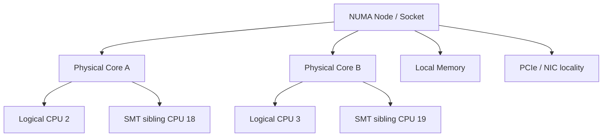

# CPU 亲和性与隔离 (CPU Affinity & Isolation)

中央处理器（Central Processing Unit，CPU）亲和性限制线程可以在哪些逻辑 CPU 上运行；CPU 隔离则是一组减少其他任务、中断和内核工作的运维措施。二者可能降低迁核和调度抖动，但不会自动改善延迟，也不能消除所有固件、同步多线程（Simultaneous Multithreading，SMT）、中断请求（Interrupt Request，IRQ）、内存和温度干扰。

## 1. 先认识拓扑



NUMA（Non-Uniform Memory Access，非一致内存访问）节点表示处理器访问本节点内存通常比远端节点更直接。图中数字只是示意，不能假设“前一半 CPU 属于 Socket 0，后一半属于 Socket 1”。固件、内核、容器 cpuset 和离线 CPU 都会改变编号。

Linux 上先查看：

```bash
lscpu -e=CPU,CORE,SOCKET,NODE,ONLINE
numactl --hardware
cat /proc/interrupts
cat /proc/self/status | grep Cpus_allowed_list
```

还可通过 `/sys/devices/system/cpu/` 查看 SMT sibling，通过 `/sys/class/net/<iface>/device/numa_node` 查看 NIC 所在 NUMA 节点。`-1` 可能表示系统无法提供可靠节点信息，不能当作 Node 0。

## 2. 亲和性解决什么、不解决什么

可能收益：

- 减少调度器迁核；
- 提高私有缓存和分支历史复用机会；
- 让线程、内存和 NIC 拓扑更可控；
- 便于把日志、监控等噪声与热线程分开。

仍然可能发生：

- 同核中断、NMI、SMI 和内核工作；
- SMT sibling 争执行单元和 cache；
- 跨 NUMA 内存或 PCIe 访问；
- 内存带宽/LLC 争用；
- page fault、锁、队列和应用自身过载；
- 功耗、温度与频率变化。

所以“线程不迁核”只是一个可测假设，不是完整低延迟方案。

## 3. Rust 中安全地设置线程亲和性

下面示例依赖外部 `core_affinity` crate，并且亲和性效果只能在目标 OS、容器/cgroup 限制和真实 CPU 拓扑下验证，所以不作为纯标准库 doctest。将项目锁定的 `core_affinity` 版本加入 `[dependencies]` 后，先运行 `cargo test` 检查错误分支，再在目标 Linux 主机上核对 `/proc/self/status` 与实际运行 CPU。

```rust,ignore
use core_affinity::{get_core_ids, set_for_current};

#[derive(Debug)]
pub enum PinError {
    TopologyUnavailable,
    CpuNotAllowed(usize),
    SetFailed(usize),
}

pub fn pin_current_thread(logical_cpu: usize) -> Result<(), PinError> {
    let cores = get_core_ids().ok_or(PinError::TopologyUnavailable)?;
    let core = cores
        .into_iter()
        .find(|core| core.id == logical_cpu)
        .ok_or(PinError::CpuNotAllowed(logical_cpu))?;

    set_for_current(core)
        .then_some(())
        .ok_or(PinError::SetFailed(logical_cpu))
}
```

注意：

- `CoreId` 通常代表逻辑 CPU，不直接告诉你物理 core/NUMA；
- 容器或 systemd/cgroup 可能只允许一部分 CPU；
- 设置失败不能只打印后继续假装已绑定；
- 启动期记录实际线程 → CPU 映射，运行时监控迁核；
- 不要在热循环内 `println!`；
- 若依赖 NUMA first-touch，应先绑定，再初始化/触碰大块热数据。

Thread-per-core 适合某些忙轮询/单写者设计，但会持续占用 CPU，并可能让控制、恢复或日志线程饿死。线程数和角色要由容量与故障演练决定。

## 4. NUMA：CPU 绑定与内存放置要一起看

把线程放在 Node 0，却让订单簿页在 Node 1 首次触碰，仍可能产生远端访问。常用办法：

- 在目标线程绑核后初始化并预触页；
- 用 cgroup/cpuset 或 `numactl` 同时约束 CPU 和 memory node；
- 让 NIC 队列、RX 线程和热数据尽量靠近，但用实测决定同节点内具体 core；
- 监控 `numastat`、远端访问事件和内存带宽；
- 明确自动 NUMA balancing 是否会迁页及其代价。

```bash
# 示例：只用于经过拓扑确认的实验，不要照抄节点号。
numactl --cpunodebind=<node> --membind=<node> ./target/release/hft_app
```

若进程需要跨节点数据，强制单节点内存可能导致容量不足或回收压力。分片所有权和跨 NUMA 通信也要一起设计。

## 5. IRQ、softirq 与 NIC 队列

网卡常有多个 RX/TX queue，每个队列可能对应 IRQ。IRQ 放置没有统一答案：

| 方案 | 可能收益 | 可能代价 |
| --- | --- | --- |
| IRQ 与处理线程同核 | 缓存局部性较好 | IRQ 抢占应用线程 |
| IRQ 使用相邻专用核 | 应用线程少被打断 | 多一次核间交接/cache transfer |
| busy poll / kernel bypass | 减少中断/通用栈路径 | 占核、运维和安全复杂度增加 |

还要核对 RSS、RPS、XPS、网卡 queue 数、驱动中断合并和应用分片。只改 `/proc/irq/*/smp_affinity` 而不看流量实际落在哪个 queue，可能没有效果。

`irqbalance` 不必一律禁用。可以禁用、配置 banned CPUs，或由运维脚本固定关键 IRQ；无论哪种都要防止服务重启后把配置改回，并持续检查 `/proc/interrupts`。

## 6. CPU 隔离不是一个开关

### 6.1 运行时 cpuset/cgroup

cpuset/systemd CPUAffinity 便于分配“关键 CPU”和“housekeeping CPU”，通常比一次性启动参数更容易发布和回滚。仍要确保系统服务、内核线程和 IRQ 遵循设计。

### 6.2 `isolcpus`

`isolcpus` 是启动期调度隔离机制，具体行为受参数 flags 和内核版本影响，且运行时不易改变。新部署应评估 cpuset 是否更合适，不要只复制一行 GRUB 参数。

### 6.3 `nohz_full` 与 RCU offload

`nohz_full` 可在满足条件时减少调度 tick，但不会让 CPU“完全没有中断”。通常还需 housekeeping CPU 承担时间维护、RCU callback 和系统任务；配置错误可能把噪声集中到另一个关键线程，或影响系统可管理性。

任何 boot 参数修改都需要：版本化配置、灰度机器、带外访问、回滚条目和重启验证。不要在不了解机器用途时给出全局模板。

## 7. SMT、C-State 与频率

### 7.1 SMT sibling

同一物理 core 的两个逻辑 CPU 共享部分资源。常见基线是让关键线程的 sibling 空闲，但是否关闭 SMT 要 A/B：某些吞吐工作负载会受益，关闭还会改变 CPU 编号和容量。至少不要把日志或压缩线程误放到热线程 sibling 后声称它们“在不同 core”。

### 7.2 C-State、P-State、Turbo 与热节流

深睡眠可能增加唤醒延迟，固定性能策略可能减少部分频率变化；但禁用深 C-State 会增加功耗和温度，反而可能触发热节流或降低可持续 Turbo。不同 CPU/BIOS/内核的控制方式不同。

决策要同时看：p99、频率、温度、功耗、热节流标志和长时间稳态。由硬件/运维团队评审并保留安全回滚，不要把 `intel_idle.max_cstate=0` 当通用答案。

## 8. 一套可解释的 A/B 实验

按同一回放负载交错测试：

1. 默认调度；
2. 仅线程亲和性；
3. 亲和性 + 正确 NUMA first-touch；
4. 再调整 IRQ/queue；
5. 最后才评估隔离、tick/RCU 和电源策略。

每一步同时记录：

- 端到端及分阶段 p50/p99/p99.9/max；
- 吞吐、队列 depth 与 age；
- CPU migrations、context switches、run-queue delay；
- 每 CPU IRQ/softirq、NIC drop；
- 本地/远端 NUMA 访问和内存带宽；
- SMT sibling 负载、频率、温度和 throttling；
- 系统服务、监控、SSH 和恢复流程是否仍正常。

不要用循环中两次 `Instant::now()` 的 max 就宣称配置达到某个微秒目标；那主要测读钟、调度和一个空操作，且 max 对运行时长极敏感。使用生产近似事件流和足够样本。

## 9. 回滚与故障场景

| 改动 | 回滚考虑 |
| --- | --- |
| 线程 affinity | 运行时恢复 mask，确认线程没有卡在离线 CPU |
| cpuset/systemd | 恢复 unit 配置，保留 housekeeping 容量 |
| IRQ affinity | 恢复自动/已知良好 mask，处理网卡重置后 IRQ 编号变化 |
| NUMA bind | 重新启动或迁移页，防内存节点耗尽 |
| boot 参数/BIOS | 需要重启和带外管理，先在灰度机验证 |

演练 CPU offline、NIC reset、线程崩溃和机器降频。若绑死某个 CPU 后该 CPU/queue 不可用，系统要能报警、降级或按批准策略退出，而不是静默停止处理。

## 10. 做题方法：画拓扑再做亲和性实验

1. **读题列执行者**：应用线程、IRQ/softirq、网卡队列、后台线程和宿主任务分别做什么；仅绑定应用线程可能把中断留在远端。
2. **画硬件拓扑**：socket、NUMA node、物理核、SMT sibling、NIC 与内存归属逐层标出，不能把逻辑 CPU 编号当物理相邻关系。
3. **设计 A/B**：固定流量、频率策略和软件版本，对比未绑定与候选绑定；每次只改 CPU/IRQ/内存放置中的一个或一组有明确因果的配置。
4. **采集证据**：迁核、run queue、远端 NUMA、IRQ 分布、cache miss、吞吐和全分位延迟一起看，并记录后台干扰。
5. **验算与回滚**：目标分位数在重复实验中改善，峰值容量和故障接管仍可用；CPU 下线、线程重启和 IRQ 重分配后配置不会指向无效核。

常见陷阱：照抄 CPU 编号；vCPU 绑定却不放置内存/NIC；把 SMT sibling 当独立物理核；隔离全部核心不给内核工作线程；只在空闲机器验证。

## 11. 面试追问与验证清单

**绑核为什么可能没改善？** 根因可能是排队、锁、IRQ、远端 NUMA 或应用过载；也可能绑到了 SMT sibling/错误 socket，或默认调度本来就很稳定。

**IRQ 应放热线程同核还是专用核？** 两者都有权衡，要结合驱动模式、cache transfer 和抢占，用同一负载 A/B。

**为什么不直接禁用 SMT 和所有 C-State？** 它会改变容量、功耗、温度和频率，可能让持续性能更差；应逐项实验并具备运维回滚。

验证清单：

- [ ] 逻辑 CPU、物理 core、SMT、NUMA 和 NIC 拓扑来自系统事实；
- [ ] 容器/cgroup 允许的 CPU 已核对；
- [ ] 线程、内存、IRQ 和 queue 映射均有运行时证据；
- [ ] 每次只改变主要变量并交错 A/B；
- [ ] p99 与迁核、IRQ、NUMA、温度指标一起解释；
- [ ] housekeeping、监控和减险通道没有被饿死；
- [ ] 运行时、boot 和 BIOS 改动都有回滚步骤。

---

下一章：[FPGA 交互](fpga.md)
