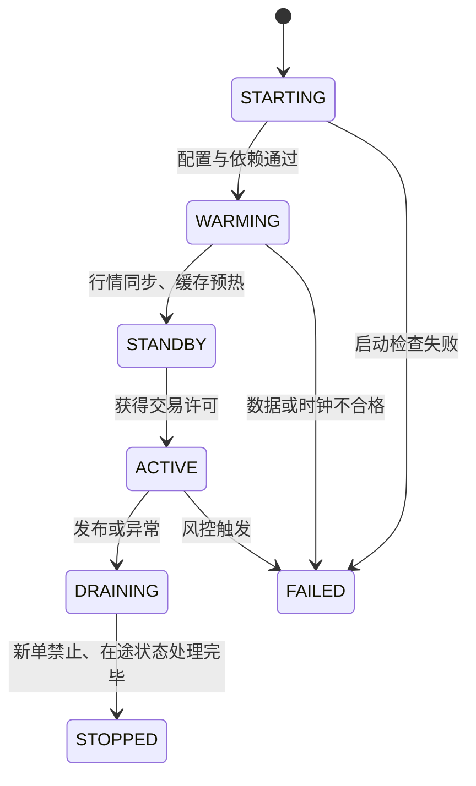

# 生产环境部署：把“快”安全地带到线上

一个程序在开发机上跑得快，不代表它在交易日开盘时也会快。生产部署要同时控制四件事：**二进制、机器、网络和操作流程**。其中任何一项发生漂移，都可能让 P99.99 延迟变差，甚至触发错误下单。

> 本章的核心结论：低延迟部署不是“把文件复制到服务器”，而是把一套验证过的运行条件原样交付，并且随时能够安全退出。

学完本章，你应该能回答三类面试题：

- 如何发布一个 Rust HFT 交易引擎？
- 如何证明新版本既正确又没有性能退化？
- 新版本异常时，如何停止风险并恢复服务？

## 1. 先建立部署心智模型

可以把一次发布看成下面这条链路：


这里有两个容易混淆的词：

- **回滚（rollback）**：把程序版本退回旧版本。
- **风险收敛（risk containment）**：先停止新风险，例如禁止新单、执行撤单或触发 kill switch。线上事故中通常先做风险收敛，再决定是否回滚。

仅仅把进程重启成旧版本，并不能自动撤销新版本已经发出的订单。

## 2. 构建可识别、可复现的产物

### 2.1 锁定输入

生产构建至少应固定：

- Rust 工具链版本，例如仓库中的 `rust-toolchain.toml`。
- 依赖解析结果，即提交并使用 `Cargo.lock`。
- 目标架构、编译参数和链接器版本。
- 配置 schema 与行情协议版本。

CI 中使用 `--locked`，避免构建时悄悄更新依赖：

```bash
cargo build --release --locked --target x86_64-unknown-linux-gnu
```

“可复现”不只是两次构建的字节完全一致，更重要的是能回答：**这个正在运行的进程到底由哪次提交、哪套配置和哪个工具链生成？**

常见做法是在构建时写入版本信息。下面的 `env!` 是**构建期集成示例**：变量必须由 CI 环境或 `build.rs` 的 `cargo:rustc-env=...` 注入，单独复制代码不会编译，因此不作为 doctest。可用 `BUILD_GIT_SHA=<commit> BUILD_PROFILE=release cargo build --release --locked` 验证最终产物，再从启动日志或 `--version` 检查值是否正确。

```rust,ignore
pub const GIT_SHA: &str = env!("BUILD_GIT_SHA");
pub const BUILD_PROFILE: &str = env!("BUILD_PROFILE");

pub fn version_line() -> String {
    format!("git_sha={GIT_SHA} profile={BUILD_PROFILE}")
}
```

启动日志、健康检查和监控标签都应暴露该标识，但不要写入密钥或账户凭证。

### 2.2 从稳妥的 Release Profile 起步

下面是一套常见起点，不是所有项目的万能答案：

```toml
[profile.release]
opt-level = 3
lto = "thin"
codegen-units = 1
debug = "line-tables-only"
incremental = false
```

逐项理解它们：

| 选项 | 作用 | 取舍 |
| :--- | :--- | :--- |
| `opt-level = 3` | 启用较激进优化 | 可能增大代码体积，必须实测 |
| `lto = "thin"` | 跨 crate 优化 | 构建更慢；通常比 fat LTO 更实用 |
| `codegen-units = 1` | 给 LLVM 更完整的优化视野 | 编译并行度降低 |
| `debug = "line-tables-only"` | 保留定位采样所需的行号 | 产物略大，但不等于 Debug 构建 |
| `incremental = false` | 避免生产构建受增量缓存影响 | 构建时间增加 |

`panic = "abort"` 有时能缩小二进制并简化失败路径，但它会让进程在 panic 时直接终止，无法展开栈。是否启用必须结合进程监督、崩溃转储和恢复方案决定，不能只为了“更快”盲目开启。

### 2.3 `target-cpu=native` 的陷阱

`-C target-cpu=native` 会使用**构建机**支持的 CPU 指令。如果构建机有 AVX-512，而生产机没有，程序可能以 `Illegal instruction` 直接崩溃。

更稳妥的选择有两种：

1. 构建机与生产机使用完全相同的 CPU 型号，并把该条件纳入资产管理。
2. 明确指定团队支持的最低 CPU 型号或 features，并在启动时做能力检查。

```bash
rustc --print target-cpus
rustc --print target-features
```

## 3. 上线前必须过的四道门

### 3.1 正确性门

- `cargo test --all-targets --locked` 通过。
- 协议解析、订单状态机、风控边界和断线恢复测试通过。
- 使用固定输入做历史数据回放，关键输出与已批准基线一致。
- 新旧版本对同一输入的差异都能解释；不能只看“进程没崩”。

### 3.2 性能门

至少比较以下指标，而不是只比较平均值：

| 指标 | 需要回答的问题 |
| :--- | :--- |
| P50 | 正常路径是否变慢？ |
| P99 / P99.9 / P99.99 | 尾部延迟是否恶化？ |
| 最大值与超阈值次数 | 是否出现长尾尖刺？ |
| 吞吐与丢包 | 高峰流量下能否跟上？ |
| cycles、instructions | 代码是否做了更多工作？ |
| cache-misses、branch-misses | 数据布局或分支是否退化？ |

性能测试应运行在固定 CPU、固定频率策略、相同 NUMA 布局的专用机器上。共享 CI 虚拟机适合发现“大幅退化”，不适合证明几十纳秒的提升。

### 3.3 兼容性门

检查新版本是否兼容：

- 交易所会话和消息 schema。
- 持久化文件、快照、journal 与恢复点。
- 配置文件版本。
- 监控、告警和运维脚本。
- 旧版本能否读取新版本产生的状态；若不能，回滚计划必须包含状态转换。

### 3.4 风控门

启动成功不等于允许发单。进程进入 `ACTIVE` 前应验证：

- 交易日、市场和账户是否正确。
- 行情是否新鲜、序列号是否连续。
- 本地仓位与权威仓位是否对齐。
- PTP/NTP 状态是否在允许误差内。
- 单笔数量、价格偏离、总敞口、消息速率限制是否加载成功。
- kill switch、cancel-on-disconnect 和人工操作通道是否可用。

“风控配置缺失时使用默认值继续运行”通常是危险设计。生产交易系统更适合 **fail closed**：验证失败就拒绝进入可交易状态。

## 4. 机器状态也是发布产物的一部分

同一个二进制在两台配置不同的机器上，尾延迟可能完全不同。

### 4.1 CPU 与 NUMA

- 热路径线程绑定到专用物理核，避免与同一物理核的超线程兄弟争用资源。
- 网卡、DMA 内存和处理线程尽量位于同一 NUMA 节点。
- 把网卡队列 IRQ 绑定到规划的核心；不要让 `irqbalance` 重新搬走它们。
- 检查 CPU governor、C-state、Turbo 策略是否与基准环境一致。

可用于审计的只读命令：

```bash
lscpu -e=CPU,CORE,SOCKET,NODE,ONLINE
numactl --hardware
grep . /sys/devices/system/cpu/cpu*/cpufreq/scaling_governor
cat /proc/interrupts
```

注意：关闭深度 C-state、禁用 SMT 或固定频率都会增加功耗，也可能影响整机性能。每一项都应在目标硬件上用延迟分布验证。

### 4.2 内存

- 热路径使用的内存在启动阶段预分配并触页，避免运行时 page fault。
- 谨慎评估 Transparent Huge Pages；它可能降低 TLB 压力，也可能引入整理和分配抖动。
- 交易进程通常不应依赖 swap，但“关闭 swap”不能替代容量规划。
- 检查 `RLIMIT_MEMLOCK`、文件描述符上限和大页配置是否满足程序要求。

### 4.3 网络与时间

- 网卡固件、驱动、ring size、offload 和中断合并参数与基线一致。
- 多播组、VLAN、路由、静态邻居项和防火墙规则经过实际收包验证。
- 同时记录网卡丢包、内核丢包和应用序列号 gap，才能定位丢包发生在哪一层。
- 区分**单调时钟**与**墙上时间**：超时计算用单调时钟；审计时间戳使用同步后的墙上时间或硬件时间戳。

## 5. 安全切换，而不是“赌一次重启”

### 5.1 推荐的进程状态机



关键点是把“进程活着”和“允许交易”拆成两个状态。健康检查返回 200，并不代表订单网关已经准备好承担风险。

### 5.2 影子、主备和小流量

- **影子模式**：新版本接收真实行情并计算决策，但发单出口被物理或逻辑阻断。适合比较决策、延迟和资源使用。
- **主备切换**：备实例保持会话或状态同步，获得明确 lease 后才能成为主实例。必须防止 split brain（两个实例同时认为自己是主）。
- **小流量验证**：仅当交易所、账户隔离和风险规则允许时使用；HFT 流量并不总能自然按百分比切分。

永远不要让新旧实例同时使用同一会话序列号独立发单，除非协议和网关明确支持。

## 6. 可观测性不能反过来拖慢热路径

热路径中同步写日志、格式化字符串或访问远程指标服务，都可能制造长尾。

更常见的设计是：


- 热路径只写入预分配、定长或紧凑的事件。
- 遥测队列满时，明确选择丢遥测、计数告警还是触发降级，不能无界增长。
- 为延迟直方图记录输入、决策、送达网卡、ACK 等关键时间点。
- 告警使用“连续窗口 + 恢复阈值”，避免一次尖刺造成告警风暴。

发布后至少观察：行情 gap、订单 reject、会话重连、风险拒绝、时钟偏差、CPU steal/迁核、page fault、NIC/内核丢包和端到端尾延迟。

## 7. 回滚与故障手册

一个可执行的回滚计划应写清楚：

1. **谁有权触发**：自动风控、值班工程师还是交易负责人。
2. **先做什么**：禁止新单、撤销活动单、切断发单链路。
3. **状态如何处理**：在途订单、成交回报、序列号和仓位由谁对账。
4. **旧版本如何恢复**：产物地址、校验和、配置版本和启动命令。
5. **如何确认恢复**：行情连续、会话同步、仓位一致、延迟和错误率回到基线。

回滚前后都应保留证据：版本号、配置摘要、触发原因、关键指标、交易所回报和操作时间线。事故复盘依赖这些信息，而不是依赖人的记忆。

## 8. 面试高频问答

### Q1：你会如何部署一个低延迟交易引擎？

一个有层次的 60 秒回答可以是：

> 我会先生成可追溯的不可变产物，锁定工具链、依赖、目标 CPU 和配置版本。上线前依次通过正确性回放、尾延迟基线、协议兼容和风控检查。新版本先在相同硬件上预热，并用影子模式对比决策与延迟；切换时通过唯一 lease 保证只有一个实例可发单。发布后同时观察行情 gap、reject、时钟偏差、NIC/内核丢包和 P99.99。异常时先禁止新单并处理活动单，再回滚二进制和状态，最后做仓位对账。

### Q2：为什么不能只做蓝绿部署然后切负载均衡？

普通 Web 请求大多近似无状态，而订单会话包含序列号、在途订单、仓位和交易所连接所有权。两个实例同时活动可能重复发单或造成会话冲突，因此切换必须连同**状态与发单权**一起转移。

### Q3：为什么 Release 构建还要保留调试信息？

调试信息帮助 `perf`、core dump 和火焰图把地址映射回函数或行号。它不等于关闭优化；可以把符号拆分保存，并在部署包中只保留所需部分。

### Q4：服务启动后延迟突然恶化，你先看什么？

先确认是否是发布相关变化，再按路径分层：线程是否迁核、CPU 频率/C-state 是否变化、page fault 是否增加、IRQ/NUMA 是否错位、NIC 与内核是否丢包、遥测是否阻塞。不要一上来就修改十个 sysctl，否则无法确定根因。

## 9. 一页部署清单

### 构建

- [ ] 工具链、依赖锁和目标 CPU 已固定。
- [ ] 产物包含提交号、构建配置和校验和。
- [ ] Release + PGO/LTO 的组合经过基准验证，而不是凭感觉启用。

### 验证

- [ ] 单元、集成、回放、故障注入测试通过。
- [ ] P50 到 P99.99、吞吐、丢包和硬件计数器未越过门槛。
- [ ] 协议、配置、持久化状态和回滚兼容性已确认。

### 主机与网络

- [ ] CPU/IRQ/NUMA、内存、NIC、内核参数与基线一致。
- [ ] 行情连续，时钟同步，账户和交易日正确。
- [ ] 密钥权限最小化，日志不包含凭证和敏感业务数据。

### 切换与恢复

- [ ] 新实例已预热并在影子/待命状态验证。
- [ ] 任意时刻只有一个实例拥有发单权。
- [ ] kill switch、撤单、状态对账和旧版本回滚已演练。

真正成熟的部署方案，不是承诺“永不出错”，而是让错误更难发生、能被快速发现，并且不会演变成失控的交易风险。
