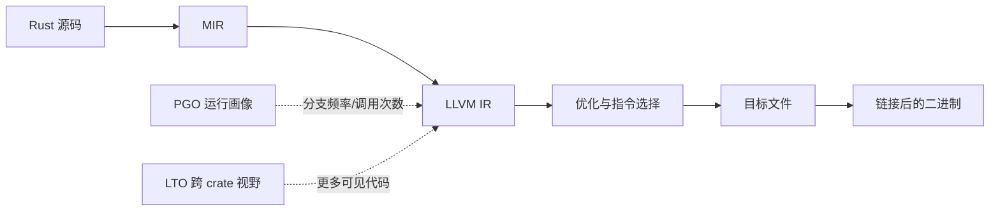

# 编译优化与 PGO：让编译器认识真实热路径

> **面试优先级：P2。** P0 先掌握 release 构建、基准测试与 profiling；只有简历写了 PGO 或岗位重视编译优化，才需要记完整采集、合并和发布流程。

普通优化只看代码本身；PGO（Profile-Guided Optimization，基于运行画像的优化）还会告诉编译器：**哪些分支最常走、哪些函数真正热、哪些调用值得内联**。

这很适合 HFT，但也很容易“把基准答案背进二进制”。训练流量不真实，PGO 可能优化正常行情、拖慢极端行情，而极端行情恰恰是最不能慢的时候。

本章目标是让你既会操作，也能在面试中解释 PGO 为什么有效、为什么可能无效，以及怎样证明它没有伤害尾延迟。

## 1. 先理解编译器在做什么

Rust 源码会经过多层转换，最终由 LLVM 生成机器码：



PGO 常帮助 LLVM 做这些决定：

- 把更常见的分支放在顺序执行路径上，减少跳转和指令缓存压力。
- 更积极地内联热调用，同时避免无意义地膨胀冷路径。
- 调整基本块和函数的布局，让热代码更集中。
- 对间接调用、循环和寄存器分配做更符合实际流量的选择。

PGO 不是新的算法，也不会修复锁竞争、网卡丢包或糟糕的数据结构。它是在算法和架构已经合理后，继续减少 CPU 工作量的一种工具。

## 2. 先用好普通 Release 优化

### 2.1 Cargo Profile

先建立可重复的非 PGO 基线：

```toml
[profile.release]
opt-level = 3
lto = "thin"
codegen-units = 1
debug = "line-tables-only"
incremental = false
```

这些选项需要分别验证：

| 选项 | 可能收益 | 可能代价 |
| :--- | :--- | :--- |
| `opt-level = 3` | 更积极的向量化和内联 | 代码体积增加，偶尔反而变慢 |
| `lto = "thin"` | 跨 crate 优化 | 构建和链接更慢 |
| `codegen-units = 1` | LLVM 看到更完整的 crate | 编译并行度降低 |
| `panic = "abort"` | 简化 panic 路径、可能减小体积 | 无法 unwind；测试与故障诊断策略会变化 |

不要把全部开关一次性打开后只测一次。推荐从稳定基线开始，每次改变一个变量，记录二进制大小、吞吐、分位数延迟和硬件计数器。

### 2.2 目标 CPU

```bash
RUSTFLAGS="-C target-cpu=native" cargo build --release --locked
```

`native` 针对**构建机器**生成指令。只有构建机和生产机 CPU 能力一致时才安全。更通用的发布应指定明确的目标 CPU 或最低 features，并在目标机器上验证。

### 2.3 为什么 LTO 与 PGO 可以叠加

- LTO 回答：“编译器能看到哪些跨 crate 的代码？”
- PGO 回答：“真实运行时，哪些代码最重要？”

两者提供的信息维度不同，通常可以组合。但组合后必须重新测量，因为更激进的内联可能扩大指令工作集，造成 I-cache miss。

## 3. Instrumentation PGO 的完整流程

`rustc` 直接支持 LLVM 的 instrumentation PGO。流程固定为四步：

1. 编译带计数器的训练版。
2. 用代表性工作负载运行训练版，产生 `.profraw`。
3. 合并为 `.profdata`。
4. 使用画像重新构建正式版。

### 3.1 安装匹配的 LLVM 工具

```bash
rustup component add llvm-tools-preview
rustc --version --verbose
```

`llvm-profdata` 最好来自当前 Rust 工具链自带的 `llvm-tools-preview`。系统中另一个 LLVM 版本可能无法读取该画像格式。

它通常位于：

```text
<rustup-toolchain>/lib/rustlib/<target-triple>/bin/llvm-profdata
```

可以用 `rustc --print target-libdir` 帮助定位，但 CI 最好把解析后的绝对路径保存成任务变量，并打印工具版本以便追溯。

### 3.2 构建训练版

下面用独立的临时目录举例。真实脚本应使用本次任务专属目录，并在创建后打印确认，避免误删其他数据。

```bash
PGO_DATA_DIR="$(mktemp -d)"
TARGET_TRIPLE="x86_64-unknown-linux-gnu"

RUSTFLAGS="-Cprofile-generate=${PGO_DATA_DIR}" \
  cargo build --release --locked --target "${TARGET_TRIPLE}"
```

为什么显式传 `--target`？Cargo 的构建脚本也可能调用 rustc。指定 target 能避免把相同 `RUSTFLAGS` 不必要地施加给 host build script，并让训练和正式构建目标保持清晰。

训练版包含额外计数逻辑，**不能拿它的延迟当作正式版性能**，也不应把它当生产交易版本。

### 3.3 运行代表性训练负载

```bash
BIN="target/${TARGET_TRIPLE}/release/trading-engine"

"${BIN}" replay --input fixtures/quiet-session.bin
"${BIN}" replay --input fixtures/open-auction.bin
"${BIN}" replay --input fixtures/volatile-session.bin
"${BIN}" replay --input fixtures/recovery-and-gap.bin
```

理想训练集不只是“最常见的一天”，还应覆盖：

- 安静行情、开收盘、突发高峰和波动日。
- 正常报单、撤单、reject、部分成交和重连恢复。
- 行情 gap、乱序、快照恢复等异常但重要的路径。
- 实际支持的产品、协议版本与配置组合。

训练输入与最终评测输入应分开。否则你只证明了程序记住训练集，而没有证明它对未来流量有效。

### 3.4 合并画像

```bash
LLVM_PROFDATA="/absolute/path/to/llvm-profdata"

"${LLVM_PROFDATA}" merge \
  -o "${PGO_DATA_DIR}/merged.profdata" \
  "${PGO_DATA_DIR}"
```

多个训练场景可以产生多个 raw profile，再统一 merge。若业务确实需要，也可以给场景设置权重，但权重应有生产流量或风险分析依据，不能为了让某个 benchmark 好看而调。

### 3.5 构建 PGO 正式版

```bash
PROFILE_FILE="${PGO_DATA_DIR}/merged.profdata"

RUSTFLAGS="-Cprofile-use=${PROFILE_FILE} -Cllvm-args=-pgo-warn-missing-function" \
  cargo build --release --locked --target "${TARGET_TRIPLE}"
```

训练和正式构建必须使用相同的源码、工具链、target 以及其他关键 codegen 参数。依赖或代码变化后，旧画像可能失配；不要因为构建“还能成功”就认为画像仍然有效。

`-pgo-warn-missing-function` 有助于发现正式二进制里的函数没有对应画像。少量冷代码缺失未必是错误，但大量告警通常意味着训练覆盖不足或构建不一致。

## 4. 什么叫“代表性”训练

PGO 的本质可以用一个简单例子理解：

```rust
#[derive(Debug)]
struct BookUpdate;

#[derive(Debug)]
struct Trade;

#[derive(Debug)]
struct SequenceRange;

enum Message {
    BookUpdate(BookUpdate),
    Trade(Trade),
    GapDetected(SequenceRange),
}

fn apply(_update: BookUpdate) {}
fn record(_trade: Trade) {}
fn recover(_range: SequenceRange) {}

fn handle(msg: Message) {
    match msg {
        Message::BookUpdate(update) => apply(update),
        Message::Trade(trade) => record(trade),
        Message::GapDetected(range) => recover(range),
    }
}

fn main() {
    handle(Message::BookUpdate(BookUpdate));
    handle(Message::Trade(Trade));
    handle(Message::GapDetected(SequenceRange));
}
```

如果训练集中 99.99% 都是 `BookUpdate`，编译器会把它当作最热路径。这通常合理；但如果训练集中从未出现 `GapDetected`，恢复代码可能被放进冷区。极端行情发生 gap 时，恢复延迟反而可能恶化。

因此应从两个角度配置训练权重：

- **频率代表性**：线上通常执行什么？
- **风险代表性**：哪些低频路径一旦变慢就会造成严重后果？

HFT 的优秀回答不会只说“拿生产流量训练”，还会说明如何去敏、如何复现、如何覆盖异常路径，以及如何防止训练数据泄漏账户与策略信息。

## 5. 验证：PGO 版本必须击败公平基线

至少保留三个可对比产物：

1. 普通 Release。
2. Release + LTO（若基线未使用）。
3. Release + LTO + PGO。

在同一机器、同一 BIOS/内核设置、同一 CPU 绑定和同一输入下交错运行，减少温度与环境漂移：

```text
A(普通) -> B(PGO) -> B(PGO) -> A(普通) -> A(普通) -> B(PGO)
```

比较维度：

| 类别 | 指标 |
| :--- | :--- |
| 延迟 | P50、P99、P99.9、P99.99、max、超 SLA 次数 |
| CPU | cycles、instructions、IPC |
| 前端 | branch-misses、i-cache misses |
| 内存 | L1/LLC misses、page faults |
| 功能 | 输出一致性、reject/gap/recovery 行为 |
| 产物 | 二进制大小、构建时间、符号可观测性 |

一个常见现象是平均值改善但 P99.99 变差。可能原因包括：热路径内联过多导致指令缓存压力、冷路径布局变差，或训练集没有覆盖长尾场景。HFT 是否接受这种结果取决于业务目标，但绝不能只汇报平均提升。

### 5.1 防止性能回归门槛“抖动”

不要用“必须比上次快 1ns”这种脆弱规则。更稳妥的方法是：

- 使用多轮样本和置信区间。
- 设置有实际意义的退化预算，例如 P99.9 不得恶化超过某比例且超 SLA 次数不得增加。
- 同时看时间和指令数；时间抖动但指令数稳定时，可能是机器噪音。
- 性能门失败后保存原始直方图、硬件计数器、版本和主机状态。

## 6. 常见失败模式与排查

### 6.1 “profile data may be out of date”

原因通常是源码、依赖、编译器或编译参数发生变化。解决方案不是压掉告警，而是用当前构建重新采集画像。

### 6.2 画像文件为空或覆盖不全

检查训练版是否正常退出并刷新计数器、训练脚本是否实际调用了目标二进制、profile 目录权限是否正确。崩溃或被强制终止可能导致数据不完整。

### 6.3 Benchmark 变快，端到端不变

PGO 优化了一个不在关键路径上的微基准，或者端到端瓶颈在 I/O、锁、缓存一致性和排队。结合火焰图、硬件计数器和因果分析确认真正瓶颈。

### 6.4 正常日变快，波动日变慢

训练分布过窄。补充突发流量和恢复路径，或者为风险关键路径建立单独的性能门槛。不要用更多正常日样本稀释异常路径。

### 6.5 二进制膨胀

PGO 与 LTO 可能让 LLVM 更积极内联。检查文本段大小、I-cache miss 和具体函数汇编；必要时减少不合算的内联，而不是机械追求所有开关都启用。

## 7. PGO 与其他技术怎么选

| 技术 | 主要信息来源 | 优点 | 局限 |
| :--- | :--- | :--- | :--- |
| Instrumentation PGO | 程序内部计数器 | 路径数据精确，rustc 原生支持 | 需要训练构建与代表性输入 |
| Sample PGO | `perf` 等采样 | 可从接近生产的运行采集 | 采样偏差、地址映射和工具链更复杂 |
| BOLT 类后链接优化 | 最终二进制画像 | 可改善函数/基本块布局 | 平台、构建和部署链路复杂 |
| 手工 `likely/unlikely` 思路 | 工程师判断 | 局部、直观 | 人的判断容易过时，Rust 稳定接口也有限 |

对初学者，优先顺序通常是：正确算法与数据布局 → Release/LTO 基线 → profiling → instrumentation PGO → 更复杂的后链接优化。不要跳过测量直接追逐高级名词。

## 8. 面试高频问答

### Q1：PGO 为什么能加速程序？

因为静态代码不能告诉编译器真实的分支频率和调用热度。PGO 用训练运行收集这些数据，帮助 LLVM 做更合适的内联、代码布局和分支优化，从而减少指令、分支失败或指令缓存压力。

### Q2：PGO 最大的风险是什么？

画像不代表生产分布。它可能过拟合正常流量，牺牲极端行情和恢复路径。另一个风险是源码或工具链变化后继续使用过时画像。因此画像需要版本化、重采集，并在未参与训练的数据上验证端到端尾延迟。

### Q3：PGO 一定会更快吗？

不一定。性能可能受 I/O、锁和内存访问限制；错误画像还可能导致代码膨胀或冷路径变慢。是否采用必须由 A/B 基准、硬件计数器和业务 SLA 决定。

### Q4：为什么 PGO 训练版不能直接上线？

训练版插入了运行计数器，会增加指令、内存写入和退出时的数据刷新，延迟分布不代表正式优化版。它的职责是生成画像，不是提供最低延迟。

## 9. 最终检查清单

- [ ] 非 PGO Release 基线稳定且可复现。
- [ ] 训练与正式构建使用同一源码、依赖、工具链、target 和关键参数。
- [ ] 训练集覆盖常态、高峰、异常与恢复路径，并与评测集隔离。
- [ ] 使用匹配版本的 `llvm-profdata`，构建时检查缺失画像告警。
- [ ] 在目标硬件上比较完整延迟分布、硬件计数器和功能一致性。
- [ ] PGO 画像、训练清单、构建日志和最终产物可追溯。
- [ ] 代码或工具链变化后重新训练，不把 `.profdata` 当作永久资产。

PGO 的价值不在于让简历多一个缩写，而在于建立一条闭环：**用真实工作负载告诉编译器，再用独立工作负载检验编译器是否做对了。**

## 10. 官方资料

- [rustc：Profile-guided Optimization](https://doc.rust-lang.org/rustc/profile-guided-optimization.html)
- [Cargo：构建 Profiles](https://doc.rust-lang.org/cargo/reference/profiles.html)
- [rustc：Codegen Options](https://doc.rust-lang.org/rustc/codegen-options/index.html)
