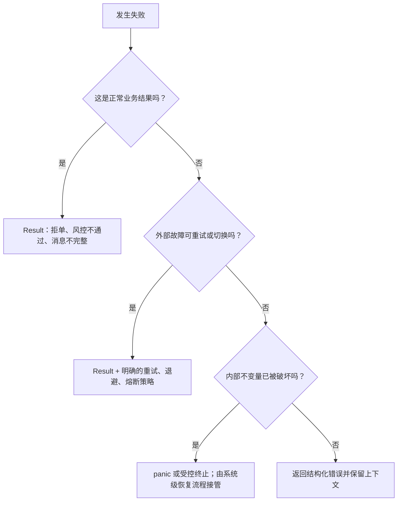

# 错误处理：把失败路径也设计成系统的一部分

Rust 通常用 `Result<T, E>` 表示可恢复错误，用 `Option<T>` 表示“可能没有值”，用 panic 表示程序错误或被破坏的不变量。它没有 Java/Python 那种用于普通错误传播的异常机制，但 Rust **有 panic 和可选的栈展开**，所以“Rust 完全没有异常式控制转移”也不准确。

在任何长期运行的服务里，关键问题不只是“怎样返回错误”，还包括：失败是否预期、谁负责恢复、外部副作用怎么办，以及错误处理是否影响成功路径。交易系统还必须处置场内活动订单，推理服务则要处置已接收请求和设备任务。

## 1. 先给失败分类



典型例子：

| 类别 | 示例 | 常见表达 |
|---|---|---|
| 正常业务结果 | 价格越界、余额不足、重复订单 | 小型 `Result<T, RejectReason>` |
| 短暂外部故障 | 连接断开、上游暂时不可用 | `Result` + 重连/退避策略 |
| 数据或协议错误 | 截断消息、未知模板版本 | `Result`，记录原始序号与来源 |
| 程序不变量破坏 | 已确认不可能出现的状态 | panic/终止当前故障域 |

不要用 panic 表示预期拒单，也不要对所有 I/O 错误无限重试。

## 2. `Result<T, E>` 的布局没有通用加法公式

`Result` 是枚举：

```rust
enum Result<T, E> {
    Ok(T),
    Err(E),
}
```

但下面这个公式是错的：

```text
size_of::<Result<T, E>>() = max(size_of::<T>(), size_of::<E>()) + 1
```

实际大小还受对齐和填充、判别标记的表示方式，以及编译器能否利用无效位模式（niche）影响。除文档明确承诺的情况外，默认 Rust 表示的具体布局也不是稳定 ABI。应直接检查关心的具体类型：

```rust
use std::mem::{align_of, size_of};

fn main() {
    println!("size  = {}", size_of::<Result<u64, u8>>());
    println!("align = {}", align_of::<Result<u64, u8>>());
}
```

输出可能因目标平台和工具链而变化，不要把本机结果硬编码成跨平台协议或 FFI ABI。

### 哪些 niche 优化有明确保证？

<details>
<summary><strong>进阶：<code>Result&lt;&amp;T, ()&gt;</code> 的特定布局保证</strong></summary>

下面是标准库文档列出的窄特例，适合库作者或布局审计时查阅。更普遍的结论是：不要凭“最大变体加一字节”猜枚举大小，应对具体类型用工具检查。

对 `T: Sized`，引用 `&T` 属于标准库列出的空指针优化类型；`()` 又是大小为 0、对齐为 1 的类型。因此标准库明确保证：

```rust
use std::mem::{align_of, size_of};

fn assert_layout<T: Sized>() {
    assert_eq!(size_of::<Result<&T, ()>>(), size_of::<&T>());
    assert_eq!(align_of::<Result<&T, ()>>(), align_of::<&T>());
}

fn main() {
    assert_layout::<u64>();
}
```

这个结论来自 `Result` 的特定表示保证：一侧是符合 `Option` 表示保证的类型，另一侧是对齐为 1 的零大小类型。不要把它外推成“任何 `Result<指针, 小错误>` 都与指针一样大”，也不要默认所有 Rust 枚举都有稳定 FFI 布局。

</details>

## 3. 大错误类型的真实成本

一个大错误变体会让整个 `Result` 值足以容纳它：

```rust
struct HugeError {
    message: [u8; 1024],
}

fn process() -> Result<i32, HugeError> {
    Ok(42)
}
```

这可能增加栈帧、寄存器压力或缓存流量，但“每次成功返回都必然 memcpy 1 KiB”是错误的。具体 ABI 可能让调用者预留返回位置，函数直接写入；内联和返回值优化还可能消除移动。是否真的产生大拷贝，应检查优化后的汇编并做基准测试。

热路径常用的设计是把高频判断结果保持紧凑：

```rust
#[derive(Debug, Clone, Copy, PartialEq, Eq)]
#[repr(u8)]
enum RejectReason {
    InvalidPrice,
    PositionLimit,
    DuplicateOrder,
}

fn risk_check(price: i64, position: i64) -> Result<(), RejectReason> {
    if price <= 0 {
        return Err(RejectReason::InvalidPrice);
    }
    if position > 10_000 {
        return Err(RejectReason::PositionLimit);
    }
    Ok(())
}
```

详细诊断可以在冷路径中根据错误码、订单 ID、行情序号和时间戳组装。若确实需要携带大错误，`Box<LargeError>` 往往能缩小枚举，并只在构造错误时分配；但 `Result<T, Box<E>>` **不保证只有一个指针大小**，也不保证一定更快。错误高频发生时，堆分配反而可能成为瓶颈。

## 4. `?` 做了什么？

对 `Result` 而言，`?` 可以先理解成“成功就取值，失败就转换错误并提前返回”：

```rust
use std::num::ParseIntError;
use std::str::Utf8Error;

#[derive(Debug, PartialEq, Eq)]
enum PriceError {
    InvalidUtf8,
    InvalidNumber,
}

impl From<Utf8Error> for PriceError {
    fn from(_: Utf8Error) -> Self {
        Self::InvalidUtf8
    }
}

impl From<ParseIntError> for PriceError {
    fn from(_: ParseIntError) -> Self {
        Self::InvalidNumber
    }
}

fn decode_price(input: &[u8]) -> Result<u64, PriceError> {
    let text = std::str::from_utf8(input)?;
    let price = text.parse::<u64>()?;
    Ok(price)
}

fn decode_price_expanded(input: &[u8]) -> Result<u64, PriceError> {
    let text = match std::str::from_utf8(input) {
        Ok(value) => value,
        Err(error) => return Err(PriceError::from(error)),
    };

    let price = match text.parse::<u64>() {
        Ok(value) => value,
        Err(error) => return Err(PriceError::from(error)),
    };

    Ok(price)
}

fn main() {
    assert_eq!(decode_price(b"123"), Ok(123));
    assert_eq!(decode_price_expanded(b"123"), Ok(123));
}
```

严格来说，`?` 建立在 `Try`/残差传播机制上；对常见 `Result` 代码，上面的 `match` 展开足以说明重点：错误可能通过 `From::from` 转换，而不是简单原样返回。

### `?` 是不是“几乎免费”？

不能脱离上下文承诺：

- `?` 语法本身不要求堆分配；
- 成功路径通常只是判断变体并继续，优化器常能生成紧凑代码；
- `From` 实现可以格式化字符串、分配内存或做其他昂贵工作；
- 错误若从“极少发生”变成“频繁发生”，分支预测和错误构造成本都会改变；
- 内联与代码布局由具体编译结果决定。

因此，更准确的结论是：“`?` 是由 `match` 类控制流展开的语法抽象，通常不会比等价手写传播多出固有成本”，而不是“`?` 保证没有成本”。

## 5. Panic：`unwind` 与 `abort`

panic 表示当前代码无法按正常契约继续。常见策略是：

| 策略 | 行为 | 资源清理 | 能否用 `catch_unwind` 捕获 Rust panic |
|---|---|---|---|
| `unwind` | 沿调用栈展开 | 展开经过的栈帧会运行 `Drop` | 可以在合适边界尝试捕获 |
| `abort` | 终止整个进程 | 不运行普通栈展开析构；OS 回收进程资源 | 不可以 |

多数支持展开的标准目标默认使用 `unwind`，但并非所有目标都支持。release 配置可以选择：

```toml
[profile.release]
panic = "abort"
```

`abort` 让优化器假设 Rust 栈帧不会展开，**可能**减小某些程序的代码体积或改善运行时表现，但这不是“二进制一定极小、正常路径一定更快”的保证。

### `panic = "abort"` 不等于系统一定更安全

进程退出后，操作系统会回收内存和文件描述符，但交易所中的活动订单、已经发出的网络消息和外部持久状态不会被 OS 自动撤销。立即退出是否更安全，取决于完整的故障设计：

- 是否有独立 kill switch 或风险进程；
- 交易通道是否支持 cancel-on-disconnect；
- 监控是否能确认进程退出并阻止重复启动；
- 重启后是否先恢复序号、持仓和活动订单，再允许交易；
- 一个进程包含多少策略和交易所连接，即故障域有多大。

`unwind` 也不意味着可以随便捕获 panic 后继续交易。`catch_unwind` 适合在明确的故障隔离边界阻止整个服务被带走，但捕获后仍要判断状态是否可信；锁中毒和外部副作用都需要单独处理。

### 怎样选择 panic 策略

1. 预期业务失败用 `Result`，绝不依赖 panic 控制正常流程；
2. 明确一个 panic 会杀死线程、策略进程还是整个交易进程；
3. 同时设计进程外风控、订单撤销与重启对账；
4. 用 release 二进制比较 `unwind`/`abort` 的体积与热路径基准；
5. 再根据故障域与恢复流程选择策略，而不是把 `abort` 或 `unwind` 当成所有系统的固定答案。

## 6. 常见误区

### 误区一：`Result` 的大小就是最大变体加一个字节

标签、对齐、填充和 niche 都会影响布局。只有文档列出的特例有稳定保证，其余用 `size_of` 检查具体类型。

### 误区二：大错误会让每次返回都复制整个错误缓冲区

大错误会放大返回类型，但具体调用约定和优化可能避免复制。它仍可能增加栈或缓存压力，必须测量。

### 误区三：`?` 原样返回所有错误

对 `Result`，它通常会通过 `From`/残差转换成当前函数的错误类型。转换逻辑可能有成本。

### 误区四：进程 abort 后订单会自动安全消失

本地资源会被 OS 回收，远端订单与外部状态不会自动恢复。必须有撤单、风控和对账机制。

## 7. 三类系统中的应用

| 场景 | 可恢复错误 | 不变量破坏后还要处理什么 |
| --- | --- | --- |
| 传统后端 | 参数错误、依赖超时、数据库冲突 | 隔离请求或进程，避免重复写入，保留可追踪上下文 |
| AI Infra | 模型不存在、设备繁忙、输入形状不符 | 取消或核对设备任务，释放显存，决定是否重建执行上下文 |
| HFT | 拒单、断线、协议消息不完整 | 核对活动订单、持仓和序号，由进程外风控接管 |

`Result` 只负责把失败传给调用者；重试、幂等、撤销外部副作用和重建状态仍是系统设计。

## 8. 面试题

### Q1：`Result<T, E>` 的大小怎样计算？

没有适用于所有 `T`、`E` 的简单公式。说明枚举需要容纳变体，并受标签、对齐、填充和 niche 优化影响；然后用 `size_of`/`align_of` 检查目标平台上的具体类型。

### Q2：什么时候返回 `Result`，什么时候可以 panic？

调用者预期会遇到并能够处理的失败，例如拒单、截断消息和连接失败，返回 `Result`。panic 更适合表示程序内部契约已经被破坏、当前路径无法可信继续；即便如此，还要由进程外风控、撤单和对账流程处理外部状态，不能把 panic 当普通错误分支。

### Q3：`?` 会分配内存吗？

操作符本身不要求分配；它调用的错误转换可能分配。例如把底层错误格式化成 `String` 就可能在错误路径上分配。

### Q4：为什么 `panic = "abort"` 可能减小代码，又不一定更安全？

编译器不必支持 Rust 栈展开，可能删除相关代码；但进程会立即终止，外部订单和持久状态不会自动清理，安全性取决于故障隔离、kill switch、撤单与重启对账。

### Q5：什么时候可以捕获 panic 后继续？

只在边界清晰、状态能被丢弃或重新初始化、外部副作用可核对时考虑。`catch_unwind` 不是“恢复一切”的按钮，也无法捕获 `panic = "abort"`。

## 9. 小结

- `Result` 的具体布局要区分“官方保证”和“当前编译器观察结果”。
- 大错误类型可能影响热路径，但不能凭源码断言每次返回都有大 `memcpy`。
- `?` 通常生成与手写传播相当的控制流，错误转换本身仍可能昂贵。
- `abort` 与 `unwind` 是故障策略选择；是否安全取决于进程之外的订单和恢复设计。
