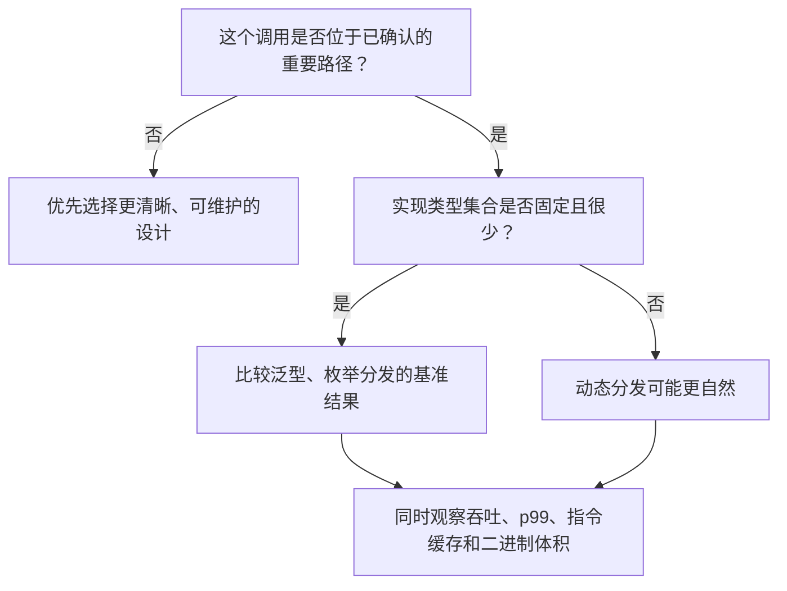

# 泛型、分发与 GAT：把抽象成本说清楚

泛型不只是“少写几遍代码”。它还会影响调用方式、编译时间、机器码体积、指令缓存占用，以及接口能否返回借用视图。

Rust 的“零成本抽象”不是“任何抽象都一定免费”，而是抽象不应强迫调用者支付低层等价实现之外的运行时成本。实际代码大小和执行成本仍取决于优化、具体类型、目标 CPU 和编译器版本。

## 1. 泛型与单态化

下面的函数可以接受所有实现了 `Display` 的类型：

```rust
use std::fmt::Display;

fn print_item<T: Display>(item: T) {
    println!("Item: {item}");
}

fn main() {
    print_item(42_i32);
    print_item("hello");
}
```

Rust 通常会对实际使用到的具体类型进行**单态化**（monomorphization）。可以先把它理解为：编译器为 `i32` 和 `&str` 分别处理出具体版本，因此调用点知道真实类型，可以继续内联、常量传播和删除无用分支。

不过，“源码里用了两种类型，二进制里就一定原样放两份函数”并不是语言保证。优化器可能：

- 把函数完全内联，最终不再保留独立函数；
- 合并机器码完全相同的实例；
- 因为优化级别、LTO 或目标平台不同而产生不同结果。

因此，更准确的说法是：

> 泛型通常通过单态化实现静态分发，为优化器提供具体类型信息；代价可能是更长的编译时间和更多机器码，而不是机械地保证“每种类型复制一份”。

### 代码体积为什么也会影响运行性能？

二进制文件大一点不只是多占磁盘。频繁执行的机器码如果膨胀过多，还可能挤压 CPU 的指令缓存（I-cache），增加取指停顿。

常见取舍如下：

| 方案 | 主要收益 | 主要代价 |
|---|---|---|
| 泛型 / `impl Trait` | 具体类型已知，容易内联和跨函数优化 | 可能增加编译时间与机器码体积 |
| `dyn Trait` | 一份调用代码可处理多种运行时类型，便于异构集合 | 一般需要间接调用，优化空间较小 |
| 枚举分发 | 类型集合封闭，可用 `match` 显式分发 | 每增加一种实现都要改枚举和分支 |

## 2. 静态分发与动态分发

先定义两个最小策略：

```rust
trait Strategy {
    fn on_tick(&mut self, price: i64) -> i64;
}

struct Maker;

impl Strategy for Maker {
    fn on_tick(&mut self, price: i64) -> i64 {
        price + 1
    }
}

// 静态分发：每次调用时，S 都是一个确定的具体类型。
fn run_static<S: Strategy>(strategy: &mut S, price: i64) -> i64 {
    strategy.on_tick(price)
}

// 动态分发：具体类型在运行时由 trait object 携带。
fn run_dynamic(strategy: &mut dyn Strategy, price: i64) -> i64 {
    strategy.on_tick(price)
}

fn main() {
    let mut maker = Maker;
    assert_eq!(run_static(&mut maker, 100), 101);
    assert_eq!(run_dynamic(&mut maker, 100), 101);
}
```

### `dyn Trait` 实际付出了什么？

`&dyn Strategy` 通常是由两部分组成的宽指针：数据指针和虚函数表（vtable）指针。方法调用一般要先从 vtable 取得函数地址，再做一次间接调用。

这意味着：

- 未知目标的动态调用通常不能像静态调用那样直接内联；
- 间接分支的预测效果取决于调用点是否经常跳到同一个目标；
- 优化器若能重新推断出具体类型，有时也能“去虚拟化”；
- `&dyn Trait` 本身不需要堆分配；`Box<dyn Trait>` 的堆分配来自 `Box`，不是来自 `dyn` 这个关键字。

不能给 vtable 调用编造一个固定的“几十纳秒”成本。若目标稳定且数据都在缓存中，间接调用可能很便宜；若目标频繁变化、阻碍内联后的连锁优化很多，影响可能明显得多。答案只能来自与真实负载相似的基准测试。

### 怎样选择分发方式？



比较务实的做法是：

- 请求逐条解析、张量操作或订单簿更新等频繁内层循环，可以比较泛型与封闭枚举；
- 启动配置、监控、管理接口和插件边界，`dyn Trait` 往往更自然；
- 不要用“禁止 `dyn`”代替测量，也不要为了消除一次间接调用而复制大量机器码。

## 3. Const Generics：容量进入类型

Const Generics 允许把编译期常量作为泛型参数。`FixedQueue<u64, 64>` 与 `FixedQueue<u64, 1024>` 是两个不同的具体类型：

```rust
struct FixedQueue<T, const N: usize> {
    slots: [Option<T>; N],
    head: usize,
    len: usize,
}

impl<T, const N: usize> FixedQueue<T, N> {
    fn new() -> Self {
        assert!(N > 0, "queue capacity must be greater than zero");
        Self {
            slots: std::array::from_fn(|_| None),
            head: 0,
            len: 0,
        }
    }

    fn push(&mut self, value: T) -> Result<(), T> {
        if self.len == N {
            return Err(value);
        }

        let tail = (self.head + self.len) % N;
        self.slots[tail] = Some(value);
        self.len += 1;
        Ok(())
    }

    fn pop(&mut self) -> Option<T> {
        if self.len == 0 {
            return None;
        }

        let value = self.slots[self.head].take();
        self.head = (self.head + 1) % N;
        self.len -= 1;
        value
    }
}

fn main() {
    let mut queue = FixedQueue::<u64, 4>::new();
    queue.push(10).unwrap();
    queue.push(20).unwrap();
    assert_eq!(queue.pop(), Some(10));
}
```

### `[T; N]` 并不等于“永远在栈上”

数组字段会**内联存放在它的拥有者里面**：

- 拥有者是局部变量时，它通常位于当前栈帧中（也可能被优化到寄存器或直接消除）；
- 拥有者放进 `Box` 时，数组随拥有者位于堆上；
- 拥有者是 `static` 时，数组位于静态存储区；
- 若 `T` 本身含有 `String`、`Vec` 等，数组只是内联保存这些值的控制信息，它们仍可能管理堆内存。

所以更准确的收益是：`[T; N]` 这个字段本身不需要像 `Vec<T>` 的元素区那样单独做动态扩容。它不保证整个程序“零分配”，更不保证一定使用栈。

还要注意两个风险：

1. 很大的局部数组可能造成栈压力甚至栈溢出；
2. 每个不同的 `N` 都可能产生新的单态化实例，增加代码体积。

### 编译期常量不等于“自动快几十倍”

`N` 已知会给优化器更多信息。例如 `N` 是 2 的幂时，`index % N` 很容易被降低为掩码运算。但是否真的发生、能省多少时间，取决于编译器和上下文；固定除数即使不是 2 的幂也可能被优化。请检查生成代码或做基准测试，不要承诺固定倍数。

## 4. 关联类型还是 Trait 泛型？

经典对比是：

```rust
trait Source {
    type Item;
    fn next_item(&mut self) -> Option<Self::Item>;
}

trait Handle<Event> {
    fn handle(&mut self, event: Event);
}
```

- `Source::Item` 是某个 `Source` 实现所选择的输出类型。不能同时写两个仅在 `Item` 上不同的 `impl Source for MySource`。
- `Handle<Event>` 的 `Event` 是 trait 的输入参数。同一个类型可以分别实现 `Handle<Trade>` 和 `Handle<Quote>`。

“关联类型对一个类型全局唯一”也不准确。严格说，关联类型由**某个 trait 实现**决定；若 trait 自身还有泛型参数，那么不同的 `Trait<Arg>` 实现仍可能选择不同的关联类型。

标准库的 `Add` 就同时使用了两者：

```rust
trait Add<Rhs = Self> {
    type Output;
    fn add(self, rhs: Rhs) -> Self::Output;
}
```

`Rhs` 表示可以为不同右操作数分别实现加法，`Output` 表示某个具体加法实现对应的结果类型。

### 一套可复用的选择方法

> 调用者需要选择输入类型，或同一 `Self` 要支持多种输入时，考虑 trait 泛型；输出类型由实现者确定，并希望调用处少写一个类型参数时，考虑关联类型。

## 5. `Iterator` 能借用外部缓冲区

<details>
<summary><strong>进阶：普通 Iterator 的借用边界与 GAT lending iterator</strong></summary>

这两节回答一个库设计问题：迭代项什么时候能借用迭代器自己的临时缓冲区。核心区别是借用来自外部数据，还是来自迭代器自身的一次短暂可变借用。

标准 `Iterator` 的 `Item` 并不要求拥有数据。下面的解析器持有一个**外部传入**的切片，因此完全可以返回借用该切片的 `Packet<'a>`：

```rust
#[derive(Debug, PartialEq, Eq)]
struct Packet<'a> {
    data: &'a [u8],
}

struct PacketParser<'a> {
    buffer: &'a [u8],
    pos: usize,
    frame_len: usize,
}

impl<'a> PacketParser<'a> {
    fn new(buffer: &'a [u8], frame_len: usize) -> Self {
        assert!(frame_len > 0);
        Self { buffer, pos: 0, frame_len }
    }
}

impl<'a> Iterator for PacketParser<'a> {
    type Item = Packet<'a>;

    fn next(&mut self) -> Option<Self::Item> {
        let end = self.pos.checked_add(self.frame_len)?;
        let data = self.buffer.get(self.pos..end)?;
        self.pos = end;
        Some(Packet { data })
    }
}

fn main() {
    let bytes = [1, 2, 3, 4, 5, 6, 7, 8];
    let packets: Vec<_> = PacketParser::new(&bytes, 4).collect();
    assert_eq!(packets[0].data, &[1, 2, 3, 4]);
    assert_eq!(packets[1].data, &[5, 6, 7, 8]);
}
```

这里 `Item = Packet<'a>` 的 `'a` 来自解析器外部，创建迭代器时就已经确定。`Packet` 可以比一次 `next(&mut self)` 调用活得更久，因为真正的数据不由这个可变借用临时提供。

## 6. GAT 解决的是 Lending Iterator

真正的限制是：标准 `Iterator` 对每个实现只有一个固定的 `Item` 类型，无法让 `Item` 的生命周期随**每一次** `next(&mut self)` 对 `self` 的借用而变化。

例如，解码器想反复覆盖自己的内部缓冲区，并把当前内容借给调用者。此时需要“借出式迭代器”（lending iterator）：

```rust
trait LendingIterator {
    type Item<'a>
    where
        Self: 'a;

    fn next(&mut self) -> Option<Self::Item<'_>>;
}

struct ReusableDecoder {
    scratch: [u8; 4],
    next_value: u32,
    remaining: u8,
}

impl LendingIterator for ReusableDecoder {
    type Item<'a> = &'a [u8]
    where
        Self: 'a;

    fn next(&mut self) -> Option<Self::Item<'_>> {
        if self.remaining == 0 {
            return None;
        }

        self.scratch = self.next_value.to_be_bytes();
        self.next_value += 1;
        self.remaining -= 1;
        Some(&self.scratch)
    }
}

fn main() {
    let mut decoder = ReusableDecoder {
        scratch: [0; 4],
        next_value: 7,
        remaining: 2,
    };

    let first = decoder.next().unwrap();
    assert_eq!(first, &7_u32.to_be_bytes());

    // 如果后面还要使用 first，这里就不能再次可变借用 decoder：
    // let second = decoder.next().unwrap();
    // println!("{first:?} {second:?}");

    // first 最后一次使用结束后，借用释放，才能安全覆盖 scratch。
    let second = decoder.next().unwrap();
    assert_eq!(second, &8_u32.to_be_bytes());
}
```

`type Item<'a>` 就是 GAT：关联类型本身还能接收生命周期参数。返回值借用了 `decoder`，所以 Rust 能在编译期阻止“旧切片仍在使用时覆盖内部缓冲区”。

这类接口适合复用解码缓冲区，但也有约束：调用者不能长期保存所有 item，也不能在持有一个 item 时再次调用 `next`。有时回调式接口 `decode_one(|packet| ...)` 反而更简单。

</details>

## 7. 常见误区

### 误区一：`impl Trait` 永远比 `dyn Trait` 快

静态分发更容易优化，但代码膨胀也可能伤害指令缓存。冷路径上差异可能不可测，动态分发还能降低代码体积。

### 误区二：用了 Const Generics 就一定没有堆分配

常量泛型只让 `N` 进入类型。实际内存位置取决于拥有者，元素类型也可能自己分配内存。

### 误区三：标准 `Iterator` 不能返回引用

它可以返回生命周期在实现时已经确定的引用，例如借用外部切片；它不能表达的是 item 借用每次 `next` 的接收者自身。

### 误区四：关联类型意味着某个 `Self` 只能对应一个类型

它只在某个具体 trait 实现中确定。trait 名称、trait 泛型参数和 `Self` 一起决定你讨论的是哪个实现。

## 8. 面试题

### Q1：单态化为何可能同时提高速度和降低速度？

提高速度是因为具体类型信息支持内联和进一步优化；降低速度是因为实例过多可能增大机器码，给指令缓存带来压力。需要结合热路径和代码体积测量。

### Q2：`&dyn Trait` 和 `Box<dyn Trait>` 都会分配堆内存吗？

不会。`&dyn Trait` 是借用，不要求堆分配；`Box<dyn Trait>` 使用堆是因为 `Box` 拥有其对象。

### Q3：为什么 `Iterator<Item = Packet<'a>>` 可以借用输入切片，却不能借用每次调用时的内部 scratch buffer？

前者的 `'a` 在 `Iterator` 实现建立时已经确定；后者需要 `Item` 生命周期依赖每次 `next(&mut self)` 的短借用，而标准 `Iterator::Item` 不是 GAT。

### Q4：Const Generics 的容量为什么可能影响 API 兼容性？

因为容量是类型的一部分，`FixedQueue<T, 64>` 与 `FixedQueue<T, 128>` 是不同类型，不能直接互换；每个容量也可能产生不同的单态化代码。

## 9. 小结

- 泛型通常通过单态化实现静态分发，但实际机器码不是简单的“固定复制公式”。
- 动态分发是取舍，不是禁令；在热路径比较延迟、尾延迟和代码体积后再决定。
- `[T; N]` 内联在拥有者中，不等于必然位于栈上，也不等于整个对象零分配。
- 标准 `Iterator` 可以借用外部数据；GAT 让关联类型的生命周期依赖每次方法借用，从而表达 lending iterator。
