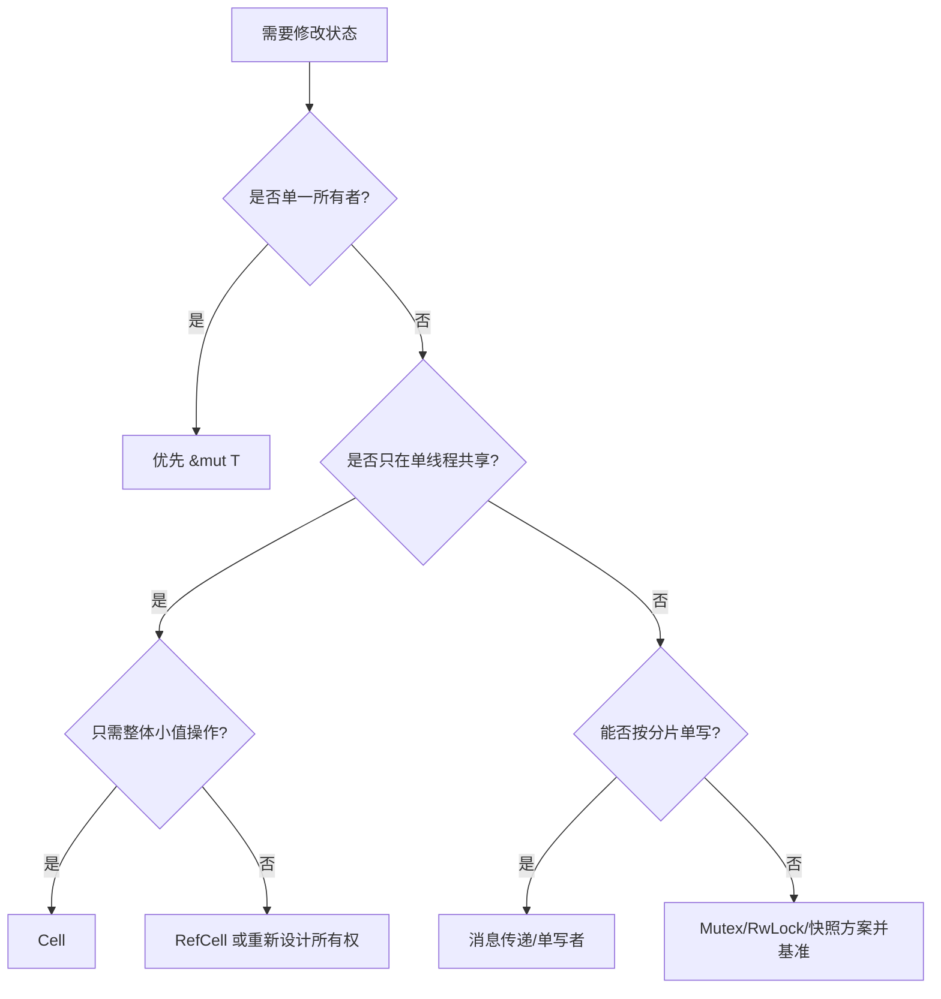

# 内部可变性：从 `Cell` 到 `Mutex`

内部可变性（Interior Mutability）允许通过共享引用 `&T`，在受控规则下修改内部状态。它不是绕过借用检查的“小技巧”，而是把“何时允许修改”交给具体类型在运行期或安全封装中维护。

> **本章目标**：区分 `Cell`、`RefCell`、`Mutex`、`RwLock` 与 `UnsafeCell`；理解它们分别把独占性放在哪里检查；知道单所有者状态应优先使用普通 `&mut T`。

## 1. 先问：真的需要内部可变性吗

若事件循环独占一个策略，最直接的 API 是：

```rust
struct Strategy {
    call_count: u64,
}

impl Strategy {
    fn on_tick(&mut self) {
        self.call_count += 1;
    }
}
```

`&mut self` 清楚表达唯一写者，不需要运行期检查。只有当外部接口必须暴露 `&self`、对象需要共享所有权，或缓存/计数不属于逻辑状态时，才考虑内部可变性。

典型例子是只读查询对象中的 memoization 缓存：调用者看到的业务语义不变，但实现会记录已计算结果。这常被称为“逻辑不可变、物理可变”。

## 2. `UnsafeCell<T>`：语言认可的底层原语

普通 `&T` 指向的数据不能被修改；`UnsafeCell<T>` 是 Rust 用来表示“共享引用下内容可能变化”的底层原语。`Cell`、`RefCell`、`Mutex` 和许多原子/无锁封装最终都会在合适边界使用它。

```rust
use std::cell::UnsafeCell;

let cell = UnsafeCell::new(42_u64);
let ptr = cell.get();

// SAFETY: 这个局部示例没有其他引用或并发访问。
// 一旦跨线程或存在别名，调用者必须额外证明同步与生命周期。
unsafe { *ptr = 100 };
```

`UnsafeCell` 只改变别名/可变性的编译器假设，不提供锁、原子性、线程同步或生命周期管理。实现 `unsafe impl Sync` 时，库作者必须自己证明所有并发访问安全。

## 3. `Cell<T>`：整体取值或替换

`Cell<T>` 不返回对内部值的普通引用，而是让你整体 `set`、`replace`、`take`；`get` 只在 `T: Copy` 时可用。它不是“只能装 Copy 类型”。

```rust
use std::cell::Cell;

struct Counters {
    seen: Cell<u64>,
}

impl Counters {
    fn observe(&self) {
        self.seen.set(self.seen.get() + 1);
    }
}
```

对 `u64`，优化后的代码通常接近普通加载、加法和存储，但这不是原子操作，也不是跨线程同步。`Cell<T>` 通常不是 `Sync`，因此编译器会阻止多个线程通过共享引用并发访问。

适用场景：

- 单线程回调接口只给 `&self`，内部维护小计数或标志；
- 一个线程拥有的状态机需要暂时取出/替换值；
- 明确不跨线程，且不需要借用内部字段。

若你可以改 API，普通 `&mut self` 往往更直观。

## 4. `RefCell<T>`：把借用规则移到运行期

`RefCell<T>` 在运行期记录当前有多少共享借用、是否有可变借用：

```rust
use std::cell::RefCell;

let values = RefCell::new(vec![1_u64, 2]);
values.borrow_mut().push(3);

let first = values.borrow();
// let second = values.borrow_mut(); // 运行时冲突，会 panic。
assert_eq!(first[0], 1);
```

- `borrow`/`borrow_mut` 冲突时会 panic；
- `try_borrow`/`try_borrow_mut` 返回 `Result`，适合不希望 panic 的边界；
- 每次借用需要检查并更新状态；
- 它通常不是 `Sync`，不能作为多线程同步方案。

低延迟热路径是否能用，要看借用频率、分支可预测性与错误策略。更重要的是：复杂嵌套借用容易造成运行期故障，能通过所有权拆分解决时，应优先让编译器检查。

## 5. `Mutex<T>`：跨线程的独占访问

`Mutex<T>` 在安全 API 内通过同步保护 `T`。线程拿到 guard 后才能访问数据；guard 离开作用域时解锁。

```rust
use std::sync::Mutex;

let position = Mutex::new(0_i64);
{
    let mut guard = position.lock().expect("mutex poisoned");
    *guard += 10;
}
```

成本取决于实现和竞争：无竞争快路径可能只需原子操作；竞争后可能自旋、进入内核等待或被调度。真正危险的通常是长临界区、持锁 I/O、锁顺序不一致和高优先级线程等待低优先级线程。

`std::sync::Mutex<T>` 的跨线程 trait 条件可简化记为：内部值必须能安全转移给持锁线程（通常需要 `T: Send`）；`T` 不必自己是 `Sync`，因为锁保证同一时刻只暴露一个 `&mut T`。

## 6. `RwLock<T>`：多读或单写

`RwLock` 允许多个读者或一个写者。它不自动比 `Mutex` 快：

- 每次读仍要更新/检查共享同步状态；
- 写者可能等待已有读者；公平性与饥饿策略依实现/平台而异；
- 读临界区很短时，额外管理成本可能超过并行收益；
- 配置读极多、更新很少且读工作较长时，才可能合适。

对低延迟只读配置，常见替代是不可变快照 + 原子整体替换；对订单状态，按线程/标的分片的单写者模型往往更容易推理。

## 7. 对照表

| 类型 | 独占规则在哪里保证 | 跨线程共享 | 失败/等待方式 | 典型用途 |
|---|---|---|---|---|
| `&mut T` | 编译期 | 由所有权边界决定 | 编译不通过 | 单所有者状态，优先选择 |
| `Cell<T>` | 不暴露内部引用，整体操作 | 通常不可 `Sync` | 无动态借用冲突 | 单线程小状态 |
| `RefCell<T>` | 运行期借用计数 | 不可 `Sync` | 冲突可 panic 或返回错误 | 单线程复杂借用 |
| `Mutex<T>` | 锁 + guard | 满足 trait 条件时可以 | 等待、poison/错误策略 | 通用跨线程独占状态 |
| `RwLock<T>` | 读写锁状态 | 满足 trait 条件时可以 | 等待、实现相关公平性 | 读多写少且读临界区有价值 |
| `UnsafeCell<T>` | 调用者/封装自行证明 | 自身不提供 | 错误可能导致 UB | 构建安全抽象的底层原语 |

## 8. HFT 选型思路



不要因为 `Cell` 看起来快就把结构体每个字段都包一层。这样可能削弱不变量：多个字段本应一起更新，却被拆成可观察的中间状态。交易状态优先保持事务边界清晰。

## 面试现场

### Q1：`UnsafeCell` 为什么特殊？

**参考答法**：它告诉编译器内部值可能通过共享引用被修改，是构建内部可变性抽象的语言原语；但不提供同步或安全保证。安全封装仍要证明别名、线程、生命周期和内存顺序。

### Q2：`Cell<T>` 是否零开销、线程安全？

**参考答法**：它没有 `RefCell` 的动态借用计数，简单 get/set 常优化为普通访存；但仍有实际加载/存储，不是原子同步，并且通常不是 `Sync`。适合单线程共享引用下的小状态。

### Q3：为什么读多不代表应使用 `RwLock`？

**参考答法**：读者也操作共享锁状态；写者等待和公平策略会影响尾延迟。要比较临界区长度、读写比例、竞争拓扑和快照替代方案，而不是只看“读多”。

## 易错点

- 本可使用 `&mut self`，却为了方便滥用内部可变性；
- 认为 `Cell<T>` 只能存 `Copy` 类型；
- 把 `Cell` 当原子计数器跨线程；
- 用 `borrow_mut` 的 panic 作为正常控制流；
- 持锁执行日志、网络或未知回调；
- 把多个必须原子更新的业务字段拆成独立 `Cell`。

## 小结

内部可变性的核心问题是：谁证明独占性。`&mut T` 让编译器证明，`RefCell` 在运行期检查，`Mutex` 用跨线程同步保证，`UnsafeCell` 则把全部证明责任交给封装作者。低延迟系统优先让所有权结构消除共享；确实需要共享时，再选择最简单且可验证的机制。
