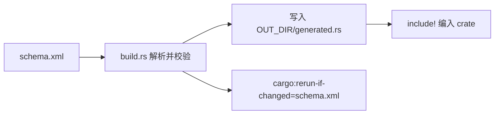

# 宏编程实战：让重复代码可审计

宏的价值不是“炫技”，而是把机械、重复、容易抄错的代码交给编译器生成。在二进制协议解析中，它尤其适合批量生成字段访问器和消息分派表。

但先纠正一个重要误解：**宏不是天然安全的**。宏能生成安全 Rust，也能生成逻辑错误、`panic!`，甚至 `unsafe` 代码。过程宏和 `build.rs` 还是构建时会执行的程序，依赖来源必须可信。

> **面试优先级**：P0 是说清宏与函数的区别、`macro_rules!` 解决什么重复语法问题，以及展开结果仍会接受类型检查；P1 是能读懂一个简单重复模式；过程宏、卫生细节和外部 schema 生成器属于 P2。除非简历写了宏框架，不要求现场手写复杂过程宏。

## 1. 宏与函数的边界

函数接收运行时的值；宏接收 Rust 语法片段（token），在编译过程中展开为新的 Rust 代码。宏展开后生成的代码仍可能在运行时做计算、分配内存或发起 I/O。

| 能力 | 函数 | 宏 |
|---|---|---|
| 处理普通运行时值 | 擅长 | 生成处理这些值的代码 |
| 接受不同数量或形状的语法 | 不直接支持 | 擅长 |
| 由类型系统检查函数体一次 | 是 | 每个展开结果都会被检查 |
| 自动获得“零运行时开销” | 否 | 否 |

`println!("price = {}", price)` 使用宏，不只是因为参数数量可变，还因为它能解析格式字符串并生成对应的格式化参数代码。普通 Rust 函数的参数个数和类型必须由函数签名固定。

## 2. `macro_rules!`：按语法模式生成代码

下面是一个教学版 `vec!`：

```rust
macro_rules! my_vec {
    ($($value:expr),* $(,)?) => {{
        let mut values = Vec::new();
        $(values.push($value);)*
        values
    }};
}

fn main() {
    let values = my_vec![1, 2, 3,];
    assert_eq!(values, vec![1, 2, 3]);
}
```

读法如下：

- `$value:expr` 匹配一个表达式；
- `$(...),*` 表示用逗号分隔、重复零次或多次；
- `$(,)?` 允许最后再有一个逗号；
- 每个表达式只出现在一次 `push` 中，因此这个版本不会重复求值。

真实项目应优先使用标准库的 `vec!`。自己写宏时，至少要测试空输入、尾逗号、带副作用表达式是否只求值一次，以及错误输入能否给出可读的编译错误。

## 3. 安全生成二进制字段访问器

协议 getter 的危险版本经常长这样：对 `buffer.as_ptr().add(offset)` 做 `read_unaligned`，然后直接返回任意 `$ty`。它至少遗漏了四件事：

1. 缓冲区是否足够长；
2. `offset + width` 是否溢出；
3. 协议是大端还是小端；
4. 目标类型是否允许任意位模式，例如 `bool` 并非任意字节都有效。

下面的宏只生成**显式字节序的整数读取**，并把越界变成普通错误：

```rust
use std::convert::TryInto;

#[derive(Debug, PartialEq, Eq)]
pub enum DecodeError {
    OffsetOverflow {
        field: &'static str,
    },
    Truncated {
        field: &'static str,
        needed: usize,
        actual: usize,
    },
}

fn read_array<const N: usize>(
    buffer: &[u8],
    offset: usize,
    field: &'static str,
) -> Result<[u8; N], DecodeError> {
    let end = offset
        .checked_add(N)
        .ok_or(DecodeError::OffsetOverflow { field })?;

    let bytes = buffer.get(offset..end).ok_or(DecodeError::Truncated {
        field,
        needed: end,
        actual: buffer.len(),
    })?;

    bytes.try_into().map_err(|_| DecodeError::Truncated {
        field,
        needed: end,
        actual: buffer.len(),
    })
}

macro_rules! be_integer_field {
    ($name:ident, $ty:ty, $offset:expr, $width:literal, $decode:path) => {
        #[inline]
        pub fn $name(&self) -> Result<$ty, DecodeError> {
            let bytes = read_array::<$width>(
                self.buffer,
                $offset,
                stringify!($name),
            )?;
            Ok($decode(bytes))
        }
    };
}

pub struct MdHeader<'a> {
    buffer: &'a [u8],
}

impl<'a> MdHeader<'a> {
    pub fn new(buffer: &'a [u8]) -> Self {
        Self { buffer }
    }

    be_integer_field!(seq_num, u64, 0, 8, u64::from_be_bytes);
    be_integer_field!(timestamp, u64, 8, 8, u64::from_be_bytes);
    be_integer_field!(msg_type, u16, 16, 2, u16::from_be_bytes);
}

#[cfg(test)]
mod tests {
    use super::*;

    #[test]
    fn decodes_big_endian_fields() {
        let mut bytes = [0_u8; 18];
        bytes[0..8].copy_from_slice(&42_u64.to_be_bytes());
        bytes[8..16].copy_from_slice(&99_u64.to_be_bytes());
        bytes[16..18].copy_from_slice(&7_u16.to_be_bytes());

        let header = MdHeader::new(&bytes);
        assert_eq!(header.seq_num(), Ok(42));
        assert_eq!(header.timestamp(), Ok(99));
        assert_eq!(header.msg_type(), Ok(7));
    }

    #[test]
    fn rejects_truncated_input() {
        let bytes = [0_u8; 8];
        let header = MdHeader::new(&bytes);

        assert_eq!(
            header.timestamp(),
            Err(DecodeError::Truncated {
                field: "timestamp",
                needed: 16,
                actual: 8,
            })
        );
    }
}
```

这个版本没有 `unsafe`，并且端序直接写在函数名 `from_be_bytes` 中。把小数组从切片复制出来不等于一定很慢；在优化构建中，编译器常能把固定宽度读取降低为合适的加载指令。是否满足目标延迟仍要看生成代码和基准测试。

若协议明确使用小端，应改为 `from_le_bytes`。不要使用 `from_ne_bytes` 读取网络协议，因为它依赖运行程序的机器端序。

## 4. 三种代码生成方式怎么选？

| 方式 | 输入 | 适合做什么 | 主要限制与风险 |
|---|---|---|---|
| `macro_rules!` | Rust token 模式 | 小范围重复、固定语法模板 | 难做复杂解析，错误信息需设计 |
| 过程宏 | `TokenStream` | `derive`、属性、函数式 DSL | 是构建时程序；看不到完整的类型检查语义 |
| `build.rs` | 文件、环境变量、外部工具输出 | XML/JSON/SBE 等外部 schema 代码生成 | 必须管理重建条件、输出目录和可复现性 |

过程宏分三类：

1. 派生宏：`#[derive(MyDecode)]`；
2. 属性宏：`#[my_message(id = 1)]`；
3. 函数式过程宏：`message_schema!(...)`。

过程宏理论上可以访问文件系统，但把一个隐藏的外部文件依赖塞进过程宏，容易让增量构建和重建条件变得不透明。对于交易所 XML schema，`build.rs` 往往更自然：



一个可维护的 SBE 生成流程通常还会：

- 对未知字段类型、重复消息 ID 和偏移重叠立即报错；
- 为生成代码添加 schema 版本和生成器版本；
- 只写入 Cargo 提供的 `OUT_DIR`，或把生成文件明确签入版本库；
- 输出 `cargo:rerun-if-changed=...`；
- 对真实交易所样本做解码回归测试，而不只测试宏能展开。

## 5. 宏的安全边界

### `macro_rules!` 仍能生成危险代码

调用位置最终会对展开代码做语法和类型检查，但宏完全可以展开出 `unsafe` 块。安全性来自展开后代码满足 Rust 的规则，以及作者正确维护 `unsafe` 不变量，而不是来自“它是宏”。

### 过程宏与 `build.rs` 属于供应链的一部分

它们在构建机器上运行，可能读取环境变量和文件，也可能启动子进程。添加这类依赖相当于信任一段构建时程序。生产环境应锁定依赖、审查来源，并在受限且可复现的构建环境中运行。

### 宏不会自动消除运行时成本

宏只是生成代码。若展开结果调用 `Vec::new()`、格式化字符串或做边界检查，这些操作仍然存在。宏还可能重复展开大段逻辑，增加机器码和指令缓存压力。

## 6. 怎样测试宏？

宏测试至少分三层：

1. **行为测试**：像上面的测试一样，调用生成的方法，覆盖正确输入、截断、端序和边界值；
2. **编译失败测试**：验证错误写法会失败，并给出可理解的信息，常用 `trybuild` 一类工具；
3. **展开检查**：调试时用 `cargo expand` 查看生成代码，但快照不应替代行为测试。

对于过程宏，还应在普通测试 crate 中做集成测试，因为过程宏定义 crate 不能像普通函数那样在自身代码中随意使用自己刚定义的宏。

## 7. 高频误区

### 误区一：宏在编译期运行，所以没有运行时成本

宏的**展开**发生在编译期；展开出来的代码照常在运行时执行。

### 误区二：过程宏能读取 Rust 的所有类型信息

过程宏主要接收和输出 token。它不是完整的编译器类型查询接口，不能随意询问某个表达式类型检查后的真实类型。

### 误区三：`read_unaligned` 就是安全的零拷贝解析

`read_unaligned` 只解决地址未对齐的问题，不负责长度、端序、指针有效性或目标类型位模式。

### 误区四：生成代码通过编译就说明协议实现正确

编译器不知道交易所 schema 的业务语义。字段偏移、端序、版本和可选字段仍需要样本与回归测试验证。

## 8. 面试题

### Q1：什么时候选 `macro_rules!`，什么时候选过程宏？

简单 token 重复和局部模板优先 `macro_rules!`；需要解析自定义 Rust 语法、实现 `derive` 或属性时选过程宏。外部 schema 驱动的大规模代码生成通常更适合 `build.rs` 或独立生成器。

### Q2：为什么安全函数里也可能隐藏宏带来的 `unsafe` 风险？

宏可以把 `unsafe` 展开进函数体。调用者看到的是安全 API，但宏作者必须证明边界、对齐、生命周期和位模式等不变量始终成立。

### Q3：网络协议 getter 为什么应显式使用 `from_be_bytes` 或 `from_le_bytes`？

协议端序由协议定义，而 `from_ne_bytes` 使用运行机器的本地端序。同一份代码换到不同架构可能得到不同结果。

### Q4：宏生成 getter 后，最重要的测试是什么？

不是“能编译”，而是用已知字节样本验证每个字段的值，并覆盖截断、边界、端序和 schema 版本变化。

## 9. 小结

- 宏是代码生成工具，不是安全边界，也不自动保证零成本。
- 二进制解析首先要正确处理长度、整数溢出、端序和有效位模式，再谈消除拷贝。
- Rust 语法驱动的生成适合宏；外部 schema 驱动的生成通常适合 `build.rs` 或独立工具。
- 测试展开后的行为与错误路径，比只观察宏展开文本更重要。
