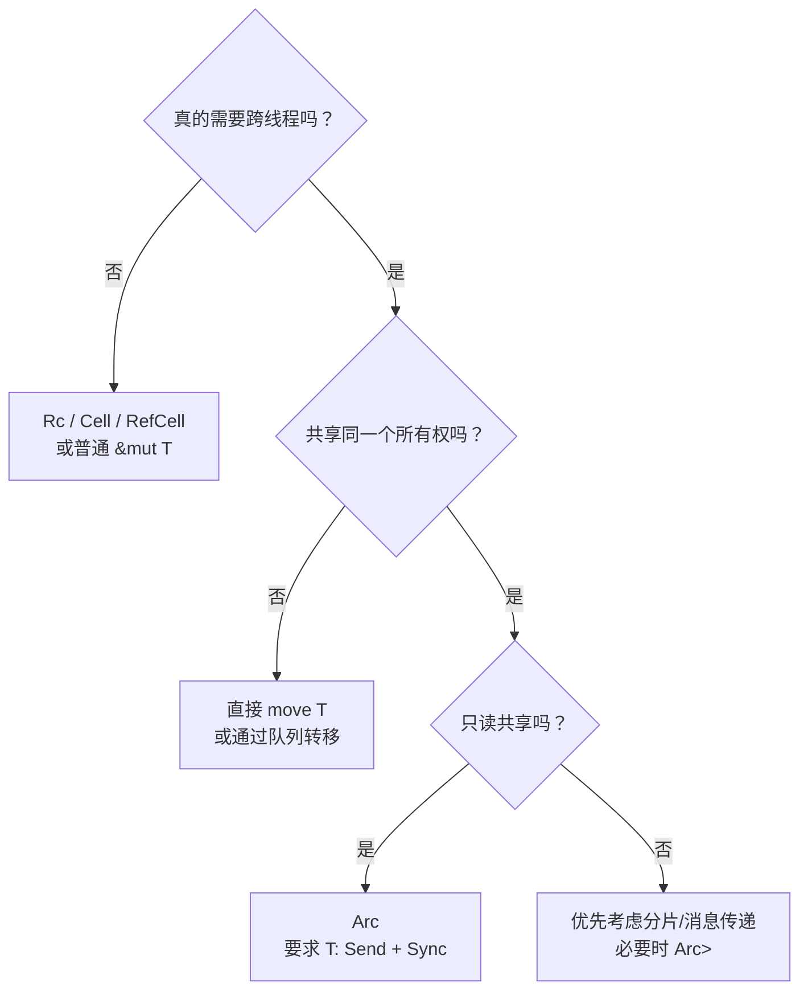

# Send 与 Sync 的本质 (Send & Sync)

`Send` 和 `Sync` 没有任何方法，也不会自动加锁，却决定了一个类型能否穿过线程边界。理解它们不能靠口诀，而要从**所有权转移**与**共享引用**推导 trait bound。

## 1. 两个定义，一条公式

`Send` 与 `Sync` 都是 `unsafe auto trait`：

- **`T: Send`**：把一个 `T` 的所有权移动到另一个线程，并在那个线程使用、销毁，是安全的；
- **`T: Sync`**：多个线程共享 `&T` 是安全的；
- **核心等价关系**：`T: Sync` 当且仅当 `&T: Send`。

这里有三个容易忽略的词：

1. **移动**不等于复制。原线程失去那个值，但类型内部可能还有共享资源；
2. **共享**指共享引用 `&T`，不是说所有方法都能并发调用；
3. **销毁**也算使用。一个线程亲和的句柄即便“只移动不访问”，在目标线程执行 `Drop` 仍可能违规。

`auto trait` 表示编译器会根据字段递归推导。例如结构体所有相关字段都是 `Send`，它通常也自动是 `Send`。`unsafe trait` 表示其他 unsafe 代码可以依赖这个结论；手写错误的 `unsafe impl Send/Sync` 可能导致未定义行为。

## 2. 用“谁能碰底层状态”来推导

### 2.1 为什么 `Rc<T>` 既不是 Send，也不是 Sync

`Rc` 的多个克隆共享同一个**非原子引用计数**。即使你只把其中一个克隆 move 到线程 B，线程 A 仍可能保留另一个克隆。两边同时 clone/drop 会并发修改同一个普通计数，造成数据竞争，甚至提前释放。

所以“move 后原线程就没有了”只对**那个 Rc 句柄**成立，不代表底层分配只有一个所有者。

### 2.2 为什么 `Cell<T>` / `RefCell<T>` 可以 Send，却不是 Sync

它们都基于 `UnsafeCell<T>` 提供内部可变性，却没有跨线程同步：

- 整个容器被 move 到另一个线程后，若 `T: Send`，仍只有一个线程访问，所以可以 `Send`；
- 若共享 `&Cell<T>` 或 `&RefCell<T>`，多个线程能无锁修改值或借用状态，所以不是 `Sync`。

`RefCell` 的“运行时借用检查”只解决单线程内的别名规则，不是线程同步器。

### 2.3 为什么 `Arc<T>` 不是万能线程安全包装

`Arc` 只把**引用计数**做成原子操作。它不会自动保护 `T`：

```rust
// Arc<RefCell<u64>> 仍不能在线程间共享，因为 RefCell<u64>: !Sync。
// let shared = Arc::new(RefCell::new(0_u64));

// 需要共享可变状态时，保护数据的是 Mutex，Arc 只负责共享所有权。
let shared = std::sync::Arc::new(std::sync::Mutex::new(0_u64));
```

精确地说，`Arc<T>` 要成为 `Send + Sync`，通常要求 `T: Send + Sync`。因此，“把 `Rc` 换成 `Arc` 就线程安全”是不完整的。

### 2.4 为什么 `Mutex<T>: Sync` 只要求 `T: Send`

通过共享的 `&Mutex<T>`，线程 A 可以加锁后修改 `T`，线程 B 随后也可以加锁，并可用 `mem::replace` 把 `T` 移出。这等价于通过 Mutex 把 `T` 在线程间交接，因此 `T` 至少必须是 `Send`。

它不一定要是 `Sync`，因为锁保证同一时刻只有一个线程取得 `&mut T`。例如 `Mutex<Cell<u64>>` 可以跨线程共享：`Cell` 是 `Send` 但不是 `Sync`，外层 Mutex 补上了同步。

`RwLock<T>` 的条件更强：多个读者可同时拿到 `&T`，所以跨线程共享时通常还需要 `T: Sync`。

## 3. 常见类型的精确结论

下表中的条件才是重点；✅ 不是无条件成立。

| 类型 | 何时是 `Send` | 何时是 `Sync` | 关键原因 |
| :--- | :--- | :--- | :--- |
| `Box<T>` | `T: Send` | `T: Sync` | 独占所有权，边界跟随内部 T |
| `Rc<T>` | 从不 | 从不 | 共享的非原子引用计数 |
| `Arc<T>` | `T: Send + Sync` | `T: Send + Sync` | 计数原子化，但仍可跨线程取得 `&T` |
| `Cell<T>` | `T: Send` | 从不 | 无同步的内部可变性 |
| `RefCell<T>` | `T: Send` | 从不 | 借用状态不是线程同步器 |
| `Mutex<T>` | `T: Send` | `T: Send` | 锁把对 T 的访问串行化 |
| `RwLock<T>` | `T: Send` | `T: Send + Sync` | 写者会移动/修改 T，多个读者会共享 `&T` |
| `AtomicU64` 等 | 是 | 是 | 类型自身定义了原子并发访问 |
| `*const T` / `*mut T` | 从不自动实现 | 从不自动实现 | 裸指针没有所有权与并发保护信息 |
| `&T` | `T: Sync` | `T: Sync` | 移动/共享引用都会让别处取得 `&T` |
| `&mut T` | `T: Send` | `T: Sync` | 独占引用可转移；共享 `&&mut T` 只能共享读能力 |

可以用只在编译期存在的断言验证你的推导：

```rust
use std::cell::Cell;
use std::sync::Mutex;

fn assert_send<T: Send>() {}
fn assert_sync<T: Sync>() {}

fn verify_bounds() {
    assert_send::<Cell<u64>>();
    // assert_sync::<Cell<u64>>(); // 编译失败：Cell<u64> 不是 Sync
    assert_sync::<Mutex<Cell<u64>>>();
}
```

这些 marker trait 本身没有运行时成本。真正的成本来自为了满足并发协议而选择的原子计数、锁、队列与缓存一致性流量。

## 4. `unsafe impl Send/Sync` 到底承诺了什么

看到裸指针或 FFI 句柄时，编译器通常不会自动推导 Send/Sync。此时不能因为“我想放进 `thread::spawn`”就加两行 `unsafe impl`。

### 4.1 Send 审核清单

若要 `unsafe impl Send for MyType`，至少回答：

- 底层资源能否在另一个线程访问？
- 分配与释放能否发生在不同线程？
- 类型内部是否还存在别名指向同一资源？
- FFI 库是否要求 create/use/destroy 在同一线程？
- 泛型参数是否需要 `T: Send`？

### 4.2 Sync 审核清单

若要 `unsafe impl Sync for MyType`，还要回答：

- 从多个 `&MyType` 能调用哪些方法？
- 是否能触达可变裸内存或 `UnsafeCell`？
- 并发读写由锁、原子还是单写者协议保护？
- 生命周期、回收与 ABA 如何处理？
- 泛型参数是否需要 `T: Sync` 或 `T: Send + Sync`？

安全注释应描述这些不变量，而不是写“测试通过”。测试很难枚举所有线程交错。

### 4.3 有意让类型保持线程亲和

有些外部资源要求“在哪个线程创建，就在哪个线程使用或销毁”。例如图形上下文、部分设备队列、事件循环句柄和线程本地内存池。即便句柄只是一个整数，也可以用零大小的**标记字段**（marker field）阻止编译器自动推导 `Send`/`Sync`：

```rust
use std::marker::PhantomData;
use std::rc::Rc;

struct ThreadLocalSession {
    handle: u32,
    // Rc 是 !Send + !Sync；PhantomData 不占运行时空间，但影响 auto trait 推导。
    _thread_bound: PhantomData<Rc<()>>,
}
```

这不是“和编译器作对”，而是把外部系统的线程亲和约束写进类型系统。

## 5. 与 Async Rust 的连接

多线程 executor 可能在两次 `poll` 之间把 Future 移到另一个 worker，因此 `tokio::spawn` 要求 Future 是 `Send`。决定 Future 是否 `Send` 的，主要是**哪些状态跨过了 `.await` 并被保存在 Future 中**。

```rust,edition2021
fn use_value<T>(_: &T) {}

async fn something() {}

async fn ok() {
    {
        let local = std::rc::Rc::new(1);
        use_value(&local);
    } // Rc 在 await 前销毁，不再是 Future 的挂起状态
    something().await;
}

fn assert_send<T: Send>(_: T) {}

fn main() {
    // 若 Rc 仍跨越 await，这个编译期断言就不会通过。
    assert_send(ok());
}
```

若 `Rc` 活过 `.await`，这个 Future 通常就是 `!Send`，不能交给 `tokio::spawn`；可考虑缩小变量作用域，或在 `LocalSet` 上使用 `spawn_local`。不要条件反射地把所有 `Rc` 改成 `Arc`，先问它是否真的需要跨线程。

## 6. 从类型安全到系统代价

- `Arc<T>: Send + Sync` 只证明内存安全，不证明 clone/drop 便宜；热点引用计数会产生缓存行流量；
- `Mutex<T>: Sync` 只证明正确加锁时安全，不证明没有阻塞、优先级反转或尾延迟尖刺；
- 无锁结构含 `unsafe impl Sync` 只是一份证明责任，不代表 wait-free；
- 一种常见的简化方法是减少共享：按租户、模型分片或业务键划分状态，让一个线程拥有一份状态，再通过队列转移消息。

选择容器时可按下面的顺序思考：



## 做题方法

判断类型能否跨线程时，不从类型名猜，而是递归审计其底层状态：

1. `Send` 问的是“把这个值的所有权移动到另一线程是否安全”；`Sync` 问的是“多个线程持有 `&T` 是否安全”。先把两个问题分开。
2. 展开结构体每个字段，追踪裸指针、`UnsafeCell`、`Rc`、`Cell/RefCell`、锁和原子类型；自动 trait 通常由字段组合推导。
3. 为跨线程操作画状态：移动值后原线程还剩什么访问路径，共享 `&T` 时哪些方法能改变底层状态，这些改变怎样同步。
4. Future 题找出每个 `.await` 前创建且在之后仍会使用的局部值；它们会保存在 Future 状态中，决定整个 Future 是否 `Send`。
5. `unsafe impl Send/Sync` 必须写出不变量、同步方式、别名规则和析构并发边界；“内部用了锁”还要证明所有访问都经过这把锁。
6. 用 `fn assert_send<T: Send>() {}`、`assert_sync` 等编译期断言验证推导，但断言只能确认实现存在，不能替代 unsafe 正确性证明。

若一个 `&T` 能调用的方法可在没有同步的情况下修改共享内存，`T: Sync` 就值得怀疑；若移动后仍有原线程可用的非同步别名，`T: Send` 就值得怀疑。

## 7. 面试快问快答

### Q1：`Arc<RefCell<T>>` 为什么不线程安全？

Arc 只保护引用计数；多个线程仍可通过共享引用触达 RefCell 的非原子借用状态，所以内部 `RefCell<T>: !Sync` 阻止整个 Arc 跨线程共享。

### Q2：`MutexGuard` 能不能移到另一个线程？

不能笼统回答。标准库的 guard 通常是 `!Send`，因为某些平台要求锁在获取它的线程解锁。判断一个 guard 必须查具体类型的 trait 实现，而不是从 `Mutex<T>: Sync` 反推。

### Q3：`Send + Sync` 是否表示可以无锁并发修改？

不表示。它只说明类型公开的安全 API 在相应线程边界下不会造成未定义行为。API 可能在内部加锁、使用原子，也可能根本不提供修改入口。

### Q4：为什么手写 `unsafe impl Sync` 风险大？

因为其他 unsafe 代码会无条件信任这份承诺。若遗漏某个别名、Drop 线程、泛型边界或回收竞态，安全调用者也可能触发未定义行为。

## 8. 三类系统中的应用

| 场景 | `Send` / `Sync` 需要回答的问题 |
| --- | --- |
| 传统后端 | 连接池、缓存或请求状态能否被工作线程共享？内部可变状态由什么同步？ |
| AI Infra | 设备上下文、张量句柄或执行流是否具有线程亲和性？销毁能否发生在别的线程？ |
| HFT | 行情会话、订单状态或线程本地内存池由哪个线程拥有？是否可以用分片和消息传递减少共享？ |

这些问题都先由资源本身的并发规则决定，不能只看句柄是不是整数，也不能只靠包一层 `Arc` 推断。

## 9. 本章小结

- `Send` 是所有权可跨线程转移，`Sync` 是 `&T` 可跨线程共享；
- 从底层共享状态与公开 API 推导，不要只背类型名单；
- `Arc` 解决共享所有权，不自动解决内部数据同步；
- `unsafe impl` 是需要逐条证明的不变量合同；
- 类型“线程安全”和系统“运行成本可接受”是两个不同问题。

权威参考：[Rust 标准库 `Send`](https://doc.rust-lang.org/std/marker/trait.Send.html)、[`Sync`](https://doc.rust-lang.org/std/marker/trait.Sync.html) 与 [Rustonomicon: Send and Sync](https://doc.rust-lang.org/nomicon/send-and-sync.html)。
