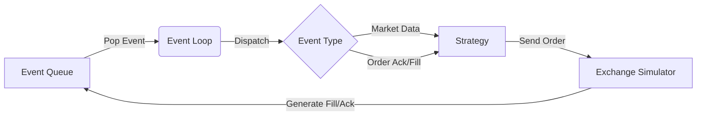

# 事件驱动回测引擎 (Event-Driven Backtesting)

回测（Backtesting）用于在历史或生成数据上检验策略。向量化回测（Vectorized Backtesting，如表格上的批量计算）很适合快速研究收益序列；但当问题涉及订单生命周期、延迟、队列位置和市场微观结构时，它通常无法单独回答这些问题。

这时需要**事件驱动（Event-Driven）**回测：按时间顺序处理行情、订单和回报事件，并明确模拟精度的边界。它能表达更多交互，但不会自动变成“和真实交易所完全一样”。

## 1. 核心架构

事件驱动回测的核心思想是：**系统状态只在事件发生时改变**。事件时间可以是纳秒整数，但这不代表输入真的具有纳秒精度；不要伪造数据源没有提供的精度。



### 1.1 统一的事件定义

为了让策略代码在回测和实盘中复用，我们需要抽象出统一的事件接口。下面使用最小领域类型，并实现可独立编译的优先队列；真实项目再把空结构替换成协议消息。

```rust
use std::cmp::Ordering;
use std::collections::BinaryHeap;

#[derive(Debug, PartialEq, Eq)]
pub struct MarketData;

#[derive(Debug, PartialEq, Eq)]
pub struct OrderAck;

#[derive(Debug, PartialEq, Eq)]
pub struct Fill;

#[derive(Debug, PartialEq, Eq)]
pub enum Event {
    MarketData(MarketData),
    OrderAck(OrderAck),
    OrderFill(Fill),
    Timer(u64), // 模拟定时器
}

// 这是一个 PriorityQueue，按时间戳排序
#[derive(Debug)]
pub struct EventQueue {
    queue: BinaryHeap<Scheduled>,
    next_ordinal: u64,
}

#[derive(Debug, Clone, Copy, PartialEq, Eq, PartialOrd, Ord)]
pub enum Phase {
    MarketData,
    ExchangeArrival,
    ExchangeResponse,
    StrategyTimer,
}

#[derive(Debug)]
struct Scheduled {
    timestamp: u64,
    phase: Phase,
    // 同 timestamp/phase 时保持插入顺序，保证回测可重复。
    ordinal: u64,
    event: Event,
}

impl PartialEq for Scheduled {
    fn eq(&self, other: &Self) -> bool {
        (self.timestamp, self.phase, self.ordinal)
            == (other.timestamp, other.phase, other.ordinal)
    }
}

impl Eq for Scheduled {}

impl PartialOrd for Scheduled {
    fn partial_cmp(&self, other: &Self) -> Option<Ordering> {
        Some(self.cmp(other))
    }
}

// BinaryHeap 是最大堆，因此反转排序键，让最早事件先 pop。
impl Ord for Scheduled {
    fn cmp(&self, other: &Self) -> Ordering {
        (other.timestamp, other.phase, other.ordinal)
            .cmp(&(self.timestamp, self.phase, self.ordinal))
    }
}

impl EventQueue {
    pub fn new() -> Self {
        Self {
            queue: BinaryHeap::new(),
            next_ordinal: 0,
        }
    }

    pub fn schedule(&mut self, timestamp: u64, phase: Phase, event: Event) {
        let ordinal = self.next_ordinal;
        self.next_ordinal = self
            .next_ordinal
            .checked_add(1)
            .expect("event ordinal exhausted");
        self.queue.push(Scheduled { timestamp, phase, ordinal, event });
    }

    pub fn pop(&mut self) -> Option<(u64, Phase, Event)> {
        self.queue
            .pop()
            .map(|item| (item.timestamp, item.phase, item.event))
    }
}

fn main() {
    let mut queue = EventQueue::new();
    queue.schedule(10, Phase::ExchangeResponse, Event::Timer(2));
    queue.schedule(10, Phase::MarketData, Event::Timer(1));

    let (timestamp, phase, event) = queue.pop().unwrap();
    assert_eq!(timestamp, 10);
    assert_eq!(phase, Phase::MarketData);
    assert_eq!(event, Event::Timer(1));
}
```

只按 timestamp 排序是不够的。行情、timer、订单到达和成交回报可能拥有相同时间戳；不同处理顺序会改变策略看到的状态。`Phase` 没有普遍正确的固定顺序，必须根据仿真契约定义，并用测试锁定。

## 2. 交易所模拟器 (Exchange Simulator)

这是回测引擎中最复杂、也最容易产生虚假收益的部分。它至少需要模拟：

1.  **撮合逻辑 (Matching Logic)**: 模拟中央限价订单簿 (CLOB)。
2.  **延迟模拟 (Latency Simulation)**: 模拟网络传输延迟和交易所处理延迟。
3.  **订单生命周期**: Ack、reject、partial fill、cancel/fill race 与断线恢复。
4.  **队列位置**: 价格被触及不等于你的被动单一定成交；必须对前方数量和隐藏流动性做假设。

下面是连接订单簿、延迟模型与主事件队列的**多模块骨架**，省略了项目自己的 `OrderBook`、订单类型和 context trait，所以保留 `rust,ignore`。接入项目后，用 `cargo test exchange_simulator` 验证到达时间、reject、部分成交和 cancel/fill race，而不是只检查代码能编译。

```rust,ignore
pub struct ExchangeSimulator {
    // 模拟的订单簿
    order_book: OrderBook,
    // 延迟模型
    latency_model: Box<dyn LatencyModel>,
    // 待处理的事件队列（指向主事件循环）
    event_queue: Rc<RefCell<EventQueue>>,
}

impl ExchangeContext for ExchangeSimulator {
    fn send_order(&mut self, order: NewOrder) -> Result<OrderId, RejectReason> {
        // 1. 计算延迟
        let now = self.current_time();
        let latency = self.latency_model.next_latency();
        let arrival_time = now + latency;

        // 2. 将订单到达事件推入队列
        // 注意：这里我们模拟的是“订单到达交易所”这个事件，而不是立即成交
        self.schedule_event(arrival_time, InternalEvent::OrderArrival(order));
        
        Ok(order.id) // 立即返回，就像异步发送一样
    }
}
```

### 2.1 延迟模型

HFT 回测必须考虑延迟的分布与状态依赖。固定延迟适合验证因果关系，随机模型适合做敏感性分析；最终应尽量从同硬件、同路径的时间戳测量拟合，而不是随手选一个分布。

固定值和已记录样本可以先用纯标准库写成确定性模型；若使用对数正态等随机分布，则需要外部随机数 crate、固定 seed，并为生成参数做统计检验。

```rust
trait LatencyModel {
    fn next_latency(&mut self) -> u64;
}

struct ConstantLatency(u64);

impl LatencyModel for ConstantLatency {
    fn next_latency(&mut self) -> u64 {
        self.0
    }
}

struct ReplayLatency {
    samples_ns: Vec<u64>,
    next: usize,
}

impl ReplayLatency {
    fn new(samples_ns: Vec<u64>) -> Self {
        assert!(!samples_ns.is_empty(), "latency samples must not be empty");
        Self { samples_ns, next: 0 }
    }
}

impl LatencyModel for ReplayLatency {
    fn next_latency(&mut self) -> u64 {
        let value = self.samples_ns[self.next];
        self.next = (self.next + 1) % self.samples_ns.len();
        value
    }
}

fn main() {
    assert_eq!(ConstantLatency(50).next_latency(), 50);

    let mut replay = ReplayLatency::new(vec![40, 80]);
    assert_eq!(replay.next_latency(), 40);
    assert_eq!(replay.next_latency(), 80);
    assert_eq!(replay.next_latency(), 40);
}
```

延迟模型至少区分：market-data ingress、策略计算、order egress、交易所处理和 execution-report return。把所有环节相加成一个随机数，会丢失排队相关性，也难以定位策略对哪一段最敏感。

随机模型必须保存 seed；同一个事件的延迟在调度时采样一次并写入事件，重跑和日志打印不能再次采样。

## 3. 策略代码复用

最关键的一点是：**策略代码不能感知它是在回测还是实盘。**

我们需要通过 Trait 来抽象环境（Context）。下面是 API **骨架**，`NewOrder`、`OrderId`、`Tick`、`signal` 与省略的策略字段来自项目领域模型，因此不作为单文件 doctest。替换为项目类型后，用同一组 fixture 分别运行 `BacktestContext` 与 `LiveContext` 的 contract test，验证二者遵守相同接口语义。

```rust,ignore
pub trait Context {
    // 获取当前时间（回测时是模拟时间，实盘时是真实时间）
    fn now(&self) -> u64;
    // 发送订单
    fn send_order(&mut self, order: NewOrder) -> OrderId;
    // 撤单
    fn cancel_order(&mut self, order_id: OrderId);
}

pub struct Strategy<C: Context> {
    ctx: C,
    // ...
}

impl<C: Context> Strategy<C> {
    pub fn on_tick(&mut self, tick: &Tick) {
        if self.signal(tick) {
            self.ctx.send_order(...);
        }
    }
}
```

在回测中注入 `BacktestContext`，在实盘中注入 `LiveContext`。泛型会发生单态化（monomorphization）：编译器为使用到的具体类型生成对应代码，因此这里没有 trait object 的虚表调用；代码体积、是否内联和最终开销仍要查看编译产物并测量。

## 4. 避免前视偏差与数据窥探

前视偏差（look-ahead bias）是决策使用了当时尚不可见的信息；数据窥探（data snooping）则包括反复用评估数据调参，使结果过度适应该数据。事件驱动架构能降低前视风险，但不能自动杜绝这两类问题。必须同时遵守：

1.  **时间单调不减**: 允许同时间戳，但必须有稳定 phase 与 tie-break。
2.  **因果律**: 一个动作只能影响其到达时间之后的状态；下单不能在网络延迟之前成交。
3.  **信息隔离**: 读取器可以预取，策略却只能访问已发布事件，不能看到未来 cursor 或整日统计。
4.  **可用时间选择**: 策略使用当时真实可见的 event time/receive time，不能用事后修正的时间戳做在线决策。
5.  **参数隔离**: 用不同日期训练、调参与最终评估，避免 data snooping。

## 5. 真实性阶梯：不要一开始假装“完美交易所”

| 等级 | 模型 | 能回答的问题 | 不能可靠回答的问题 |
| :--- | :--- | :--- | :--- |
| L0 | 触价即成交 | 策略逻辑是否连通 | 真实成交率与排队 |
| L1 | 固定网络/处理延迟 | 对延迟是否敏感 | 波动期长尾 |
| L2 | 队列位置 + 部分成交 | 被动单成交假设 | 隐藏单与交易所内部细节 |
| L3 | 实测分布、A/B feed、恢复 | 系统级压力和故障 | 未观测的未来市场行为 |

回测报告必须声明模型等级与假设。一个简单但诚实的模型，比一个参数很多却无法校准的“高保真模型”更可信。

### 5.1 最低限度的结果审计

每笔模拟订单至少可追溯：

- 策略看到哪条行情、在什么 receive time 决策。
- 决策、发出、到达交易所、ACK/Fill 返回的各段时间。
- 风控与 reject 原因。
- 撮合规则、队列位置假设和手续费。
- 随机 seed、数据版本和代码提交。

这让你能解释“为什么成交”，而不是只得到一条漂亮 PnL 曲线。

## 6. 做题方法：用事件队列和交换所状态机推演

1. **读题列事件类型**：行情、策略定时器、订单到达场所、ACK/Fill 返回和取消到达分别有哪个时间戳与来源。
2. **画因果链**：历史市场事件只能影响其后到达策略的信息；策略意图加发送延迟后成为交易所事件，成交回报再加返回延迟，禁止同一时刻偷看未来。
3. **维护优先队列键**：按 `(time, deterministic_sequence)` 排序；每弹一个事件更新唯一状态并可能生成未来事件，不能直接递归跨过队列顺序。
4. **列交换所不变量**：价格时间优先/场所特定规则、数量守恒、限价边界、取消竞态和市场状态；排队模型的简化假设必须显式。
5. **验算真实性阶梯**：零延迟/理想成交作为基线，再逐项加入延迟、队列、费用和拒单；结果变化应能归因，同一输入重放 hash 一致。

常见陷阱：用 bar 的收盘价在 bar 内成交；策略与成交模拟共享未来订单簿；同刻事件顺序不稳定；限价触达就假定全部成交；把简化模拟收益称为可交易事实。

## 7. 面试高频问答

### Q1：为什么 HFT 不能只用向量化回测？

因为订单、行情、延迟和成交有因果顺序。向量化回测适合研究信号，但通常难以表达队列位置、在途订单、部分成交、撤单竞态和同时间事件顺序。

### Q2：如何保证事件引擎可重复？

固定数据、配置和随机 seed；使用整数时间；为相同 timestamp 定义 phase、source sequence 与 insertion ordinal；禁止并行执行改变提交顺序；输出关键状态 hash 做回归。

### Q3：为什么“价格触及我的限价”不代表成交？

同价位前面可能有大量订单，成交量未必轮到你；还有隐藏量、优先级和取消行为。至少要模拟 queue ahead，并对未知微观结构做乐观/中性/悲观敏感性分析。

## 8. 总结

事件驱动回测的价值不是“算得越精细越真实”，而是显式表达因果、延迟与撮合假设，并让结果可重复、可审计。Rust 的 enum、Trait 和泛型很适合把事件、状态机与实盘/仿真环境边界编码进类型系统。
