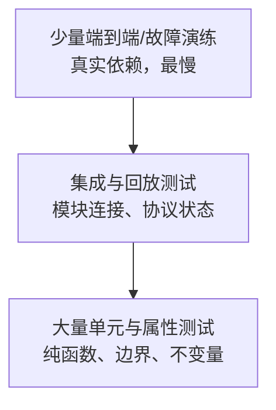
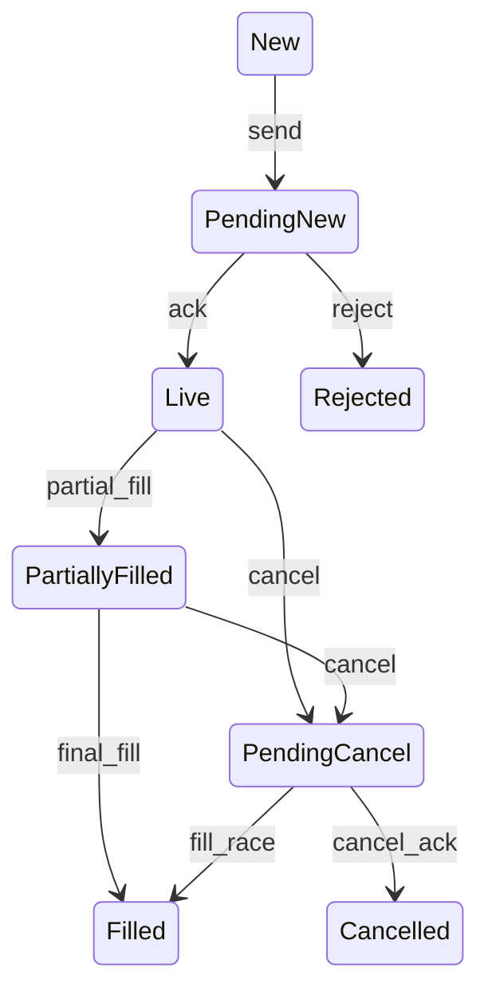
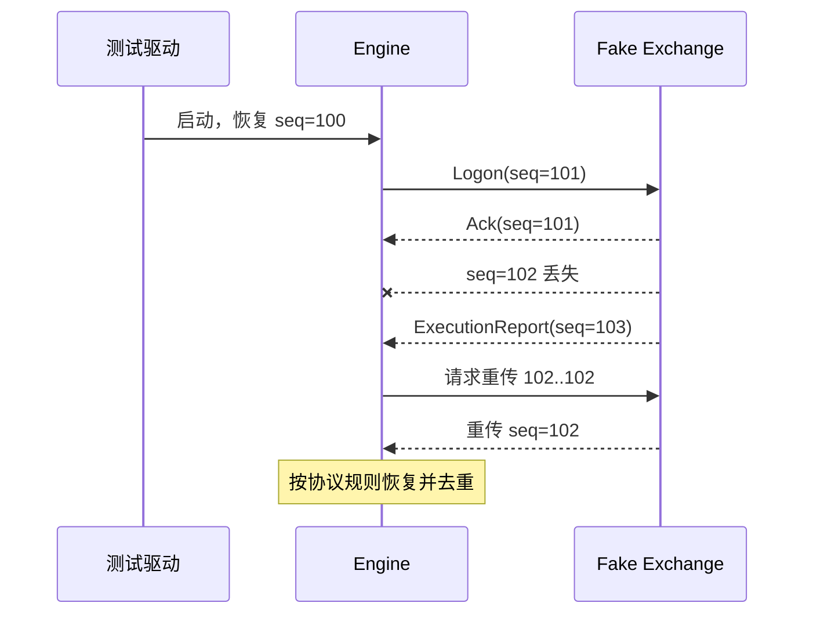

# 单元测试与集成测试：把交易规则变成可执行证据

测试不只是“证明代码现在能跑”。在 HFT 系统中，它还要证明：订单不会越过风控、协议状态不会跳错、行情缺口不会被静默忽略，并且相同输入始终产生相同结果。

对初学者，可以先记住一句话：

> 单元测试检查一个零件；集成测试检查零件连接后是否仍然正确；回放测试检查整个系统面对真实历史事件时是否正确。

测试数量不能代替覆盖业务不变量、模块边界和故障路径；以下方法按这三类风险组织。

## 1. HFT 测试到底在保护什么

普通业务系统常把 HTTP 响应是否正确作为核心；交易系统还要保护以下不变量（invariant）：

| 领域 | 必须始终成立的规则示例 |
| :--- | :--- |
| 行情 | 序列号 gap 必须被发现；旧快照不能覆盖新状态 |
| 订单状态 | 已完全成交的订单不能再次撤销；重复 ACK 不得重复记账 |
| 风控 | 数量、价格、敞口或速率越界时绝不能到达发单出口 |
| 账务 | 成交数量守恒；仓位变化等于成交净额 |
| 协议 | 编码后再解码得到等价消息；非法长度不能越界读取 |
| 时间 | 超时使用单调时钟；模拟时间不能倒退 |
| 并发 | 消息不能丢失、重复或被观察到半初始化状态 |

“不变量”比具体函数名更稳定。重构实现后，函数可能消失，但这些业务规则仍然必须成立。

## 2. 一套实用的测试分层



层次越靠下，运行越快、定位越精确；越靠上，越接近真实环境但成本越高。成熟项目通常同时需要三层，不能用大量端到端测试替代单元测试，也不能因为单元测试全绿就跳过真实网络和恢复验证。

## 3. 先让代码“可测试”

难测试的代码通常把业务逻辑与系统环境绑在一起，例如函数内部直接调用系统时间、网络和随机数。

### 3.1 把计算与副作用分开

把策略判断写成纯计算：输入相同，输出就相同。

```rust
#[derive(Debug, Clone, Copy, PartialEq, Eq)]
struct OrderRequest {
    price_ticks: i64,
    qty: u64,
}

#[derive(Debug, Clone, Copy, PartialEq, Eq)]
enum RiskDecision {
    Allow,
    Reject(&'static str),
}

fn check_order(order: OrderRequest, max_qty: u64, reference: i64) -> RiskDecision {
    if order.qty == 0 {
        return RiskDecision::Reject("zero quantity");
    }
    if order.qty > max_qty {
        return RiskDecision::Reject("quantity limit");
    }
    if order.price_ticks <= 0 || order.price_ticks > reference.saturating_mul(2) {
        return RiskDecision::Reject("price collar");
    }
    RiskDecision::Allow
}
```

网络发送应该发生在得到 `Allow` 之后的薄适配层中。这样测试风控无需启动 socket，也更容易证明 reject 不会穿透发单出口。

### 3.2 注入时间、随机数与 I/O

```rust
#[derive(Debug, Clone, Copy, PartialEq, Eq)]
struct OrderRequest {
    price_ticks: i64,
    qty: u64,
}

#[derive(Debug, Clone, Copy, PartialEq, Eq)]
enum SendError {
    Disconnected,
}

trait Clock {
    fn now_ns(&self) -> u64;
}

trait OrderSink {
    fn send(&mut self, order: OrderRequest) -> Result<(), SendError>;
}
```

生产环境注入真实时钟和网关；测试环境注入可手动推进的 `FakeClock` 与记录消息的 `FakeOrderSink`。这叫 dependency injection（依赖注入），不需要复杂框架，Trait 或泛型就足够。

## 4. 单元测试：一条规则，一个清晰失败原因

### 4.1 正常、边界、非法三类输入

```rust
#[cfg(test)]
mod tests {
    use super::*;

    #[test]
    fn accepts_order_exactly_at_quantity_limit() {
        let order = OrderRequest { price_ticks: 10_000, qty: 100 };
        assert_eq!(check_order(order, 100, 10_000), RiskDecision::Allow);
    }

    #[test]
    fn rejects_first_quantity_above_limit() {
        let order = OrderRequest { price_ticks: 10_000, qty: 101 };
        assert_eq!(
            check_order(order, 100, 10_000),
            RiskDecision::Reject("quantity limit")
        );
    }

    #[test]
    fn rejects_zero_quantity() {
        let order = OrderRequest { price_ticks: 10_000, qty: 0 };
        assert_eq!(
            check_order(order, 100, 10_000),
            RiskDecision::Reject("zero quantity")
        );
    }
}
```

边界测试应特别关注 `0`、`1`、上限、上限加一、空输入、最大整数、序列号回绕和时间戳相等。金融代码中大量事故发生在“等于”究竟允许还是拒绝。

### 4.2 测行为，不要复制实现

脆弱测试常断言内部容器长度、私有函数调用顺序或具体日志文本。重构数据结构后它们会全部失败，却没有发现任何业务错误。

更好的断言是可观察行为：

- 输入一组成交后，仓位和剩余数量是多少？
- 收到重复 ACK 后，已成交数量是否只记一次？
- gap 出现时，策略是否停止使用不完整订单簿？
- 风控拒绝时，fake sink 的发送次数是否仍为 0？

### 4.3 状态机使用表驱动测试

订单生命周期不是一串互不相关的 `if`，而是状态机：



可以把允许和禁止的迁移写成测试表：

下面是依赖项目订单状态机类型的**测试骨架**，所以不作为独立 doctest。定义 `State`、`Event`、`StateError` 与 `transition` 后，用 `cargo test order_state_transition_table` 验证，并继续补充 fill/cancel race、重复消息和所有终态。

```rust,ignore
#[test]
fn order_state_transition_table() {
    let cases = [
        (State::PendingNew, Event::Ack, Ok(State::Live)),
        (State::PendingNew, Event::Reject, Ok(State::Rejected)),
        (State::Filled, Event::CancelAck, Err(StateError::TerminalState)),
    ];

    for (from, event, expected) in cases {
        assert_eq!(transition(from, event), expected, "from={from:?} event={event:?}");
    }
}
```

除正常路径外，状态机测试还必须覆盖 **成交与撤单确认竞态、重复消息、乱序消息和终态幂等**。

### 4.4 定点数与溢出

价格和数量尽量使用整数定点数，而不是 `f64`。测试至少覆盖：

- 小数价格转换到 ticks 时的舍入规则。
- `price * qty` 是否用更宽类型或 checked arithmetic。
- 负价格、零数量和单位不匹配是否被拒绝。
- 聚合多笔成交时是否溢出。

```rust
fn notional(price_ticks: i64, qty: u64) -> Option<i128> {
    i128::from(price_ticks).checked_mul(i128::from(qty))
}

#[test]
fn notional_uses_wide_intermediate() {
    assert_eq!(notional(25_000, 40), Some(1_000_000));
}
```

不要只依赖 Debug 模式的整数溢出 panic；生产 Release 配置可能不同。业务边界应显式使用 `checked_*`、`saturating_*` 或经过证明的范围。

## 5. 协议解析器测试

解析器处在“不可信字节”与业务状态之间，是最高价值测试对象之一。

### 5.1 构造最小有效消息

每种消息至少测试：

- 最小有效长度。
- 最大合法长度。
- 截断头部、截断 body、声明长度大于实际长度。
- 未知消息类型和未知版本。
- 大端/小端字段、序列号边界和校验和失败。
- 一个数据包含多条消息时，单条长度不能越过包尾。

解析函数优先返回结构化错误，而不是 panic：

```rust
use std::convert::TryInto;

#[derive(Debug, PartialEq, Eq)]
enum ParseError {
    Truncated,
    InvalidLength,
    UnknownType(u8),
}

fn parse_header(bytes: &[u8]) -> Result<(u8, u16), ParseError> {
    let (&kind, rest) = bytes.split_first().ok_or(ParseError::Truncated)?;
    let len_bytes: [u8; 2] = rest
        .get(..2)
        .ok_or(ParseError::Truncated)?
        .try_into()
        .expect("slice length checked above");
    let len = u16::from_be_bytes(len_bytes);
    if len < 3 {
        return Err(ParseError::InvalidLength);
    }
    Ok((kind, len))
}
```

### 5.2 Golden fixture

Golden test 使用经过审核的真实字节样本作为固定输入，断言解析结果或编码输出。fixture 应保存：

- 来源和协议版本。
- 是否做过脱敏。
- 预期结构化结果。
- 若协议升级，为什么 golden 需要更新。

当测试失败时，不要直接运行“更新全部快照”。先确认是需求变化、编码变化还是回归错误。

## 6. 集成测试：验证模块边界

Rust 通常把黑盒集成测试放在 `tests/` 目录。集成测试只能使用 crate 对外 API，这能验证调用者实际看到的行为。

```text
project/
├── src/
│   └── lib.rs
├── tests/
│   ├── protocol_session.rs
│   ├── risk_to_gateway.rs
│   └── recovery.rs
└── tests/fixtures/
```

### 6.1 风控到网关：证明拒绝不会泄漏

下面是放在 `tests/risk_to_gateway.rs` 的**跨模块集成骨架**，依赖项目公开的 `Engine`、fake clock/sink 和领域错误类型，因此不作为单文件 doctest。补齐项目类型后运行 `cargo test --test risk_to_gateway rejected_order_never_reaches_gateway`。

```rust,ignore
#[test]
fn rejected_order_never_reaches_gateway() {
    let clock = FakeClock::at(1_000_000);
    let sink = RecordingSink::default();
    let mut engine = Engine::new(clock, sink, RiskLimits { max_qty: 100 });

    let result = engine.submit(OrderRequest { price_ticks: 10_000, qty: 101 });

    assert_eq!(result, Err(SubmitError::RiskRejected));
    assert!(engine.sink().sent_orders().is_empty());
}
```

这个测试比单独测试 `check_order` 多证明了一层：即使上层错误处理发生变化，拒绝单也没有穿过系统边界。

### 6.2 会话与恢复

典型场景应包含完整时间线：



断言不仅包括“最终连上了”，还应包括：请求的序列号范围、重放消息是否去重、恢复期间是否禁止新订单、恢复后状态是否一致。

### 6.3 真实 socket 何时有价值

进程内 fake 很快，但不能发现 socket 选项、字节分帧和实际关闭语义的问题。少量测试可以使用 loopback TCP/UDP；硬件时间戳、多播交换机、DPDK 和 NIC queue 等则需要专用测试环境。

测试应设置明确超时，并在失败时打印双方状态，避免 CI 永久卡住：

```rust
use std::time::Duration;

const TEST_TIMEOUT: Duration = Duration::from_secs(2);
```

“加一个 `sleep(100ms)` 等服务启动”通常是 flaky test（偶发失败）的来源。更好的是监听端口后发送 ready 信号，或用 barrier/channel 明确同步。

## 7. 历史回放与差分测试

回放测试把一段确定的输入事件送入系统，并比较：

- 决策序列和原因码。
- 订单、成交、仓位及风险状态。
- 行情 gap 与恢复行为。
- 可选的性能分布，但正确性回放不要依赖真实墙上时间。

差分测试（differential testing）让新旧实现处理同一输入。如果输出不同，先分类：

1. 有意的需求变化。
2. 旧实现已有 bug，新实现修复。
3. 新实现回归。
4. 非确定因素，例如随机种子、无序 map 遍历或真实时钟。

差分测试不是假定旧版本永远正确，而是把“无声变化”变成必须解释的变化。

## 8. 并发、故障与性能测试的边界

### 8.1 并发测试

普通压力测试很难穷举线程交错。可以把并发算法缩小后使用 `loom` 做模型检查，覆盖不同调度次序；再用长时间压力测试检查真实硬件上的缓存和时序问题。

需要测试的场景包括：

- producer 快于 consumer 时 ring buffer 满载行为。
- 序列号、head/tail 回绕。
- shutdown 与消息到达同时发生。
- 内存序是否保证 consumer 看见完整写入。

### 8.2 故障注入

集成测试应主动制造：

- 丢包、重复、乱序、延迟尖刺。
- 对端半关闭、RST、连接抖动。
- 配置损坏、磁盘写满、快照截断。
- 时钟偏差或 PTP 失锁。
- 下单已发送但 ACK 丢失的“未知结果”。

重点不是“自动重试一切”。订单发送超时具有歧义：交易所可能已接收订单，只是回报丢失。盲目重试可能造成重复订单，通常需要客户端订单 ID、幂等协议或查询恢复。

### 8.3 性能测试不是普通单元测试

微基准和端到端延迟测试应独立运行在 Release 模式与受控硬件上。单元测试主要回答“对不对”，性能测试回答“有多快且分布如何”。不要在共享 CI 上断言某函数必须小于固定的几十纳秒。

## 9. 让测试稳定、可诊断

- 时间、随机数和输入都可注入；失败日志记录随机 seed。
- fixture 只读且版本化，测试不能相互依赖执行顺序。
- 每个外部等待都有超时，错误信息包含当前状态和最近事件。
- 使用临时目录和随机可用端口，避免并行测试互相污染。
- 测试失败时保留最小复现输入，而不只保留一张 CI 红灯截图。
- 不把真实生产密钥、账户和未脱敏抓包提交到仓库。

常用命令：

```bash
cargo test --all-targets --locked
cargo test order_state -- --nocapture
cargo test --test recovery -- --test-threads=1
```

`--test-threads=1` 只应在测试确实共享无法隔离的资源时使用。它能隐藏数据竞争，也会让 CI 变慢；优先修复隔离问题。

## 10. 面试高频问答

### Q1：你会优先测试 HFT 系统的哪些部分？

优先测试损失半径最大的边界：协议解析、订单状态机、风控、仓位记账和断线恢复。纯函数用大量单元/属性测试，模块连接用集成测试，真实历史与故障场景用确定性回放。性能则在独立基准环境关注尾延迟。

### Q2：Mock 越多越好吗？

不是。Mock 能让错误路径可控，但过度 mock 只是在测试“我调用了自己规定的方法”。核心领域更适合 fake（有简化行为的实现）或 in-memory simulator，并保留少量真实 socket、真实协议和专用硬件测试。

### Q3：如何测试时间相关逻辑而不让测试 sleep？

把时钟抽象成依赖，测试使用可手动推进的模拟时钟；定时器变成事件队列中的定时事件。这样测试运行快、无抖动，还能精确覆盖超时前一纳秒和超时点。

### Q4：单元测试全绿，为什么线上还会出问题？

单元测试看不到模块连接、真实协议、资源上限、线程交错、内核/NIC 行为和生产流量分布。因此需要集成、回放、故障注入、性能与发布验证共同构成证据链。

## 11. 做题方法：从规则表生成可执行证据

1. **读需求拆层**：纯函数规则放单元测试，组件交互放集成测试，协议兼容用 golden vector，跨进程/网络/恢复放端到端；不要让一个大测试承担所有定位责任。
2. **先写不变量和状态表**：撮合量守恒、订单合法迁移、持仓与成交对账、gap 后不可交易等，每条规则至少覆盖正常、边界和禁止迁移。
3. **按 Arrange→Act→Assert 推演**：输入和初始状态最小化，一次只触发一个行为；断言业务结果、状态、副作用和未发生的动作。
4. **故障测试控制时间和依赖**：使用模拟时钟、可注入错误和临时资源，覆盖超时、重复、乱序、崩溃恢复；测试结束验证进程、文件和端口已清理。
5. **验算 oracle**：关键算法与简单参考实现/交易所官方样例差分；快照恢复前后 hash、订单和持仓一致；失败测试能在移除修复时真正失败。

常见陷阱：只断言返回码不看状态；测试复刻生产算法导致同错；依赖真实睡眠形成 flaky test；共享全局状态污染顺序；把交易所特定规则写成通用断言而无版本夹具。

## 12. 提交前检查清单

- [ ] 每条关键业务不变量至少有一个直接测试。
- [ ] 正常、边界、非法和重复/乱序输入均有覆盖。
- [ ] 时间、随机数、网络出口可以替换，测试无需真实 sleep。
- [ ] 风控拒绝已验证不会到达真实发单边界。
- [ ] 订单状态机覆盖 fill/cancel 竞态和重复回报。
- [ ] 解析器覆盖截断、非法长度、字节序和未知版本。
- [ ] 集成测试覆盖重连、恢复、gap、未知发送结果和安全 shutdown。
- [ ] 测试可并行、可复现，失败时输出 seed、状态和最小输入。
- [ ] 性能门槛在 Release 与受控硬件上评估完整分位数。

优秀测试的最终产物不是一个漂亮的覆盖率数字，而是一组可重复的证据：当真实市场以最糟糕的顺序交付事件时，系统仍然守住交易规则。
