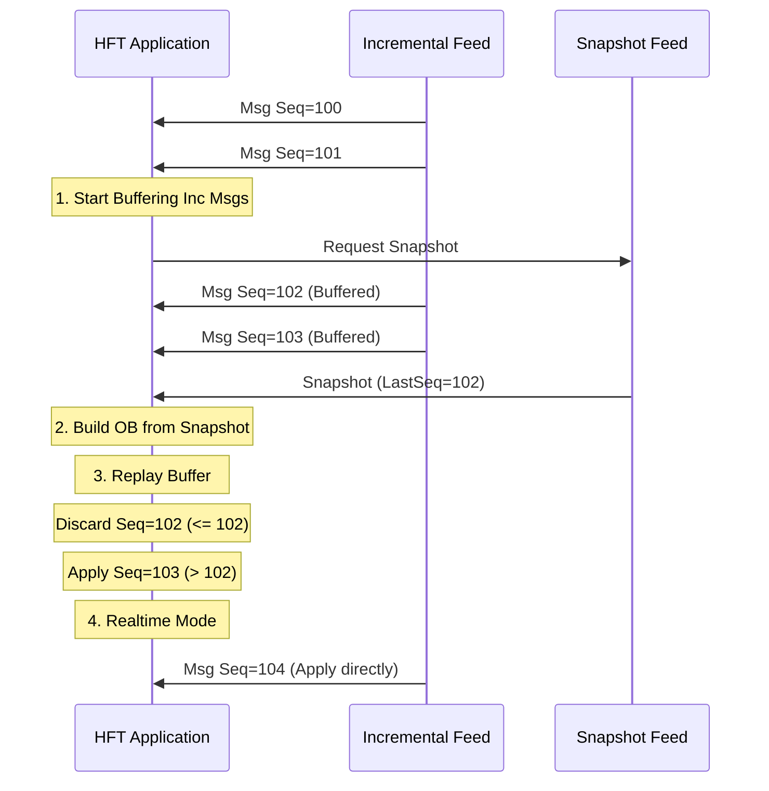

# 增量更新与快照机制 (Incremental Updates & Snapshots)

在处理市场数据（Market Data）时，我们面临两个核心挑战：
1.  **数据量巨大**：全量推送订单簿（Order Book）会消耗惊人的带宽。
2.  **一致性维护**：如何在丢包或乱序的情况下，保证本地订单簿与交易所完全一致。

因此，现代交易所协议（如 NASDAQ ITCH, CME MDP 3.0）普遍采用 **快照 (Snapshot) + 增量 (Incremental)** 的模式。

## 1. 理论模型

### 1.1 增量更新 (Incremental Updates)
增量更新只包含**变化量**。例如：
- "订单 ID 12345 的数量减少 100"
- "在价格 100.00 新增一个买单，数量 500"
- "删除订单 ID 67890"

这种方式带宽效率极高，但要求接收端必须**从一开始就维护状态**，且**不能丢失任何消息**。

### 1.2 快照 (Snapshot)
快照是某一时刻订单簿的**全量状态**。它通常包含所有活跃的买单和卖单。
快照用于：
- **系统启动**：初始化本地订单簿。
- **灾难恢复**：当发现增量消息丢失（Sequence Number Gap）且无法恢复时，重置状态。
- **晚加入 (Late Join)**：盘中启动的程序需要先获取快照，再应用后续的增量。

## 2. 核心流程：快照与增量的同步

这是最容易出错的地方。如果在获取快照的过程中，又有新的增量消息到达，该如何处理？

标准的**重放 (Replay)** 流程如下：

1.  **开始缓存增量**：在请求快照之前，先启动增量消息的接收，并将其缓存到队列中。不要丢弃任何消息！
2.  **请求/接收快照**：获取最新的快照数据。快照中通常包含一个 **Last Applied Sequence Number (LastSeq)**，表示该快照包含截止到 `LastSeq` 的所有变更。
3.  **构建初始状态**：使用快照数据构建本地 OrderBook。
4.  **过滤过期增量**：检查缓存队列中的增量消息。
    - 如果 `Msg.SeqNum <= LastSeq`，说明该增量已经包含在快照里了，**丢弃**。
    - 如果 `Msg.SeqNum > LastSeq`，说明这是快照之后发生的变更，**应用**。
5.  **进入实时模式**：缓存队列处理完毕后，直接处理新到达的实时增量消息。



## 3. Rust 实现：无锁增量重放器

我们需要一个高效的结构来处理这个逻辑。

```rust
use std::collections::VecDeque;

#[derive(Debug, Clone)]
pub struct IncrementalMsg {
    pub seq: u64,
    pub data: Vec<u8>, // 简化演示，实际应为解析后的 Enum
}

pub struct MarketDataEngine {
    // 状态机：等待快照 -> 重放中 -> 实时
    state: State,
    // 增量消息缓存，使用 VecDeque 作为 RingBuffer
    buffer: VecDeque<IncrementalMsg>,
    // 这里的 OrderBook 是我们之前章节实现的
    book: OrderBook, 
}

enum State {
    WaitingForSnapshot,
    Replaying,
    Realtime,
}

struct OrderBook {
    last_applied_seq: u64,
    // ... L2/L3 data structures
}

impl MarketDataEngine {
    pub fn new() -> Self {
        Self {
            state: State::WaitingForSnapshot,
            buffer: VecDeque::with_capacity(10000), // 预分配防止重分配
            book: OrderBook { last_applied_seq: 0 },
        }
    }

    pub fn on_incremental(&mut self, msg: IncrementalMsg) {
        match self.state {
            State::WaitingForSnapshot => {
                // 关键：在等待快照时，必须缓存所有增量
                self.buffer.push_back(msg);
            }
            State::Realtime => {
                // 实时模式：直接检查序列号连续性并应用
                self.apply_incremental(msg);
            }
            State::Replaying => {
                // 理论上重放是瞬间完成的，不应收到外部消息
                // 但如果是异步架构，可能发生。先缓存。
                self.buffer.push_back(msg);
            }
        }
    }

    pub fn on_snapshot(&mut self, snapshot_seq: u64, orders: Vec<Order>) {
        println!("Received snapshot with seq: {}", snapshot_seq);
        
        // 1. 重置订单簿
        self.book.clear();
        for order in orders {
            self.book.add(order);
        }
        self.book.last_applied_seq = snapshot_seq;

        // 2. 进入重放模式
        self.state = State::Replaying;
        self.replay_buffer();
    }

    fn replay_buffer(&mut self) {
        let snapshot_seq = self.book.last_applied_seq;
        let mut applied_count = 0;
        let mut dropped_count = 0;

        // 3. 处理缓存队列
        while let Some(msg) = self.buffer.pop_front() {
            if msg.seq <= snapshot_seq {
                dropped_count += 1; // 已包含在快照中
            } else {
                self.apply_incremental(msg);
                applied_count += 1;
            }
        }

        println!("Replay done. Dropped: {}, Applied: {}", dropped_count, applied_count);
        self.state = State::Realtime;
    }

    fn apply_incremental(&mut self, msg: IncrementalMsg) {
        // 严格的序列号检查
        if msg.seq != self.book.last_applied_seq + 1 {
            // 生产环境通常会触发报警并重新请求快照
            eprintln!("GAP DETECTED! Expected {}, got {}", self.book.last_applied_seq + 1, msg.seq);
            // 简单策略：重置状态，重新请求快照
            self.state = State::WaitingForSnapshot;
            self.buffer.clear();
            // send_snapshot_request();
            return;
        }

        // 应用逻辑 (Update/Delete/Add)
        // self.book.update(msg);
        self.book.last_applied_seq = msg.seq;
    }
}

// 辅助结构用于演示
struct Order;
impl OrderBook {
    fn clear(&mut self) {}
    fn add(&mut self, _o: Order) {}
}
```

## 4. 性能优化技巧

### 4.1 避免缓存重分配
在等待快照期间，如果市场波动剧烈，缓存队列可能会迅速增长。如果 `VecDeque` 触发扩容，会发生内存拷贝。
**优化**：
- 预分配足够大的 `VecDeque::with_capacity(100_000)`。
- 或者使用我们在基础设施篇实现的 `RingBuffer`，固定大小，溢出则视为错误（因为回放太久意味着快照下载太慢，数据已经失效）。

### 4.2 零拷贝快照解析
快照数据通常非常大（数百 MB）。不要将其完全反序列化为 `Vec<Order>` 结构体。
**优化**：
- 直接在网络 buffer 上进行迭代。
- 使用 `nom` 或 `unsafe` 指针操作直接读取价格和数量，立即插入 OrderBook，不生成中间对象。

### 4.3 序列号回绕 (SeqNum Wrap-around)
虽然 64 位整数几乎不可能耗尽，但某些协议使用 32 位序列号。必须处理回绕逻辑：
```rust
fn is_newer(a: u32, b: u32) -> bool {
    // 假设阈值为 2^31，处理回绕
    let diff = a.wrapping_sub(b);
    diff < 0x8000_0000 && diff != 0
}
```

## 5. 常见陷阱

1.  **丢弃了早于 Snapshot 的消息，但 Snapshot 还没处理完**：
    如果在解析 Snapshot 的过程中，又来了新的增量消息，必须继续缓存。不能因为拿到了 Snapshot 就停止缓存，必须等 Snapshot **完全应用** 后，再开始重放。

2.  **UDP 乱序**：
    增量消息通常通过 UDP 多播发送。虽然网络通常保持顺序，但不可完全依赖。
    **解决**：在 `buffer` 中不仅仅是 `push_back`，如果是乱序到达的，可能需要一个 `BinaryHeap` 或排序逻辑来重组（但在局域网 HFT 环境中，直接丢弃并报错通常更安全，因为乱序往往意味着丢包）。

3.  **Cross-Book 状态**：
    在重放过程中，可能会出现买一价 >= 卖一价的情况（Locked/Crossed Market）。这是因为快照和增量之间的时间差。交易所通常会发送 `Trade` 消息来消除这些挂单。如果你的逻辑禁止 Cross Book，需要暂时放宽校验，或者正确处理 Trade 消息。

## 6. 延伸阅读
- [NASDAQ TotalView-ITCH 5.0 Specification](http://www.nasdaqtrader.com/content/technicalsupport/specifications/dataproducts/NQTVITCHspecification.pdf) - 经典的增量协议。
- [CME MDP 3.0 Recovery](https://www.cmegroup.com/confluence/display/EPICSANDBOX/MDP+3.0+-+Recovery) - CME 的快照恢复流程文档。

---
下一章：我们将构建交易引擎的核心 —— [交易引擎篇：策略框架设计](../engine/strategy.md)。
