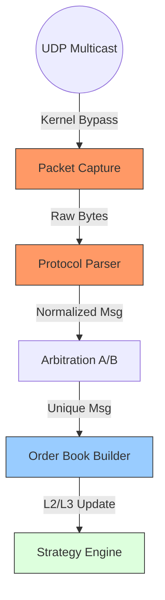

# 市场数据处理 (Market Data)

在 HFT 中，"Market Data" (MD) 是你的眼睛。如果你的 MD 慢了，你就瞎了。
如果你的 MD 不准确（例如丢包了、乱序了），你就会做出错误的决策，赔钱。

本章将探讨如何构建一个**低延迟**、**高可靠**且**内存友好**的市场数据处理流水线。

## 核心挑战

1.  **Volume (吞吐量)**: 
    NASDAQ 或 SSE (上交所) 在开盘瞬间，每秒可能会推送数百万个 Order/Trade 消息。你的系统必须能吞下这个峰值，而不能 OOM 或延迟飙升。
    
2.  **Latency (延迟)**: 
    从网卡收到包到你的策略回调被触发，这个过程必须在微秒级完成。任何内存分配、锁竞争、缓存未命中都是不可接受的。
    
3.  **Correctness (正确性)**: 
    UDP 是不可靠的。你必须处理丢包、乱序、重复包。如果丢了关键的 "Add Order" 消息，你的本地订单簿就会和交易所不一致（Crossed Book），导致策略误判。

## 数据流水线 (Pipeline)

一个典型的 MD 流水线包含以下阶段：



1.  **Packet Capture**: 内核旁路或 Socket 接收 (Network Layer)。
2.  **Parsing**: 将字节流转为 Rust Struct (Protocol Layer)。
3.  **Arbitration**: A/B 通道去重与仲裁。
4.  **Book Building**: 根据消息更新本地订单簿 (L2/L3)。
5.  **Signal Generation**: 触发策略逻辑。

## 章节概览

1.  **[L1/L2/L3 数据构建](order_book_data.md)**
    *   L1 (BBO): Best Bid Offer，最简单的快照。
    *   L2 (Price Levels): 这里的“坑”在于价格档位的内存管理。
    *   L3 (MBO): Market By Order，全量订单簿，最复杂但也最精准。

2.  **[增量更新与快照](incremental_updates.md)**
    *   如何处理 `Add`, `Modify`, `Delete`, `Execute` 消息。
    *   如何通过 `Snapshot` 恢复状态。
    *   在交易时段中途启动程序的“热加入” (Late Join) 问题。

## 关键设计原则

### 1. 避免指针追逐 (Pointer Chasing)
在构建 L2 订单簿时，新手常犯的错误是用 `BTreeMap<Price, Size>`。
每次更新都需要 `O(log N)` 的查找，且节点散落在堆内存中，对 CPU Cache 极不友好。
**HFT 方案**: 使用预分配的 `Vec` 或固定大小数组，结合 `Price -> Index` 的映射。

### 2. 批量处理 (Batching) vs 低延迟
通常我们认为 Batching 会增加延迟。但在高吞吐场景下，适当的 Batching (如 `io_uring` 或 `recvmmsg`) 可以显著减少系统调用开销，反而降低整体延迟（特别是长尾延迟）。
**策略**: 自适应 Batching。如果队列里积压了数据，就一次处理完；如果队列空闲，来一个处理一个。

### 3. 数据归一化 (Normalization)
不同交易所的协议不同（ITCH, SBE, ETI），但策略层希望看到统一的接口。
你需要一个高效的转换层，将异构数据转换为内部统一格式 (Internal Format)。

```rust
// 内部统一格式示例
#[repr(C)]
pub struct MdUpdate {
    pub symbol_id: u16,
    pub action: Action, // Add, Modify, Delete, Trade
    pub side: Side,
    pub price: i64,
    pub quantity: u32,
    pub order_id: u64,
    pub exchange_ts: u64,
    pub local_ts: u64,
}
```

---
下一章：[L1/L2/L3 数据构建](order_book_data.md)
